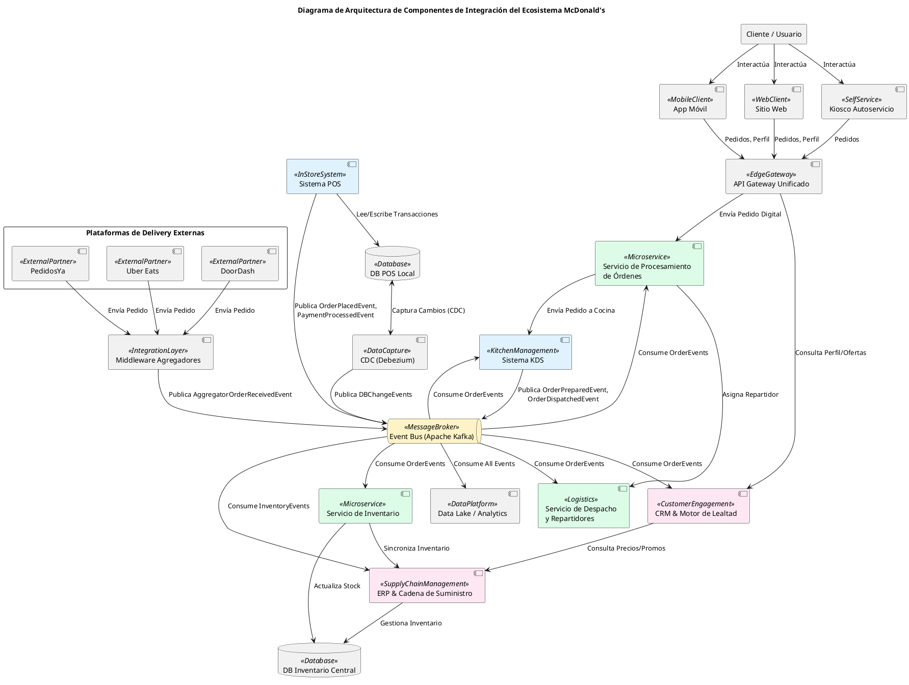
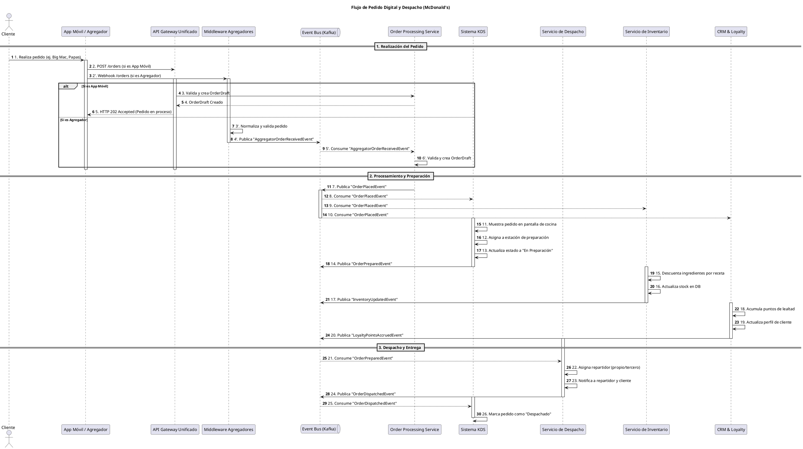

Como Principal Software & Enterprise Architect, he realizado un análisis exhaustivo del ecosistema tecnológico de McDonald's, centrándome en la ingeniería de sistemas distribuidos, la interoperabilidad y las estrategias de migración de datos. Mi enfoque se ha dirigido a identificar las causas raíz de los desafíos de integración, evaluar los compromisos arquitectónicos y proponer soluciones robustas y escalables.

---

## 1. Identificación y Caracterización de Sistemas Centrales

El ecosistema de McDonald's se compone de sistemas interconectados, cada uno con responsabilidades específicas y características operativas críticas:

-   **POS (Point of Sale) <<InStoreSystem>>**
    -   **Rol Operativo**: Núcleo de las operaciones en tienda. Gestiona pedidos presenciales, transacciones de pago, sincronización de precios y gestión de caja. Es el punto de verdad para las ventas locales.
    -   **Patrón de Responsabilidad**: `TransactionCoordinator`, `LocalDataStore`.
    -   **Arquitectura Interna**: Típicamente una aplicación robusta, a menudo monolítica, con una base de datos local para garantizar la continuidad operativa incluso sin conectividad de red. Integrado con hardware específico (impresoras, terminales de pago).
    -   **Capacidades**: Alta disponibilidad local, procesamiento de pagos en tiempo real, aplicación de descuentos y promociones, gestión de empleados.

-   **KDS (Kitchen Display System) <<KitchenManagement>>**
    -   **Rol Operativo**: Orquestación visual de la preparación de pedidos en la cocina. Recibe órdenes de múltiples canales, las enruta a las estaciones de trabajo adecuadas (freidoras, parrillas, ensamblaje) y gestiona su estado de preparación.
    -   **Patrón de Responsabilidad**: `WorkflowOrchestrator`, `RealtimeDisplay`.
    -   **Arquitectura Interna**: Sistema de baja latencia, a menudo basado en eventos, con interfaces de usuario optimizadas para pantallas táctiles en entornos de cocina. Puede tener lógica de ruteo y priorización configurable.
    -   **Capacidades**: Actualizaciones en tiempo real, visualización de tiempos de espera, gestión de colas de preparación, integración con temporizadores y sensores.

-   **Canales Digitales Directos (App/Web & Kioscos) <<DigitalChannels>>**
    -   **Rol Operativo**: Interfaz principal para la interacción digital del cliente. Permite la toma de pedidos anticipados (Mobile Order & Pay), personalización del menú, pagos y seguimiento de pedidos.
    -   **Patrón de Responsabilidad**: `CustomerFrontend`, `OrderIngestion`.
    -   **Arquitectura Interna**: Aplicaciones móviles nativas (iOS/Android), frontends web y aplicaciones para kioscos. Se apoyan en un backend de APIs escalable, generalmente cloud-native, para autenticación, gestión de menús y procesamiento de pedidos.
    -   **Capacidades**: Alta concurrencia, geolocalización, notificaciones push, experiencias personalizadas, integración con pasarelas de pago.

-   **Middleware de Integración de Terceros (Delivery Aggregators) <<AggregatorAdapter>>**
    -   **Rol Operativo**: Centraliza y normaliza la ingesta de pedidos de diversas plataformas de delivery externas (PedidosYa, Uber Eats, DoorDash, Rappi). Traduce formatos externos a un estándar interno.
    -   **Patrón de Responsabilidad**: `AntiCorruptionLayer`, `DataTransformer`.
    -   **Arquitectura Interna**: Un conjunto de microservicios o un API Gateway especializado, donde cada servicio se encarga de la integración con un agregador específico. Implementa lógica de mapeo, validación y enriquecimiento de datos.
    -   **Capacidades**: Resiliencia ante fallas de APIs externas, control de tasas (rate limiting), unificación del estado de los pedidos de delivery.

-   **CRM & Motor de Lealtad (MyMcDonald's Rewards) <<CustomerEngagement>>**
    -   **Rol Operativo**: Gestiona perfiles de clientes, acumulación y redención de puntos de lealtad, ofertas personalizadas y campañas de marketing.
    -   **Patrón de Responsabilidad**: `CustomerDataPlatform`, `RulesEngine`.
    -   **Arquitectura Interna**: Plataforma de Datos del Cliente (CDP), motor de reglas para la lógica de lealtad, motor de recomendaciones. A menudo una solución basada en la nube con capacidades analíticas y de procesamiento de datos en tiempo real.
    -   **Capacidades**: Ingesta de datos en tiempo real, recuperación de ofertas de baja latencia, procesamiento de grandes volúmenes de datos, segmentación de clientes.

-   **ERP & Gestión de Inventario <<SupplyChainManagement>>**
    -   **Rol Operativo**: Controla el inventario de materias primas, gestiona recetas, calcula costos de alimentos, genera órdenes de compra y administra proveedores.
    -   **Patrón de Responsabilidad**: `InventoryManager`, `ResourcePlanner`.
    -   **Arquitectura Interna**: Sistema de Planificación de Recursos Empresariales (ERP), que puede ser una solución COTS (Commercial Off-The-Shelf) o un desarrollo a medida. Se integra con el POS y KDS para el descuento automático de inventario.
    -   **Capacidades**: Actualizaciones de inventario en tiempo real (crítico para la disponibilidad), procesamiento por lotes para informes, integración con logística de la cadena de suministro.

## 2. Mapeo de Puntos de Integración entre Sistemas

Las interacciones entre estos sistemas son la clave para la operación fluida del ecosistema:

-   **Integración Canales Digitales (App/Web/Kiosco) -> POS / KDS**
    -   **Flujo**: Un pedido digital se inicia en la App/Web o Kiosco, se procesa en el backend de Canales Digitales (validación de inventario, pago), se envía al POS para registro de venta y al KDS para preparación.
    -   **Protocolos**: Principalmente **REST APIs** para la comunicación entre el frontend y el backend de canales digitales. Para la comunicación interna hacia POS/KDS, se pueden usar **gRPC** (por su eficiencia) o **mensajería asíncrona** (para desacoplamiento y resiliencia).
    -   **Trade-offs**: La validación de inventario en tiempo real introduce latencia y acoplamiento síncrono. Una validación asíncrona mejora la resiliencia pero requiere estrategias para manejar sobreventas.

-   **Integración Agregadores -> Middleware -> KDS**
    -   **Flujo**: Un pedido de un agregador (ej. PedidosYa) llega al Middleware de Integración, donde se normaliza y valida. Luego, se enruta al KDS para su preparación. El POS puede recibir una notificación de venta simplificada.
    -   **Protocolos**: **Webhooks** (los agregadores notifican al Middleware sobre nuevos pedidos o cambios de estado) y **REST APIs** (el Middleware interactúa con los agregadores y envía el pedido al KDS o a un servicio de procesamiento de órdenes).
    -   **Trade-offs**: La complejidad del Middleware es alta debido a la heterogeneidad de las APIs de los agregadores. La latencia es crítica para cumplir los SLAs de los agregadores.

-   **Integración POS -> CRM / Loyalty**
    -   **Flujo**: Una vez que una transacción se finaliza en el POS, los datos de la compra y del cliente se envían al sistema de CRM/Loyalty para la acumulación de puntos y la redención de cupones.
    -   **Protocolos**: **REST APIs** (síncronas para la redención de cupones en tiempo real durante la transacción) y **Event-driven** (asíncronas para la acumulación de puntos y el perfilado de clientes, para no bloquear el POS).
    -   **Trade-offs**: La sincronía para la redención garantiza la aplicación inmediata de descuentos, pero introduce una dependencia directa. La asincronía para la acumulación mejora la resiliencia y escalabilidad.

-   **Integración POS / KDS -> ERP / Inventario**
    -   **Flujo**: Cada vez que un ítem se vende en el POS o se consume en la preparación en el KDS, se debe descontar del inventario en el sistema ERP.
    -   **Protocolos**: **Mensajería asíncrona** (Event Bus/Queue) es el método preferido para desacoplar estos sistemas y absorber picos de tráfico sin impactar el rendimiento del POS/KDS. **REST APIs** pueden usarse para consultas puntuales de stock.
    -   **Trade-offs**: La asincronía es fundamental para no introducir latencia en las operaciones de venta y preparación, pero implica una ventana de inconsistencia temporal en el inventario, que debe ser gestionada con lógica de compensación o conciliación.

## 3. Propuestas de Mejora para Interoperabilidad y Migración de Datos

Para modernizar y escalar el ecosistema de McDonald's, propongo las siguientes estrategias arquitectónicas:

### 3.1. Arquitectura Orientada a Eventos (EDA) con un Bus de Eventos Centralizado

-   **Propuesta**: Implementar un **Event Bus** robusto y escalable (ej. **Apache Kafka** o **Google Cloud Pub/Sub**) como el eje central de comunicación asíncrona entre todos los sistemas.
-   **Beneficios Arquitectónicos**:
    -   **Desacoplamiento Extremo**: Los sistemas no necesitan conocerse directamente. Publican eventos sobre hechos ocurridos (ej. `OrderPlacedEvent`, `ItemPreparedEvent`) y otros sistemas interesados se suscriben a estos eventos. Esto reduce la complejidad de las dependencias punto a punto.
    -   **Escalabilidad Horizontal**: El Event Bus puede manejar volúmenes masivos de eventos, absorbiendo picos de tráfico y permitiendo que los consumidores escalen independientemente.
    -   **Resiliencia y Tolerancia a Fallas**: Los eventos persisten en el Event Bus, permitiendo que los consumidores procesen la información incluso si estuvieron inactivos temporalmente. Esto evita la pérdida de datos y mejora la disponibilidad del sistema.
    -   **Auditoría y Replay**: El log inmutable de eventos proporciona un registro completo de todas las transacciones, facilitando la auditoría, el debugging y la capacidad de "reproducir" el estado del sistema para análisis o recuperación.
    -   **Extensibilidad**: Facilita la adición de nuevos servicios o funcionalidades que pueden simplemente suscribirse a eventos existentes sin modificar los sistemas actuales.
-   **Aplicación en McDonald's**:
    -   El **POS** publicaría `OrderPlacedEvent`, `PaymentProcessedEvent`.
    -   Los **Canales Digitales** publicarían `DigitalOrderSubmittedEvent`.
    -   El **KDS** publicaría `OrderPreparedEvent`, `OrderDispatchedEvent`.
    -   **CRM/Loyalty** consumiría eventos de compra para actualizar perfiles y otorgar puntos.
    -   **ERP/Inventario** consumiría eventos de venta/preparación para descontar stock.
    -   Sistemas analíticos y de Business Intelligence consumirían eventos para análisis en tiempo real.
-   **Trade-offs**: Introduce complejidad operativa en la gestión del Event Bus. Requiere un diseño cuidadoso de la semántica de los eventos y la gestión de esquemas (Schema Registry). Implica una transición a un modelo de consistencia eventual, que debe ser manejado explícitamente en el diseño de los servicios.

### 3.2. Estrategia de Migración de Datos Cero-Downtime con Change Data Capture (CDC)

-   **Propuesta**: Utilizar el patrón **Change Data Capture (CDC)**, implementado con herramientas como **Debezium** y **Kafka Connect**, para capturar cambios a nivel de fila en las bases de datos relacionales legadas (ej. la base de datos local del POS) y publicarlos como eventos en el Event Bus.
-   **Beneficios Arquitectónicos**:
    -   **Cero Downtime**: La migración de datos se realiza de forma asíncrona y en segundo plano, sin requerir interrupciones en las operaciones 24/7 del restaurante. Esto es crítico para un negocio como McDonald's.
    -   **Consistencia de Datos en Tiempo Real**: Garantiza que los sistemas nuevos o modernizados en la nube reciban todos los cambios de datos de los sistemas legados de manera incremental y en tiempo real, manteniendo la coherencia.
    -   **Desacoplamiento de Bases de Datos**: Evita que los nuevos servicios tengan que consultar directamente las bases de datos legadas, reduciendo la dependencia y permitiendo la evolución independiente.
    -   **Patrón Strangler Fig**: Facilita una estrategia de modernización gradual, donde los componentes legados pueden ser reemplazados progresivamente por nuevos servicios que consumen los datos vía CDC.
-   **Aplicación en McDonald's**:
    -   Configurar **Debezium** para monitorear tablas críticas en las bases de datos del **POS** (ej. `Orders`, `Products`, `Customers`, `Inventory`).
    -   Los eventos de cambio (INSERT, UPDATE, DELETE) se publican en tópicos dedicados de Kafka.
    -   Nuevos servicios en la nube (ej. un servicio de inventario centralizado, un Customer Data Platform unificado) consumirían estos eventos para construir su propio estado, replicar datos o alimentar un Data Lake.
-   **Trade-offs**: Requiere acceso a los logs transaccionales de la base de datos de origen. La gestión de esquemas y las transformaciones de datos (si los esquemas de destino son diferentes) pueden ser complejas. Puede generar un gran volumen de eventos, lo que requiere una infraestructura de Event Bus robusta.

### 3.3. Patrón API Gateway y Canales Unificados para Agregadores

-   **Propuesta**: Implementar un **API Gateway** dedicado que actúe como un "Middleware de Agregadores" unificado, exponiendo una interfaz estándar para los sistemas internos y gestionando la complejidad de las integraciones con múltiples plataformas de delivery.
-   **Beneficios Arquitectónicos**:
    -   **Abstracción y Desacoplamiento**: Los sistemas internos (KDS, Order Processing Service) interactúan con una única API estandarizada, sin importar el agregador de origen. Esto aísla los sistemas internos de los cambios frecuentes en las APIs de terceros.
    -   **Normalización de Datos**: El Gateway se encarga de traducir los diferentes formatos de pedido de cada agregador a un formato interno común y enriquecer los datos si es necesario.
    -   **Seguridad y Control Centralizados**: Centraliza la autenticación, autorización, rate limiting, monitoreo y logging para todas las integraciones externas, mejorando la postura de seguridad y la observabilidad.
    -   **Resiliencia y Aislamiento de Fallas**: Permite implementar patrones como Circuit Breaker, Retry Mechanisms y Bulkhead específicos para cada agregador, aislando las fallas de un agregador para que no afecten a otros o a los sistemas internos.
    -   **Flexibilidad y Agilidad**: Facilita la adición o eliminación de nuevos agregadores con un impacto mínimo en los sistemas internos, acelerando la integración de nuevos socios.
-   **Aplicación en McDonald's**:
    -   Cada agregador (PedidosYa, Uber Eats, DoorDash) se integra con un endpoint específico del API Gateway (ej. `/v1/aggregator/pedidosya/orders`).
    -   El Gateway valida, transforma y enriquece el pedido, luego lo publica como un `AggregatorOrderReceivedEvent` en el Event Bus.
    -   Un servicio interno (ej. `OrderIngestionService`) consume este evento, realiza validaciones de negocio adicionales y lo envía al KDS.
-   **Trade-offs**: Añade una capa de latencia y complejidad al flujo de pedidos. Requiere mantenimiento continuo para adaptarse a los cambios en las APIs de los agregadores.

## 4. Modelado Visual en PlantUML

### 4.1. Diagrama de Arquitectura de Componentes de Integración del Ecosistema McDonald's

Este diagrama muestra la topología de los sistemas centrales, las capas de integración y el papel del Event Bus como columna vertebral.

### 4.2. Diagrama de Secuencia de Pedido Digital y Despacho

Este diagrama ilustra el flujo de un pedido desde un agregador o la App Móvil hasta su preparación, despacho y actualización de inventario.

