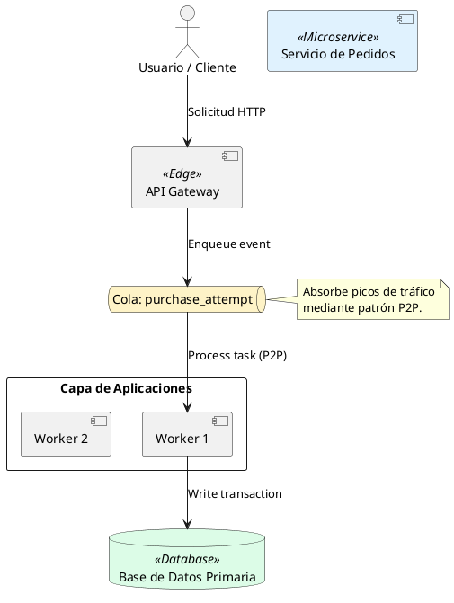
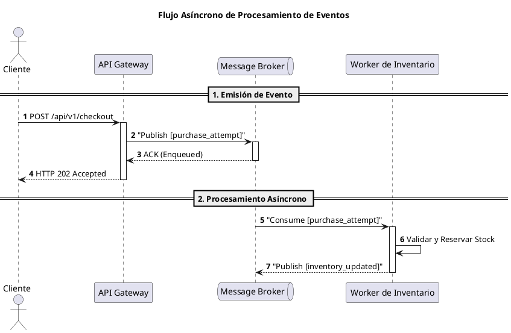

# Guía Estándar de Diagramación en PlantUML (PlantUML Syntax & Best Practices)

Esta guía define las reglas de sintaxis estrictas y patrones de diseño visual en **PlantUML** para garantizar que todos los diagramas arquitectónicos generados sean **100% sintácticamente válidos, parseables y libres de errores**.

---

## 1. Reglas Generales de Sintaxis

1. **Delimitadores Obligatorios**: Todo diagrama debe comenzar estrictamente con `@startuml` y finalizar con `@enduml`.
2. **Uso Obligatorio de Alias y Comillas**:
   - Todo componente con espacios o caracteres especiales en su nombre DEBE declararse con alias y comillas:
     - **INCORRECTO (Error de sintaxis)**: `component API Gateway as APIGW`
     - **CORRECTO**: `component "API Gateway" as APIGW`
3. **Identificadores Limpios**: Los alias deben ser cadenas alfanuméricas simples sin espacios ni guiones especiales (ej: `APIGW`, `CheckoutSvc`, `InvDB`).
4. **Etiquetas de Flechas**: Si la etiqueta de una flecha contiene espacios o caracteres especiales, usa comillas o sintaxis simple:
   - **CORRECTO**: `Producer --> Broker : "Publish user_joined"`
5. **Separación de Líneas en Nombres**: Para añadir saltos de línea dentro del nombre visible de un componente, usa `\n` en lugar de ` `:
   - **CORRECTO**: `component "Servicio de Notificaciones\n<<Asíncrono>>" as NotifSvc`

---

## 2. Diagramas de Componentes y Despliegue

### A. Elementos Soportados y Sintaxis

---

## 3. Diagramas de Secuencia (Sequence Diagrams)

### A. Elementos y Estructura Sintáctica

---

## 4. Lista de Trampas de Sintaxis a Evitar (Checklist Anti-Errores)

| Error Común en PlantUML | Causa del Error | Forma Correcta |
| :--- | :--- | :--- |
| `component Servicio Pedidos` | Falta comillas en nombre con espacio. | `component "Servicio Pedidos" as OrderSvc` |
| `<Service>` | Estereotipo con solo 1 corchete angular. | `<<Service>>` (Doble corchete angular) |
| `--->` o `====>` | Flechas con demasiados guiones no estándar. | `-->` o `->` |
| `endnote` | Palabra clave de nota pegada. | `end note` |
| `package Capa App {` sin cerrar `}` | Llave desbalanceada en package. | Asegurar cerrar cada `package` con `}` |
| Uso de ` ` dentro de nombres de PlantUML | Etiquetas HTML no soportadas en alias. | Usar `\n` para saltos de línea visibles. |
