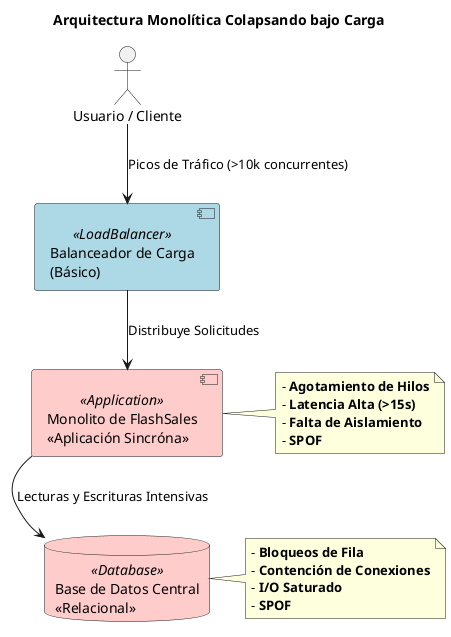
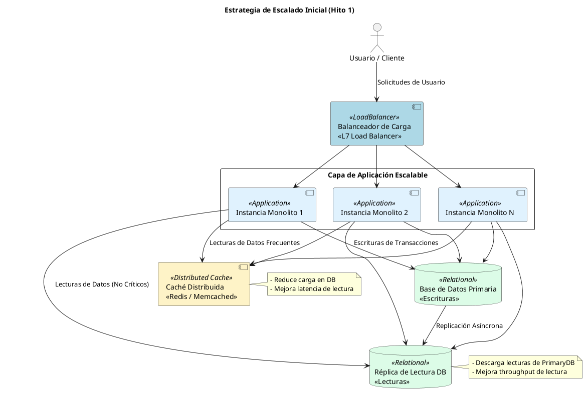

Como Principal Software & Enterprise Architect, procedo con el análisis riguroso de la arquitectura monolítica de FlashSales Inc. y las estrategias iniciales de escalado, adhiriéndome estrictamente a los principios de diseño sistémico, evaluación de compromisos y las directrices de formato y diagramación.

---

# Informe de Arquitectura - Hito 1: Análisis de Rendimiento del Sistema para FlashSales Inc.

## 1. Diagnóstico de Cuellos de Botella en la Arquitectura Monolítica

La arquitectura monolítica de FlashSales Inc., bajo picos de tráfico superiores a 10,000 usuarios concurrentes, exhibe fallas sistémicas debido a su diseño acoplado y sincrónico. Los principales cuellos de botella identificados son:

-   **Base de Datos Centralizada**:
    -   **Bloqueos de Fila (Row Locking)**: Múltiples transacciones intentando modificar las mismas filas (ej., inventario de un producto popular) resultan en contención, serialización de operaciones y esperas prolongadas, degradando drásticamente el rendimiento.
    -   **Contención en Pool de Conexiones**: El número limitado de conexiones a la base de datos se agota rápidamente bajo alta carga, impidiendo que nuevas solicitudes accedan a la DB y provocando errores de conexión o timeouts.
    -   **Impacto de I/O de Disco**: Las operaciones intensivas de lectura/escritura en disco, especialmente en un único servidor, saturan el subsistema de I/O, ralentizando todas las operaciones de persistencia.

-   **Manejo Sincrónico de Pedidos**:
    -   **Acoplamiento Temporal**: Cada paso del proceso de pedido (validación, reserva de inventario, procesamiento de pago, notificación) se ejecuta secuencialmente y de forma bloqueante. Un retraso en cualquier subsistema bloquea la cadena completa.
    -   **Encadenamiento de Llamadas Bloqueantes**: Las llamadas a servicios externos o componentes internos que tardan en responder (ej., pasarela de pago) bloquean los hilos de ejecución del servidor de aplicaciones, consumiendo recursos valiosos.
    -   **Agotamiento de Hilos (Thread Pool Starvation)**: El pool de hilos del servidor de aplicaciones se satura rápidamente con solicitudes bloqueadas, impidiendo el procesamiento de nuevas peticiones y llevando a la inaccesibilidad del servicio.

-   **Escalado Vertical**:
    -   **Límites Físicos de Hardware**: La capacidad de escalar un único servidor (CPU, RAM, I/O) es finita. Eventualmente, se alcanza un límite físico que no puede ser superado.
    -   **Costos Exponenciales y Retornos Decrecientes**: Aumentar la capacidad de un servidor de forma vertical se vuelve exponencialmente más caro por unidad de rendimiento adicional, con retornos cada vez menores.
    -   **Punto Único de Falla (SPOF)**: Un fallo en el servidor monolítico o en su base de datos centralizada provoca una interrupción total del servicio, sin redundancia ni tolerancia a fallas.

-   **Dependencias Fuertes entre Módulos**:
    -   **Falta de Aislamiento de Fallas**: Un error o un cuello de botella en un módulo (ej., notificaciones) puede afectar y colapsar a otros módulos críticos (ej., procesamiento de pedidos) debido a la compartición de recursos y la ejecución en el mismo proceso.
    -   **Propagación de Errores en Cascada**: La interdependencia sincrónica permite que un fallo en un componente se propague rápidamente a través de todo el sistema, causando un colapso en cadena.

## 2. Definición y Cuantificación de Métricas Clave de Rendimiento

Para evaluar el rendimiento y la salud del sistema, se proponen las siguientes métricas clave:

| Métrica | Objetivo Cuantitativo | Propósito / Descripción |
| :--- | :--- | :--- |
| **Latencia (p95)** | < 200 ms | El 95% de las solicitudes deben completarse en menos de 200 ms. El p95 es crucial para entender la experiencia de la mayoría de los usuarios, a diferencia del promedio que puede ocultar latencias altas para una minoría significativa. |
| **Latencia (p99)** | < 500 ms | El 99% de las solicitudes deben completarse en menos de 500 ms. Representa la experiencia de los usuarios con mayor latencia, identificando problemas que afectan a la "cola larga" de solicitudes. |
| **Throughput (req/s)** | > 10,000 req/s | El sistema debe procesar más de 10,000 solicitudes por segundo en picos de carga. Mide la capacidad del sistema para manejar volumen de trabajo. |
| **Throughput (tps)** | > 1,000 tps | El sistema debe procesar más de 1,000 transacciones de negocio por segundo. Mide la capacidad de procesar unidades de trabajo significativas. |
| **Uso de CPU** | < 70% | El uso promedio de CPU de los servidores de aplicaciones no debe superar el 70% durante picos sostenidos. Permite margen para picos inesperados y evita la saturación. |
| **Uso de Memoria** | < 80% | El uso de memoria de los servidores de aplicaciones no debe superar el 80%. Previene agotamiento de memoria y excesivos ciclos de Garbage Collection (GC), que pueden introducir pausas significativas. |
| **Tasa de Errores (HTTP 5xx)** | < 0.1% | El porcentaje de respuestas HTTP 5xx (errores del servidor) debe ser inferior al 0.1%. Indica la estabilidad y fiabilidad del servicio. |
| **Backpressure (Longitud de Cola)** | < 1000 ítems | La longitud de cualquier cola interna o buffer (ej., pool de hilos, colas de mensajes) no debe superar los 1000 ítems en espera. Indica saturación y riesgo de colapso. |

## 3. Estrategia de Escalado (Hito 1)

La estrategia inicial para mitigar los cuellos de botella del monolito se centra en el escalado horizontal de componentes sin estado y la optimización de la capa de datos.

-   **Componentes que escalan horizontalmente**:
    -   **Servidores de Aplicaciones (Monolito)**: Aunque el monolito en sí es una unidad indivisible, sus instancias pueden ser desplegadas en múltiples servidores detrás de un balanceador de carga. Cada instancia es idéntica y sin estado (o con estado de sesión gestionado externamente), permitiendo distribuir la carga de solicitudes entrantes. Esto aumenta el throughput y la resiliencia al eliminar un SPOF a nivel de aplicación.

-   **Componentes que requieren particionado o replicación**:
    -   **Base de Datos Centralizada**:
        -   **Réplicas de Lectura (Read Replicas)**: Para aliviar la carga de lectura de la base de datos primaria, se implementarán réplicas asíncronas. Las operaciones de lectura intensivas (ej., consulta de productos, historial de pedidos) se redirigirán a estas réplicas, liberando la base de datos primaria para las operaciones de escritura críticas (ej., creación de pedidos, actualización de inventario).
        -   **Caché Distribuido**: Se introducirá una capa de caché distribuido (ej., Redis, Memcached) para almacenar datos frecuentemente accedidos y de lectura intensiva (ej., detalles de productos, precios de flash sales). Esto reduce significativamente la carga sobre la base de datos, mejora la latencia de lectura y absorbe picos de tráfico para datos estáticos o semi-estáticos.

## 4. Tabla Comparativa de Herramientas de Monitoreo de Performance

Para garantizar la visibilidad del rendimiento y la salud del sistema, se evalúan las siguientes herramientas de monitoreo:

| Herramienta | Tipo (APM/Logs/Metrics) | Ventajas Principales | Modelo de Costos |
| :--- | :--- | :--- | :--- |
| **Prometheus + Grafana** | Metrics / Visualización | Open-source, potente para métricas de infraestructura y aplicación, alta flexibilidad, gran comunidad. | Gratuito (requiere gestión de infraestructura). |
| **ELK Stack (Elasticsearch, Logstash, Kibana) / OpenSearch** | Logs / Metrics / APM | Open-source, centralización de logs, búsqueda y análisis de texto completo, monitoreo de APM con Elastic APM. | Gratuito (requiere gestión de infraestructura), versiones comerciales con soporte y características adicionales. |
| **Datadog** | APM / Logs / Metrics / Infra | Plataforma unificada, fácil integración, monitoreo de extremo a extremo, AI para detección de anomalías. | Basado en consumo (hosts, métricas, logs, APM traces). |
| **New Relic** | APM / Logs / Metrics / Infra | Fuerte en APM, análisis de transacciones, mapas de servicio, monitoreo de experiencia de usuario (Browser/Mobile). | Basado en consumo (usuarios, datos ingesta, APM compute). |

## 5. Modelado Visual en PlantUML

### 5.1. Diagrama de Estado Actual: Arquitectura Monolítica Colapsando bajo Carga

Este diagrama ilustra la arquitectura monolítica de FlashSales Inc. y los puntos de falla bajo una carga extrema.

### 5.2. Diagrama Objetivo del Hito 1: Estrategia de Escalado con Capas Horizontales y Replicación

Este diagrama presenta la estrategia de escalado inicial para el monolito, introduciendo escalado horizontal de la capa de aplicación, réplicas de lectura y una caché distribuida para aliviar la base de datos.

