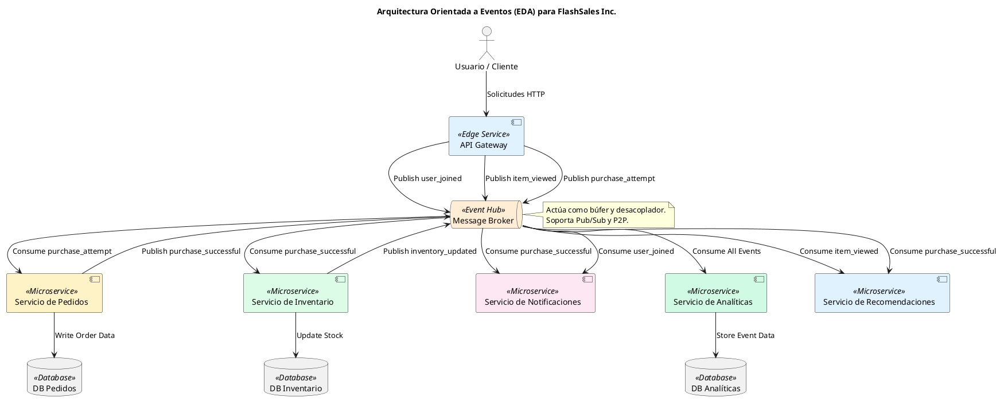
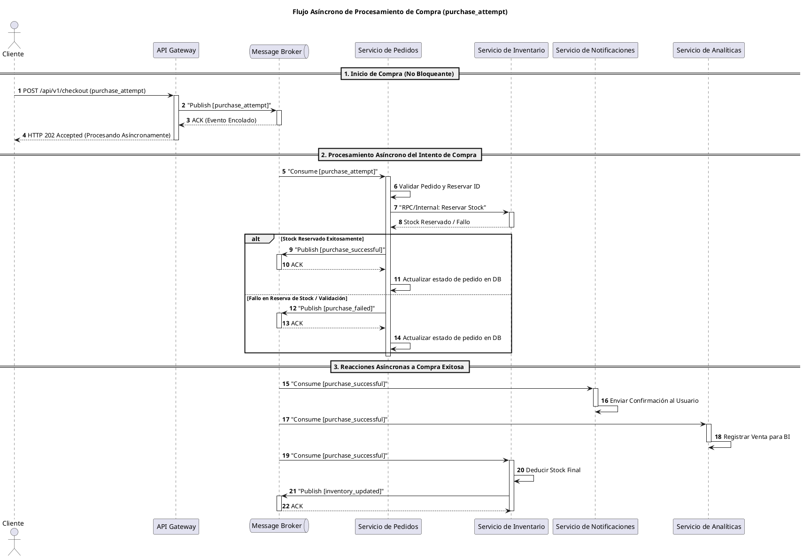

Como Arquitecto Principal de Software y Sistemas Distribuidos para FlashSales Inc., he analizado la problemática actual de la plataforma monolítica y propongo una transformación hacia una Arquitectura Orientada a Eventos (EDA) para abordar los desafíos de escalabilidad, resiliencia y rendimiento durante los eventos de ventas relámpago.

---

## Informe Arquitectónico: Diseño de Brokers de Mensajes y EDA para FlashSales Inc.

### 1. Introducción y Justificación de la Arquitectura Orientada a Eventos (EDA)

La arquitectura monolítica actual de FlashSales Inc. es inherentemente síncrona y fuertemente acoplada, lo que la hace vulnerable a fallas en cascada y cuellos de botella bajo carga extrema. La adopción de una Arquitectura Orientada a Eventos (EDA) con brokers de mensajes es una estrategia fundamental para:

-   **Desacoplamiento**: Reducir la dependencia directa entre servicios, permitiendo que evolucionen y escalen de forma independiente.
-   **Resiliencia**: Los brokers actúan como búferes, absorbiendo picos de tráfico y aislando fallas. Los consumidores pueden procesar eventos a su propio ritmo, y los eventos pueden ser reintentados o dirigidos a colas de mensajes fallidos (DLQ).
-   **Escalabilidad**: Los productores pueden emitir eventos sin esperar la confirmación de los consumidores, y los consumidores pueden escalar horizontalmente para procesar el volumen de eventos.
-   **Observabilidad**: Los flujos de eventos proporcionan un rastro auditable de las operaciones del sistema.
-   **Procesamiento Asíncrono**: Permite que las operaciones de larga duración se ejecuten en segundo plano, mejorando los tiempos de respuesta de cara al usuario.

### 2. Identificación del Ecosistema EDA

Para FlashSales Inc., el ecosistema EDA se estructurará en torno a los siguientes roles:

-   **Productores de Eventos**:
    -   **API Gateway / Frontend**: Genera eventos relacionados con la interacción del usuario (ej. `user_joined`, `item_viewed`, `purchase_attempt`).
    -   **Servicio de Pedidos (Order Service)**: Emite eventos sobre el estado de los pedidos (ej. `purchase_successful`).
    -   **Servicio de Inventario (Inventory Service)**: Publica eventos sobre cambios en el stock (ej. `inventory_updated`).
    -   **Servicio de Pagos (Payment Service)**: Podría emitir eventos de confirmación de pago.

-   **Brokers de Mensajes**:
    -   Actúan como el conducto central para todos los eventos, desacoplando productores y consumidores.
    -   Proporcionan durabilidad, persistencia y mecanismos de entrega garantizada (al menos una vez).

-   **Consumidores de Eventos**:
    -   **Servicio de Notificaciones (Notification Service)**: Envía confirmaciones, alertas de stock, etc.
    -   **Servicio de Inventario (Inventory Service)**: Reacciona a intentos de compra para reservar stock.
    -   **Servicio de Pedidos (Order Service)**: Procesa intentos de compra, actualiza estados.
    -   **Servicio de Analíticas (Analytics Service)**: Ingiere todos los eventos para análisis en tiempo real y generación de informes.
    -   **Servicio de Recomendaciones (Recommendation Service)**: Utiliza `item_viewed` y `purchase_successful` para personalizar sugerencias.
    -   **Servicio de Marketing/CRM**: Reacciona a `user_joined` para campañas de bienvenida.

### 3. Mapeo de Eventos Clave del Flash Sale

A continuación, se describen los 5 eventos clave identificados para la plataforma FlashSales Inc.:

-   **`user_joined`**:
    -   **Descripción**: Se emite cuando un nuevo usuario se registra en la plataforma.
    -   **Contenido (ejemplo conceptual)**: `userId`, `timestamp`, `registrationSource`.
-   **`item_viewed`**:
    -   **Descripción**: Se emite cada vez que un usuario visualiza la página de un producto.
    -   **Contenido (ejemplo conceptual)**: `userId`, `itemId`, `timestamp`, `sessionId`.
-   **`purchase_attempt`**:
    -   **Descripción**: Se emite cuando un usuario inicia el proceso de compra de un producto (ej. añade al carrito y procede al checkout). Este evento es crítico para la reserva de stock.
    -   **Contenido (ejemplo conceptual)**: `userId`, `itemId`, `quantity`, `price`, `timestamp`, `transactionId`.
-   **`purchase_successful`**:
    -   **Descripción**: Se emite una vez que un intento de compra ha sido validado, el pago procesado y el stock reservado/deducido.
    -   **Contenido (ejemplo conceptual)**: `userId`, `orderId`, `itemId`, `quantity`, `finalPrice`, `timestamp`, `paymentStatus`.
-   **`inventory_updated`**:
    -   **Descripción**: Se emite cuando el stock de un producto cambia (ej. por una compra, devolución, o reabastecimiento).
    -   **Contenido (ejemplo conceptual)**: `itemId`, `newStockLevel`, `changeAmount`, `timestamp`, `reason`.

### 4. Selección y Justificación del Tipo de Cola por Evento

Para cada evento, la elección entre Punto a Punto (P2P) y Publicación/Suscripción (Pub/Sub) se basa en la semántica de la entrega y el número esperado de consumidores interesados.

-   **`user_joined`**: **Pub/Sub**
    -   **Justificación**: Múltiples servicios pueden estar interesados en este evento (ej. analíticas, CRM, servicio de bienvenida). Una entrega a múltiples suscriptores es ideal.
-   **`item_viewed`**: **Pub/Sub**
    -   **Justificación**: Típicamente, varios sistemas consumen este evento para análisis de comportamiento, personalización de recomendaciones, o dashboards en tiempo real.
-   **`purchase_attempt`**: **Punto a Punto (P2P)**
    -   **Justificación**: Este evento es crítico y generalmente requiere un procesamiento único y atómico para la validación inicial y la reserva de stock. Un único consumidor (ej. el Servicio de Pedidos o un Worker de Procesamiento de Compras) debe procesarlo para evitar condiciones de carrera o doble reserva. Una vez procesado, se pueden emitir eventos subsiguientes (ej. `purchase_successful`) en un modelo Pub/Sub.
-   **`purchase_successful`**: **Pub/Sub**
    -   **Justificación**: Una vez que una compra es exitosa, muchos servicios necesitan reaccionar: notificaciones al usuario, actualización de inventario, registro en analíticas, procesamiento de pagos final, etc.
-   **`inventory_updated`**: **Pub/Sub**
    -   **Justificación**: Los cambios de inventario son relevantes para el catálogo de productos, el servicio de recomendaciones, la interfaz de usuario (mostrar stock disponible) y los sistemas de analíticas.

### 5. Investigación Comparativa de Servicios de Brokers de Mensajes

| Broker de Mensajes | Tipo | Principales Capacidades | Modelo de Precios (Alto Nivel) |
| :--- | :--- | :--- | :--- |
| **Apache Kafka** | Streaming / Híbrido | Alta throughput, baja latencia, persistencia duradera, escalabilidad horizontal, re-procesamiento de eventos, integración con stream processing. | Open-Source (costo de infraestructura y operación). |
| **RabbitMQ** | Cola / Híbrido | Mensajería robusta P2P y Pub/Sub, enrutamiento flexible, alta disponibilidad, soporte para múltiples protocolos (AMQP, MQTT, STOMP). | Open-Source (costo de infraestructura y operación). |
| **AWS SQS/SNS** | Cola (SQS) / Pub/Sub (SNS) | SQS: Colas P2P gestionadas, escalabilidad elástica, durabilidad. SNS: Tópicos Pub/Sub gestionados, entrega a múltiples endpoints (SQS, Lambda, HTTP, Email). | Basado en uso (número de solicitudes, volumen de datos). |
| **Google Cloud Pub/Sub** | Pub/Sub | Servicio de mensajería global y escalable, baja latencia, entrega garantizada, integración nativa con otros servicios de Google Cloud. | Basado en uso (volumen de datos, operaciones de suscripción). |

**Análisis de Trade-offs para FlashSales Inc.:**

-   **Apache Kafka**: Ofrece la mayor flexibilidad y rendimiento para escenarios de streaming y re-procesamiento, ideal para analíticas en tiempo real y la base de una plataforma de eventos. Sin embargo, su complejidad operativa es alta.
-   **RabbitMQ**: Excelente para escenarios de colas tradicionales con enrutamiento complejo y garantías de entrega. Más fácil de operar que Kafka para casos de uso de colas puras.
-   **AWS SQS/SNS y Google Pub/Sub**: Ofrecen la simplicidad y escalabilidad de servicios gestionados en la nube, reduciendo la carga operativa. Son ideales para empezar rápidamente y escalar sin preocuparse por la infraestructura subyacente. SQS es P2P, SNS y Pub/Sub son Pub/Sub.

**Recomendación Preliminar**: Para FlashSales Inc., una combinación de **Apache Kafka (o Confluent Cloud)** para los eventos de streaming de alto volumen (ej. `item_viewed`, `user_joined`, `inventory_updated` para analíticas y procesamiento en tiempo real) y **RabbitMQ (o AWS SQS/Azure Service Bus)** para los eventos transaccionales críticos que requieren semántica P2P (ej. `purchase_attempt`) podría ser una estrategia robusta. Kafka actuaría como el "Event Hub" central, mientras que las colas P2P manejarían la lógica transaccional específica.

### 6. Modelado Visual en PlantUML

#### 6.1. Diagrama de Arquitectura EDA

#### 6.2. Diagrama de Secuencia de Compra Asíncrona

