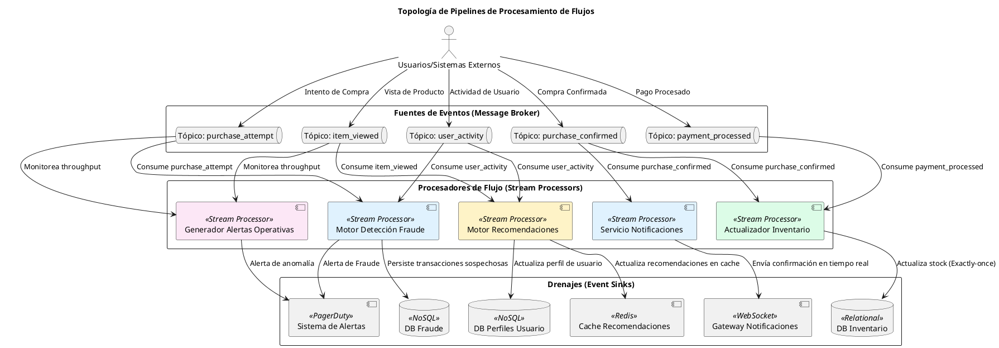
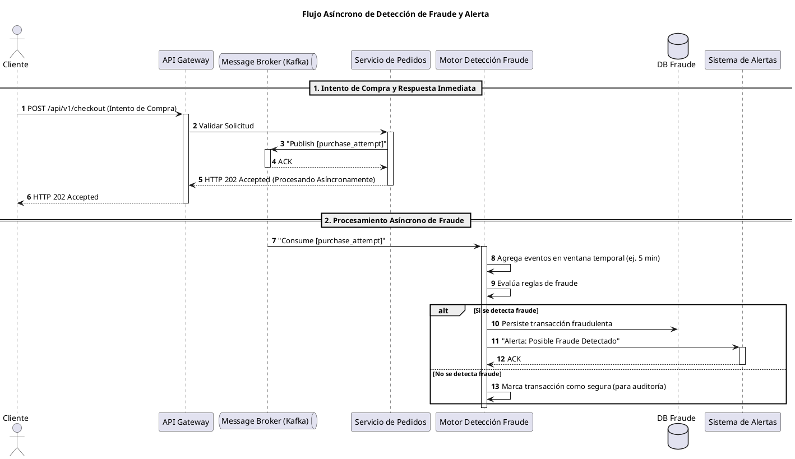

# Hito 3: Arquitectura de Procesamiento de Flujos para FlashSales Inc.

Este informe detalla la propuesta arquitectónica para la implementación de un sistema de procesamiento de flujos en tiempo real para FlashSales Inc., abordando la escalabilidad, resiliencia y las garantías de procesamiento necesarias para soportar eventos de ventas relámpago de alto volumen. Se formulan requerimientos estrictos, se diseña la topología de los pipelines, se analizan las garantías de consistencia y se comparan tecnologías clave.

---

## 1. Requerimientos Formales de Sistema (NASA & IBM DOORS)

A continuación, se presentan los requerimientos formales vinculantes para el sistema de procesamiento de flujos, redactados bajo los estándares de la NASA e IBM DOORS:

-   **ID Único**: `REQ-STREAM-001`
    -   **Declaración (Shall Statement)**: El sistema de detección de fraude **deberá** identificar patrones de compra fraudulentos en flujos de eventos `purchase_attempt` y `user_activity`.
    -   **Tipo de Requerimiento**: Funcional (FR), No Funcional / Rendimiento (NFR)
    -   **Criterio de Aceptación Cuantitativo**: El sistema deberá emitir una alerta de fraude con una latencia p99 inferior a 300 ms desde la ingestión del evento de compra.
    -   **Método de Verificación**: Prueba (Test)

-   **ID Único**: `REQ-STREAM-002`
    -   **Declaración (Shall Statement)**: El procesador de inventario **deberá** actualizar el stock disponible de productos en tiempo real tras cada evento `purchase_confirmed` o `purchase_cancelled`.
    -   **Tipo de Requerimiento**: Funcional (FR), No Funcional / Consistencia (NFR)
    -   **Criterio de Aceptación Cuantitativo**: El sistema deberá garantizar el procesamiento *exactly-once* para las actualizaciones de inventario, reflejando el stock con una desviación máxima de 0 unidades en la base de datos de inventario.
    -   **Método de Verificación**: Prueba (Test), Análisis (Analysis)

-   **ID Único**: `REQ-STREAM-003`
    -   **Declaración (Shall Statement)**: El motor de recomendaciones **deberá** generar sugerencias de productos personalizadas basadas en eventos `item_viewed` y `purchase_attempt` de usuarios.
    -   **Tipo de Requerimiento**: Funcional (FR), No Funcional / Rendimiento (NFR)
    -   **Criterio de Aceptación Cuantitativo**: El sistema deberá actualizar el perfil de recomendaciones de un usuario con una latencia p95 inferior a 500 ms desde la ocurrencia del evento relevante.
    -   **Método de Verificación**: Prueba (Test)

-   **ID Único**: `REQ-STREAM-004`
    -   **Declaración (Shall Statement)**: El sistema de monitoreo operativo **deberá** detectar anomalías en el throughput de eventos y la latencia de procesamiento de los pipelines.
    -   **Tipo de Requerimiento**: No Funcional / Operabilidad (NFR), Resiliencia (RES)
    -   **Criterio de Aceptación Cuantitativo**: El sistema deberá emitir una alerta a los operadores si el throughput de un tópico cae por debajo del 80% de su promedio en un período de 5 minutos, o si la latencia p99 excede 1 segundo.
    -   **Método de Verificación**: Prueba (Test), Inspección (Inspection)

-   **ID Único**: `REQ-STREAM-005`
    -   **Declaración (Shall Statement)**: El sistema de notificaciones **deberá** enviar confirmaciones de compra y actualizaciones de estado de envío a los usuarios.
    -   **Tipo de Requerimiento**: Funcional (FR)
    -   **Criterio de Aceptación Cuantitativo**: El sistema deberá procesar y enrutar eventos de notificación con un throughput mínimo de 5,000 eventos/segundo durante picos de tráfico.
    -   **Método de Verificación**: Prueba (Test)

---

## 2. Diseño Conceptual de Pipelines de Procesamiento de Flujos

El diseño de los pipelines de procesamiento de flujos se basa en una arquitectura orientada a eventos, donde los datos fluyen continuamente desde diversas fuentes, son transformados por procesadores de flujo y finalmente persisten o activan acciones en drenajes específicos.

-   **Fuentes de Eventos (Event Sources / Ingestion)**:
    -   **`purchase_attempt`**: Eventos generados cuando un usuario intenta realizar una compra.
    -   **`item_viewed`**: Eventos que registran las visualizaciones de productos por parte de los usuarios.
    -   **`user_activity`**: Eventos generales de interacción del usuario (login, logout, carrito).
    -   **`purchase_confirmed`**: Eventos que indican una compra exitosa.
    -   **`purchase_cancelled`**: Eventos que indican una compra cancelada o fallida.
    -   **`payment_processed`**: Eventos del sistema de pagos.
    -   **`inventory_updated`**: Eventos de actualización de stock.

-   **Procesadores de Flujo (Stream Processors / Transformations)**:
    -   **Filtrado**: Selección de eventos relevantes para un pipeline específico (ej. solo `purchase_attempt` para fraude).
    -   **Agregación**: Cálculo de métricas sobre ventanas temporales (ej. número de compras por usuario en 5 minutos para detección de fraude).
    -   **Uniones de Flujos (Stream Joins)**: Combinación de datos de diferentes flujos (ej. `item_viewed` con `user_profile` para recomendaciones).
    -   **Computación de Estado**: Mantenimiento de estado interno (ej. carrito de compras, historial de usuario) para decisiones basadas en el contexto.
    -   **Enriquecimiento**: Adición de información contextual a los eventos (ej. datos de producto, ubicación del usuario).

-   **Drenajes o Salidas (Event Sinks)**:
    -   **Bases de Datos Analíticas**: Para persistir datos agregados o resultados de análisis (ej. historial de fraude, métricas de rendimiento).
    -   **Cachés en Memoria (ej. Redis)**: Para almacenar resultados de baja latencia (ej. recomendaciones personalizadas, stock disponible).
    -   **WebSocket Gateways**: Para enviar notificaciones en tiempo real a clientes (ej. "Tu compra ha sido confirmada").
    -   **Sistemas de Alerta (ej. PagerDuty, Slack)**: Para notificar a los operadores sobre anomalías o fraudes.
    -   **Sistemas de Notificación (ej. Email, SMS)**: Para enviar comunicaciones transaccionales.

### Diagrama de Arquitectura de Stream Processing (Pipeline Topology)

---

## 3. Garantías de Consistencia, Ordenamiento y Gestión de Estado

### 3.1. Garantías de Entrega: At-least-once vs. Exactly-once Processing

La elección de la garantía de entrega es un compromiso crítico entre rendimiento, complejidad y corrección de datos.

-   **At-least-once Processing**:
    -   **Descripción**: Un evento puede ser entregado y procesado una o más veces. Es la garantía por defecto en muchos sistemas distribuidos.
    -   **Ventajas**: Menor sobrecarga, mayor rendimiento y resiliencia ante fallas (reintentos automáticos).
    -   **Desventajas**: Requiere que los procesadores sean **idempotentes** para evitar efectos secundarios duplicados (ej. doble cargo en un pago, doble decremento de inventario).
    -   **Uso en FlashSales**: Adecuado para casos donde la duplicación no es crítica o puede ser manejada por idempotencia a nivel de aplicación, como la generación de recomendaciones, el registro de vistas de productos o la detección de fraude (donde un reanálisis no es perjudicial).

-   **Exactly-once Processing**:
    -   **Descripción**: Cada evento es entregado y procesado exactamente una vez, incluso en caso de fallas del sistema.
    -   **Ventajas**: Garantiza la corrección de los datos, crucial para operaciones transaccionales.
    -   **Desventajas**: Mayor complejidad de implementación y mayor latencia debido a la coordinación distribuida (transacciones distribuidas, *two-phase commit*, *fencing*).
    -   **Uso en FlashSales**: **Crítico** para operaciones que modifican el estado financiero o de inventario, como la **actualización atómica de inventario** (`REQ-STREAM-002`) y el procesamiento de pagos. Aquí, la idempotencia estricta es fundamental para evitar inconsistencias.

### 3.2. Tratamiento de Eventos Fuera de Orden (Out-of-Order Events)

En sistemas distribuidos, los eventos pueden llegar desordenados debido a latencias de red, reintentos o particiones.

-   **Event Time vs. Processing Time**:
    -   **Processing Time**: El tiempo en que un evento es procesado por el sistema. Simple, pero no robusto para eventos fuera de orden.
    -   **Event Time**: El tiempo real en que el evento ocurrió en la fuente. Es el preferido para análisis precisos.
-   **Watermarks**:
    -   **Descripción**: Un *watermark* es un marcador de progreso en el *event time* de un flujo. Indica que todos los eventos con un *event time* anterior al *watermark* han sido recibidos y procesados (o se asume que no llegarán).
    -   **Función**: Permite a los procesadores de flujo saber cuándo pueden cerrar una ventana temporal y emitir resultados, incluso si esperan eventos tardíos. Se configura con un "período de gracia" para eventos tardíos.
    -   **Uso en FlashSales**: Esencial para la detección de fraude basada en ventanas temporales (ej. "5 compras en 1 minuto") y para la agregación de métricas de popularidad, donde la precisión temporal es clave.

### 3.3. Gestión de Estado y Ventanas Temporales

Los procesadores de flujo a menudo necesitan mantener un estado para realizar agregaciones o uniones. Las ventanas temporales son fundamentales para agrupar eventos.

-   **Tumbling Windows (Ventanas Fijas)**:
    -   **Descripción**: Ventanas de tamaño fijo y no superpuestas. Cada evento pertenece a una única ventana.
    -   **Uso en FlashSales**: Ideal para métricas periódicas (ej. "número total de ventas cada 5 minutos", "recuento de errores por minuto").
-   **Sliding Windows (Ventanas Deslizantes)**:
    -   **Descripción**: Ventanas de tamaño fijo que se superponen. Se definen por un tamaño y un "paso" (intervalo de deslizamiento).
    -   **Uso en FlashSales**: Útil para monitorear tendencias continuas (ej. "promedio móvil de latencia en los últimos 10 minutos, actualizado cada 1 minuto") o para la detección de fraude donde se necesita una vista más granular y continua del comportamiento.
-   **Session Windows (Ventanas de Sesión)**:
    -   **Descripción**: Ventanas dinámicas que agrupan eventos de un mismo usuario o entidad, separadas por un período de inactividad.
    -   **Uso en FlashSales**: Perfectas para analizar el comportamiento del usuario durante una sesión de compra (ej. "secuencia de productos vistos antes de una compra", "tiempo total de actividad en el sitio").

---

## 4. Investigación Comparativa de Tecnologías de Stream Processing

### 4.1. Apache Flink
-   **Modelo de Procesamiento**: Procesamiento de flujos *verdadero* (event-at-a-time), con soporte nativo para *event time* y *watermarks*.
-   **Gestión de Estado**: Ofrece un potente sistema de gestión de estado con *state backends* (RocksDB, memoria) y *checkpoints* asíncronos para tolerancia a fallos y *exactly-once* semántica.
-   **Tolerancia a Fallos**: Basado en *checkpoints* distribuidos y *replay* de flujos para recuperación de estado.
-   **Ventajas**:
    -   **Exactly-once**: Fuerte garantía de procesamiento *exactly-once* de extremo a extremo.
    -   **Latencia Baja**: Diseñado para baja latencia y alto rendimiento.
    -   **Flexibilidad**: Soporte para una amplia gama de operaciones de flujo, incluyendo ventanas complejas, *joins* y *stateful processing*.
    -   **API Unificada**: API para flujos y procesamiento por lotes (DataSet y DataStream).
-   **Desventajas**:
    -   **Curva de Aprendizaje**: Puede ser más complejo de configurar y operar que otras soluciones.
    -   **Ecosistema**: Aunque maduro, su ecosistema es menos amplio que el de Spark.
-   **Uso en FlashSales**: Ideal para la detección de fraude (`REQ-STREAM-001`), actualización atómica de inventario (`REQ-STREAM-002`) y cualquier caso que requiera *exactly-once* y baja latencia con estado complejo.

### 4.2. Apache Kafka Streams
-   **Modelo de Procesamiento**: Biblioteca cliente para Apache Kafka, permite construir aplicaciones de procesamiento de flujos directamente sobre tópicos de Kafka.
-   **Gestión de Estado**: Utiliza RocksDB para el estado local y tópicos de Kafka para el *changelog* de estado y la tolerancia a fallos.
-   **Tolerancia a Fallos**: Se basa en la replicación de tópicos de Kafka y la capacidad de reiniciar el procesamiento desde el último *offset* confirmado.
-   **Ventajas**:
    -   **Integración Nativas con Kafka**: Muy fácil de integrar con un ecosistema Kafka existente.
    -   **Ligero**: No requiere un clúster de procesamiento separado; las aplicaciones se ejecutan como procesos Java/Scala estándar.
    -   **Escalabilidad**: Escala horizontalmente añadiendo más instancias de la aplicación.
    -   **Exactly-once**: Soporta *exactly-once* semántica para operaciones dentro de Kafka.
-   **Desventajas**:
    -   **Limitaciones de API**: Menos flexible que Flink para operaciones de flujo muy complejas o *joins* entre flujos de diferentes fuentes.
    -   **Dependencia de Kafka**: Estrictamente acoplado a Kafka como broker y almacenamiento de estado.
-   **Uso en FlashSales**: Excelente para el servicio de notificaciones (`REQ-STREAM-005`), generación de alertas operativas (`REQ-STREAM-004`) y procesamiento de flujos más simples que ya residen en Kafka.

### 4.3. Apache Spark Structured Streaming
-   **Modelo de Procesamiento**: Extensión de Spark SQL para procesamiento de flujos, tratando los flujos como tablas que se actualizan continuamente.
-   **Gestión de Estado**: Utiliza el sistema de gestión de estado de Spark, que puede ser persistido en HDFS, S3 o RocksDB.
-   **Tolerancia a Fallos**: Basado en *checkpoints* y la capacidad de recomputar el estado a partir de los datos de entrada.
-   **Ventajas**:
    -   **API Unificada**: Permite usar la misma API (DataFrame/Dataset) para procesamiento por lotes y flujos.
    -   **Ecosistema Rico**: Acceso a todo el ecosistema de Spark (MLlib, GraphX, etc.).
    -   **Escalabilidad**: Altamente escalable en clústeres grandes.
    -   **Exactly-once**: Soporta *exactly-once* semántica.
-   **Desventajas**:
    -   **Latencia**: Generalmente tiene una latencia ligeramente superior a Flink debido a su modelo de micro-lotes.
    -   **Overhead**: Requiere un clúster Spark, lo que puede implicar mayor sobrecarga operativa.
-   **Uso en FlashSales**: Adecuado para el motor de recomendaciones (`REQ-STREAM-003`) donde se pueden beneficiar de algoritmos de Machine Learning de Spark, y para análisis de datos en tiempo casi real que no requieren la latencia más baja posible.

---

## 5. Modelado Visual en PlantUML

### 5.1. Diagrama de Arquitectura de Stream Processing (Pipeline Topology)

*(Este diagrama es una repetición del presentado en la sección 2, según las directivas del prompt para asegurar su inclusión explícita en esta sección.)*

### 5.2. Diagrama de Secuencia de Detección de Fraude y Alerta en Tiempo Real

Este diagrama ilustra el flujo asíncrono de detección de fraude, donde la respuesta al cliente no se bloquea por el procesamiento de fraude.

