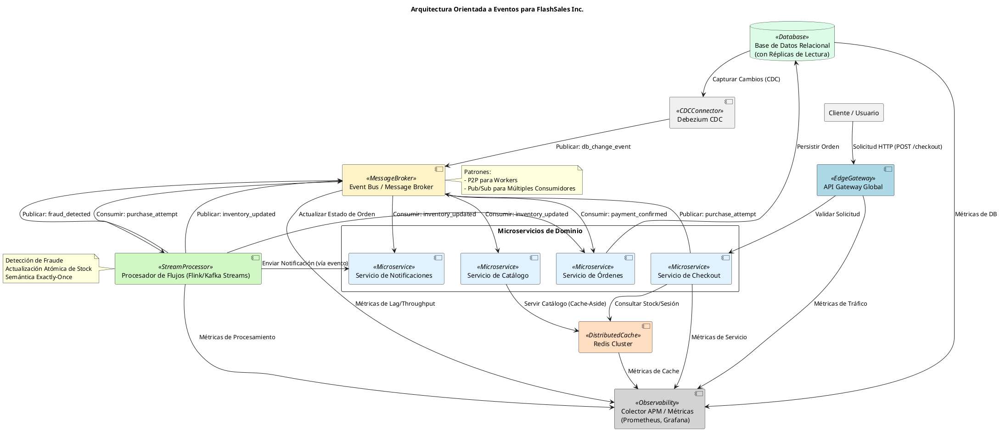

# Informe Final Sintético: Arquitectura Objetivo y Decisiones de Diseño para FlashSales Inc.

Como Arquitecto Principal de Software y Sistemas Distribuidos, presento la visión arquitectónica consolidada para transformar la plataforma de FlashSales Inc. hacia un modelo altamente escalable, resiliente y orientado a eventos. Esta propuesta aborda los desafíos de picos de tráfico extremos durante las ventas relámpago, garantizando una experiencia de usuario fluida y la integridad de las operaciones críticas.

---

## 1. Representación Visual de la Arquitectura Propuesta

A continuación, se presenta un diagrama de componentes que ilustra la arquitectura objetivo, destacando las interacciones clave y los patrones de diseño implementados.

---

## 2. Documento Sintético de Decisiones de Diseño y Cobertura de Rendimiento

### A. Justificación de las Decisiones de Diseño Clave

La arquitectura propuesta se basa en principios de diseño de sistemas distribuidos para abordar la escalabilidad, resiliencia y rendimiento bajo carga extrema.

*   **Desacoplamiento Asíncrono (EDA)**:
    *   **Justificación**: La transición de llamadas síncronas bloqueantes a una Arquitectura Orientada a Eventos (EDA) es fundamental para eliminar el agotamiento de hilos (*thread pool starvation*) que colapsaba el monolito. Al publicar eventos (`purchase_attempt`) y responder con un `HTTP 202 Accepted` de inmediato, el API Gateway y los servicios iniciales no esperan por el procesamiento downstream. Esto aísla las fallas en cascada, ya que un fallo en un servicio consumidor no bloquea al productor, y permite que los componentes procesen a su propio ritmo, absorbiendo picos de tráfico sin degradación.
    *   **Trade-offs**: Introduce complejidad en la depuración y la necesidad de manejar la consistencia eventual.

*   **Patrones de Mensajería (P2P vs. Pub/Sub)**:
    *   **Justificación**: Se utilizan ambos patrones para optimizar la comunicación.
        *   **P2P (Point-to-Point / Competing Consumers)**: Se aplica para el procesamiento de eventos de alta concurrencia como `purchase_attempt`. Múltiples instancias de un "worker" (e.g., Stream Processors o microservicios específicos) compiten por mensajes de una cola o partición, distribuyendo la carga y garantizando que cada mensaje sea procesado una única vez. Esto es crucial para la escalabilidad horizontal de los procesadores de órdenes y stock.
        *   **Pub/Sub (Publish/Subscribe)**: Se emplea para eventos que interesan a múltiples consumidores, como `inventory_updated`, `user_joined` o `fraud_detected`. Un productor publica un evento en un tópico, y todos los suscriptores interesados reciben una copia. Esto desacopla fuertemente a los productores de los consumidores, permitiendo que nuevos servicios se integren fácilmente sin modificar a los existentes (e.g., Notificaciones, Analítica, Búsqueda).
    *   **Trade-offs**: La elección incorrecta puede llevar a procesamiento duplicado o falta de escalabilidad.

*   **Procesamiento de Flujos en Tiempo Real**:
    *   **Justificación**: El uso de procesadores de flujos (e.g., Apache Flink o Kafka Streams) es vital para la detección de fraude y la actualización atómica de stock en tiempo real.
        *   **Ventanas Temporales (Sliding/Tumbling Windows)**: Permiten analizar patrones de eventos dentro de marcos de tiempo definidos (e.g., 5 segundos) para identificar comportamientos sospechosos (múltiples compras desde la misma IP en un corto periodo).
        *   **Semántica *Exactly-Once***: Es una garantía crítica para operaciones financieras y de inventario. Asegura que cada evento sea procesado exactamente una vez, previniendo dobles cargos, reservas de stock duplicadas o pérdidas de transacciones, incluso frente a fallas del sistema. Esto se logra mediante el uso de transacciones distribuidas y *idempotencia* en los sumideros (sinks).
    *   **Trade-offs**: Mayor complejidad operativa y de desarrollo para garantizar la semántica *exactly-once* y la gestión de estado distribuido.

*   **Estrategia de Datos y CDC**:
    *   **Justificación**:
        *   **Cachés Distribuidas (Redis Cluster)**: Se implementan para absorber más del 90% de las lecturas masivas (e.g., catálogo de productos, sesiones de usuario, estado de stock en tiempo real). Al servir datos desde la memoria, se reduce drásticamente la carga sobre la base de datos primaria y se mejoran las latencias de respuesta.
        *   **Change Data Capture (Debezium)**: Permite la captura de cambios en la base de datos relacional en tiempo real y su publicación como eventos en el Event Bus. Esto facilita la migración continua de datos desde sistemas legados o monolíticos sin interrupción (*zero-downtime*), la replicación de datos a otros sistemas (data warehouses, motores de búsqueda) y la creación de vistas materializadas o cachés actualizadas de forma asíncrona.
    *   **Trade-offs**: La gestión de la coherencia entre la caché y la base de datos requiere estrategias como *cache-aside* o *write-through/behind*. CDC añade una capa de infraestructura y la necesidad de gestionar el orden de los eventos.

### B. Cobertura de Requisitos de Rendimiento por Componente

Cada componente de la arquitectura está diseñado para cumplir con SLAs específicos, contribuyendo a la resiliencia y el rendimiento general del sistema:

*   **API Gateway Global**:
    *   **Requisito**: Absorción de picos de tráfico y respuesta inicial `HTTP 202 Accepted` en `< 100 ms`.
    *   **Cobertura**: Implementa *rate limiting* para proteger los servicios downstream, *caching* para recursos estáticos y *offloading* de autenticación/autorización. Su función principal es encolar rápidamente las solicitudes de compra como eventos, desacoplando la respuesta del procesamiento real, lo que garantiza una latencia baja para el usuario final.

*   **Redis Cluster**:
    *   **Requisito**: Absorción de lecturas masivas (90%+) con latencia `< 5 ms`.
    *   **Cobertura**: Al ser una base de datos en memoria distribuida, Redis ofrece latencias de microsegundos para operaciones de lectura/escritura de clave-valor. Su capacidad de clustering permite escalar horizontalmente para manejar grandes volúmenes de datos y solicitudes, reduciendo la carga sobre la base de datos relacional.

*   **Event Bus / Message Broker (Apache Kafka)**:
    *   **Requisito**: Ingesta sostenida de `> 5,000 req/s` con amortiguación de carga (*load smoothing*).
    *   **Cobertura**: Kafka está diseñado para alta throughput y baja latencia en la ingesta de eventos. Su arquitectura distribuida y particionada permite escalar la capacidad de escritura y lectura linealmente. Actúa como un *buffer* elástico, absorbiendo picos de tráfico y permitiendo que los consumidores procesen los eventos a su propio ritmo sin sobrecargar los servicios downstream.

*   **Procesador de Flujos (Flink/Kafka Streams)**:
    *   **Requisito**: Detección de fraude en ventanas de 5s y consistencia de inventario en `< 200 ms` (p99).
    *   **Cobertura**: Estas plataformas de procesamiento de flujos están optimizadas para baja latencia y alta throughput. Las operaciones con estado y las ventanas temporales permiten procesar y analizar eventos en tiempo real. La semántica *exactly-once* garantiza la precisión de las actualizaciones de inventario y la fiabilidad de la detección de fraude dentro de los umbrales de tiempo definidos.

*   **Colector APM / Métricas (Prometheus, Grafana)**:
    *   **Requisito**: Detección proactiva de saturación de CPU/memoria y alertas de lag.
    *   **Cobertura**: La observabilidad integral es clave para el rendimiento. Prometheus recolecta métricas de todos los componentes (CPU, memoria, latencia, throughput, lag de consumidores de Kafka). Grafana visualiza estos datos en tiempo real, y las reglas de alerta notifican proactivamente a los equipos de operaciones sobre cualquier degradación o saturación, permitiendo una respuesta rápida antes de que los problemas escalen a fallas críticas.