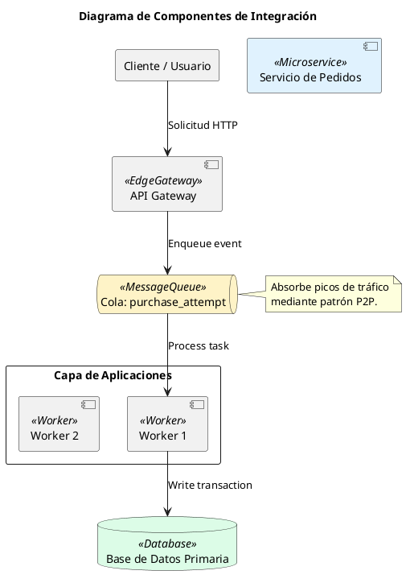
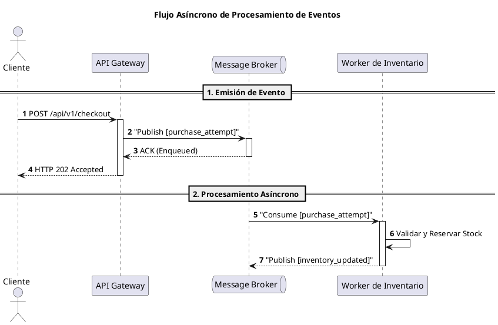

# Guía Estándar de Diagramación en PlantUML (PlantUML Syntax & Best Practices - Week 4)

Esta guía define las reglas de sintaxis estrictas y patrones de diseño visual en **PlantUML** para garantizar que todos los diagramas arquitectónicos generados sean **100% sintácticamente válidos, parseables y libres de errores**.

---

## 1. Reglas Generales de Sintaxis Imperativas (Checklist Anti-Errores)

1. **Delimitadores Obligatorios**: Todo diagrama debe comenzar estrictamente con `@startuml` y finalizar con `@enduml`.
2. **Estereotipos en Una Sola Palabra (PROHIBIDO ESPACIOS EN << >>)**:
   - **INCORRECTO (Error de Sintaxis)**: `component "App" as App <<Mobile Client>>`
   - **CORRECTO**: `component "App" as App <<MobileClient>>` o `<<ExternalPartner>>` (Sin espacios dentro de los corchetes angulares `<< >>`).
3. **Flechas Válidas (PROHIBIDO SÍMBOLOS NO SOPORTADOS)**:
   - **INCORRECTO (Error de Sintaxis)**: `A <--> B`, `A ===> B`, `A <---> B`
   - **CORRECTO**: `A <-> B`, `A --> B`, `A -> B`, `A ..> B`, `A <.. B`
4. **Declaración de Clientes/Usuarios en Diagramas de Componentes**:
   - Para representar un cliente o usuario en un Diagrama de Componentes (`componentStyle uml2`), usa `rectangle` o `component` con estereotipo:
     - **CORRECTO**: `rectangle "Cliente / Usuario" as User` o `component "Cliente" as User <<User>>`
     - Evita la palabra clave `actor` en diagramas de componentes para evitar que PlantUML confunda el tipo de diagrama.
5. **Uso Obligatorio de Alias y Comillas**:
   - Todo componente con espacios o caracteres especiales en su nombre DEBE declararse con alias y comillas:
     - **INCORRECTO**: `component API Gateway as APIGW`
     - **CORRECTO**: `component "API Gateway" as APIGW`
6. **Identificadores Limpios**: Los alias deben ser cadenas alfanuméricas simples sin espacios ni guiones especiales (ej: `APIGW`, `CheckoutSvc`, `InvDB`).
7. **Etiquetas de Flechas**: Si la etiqueta de una flecha contiene espacios o caracteres especiales, usa comillas:
   - **CORRECTO**: `Producer --> Broker : "Publish user_joined"`
8. **Separación de Líneas en Nombres**: Para añadir saltos de línea dentro del nombre visible de un componente, usa `\n` en lugar de ` `:
   - **CORRECTO**: `component "Servicio de Notificaciones\n<<Asíncrono>>" as NotifSvc`

---

## 2. Diagrama de Componentes (PlantUML Component Diagram)

---

## 3. Diagrama de Secuencia (PlantUML Sequence Diagram)

