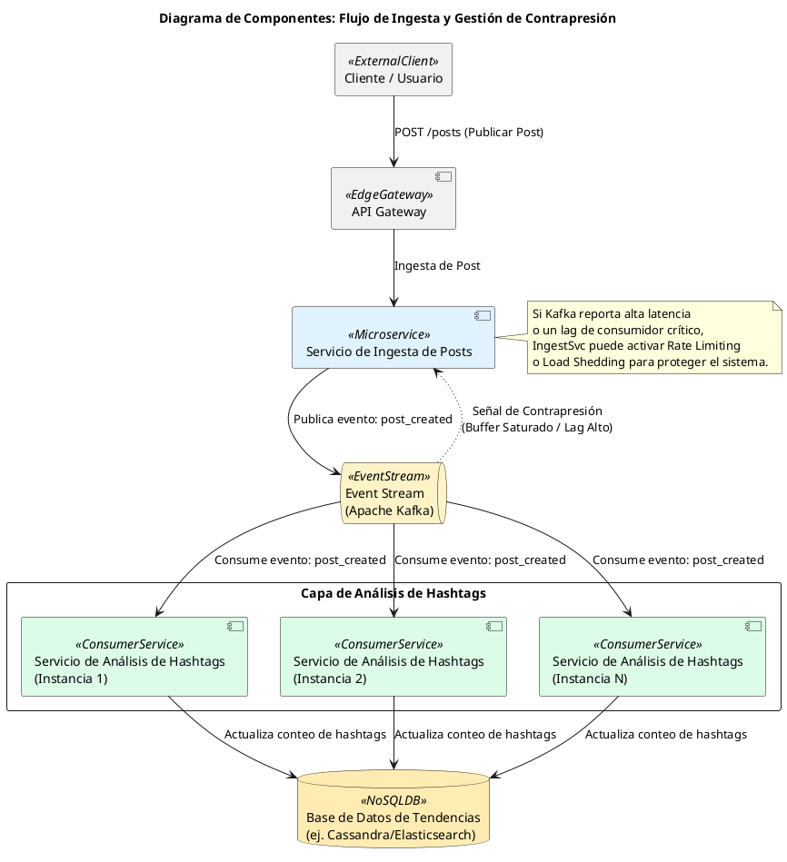
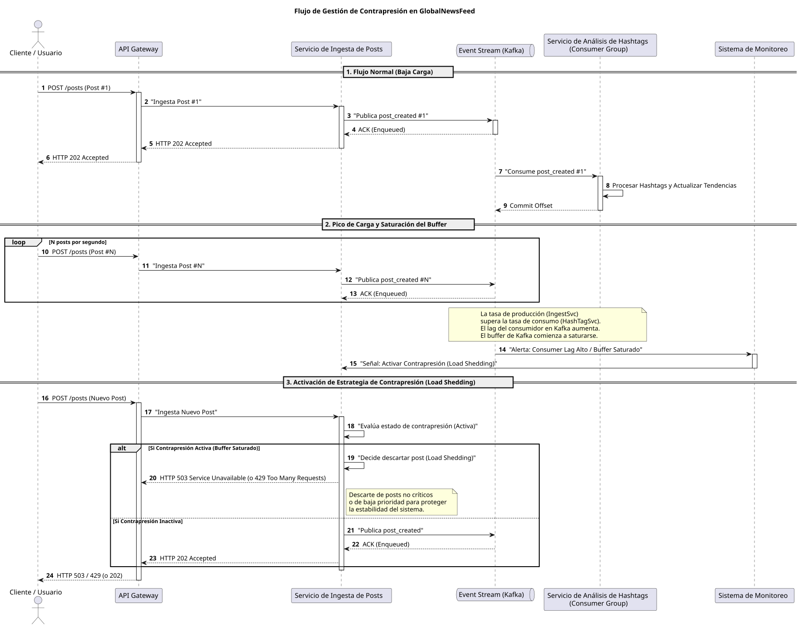

Como Principal Software & Enterprise Architect, presento el siguiente informe técnico analítico de alto nivel para la plataforma **GlobalNewsFeed**, centrándome en la funcionalidad de **Análisis de Hashtags en Tendencia** y la gestión de la contrapresión.

---

## 1.1 Análisis del Escenario del Sistema GlobalNewsFeed

El sistema GlobalNewsFeed, en su funcionalidad de "Análisis de Hashtags en Tendencia", se enfrenta a un desafío inherente a los sistemas distribuidos de procesamiento de datos en tiempo real: la gestión de la contrapresión ante flujos de eventos masivos y variables.

### Identificación de Roles en el Flujo de Análisis de Hashtags

*   **Productores de Eventos (Posts)**:
    *   **Clientes Web/Móvil**: Usuarios finales que interactúan directamente con la plataforma, creando y publicando posts. Representan una fuente de tráfico impredecible y potencialmente volátil.
    *   **Servicio de Ingesta de Posts**: Microservicio de entrada que recibe las publicaciones de los clientes, realiza validaciones iniciales y las prepara para su procesamiento posterior. Su rol es absorber la carga inicial y desacoplar a los clientes del procesamiento intensivo.
    *   **APIs de Integración (Opcional)**: Fuentes externas de contenido (ej. agregadores de noticias, feeds de otras redes sociales) que podrían inyectar posts en la plataforma.

*   **Consumidores de Eventos (Posts para Análisis)**:
    *   **Servicio de Análisis de Hashtags (HashTag Counter)**: Microservicio principal encargado de procesar cada post. Extrae hashtags, los normaliza, los cuenta en ventanas temporales y gestiona su estado. Es el componente más intensivo en CPU y memoria.
    *   **Servicio de Agregación de Tendencias**: Microservicio que consolida los conteos de hashtags de múltiples instancias del `Servicio de Análisis de Hashtags` para identificar las tendencias globales y regionales, aplicando algoritmos de ranking y filtrado.
    *   **Servicio de Notificaciones/Visualización**: Componentes que consumen las tendencias agregadas para mostrarlas a los usuarios en tiempo real o para generar alertas.

### Naturaleza del Proceso de Larga Duración

El "Análisis de Hashtags en Tendencia" es intrínsecamente un **proceso de larga duración** debido a la complejidad y el volumen de operaciones que implica por cada post:

*   **Parsing de Texto y Tokenización**: Análisis del contenido del post para identificar palabras y frases relevantes, a menudo utilizando técnicas de Procesamiento de Lenguaje Natural (NLP).
*   **Extracción de Hashtags**: Identificación de patrones específicos (ej. `#palabra`) dentro del texto, que puede requerir expresiones regulares complejas o diccionarios de sinónimos.
*   **Deduplicación y Filtrado**: Eliminación de posts repetidos, spam o contenido irrelevante para asegurar la calidad de las tendencias.
*   **Cálculo en Ventanas Deslizantes (Sliding Windows)**: Los hashtags no se cuentan de forma acumulativa, sino dentro de períodos de tiempo específicos (ej. los últimos 5, 10 o 30 minutos). Esto implica mantener un estado temporal y realizar cálculos continuos.
*   **Clasificación y Ranking en Tiempo Real**: Ordenamiento de los hashtags por frecuencia, relevancia o engagement para determinar cuáles son tendencia, lo que requiere operaciones de agregación y ordenamiento sobre grandes conjuntos de datos.
*   **Persistencia de Estado**: Almacenamiento de conteos intermedios y tendencias finales en bases de datos de alta velocidad.

Estas operaciones son intensivas en recursos (CPU, memoria, I/O) y no pueden completarse instantáneamente para cada uno de los cientos de miles de posts que pueden llegar por segundo.

### Situaciones Concretas de Contrapresión

La contrapresión se manifiesta cuando la tasa de ingesta de posts supera la capacidad de procesamiento del `Servicio de Análisis de Hashtags`. Escenarios operacionales reales incluyen:

*   **Eventos Globales de Gran Impacto**: Durante una final deportiva (ej. Copa del Mundo, Super Bowl), elecciones nacionales o un concierto masivo, millones de usuarios publican simultáneamente, generando picos de tráfico que pueden alcanzar cientos de miles de posts por segundo.
*   **Noticias de Última Hora**: Un evento noticioso inesperado (ej. un desastre natural, un anuncio político importante) puede provocar una explosión repentina de publicaciones, saturando los sistemas de ingesta y análisis.
*   **Ataques de Spam o DDoS**: Intentos maliciosos de saturar la plataforma con un volumen artificialmente alto de posts, buscando degradar o denegar el servicio.
*   **Campañas Virales o Lanzamientos de Productos**: Un hashtag promocional o un tema que se vuelve viral puede generar un pico sostenido de publicaciones.

### Ejemplos Comparativos en Sistemas Reales

La gestión de la contrapresión en flujos de datos masivos es un desafío común en la industria:

*   **Twitter/X Trends**: La plataforma debe procesar miles de millones de tweets diarios en tiempo real para identificar y clasificar las tendencias globales y locales. Su arquitectura se basa en colas de mensajes y procesamiento distribuido para manejar la ingesta masiva y el análisis de datos.
*   **Netflix (Métricas de Reproducción)**: Netflix ingiere y procesa billones de eventos de telemetría (reproducciones, pausas, búsquedas) de sus usuarios para análisis de comportamiento, personalización y monitoreo de calidad de servicio. Utilizan Kafka y sistemas de procesamiento de streams para manejar esta escala.
*   **Ingesta de Telemetría IoT**: Plataformas que gestionan millones de dispositivos IoT deben procesar flujos continuos de datos de sensores. La contrapresión es crítica para evitar la pérdida de datos y garantizar la disponibilidad del sistema de monitoreo y control.

---

## 1.2 Investigación de Conceptos Clave

### 1. Procesos de Larga Duración (*Long-Running Processes*)

*   **Analogía de la Vida Real**: Imagina la preparación de un banquete de bodas. No es una tarea instantánea; implica múltiples pasos (planificación, compra de ingredientes, cocción de diferentes platos, emplatado), cada uno con su propio tiempo y dependencias. No puedes esperar que el banquete esté listo en el momento en que pides el primer plato.
*   **Comparación Técnico-Arquitectónica**: Son operaciones que requieren un tiempo considerable para completarse, superando los límites de una única solicitud/respuesta síncrona (típicamente > 1-2 segundos). Involucran múltiples pasos, acceso a recursos externos (bases de datos, APIs de terceros), y pueden ser intensivos en CPU, memoria o I/O. Se ejecutan típicamente en segundo plano, de forma asíncrona, y su estado puede necesitar ser persistido para reintentos o seguimiento.
*   **Contraejemplo (Qué NO es)**: Una consulta simple a una base de datos por una clave primaria, una validación de formato de entrada, o una operación CRUD básica que se completa en milisegundos. Estas son operaciones de corta duración y baja latencia.

### 2. Productores y Consumidores (*Producers & Consumers*)

*   **Analogía de la Vida Real**: Una fábrica de coches (productor) fabrica vehículos y los envía a un almacén. Varios concesionarios (consumidores) recogen los coches del almacén para venderlos. La fábrica no necesita saber a qué concesionario irá cada coche, y los concesionarios no necesitan saber cómo se fabricó cada coche.
*   **Comparación Técnico-Arquitectónica**:
    *   **Productor**: Un componente o servicio que genera datos, eventos o tareas y los envía a un intermediario (ej. una cola de mensajes). Su principal preocupación es la generación y entrega confiable al intermediario, sin preocuparse por el procesamiento posterior.
    *   **Consumidor**: Un componente o servicio que lee y procesa los datos, eventos o tareas del intermediario. Opera a su propio ritmo, aplicando su lógica de negocio.
    *   Este patrón es fundamental para el desacoplamiento temporal y espacial, permitiendo que los componentes evolucionen, escalen y fallen de forma independiente.
*   **Contraejemplo (Qué NO es)**: Una llamada a función directa o una invocación RPC síncrona entre dos módulos donde el módulo A llama directamente al módulo B y espera su respuesta. Aquí, A y B están fuertemente acoplados.

### 3. Contrapresión (*Backpressure*)

*   **Analogía de la Vida Real**: Imagina una manguera de jardín conectada a un grifo (productor) y un aspersor (consumidor). Si el grifo se abre a máxima potencia y el aspersor tiene agujeros pequeños, el agua se acumulará en la manguera, aumentando la presión hasta que la manguera se hinche o reviente. La contrapresión es esa acumulación de presión.
*   **Comparación Técnico-Arquitectónica**: Es una situación en sistemas distribuidos donde la tasa de producción de eventos o datos por parte de un componente excede consistentemente la capacidad de procesamiento de los componentes consumidores. Si no se gestiona, la contrapresión puede llevar a la saturación de buffers intermedios, agotamiento de recursos (CPU, memoria, conexiones), aumento de latencia, y eventualmente a fallas en cascada o caídas del servicio. Es una señal de que el sistema está bajo estrés y necesita un mecanismo de control de flujo.
*   **Contraejemplo (Qué NO es)**: Un sistema donde la tasa de producción es siempre igual o menor que la tasa de consumo, o donde los buffers intermedios son ilimitados y nunca se llenan (un escenario ideal pero irreal en la práctica).

### 4. Colas, Buffers y Desacoplamiento (*Queues, Buffers & Decoupling*)

*   **Analogía de la Vida Real**:
    *   **Cola**: La fila de espera en un banco. Los clientes (mensajes) llegan a un ritmo variable y esperan a ser atendidos por los cajeros (consumidores) a su propio ritmo.
    *   **Buffer**: Un almacén temporal donde se guardan los productos terminados de una fábrica antes de ser distribuidos.
    *   **Desacoplamiento**: El hecho de que el cliente no necesita saber qué cajero le atenderá, ni el cajero necesita saber de dónde viene cada cliente.
*   **Comparación Técnico-Arquitectónica**:
    *   **Cola/Buffer**: Un componente intermedio (ej. Apache Kafka, RabbitMQ, Redis List) que almacena temporalmente eventos o mensajes entre productores y consumidores. Actúa como un amortiguador elástico, absorbiendo picos de carga y permitiendo que los componentes operen a ritmos diferentes sin bloquearse mutuamente.
    *   **Desacoplamiento**: La reducción de dependencias directas entre componentes. Permite que productores y consumidores evolucionen, fallen o escalen de forma independiente, mejorando la resiliencia y la flexibilidad del sistema.
*   **Contraejemplo (Qué NO es)**: Un sistema donde los componentes se comunican directamente sin intermediarios, como una llamada HTTP síncrona. En este caso, si el receptor es lento o falla, el emisor se bloquea o falla también, lo que indica un fuerte acoplamiento.

### 5. Procesamiento Síncrono vs. Asíncrono (*Sync vs. Async Processing*)

*   **Analogía de la Vida Real**:
    *   **Síncrono**: Llamas a un restaurante para pedir comida y te quedas en la línea esperando hasta que te confirmen que tu pedido está listo. No puedes hacer nada más mientras esperas.
    *   **Asíncrono**: Pides comida online, recibes una confirmación de que el pedido ha sido recibido, y luego recibes una notificación cuando esté listo para recoger. Mientras tanto, puedes seguir haciendo otras cosas.
*   **Comparación Técnico-Arquitectónica**:
    *   **Síncrono**: El emisor de una solicitud bloquea su ejecución y espera una respuesta inmediata del receptor. Esto implica un fuerte acoplamiento temporal y puede introducir alta latencia si el receptor es lento. Es adecuado para operaciones que requieren una respuesta inmediata y son de corta duración.
    *   **Asíncrono**: El emisor envía un mensaje o evento y continúa su ejecución sin esperar una respuesta inmediata. La respuesta (si es necesaria) se gestiona a través de callbacks, eventos o polling. Promueve la resiliencia, escalabilidad y desacoplamiento, siendo ideal para procesos de larga duración y sistemas distribuidos de alta concurrencia.
*   **Contraejemplo (Qué NO es)**:
    *   **Síncrono**: Un sistema que usa llamadas RPC bloqueantes para todas las operaciones, incluso aquellas que no requieren una respuesta inmediata, lo que lleva a un uso ineficiente de recursos y baja tolerancia a fallos.
    *   **Asíncrono**: Un sistema que depende exclusivamente de llamadas síncronas para todas las interacciones, sin mecanismos para manejar operaciones de larga duración o fallos de forma no bloqueante.

---

## 1.3 Exploración de Estrategias Arquitectónicas para Manejar la Contrapresión

Para GlobalNewsFeed, la gestión de la contrapresión es crítica. A continuación, se evalúan las principales estrategias arquitectónicas:

### 1. Uso de Colas de Mensajes / Event Streams (Buffering finito/infinito con Kafka/PubSub)

*   **Mecanismo**: Interponer un sistema de mensajería distribuido y persistente (ej. Apache Kafka, Google Cloud Pub/Sub) entre el `Servicio de Ingesta de Posts` (productor) y el `Servicio de Análisis de Hashtags` (consumidor). Los productores escriben eventos en el stream, y los consumidores los leen a su propio ritmo, gestionando su propio offset. El stream actúa como un buffer elástico y duradero.
*   **Ventajas**:
    *   **Desacoplamiento Temporal y Espacial**: Productores y consumidores operan de forma completamente independiente, sin necesidad de conocerse mutuamente ni de estar activos al mismo tiempo.
    *   **Resiliencia y Durabilidad**: Los mensajes persisten en el stream, tolerando fallos de los consumidores y permitiendo reintentos o re-procesamiento.
    *   **Amortiguación de Picos (Load Smoothing)**: Absorbe ráfagas de tráfico masivas, permitiendo que los consumidores procesen a una tasa más estable y predecible.
    *   **Escalabilidad Independiente**: Permite escalar el `Servicio de Ingesta` y el `Servicio de Análisis` de forma independiente según sus necesidades de carga.
*   **Riesgos**:
    *   **Complejidad Operacional**: La gestión de un clúster de Kafka o Pub/Sub añade una capa de infraestructura y complejidad operativa.
    *   **Latencia Adicional**: Introduce un salto adicional en la comunicación, aunque suele ser bajo para Kafka.
    *   **Consistencia Eventual**: No garantiza consistencia ACID inmediata; las tendencias se actualizarán con un pequeño retraso.
    *   **Saturación del Buffer (Extrema)**: Aunque Kafka es muy resistente, una contrapresión sostenida y extrema podría eventualmente llenar los discos si la tasa de consumo es drásticamente inferior a la de producción por períodos muy largos.
*   **Aplicabilidad en GlobalNewsFeed**: **Estrategia Fundamental y Obligatoria**. Es la base para desacoplar la ingesta masiva de posts del procesamiento intensivo de hashtags. Kafka es ideal por su durabilidad, escalabilidad, capacidad de re-lectura y soporte para Consumer Groups.

### 2. Escalado Horizontal de Consumidores (Consumer Groups & HPA)

*   **Mecanismo**: Aumentar dinámicamente el número de instancias del `Servicio de Análisis de Hashtags` para procesar más mensajes en paralelo. Esto se logra mediante la configuración de Consumer Groups en Kafka (donde cada mensaje es procesado por una única instancia dentro del grupo) y el uso de autoescaladores horizontales (ej. Horizontal Pod Autoscaler en Kubernetes) basados en métricas como el lag del consumidor o la utilización de CPU.
*   **Ventajas**:
    *   **Aumento Directo de Throughput**: Incrementa la capacidad de procesamiento del sistema de forma lineal con el número de instancias.
    *   **Respuesta Dinámica a la Carga**: Se adapta automáticamente a los picos de demanda, activando nuevas instancias cuando el lag aumenta.
    *   **Alta Disponibilidad**: La falla de una instancia de consumidor no detiene el procesamiento, ya que otras instancias pueden tomar su lugar.
*   **Riesgos**:
    *   **Límites de Escalabilidad**: No es ilimitado; puede haber cuellos de botella en la base de datos de tendencias (ej. contención de escrituras) o en recursos compartidos externos.
    *   **Costos**: Un mayor número de instancias implica mayores costos de infraestructura y operación.
    *   **Contención de Recursos**: Si el procesamiento es intensivo en recursos externos (ej. base de datos NoSQL), escalar consumidores puede agravar la contención en esos recursos.
    *   **Estado Compartido**: Si los consumidores necesitan mantener estado compartido, el escalado horizontal introduce complejidad (ej. locks distribuidos, consistencia de caché).
*   **Aplicabilidad en GlobalNewsFeed**: **Estrategia Esencial y Complementaria**. El `Servicio de Análisis de Hashtags` debe ser diseñado para ser *stateless* o gestionar su estado de forma distribuida (ej. con Redis Cluster o una DB NoSQL) para permitir un escalado horizontal eficiente y maximizar el throughput.

### 3. Limitación de Tasa y Descarte de Carga (Rate Limiting, Load Shedding & Throttling)

*   **Mecanismo**:
    *   **Rate Limiting**: Restringir el número de solicitudes que un cliente o un productor puede enviar en un período de tiempo (ej. 100 posts/min por usuario). Se implementa típicamente en el `API Gateway`.
    *   **Throttling**: Ralentizar la tasa de producción o consumo de forma controlada.
    *   **Load Shedding (Descarte de Carga)**: Descartar explícitamente solicitudes o eventos cuando el sistema está sobrecargado para proteger los servicios críticos y evitar un colapso total.
*   **Ventajas**:
    *   **Protección del Sistema**: Evita el colapso total bajo carga extrema, manteniendo la disponibilidad de los servicios principales.
    *   **Priorización**: Permite mantener la funcionalidad principal operativa, descartando lo menos crítico.
    *   **Simplicidad de Implementación (para Rate Limiting)**: A menudo se configura en el `API Gateway` o en el `Servicio de Ingesta`.
*   **Riesgos**:
    *   **Pérdida de Datos/Eventos**: El descarte de carga implica la pérdida intencional de información, lo cual puede ser inaceptable para ciertos casos de uso.
    *   **Experiencia de Usuario Degradada**: Los usuarios pueden experimentar errores (HTTP 429 Too Many Requests, 503 Service Unavailable) o retrasos.
    *   **Configuración Compleja**: Definir umbrales adecuados para el descarte es difícil y requiere un monitoreo constante y ajustes.
*   **Aplicabilidad en GlobalNewsFeed**: **Estrategia de Último Recurso/Contingencia**. El `API Gateway` de ingesta podría aplicar `Rate Limiting` a usuarios o IPs sospechosas para prevenir ataques. El `Servicio de Ingesta` podría implementar `Load Shedding` si el `Event Stream` está saturado y el lag de los consumidores es crítico, priorizando posts de usuarios verificados o con alto engagement sobre posts anónimos o de baja prioridad.

### 4. Degradación Controlada del Servicio (Graceful Degradation, Sampling / Lossy Processing)

*   **Mecanismo**: Reducir la calidad, precisión o completitud del servicio para mantener la disponibilidad bajo carga extrema.
    *   **Sampling**: Procesar solo un subconjunto de los eventos (ej. 1 de cada 10 posts) para reducir la carga.
    *   **Lossy Processing**: Realizar un procesamiento menos intensivo o con menos precisión (ej. actualizar las tendencias cada 5 minutos en lugar de cada 1 minuto).
    *   **Graceful Degradation**: Desactivar funcionalidades no esenciales o menos críticas.
*   **Ventajas**:
    *   **Mantiene la Disponibilidad**: El servicio sigue funcionando, aunque con menor calidad o precisión.
    *   **Control sobre la Experiencia**: Permite decidir qué funcionalidades se sacrifican y cómo se comunica al usuario.
    *   **Reduce la Carga de Procesamiento**: Alivia la presión sobre los consumidores y la base de datos.
*   **Riesgos**:
    *   **Pérdida de Precisión/Completitud**: Las tendencias podrían no ser 100% precisas o completas, lo que podría afectar la confianza del usuario.
    *   **Complejidad de Implementación**: Requiere lógica de negocio para decidir qué degradar, cómo y cuándo revertir la degradación.
    *   **Impacto en el Negocio**: Puede afectar la calidad de los datos, la experiencia del usuario o la monetización.
*   **Aplicabilidad en GlobalNewsFeed**: **Estrategia de Contingencia Avanzada**. Si el `Servicio de Análisis de Hashtags` está al límite y el escalado horizontal no es suficiente, podría optar por procesar solo un porcentaje de los posts (sampling) o reducir la frecuencia de actualización de las tendencias (lossy processing) para mantener el servicio activo y evitar un colapso.

### 5. Control de Flujo Basado en Extracción Reactiva (Reactive Streams Pull-based Backpressure)

*   **Mecanismo**: En lugar de que el productor empuje datos al consumidor, el consumidor "tira" (pulls) los datos a su propio ritmo. El consumidor solicita explícitamente un número determinado de elementos al productor, lo que le permite controlar su propia carga. Esto se implementa con frameworks de programación reactiva (ej. Akka Streams, Project Reactor, RxJava).
*   **Ventajas**:
    *   **Control Preciso del Consumidor**: El consumidor dicta su propio ritmo de procesamiento, evitando ser abrumado.
    *   **Evita la Sobrecarga**: El productor no puede abrumar al consumidor, ya que solo envía lo que se le solicita.
    *   **Eficiencia de Recursos**: Se procesan solo los datos que el consumidor puede manejar, optimizando el uso de recursos.
*   **Riesgos**:
    *   **Complejidad de Programación**: Requiere un paradigma de programación reactiva, que puede tener una curva de aprendizaje pronunciada.
    *   **Acoplamiento entre Productor y Consumidor**: Aunque el flujo es pull-based, hay una interacción más directa que con un Event Stream puro, lo que puede introducir cierto acoplamiento.
    *   **No Resuelve el Problema de Almacenamiento a Gran Escala**: Si el productor genera datos más rápido de lo que el consumidor puede tirar, los datos deben ser almacenados en algún lugar antes de ser solicitados, lo que nos lleva de nuevo a la necesidad de un buffer (cola de mensajes).
*   **Aplicabilidad en GlobalNewsFeed**: **Aplicable a Nivel de Componente Interno**. Podría usarse *dentro* del `Servicio de Análisis de Hashtags` para gestionar el flujo de datos entre sus subcomponentes internos (ej. del parser al módulo de conteo), o entre el consumidor de Kafka y el módulo de procesamiento. Sin embargo, no es la estrategia principal para el desacoplamiento a nivel de sistema distribuido, donde un `Event Stream` como Kafka ya proporciona el buffering y el desacoplamiento a gran escala.

---

## 1.4 Modelado Visual en PlantUML

### 1. Diagrama de Componentes del Flujo de Ingesta y Contrapresión

Este diagrama ilustra los componentes clave del flujo de ingesta y análisis de posts, destacando el `Event Stream` como buffer central y la señal de contrapresión.

### 2. Diagrama de Secuencia de Gestión de Contrapresión

