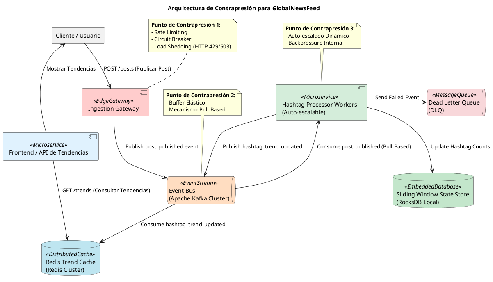
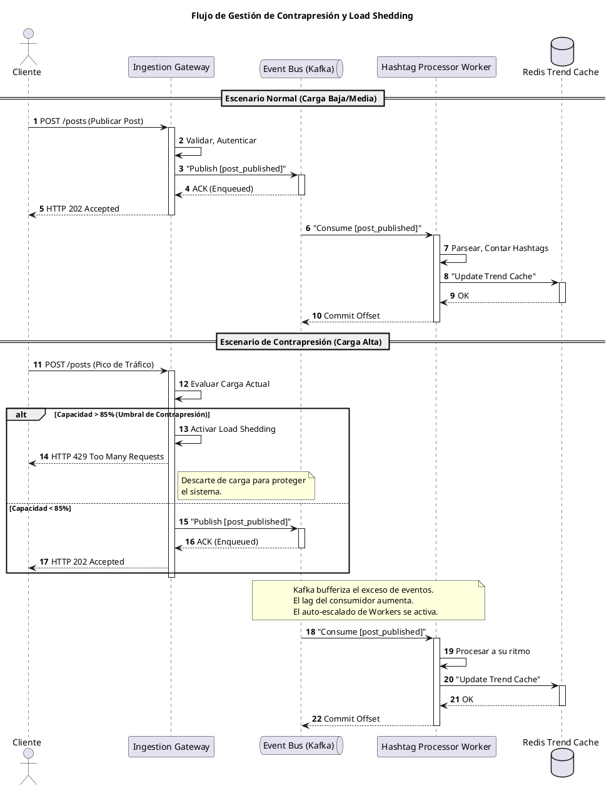

Como Principal Software & Enterprise Architect, he analizado el escenario de GlobalNewsFeed y el desafío de la contrapresión en el procesamiento de hashtags en tendencia. A continuación, presento la propuesta arquitectónica consolidada.

---

# Informe Arquitectónico: Gestión de Contrapresión en GlobalNewsFeed - Análisis de Hashtags en Tendencia

## 2.1 Selección, Justificación y Análisis Crítico de la Estrategia

### Estrategia Seleccionada: Control de Flujo Reactivo Híbrido con Buffer de Eventos y Descarte Adaptativo

La estrategia seleccionada es un enfoque híbrido que combina:
1.  **Buffer de Eventos Distribuido (Apache Kafka)**: Actúa como un amortiguador elástico y duradero, desacoplando productores de consumidores.
2.  **Consumo Pull-Based Reactivo**: Los consumidores (Hashtag Processor Workers) controlan su propio ritmo de ingesta de eventos de Kafka.
3.  **Auto-escalado Dinámico de Consumidores**: Ajusta la capacidad de procesamiento en función de la carga y el lag de la cola.
4.  **Descarte de Carga (Load Shedding) en el Borde**: Mecanismo de último recurso en el Ingestion Gateway para proteger el sistema de picos de tráfico extremos e insostenibles.
5.  **Circuit Breakers y Timeouts**: Para proteger contra fallos en cascada en dependencias externas o internas.

### Justificación Técnica

Esta combinación es idónea para GlobalNewsFeed por las siguientes razones:
-   **Desacoplamiento Extremo**: Apache Kafka proporciona un desacoplamiento temporal y espacial robusto, permitiendo que el Ingestion Gateway (productor) opere a su máxima capacidad sin preocuparse por la velocidad de los consumidores. Esto es crucial para absorber los "cientos de miles de eventos por segundo" durante picos.
-   **Resiliencia y Durabilidad**: Kafka persiste los eventos en disco, garantizando que no haya pérdida de datos incluso si los consumidores fallan o se reinician. Su capacidad de re-procesamiento es vital para la consistencia eventual.
-   **Control de Ritmo del Consumidor**: El modelo pull-based de Kafka permite que los Hashtag Processor Workers consuman mensajes a su propio ritmo, evitando ser abrumados. Esto es fundamental dado que realizan "operaciones pesadas de parsing, conteo en ventanas temporales y ordenamiento".
-   **Escalabilidad Elástica**: El auto-escalado de los workers permite que el sistema se adapte a cargas sostenidas, añadiendo o eliminando instancias según sea necesario para mantener el lag de procesamiento bajo control.
-   **Protección de Último Recurso**: El Load Shedding en el Ingestion Gateway es un mecanismo de defensa crítico. En escenarios de tráfico extremo que superan incluso la capacidad de Kafka y el auto-escalado, es preferible descartar una pequeña fracción de la carga entrante (con una respuesta HTTP 429/503) que permitir que todo el sistema colapse.
-   **Consistencia Eventual**: El uso de un Event Bus y el procesamiento asíncrono se alinea con el principio de consistencia eventual, adecuado para el análisis de tendencias donde una pequeña demora o un descarte ocasional de un post individual no compromete la integridad general de la tendencia.

### Alcance y Limitaciones

-   **Problemas que Resuelve**:
    -   **Agotamiento de Memoria y CPU**: Al desacoplar productores y consumidores, se evita que los servicios de análisis sean abrumados directamente, previniendo el agotamiento de recursos.
    -   **Caídas en Cascada**: Los Circuit Breakers y el Load Shedding previenen que un componente sobrecargado propague fallos a otros servicios.
    -   **Acoplamiento Síncrono**: Elimina la necesidad de comunicación síncrona entre la ingesta y el análisis, mejorando la resiliencia y escalabilidad.
    -   **Pérdida de Datos por Fallo de Consumidor**: Kafka asegura la durabilidad de los eventos hasta que son procesados exitosamente.
    -   **Gestión de Picos de Tráfico**: El buffer de Kafka y el auto-escalado absorben y distribuyen la carga.

-   **Problemas que NO Resuelve**:
    -   **Latencia Inevitable**: Si la cola de Kafka se llena significativamente, la latencia de extremo a extremo para que un post se refleje en las tendencias aumentará. Esto es una consecuencia inherente de la contrapresión y el buffering.
    -   **Costo de Infraestructura**: Mantener un clúster de Kafka de alta disponibilidad, un clúster de Redis y un grupo de auto-escalado de workers implica un costo operativo y de infraestructura considerable.
    -   **Complejidad de Estado Distribuido**: La gestión de ventanas deslizantes para el conteo de hashtags en un entorno distribuido (ej. con RocksDB local en cada worker) añade complejidad al diseño y la operación.
    -   **Pérdida de Datos por Descarte**: El Load Shedding implica la pérdida intencional de datos en situaciones extremas, lo cual debe ser un compromiso aceptado por el negocio para garantizar la estabilidad general.

### Feedback Crítico e Impugnación de la Arquitectura

-   **¿Qué debilidades ocultas tiene esta propuesta?**
    -   **Monitoreo del Lag de Kafka**: Una debilidad crítica es la dificultad de monitorear y reaccionar eficazmente al "lag" de los consumidores. Si el lag crece de forma sostenida, indica que el auto-escalado no es suficiente o que los workers son ineficientes. Un lag excesivo puede llevar a que los datos de tendencias se vuelvan obsoletos.
    -   **Contención de Recursos en Kafka**: Aunque Kafka es robusto, un tráfico que se triplica en 10 segundos podría saturar los discos o la red del clúster de Kafka si no está provisionado adecuadamente, convirtiéndolo en un cuello de botella.
    -   **Coherencia de Ventanas Deslizantes**: Si los workers se auto-escalan o fallan, la gestión de las ventanas deslizantes de conteo de hashtags (ej. en RocksDB) debe ser extremadamente robusta para evitar conteos duplicados o perdidos, lo que podría distorsionar las tendencias. Esto requiere estrategias de checkpointing y recuperación avanzadas.
    -   **Costo de Descarte**: El descarte de carga, aunque necesario, tiene un costo de negocio. ¿Qué tan aceptable es perder el 5% o el 10% de los posts durante un pico? La política de descarte debe ser cuidadosamente calibrada.

-   **¿Qué ocurre si el tráfico se triplica en 10 segundos?**
    1.  **Ingestion Gateway**: Los Rate Limiters y Circuit Breakers se activarían inmediatamente. Si el tráfico excede los umbrales predefinidos, el Load Shedding comenzaría a descartar solicitudes, respondiendo con HTTP 429 (Too Many Requests) o 503 (Service Unavailable) para proteger el sistema.
    2.  **Apache Kafka**: El clúster de Kafka experimentaría un aumento masivo de escrituras. Si está bien provisionado, absorbería el pico, pero el "lag" de los consumidores aumentaría drásticamente. Si los discos o la red de Kafka no pueden manejar el throughput, Kafka mismo podría empezar a ralentizarse o a rechazar escrituras, lo que se reflejaría en el Ingestion Gateway como un fallo al publicar eventos.
    3.  **Hashtag Processor Workers**: El auto-escalado se activaría para lanzar nuevas instancias de workers. Sin embargo, el tiempo de arranque de nuevas instancias (minutos) podría no ser lo suficientemente rápido para un pico de 10 segundos, resultando en un lag significativo y una posible obsolescencia temporal de las tendencias.

-   **¿Cómo reacciona si el Event Bus entra en contención de discos?**
    -   **Productores (Ingestion Gateway)**: Las operaciones de publicación en Kafka comenzarían a experimentar latencias elevadas y, eventualmente, fallos (timeouts). Esto activaría los Circuit Breakers en el Ingestion Gateway, que dejaría de intentar publicar en Kafka y, en su lugar, aplicaría Load Shedding o desviaría el tráfico a una DLQ de emergencia si existiera una.
    -   **Consumidores (Hashtag Processor Workers)**: Los workers verían una reducción drástica en el flujo de mensajes de Kafka. El lag podría estabilizarse o incluso disminuir si la ingesta se detiene, pero el procesamiento de nuevos posts se detendría o ralentizaría severamente.
    -   **Impacto General**: La plataforma dejaría de procesar nuevos posts en tiempo real, y las tendencias se estancarían o se volverían muy obsoletas. La contención de discos en Kafka es un SPOF crítico que requiere monitoreo proactivo y alertas tempranas para escalar o reconfigurar el almacenamiento.

## 2.2 Diseño Completo de la Arquitectura Objetivo

### Componentes Principales y Flujo de Datos End-to-End

1.  **Cliente / Usuario**: Publica posts en la plataforma.
2.  **Ingestion Gateway <<EdgeGateway>>**:
    *   Punto de entrada unificado.
    *   Gestiona autenticación, autorización (JWT/OAuth2), terminación TLS.
    *   Aplica **Rate Limiting** y **Circuit Breakers** para proteger los servicios internos.
    *   Implementa **Load Shedding** como mecanismo de contrapresión de último recurso, descartando solicitudes si la carga excede un umbral predefinido (ej. 85% de capacidad), respondiendo con HTTP 429/503.
    *   Publica eventos `post_published` en el Event Bus.
3.  **Event Bus (Apache Kafka Cluster) <<EventStream>>**:
    *   Buffer distribuido y duradero para eventos `post_published`.
    *   Desacopla el Ingestion Gateway de los Hashtag Processor Workers.
    *   Permite el consumo pull-based por parte de los workers.
4.  **Hashtag Processor Workers <<Microservice>>**:
    *   Grupo de consumidores de Kafka, auto-escalable.
    *   Cada worker consume eventos `post_published` a su propio ritmo.
    *   Realiza parsing del contenido del post para extraer hashtags.
    *   Actualiza el conteo de hashtags en ventanas deslizantes (ej. 5 minutos, 1 hora, 24 horas) utilizando un **Sliding Window State Store (RocksDB)** local para un acceso de baja latencia.
    *   Publica eventos `hashtag_trend_updated` en un tópico de Kafka para actualizaciones de caché.
    *   Si un evento falla repetidamente, lo envía a la **Dead Letter Queue (DLQ)**.
5.  **Sliding Window State Store (RocksDB) <<EmbeddedDatabase>>**:
    *   Base de datos embebida de clave-valor de alto rendimiento, utilizada localmente por cada Hashtag Processor Worker para mantener el estado de los conteos de hashtags dentro de las ventanas deslizantes.
    *   Permite actualizaciones rápidas y eficientes de los contadores.
6.  **Redis Trend Cache (Redis Cluster) <<DistributedCache>>**:
    *   Caché distribuida de alta velocidad para almacenar los hashtags en tendencia más recientes.
    *   Consumidores dedicados (no mostrados en detalle) escuchan `hashtag_trend_updated` de Kafka y actualizan este caché.
    *   Sirve las consultas de la UI/API para mostrar las tendencias actuales.
7.  **Dead Letter Queue (DLQ) <<MessageQueue>>**:
    *   Cola separada para eventos `post_published` que no pudieron ser procesados exitosamente por los Hashtag Processor Workers después de varios reintentos.
    *   Permite análisis forense y re-procesamiento manual o automatizado.

### Punto(s) Exacto(s) de Gestión de Contrapresión

1.  **Ingestion Gateway**:
    *   **Rate Limiting**: Limita la cantidad de solicitudes por usuario/IP/periodo.
    *   **Circuit Breaker**: Aísla fallos en la publicación a Kafka o en otras dependencias.
    *   **Load Shedding**: Cuando la tasa de ingesta supera el umbral de capacidad (ej. 85%), el Gateway descarta solicitudes entrantes, respondiendo con HTTP 429/503.
2.  **Event Bus (Apache Kafka)**:
    *   **Buffer Elástico**: Actúa como un gran buffer, absorbiendo picos de tráfico y desacoplando la velocidad de producción de la de consumo.
    *   **Mecanismo Pull-Based**: Los consumidores (Hashtag Processor Workers) controlan activamente la cantidad de mensajes que extraen de Kafka, evitando ser abrumados.
3.  **Hashtag Processor Workers**:
    *   **Auto-escalado**: El grupo de workers se escala horizontalmente (añade/elimina instancias) en función de métricas como el lag de Kafka, la utilización de CPU/memoria, para ajustar la capacidad de procesamiento.
    *   **Backpressure Interna (Bounded Queues)**: Dentro de cada worker, se pueden usar colas internas con límites de tamaño para gestionar la contrapresión entre hilos o etapas de procesamiento.

### Diagramación Visual en PlantUML

#### Diagrama de Componentes de Arquitectura Objetivo

#### Diagrama de Secuencia de Gestión de Contrapresión y Load Shedding

## 2.3 Reflexión Metodológica sobre el Uso de la IA en Arquitectura

La Inteligencia Artificial generativa, como copiloto de arquitectura de software, representa una herramienta de inmenso potencial, pero su aplicación debe ser siempre bajo la dirección y el criterio experto del arquitecto humano.

1.  **Potenciación de la Exploración de Compromisos (Trade-offs) y Simulación de Escenarios Límite**:
    *   **Exploración Rápida**: La IA puede generar rápidamente múltiples opciones arquitectónicas para un problema dado, presentando pros y contras de cada una (ej. diferentes patrones de contrapresión, opciones de bases de datos, estrategias de consistencia). Esto acelera la fase de ideación y permite al arquitecto explorar un espacio de soluciones mucho más amplio del que podría abordar manualmente.
    *   **Análisis de Impacto**: Puede simular mentalmente (o con modelos simplificados) cómo diferentes decisiones arquitectónicas impactarían métricas clave como latencia, throughput, costo y resiliencia bajo diversas condiciones de carga o fallo. Por ejemplo, puede ayudar a razonar sobre las implicaciones de un "tráfico que se triplica en 10 segundos" en cada componente.
    *   **Identificación de Anti-patrones**: La IA puede ser entrenada para reconocer anti-patrones comunes y alertar al arquitecto sobre posibles debilidades en un diseño propuesto, como acoplamiento excesivo o puntos únicos de fallo.

2.  **Importancia Crítica del Control Técnico, Criterio de Dominio y Validación por el Arquitecto**:
    *   **La IA es un Asistente, No un Sustituto**: La IA carece de la comprensión profunda del contexto de negocio, las implicaciones políticas, las restricciones organizacionales y la intuición que solo un arquitecto experimentado posee. Su rol es el de un "cerebro auxiliar" que procesa información y genera ideas, pero no el de un tomador de decisiones final.
    *   **Criterio de Dominio**: El arquitecto debe aplicar su conocimiento del dominio específico (ej. la criticidad de cada post en GlobalNewsFeed, las expectativas de latencia para tendencias) para evaluar la idoneidad de las soluciones propuestas por la IA. Una solución técnicamente sólida puede ser inviable en el contexto de negocio.
    *   **Validación de Consistencia y Coherencia**: Es responsabilidad del arquitecto asegurar que todas las piezas del rompecabezas arquitectónico encajen lógicamente, que no haya contradicciones internas y que el diseño sea coherente con los principios arquitectónicos de la organización. La IA puede generar componentes individuales, pero la integración y la visión holística son tareas humanas.
    *   **Mitigación de "Alucinaciones"**: La IA puede "alucinar" o generar información incorrecta/irrelevante. El arquitecto debe ser el filtro crítico que detecta y corrige estos errores, basándose en su experiencia y conocimiento técnico.
    *   **Responsabilidad Final**: En última instancia, la responsabilidad por el éxito o fracaso de la arquitectura recae en el arquitecto humano. La IA es una herramienta para mejorar la eficiencia y la calidad del proceso, pero no asume la responsabilidad.

En resumen, la IA generativa es un catalizador para la creatividad y la eficiencia en la arquitectura, pero el arquitecto debe mantener firmemente las riendas del control técnico, ejerciendo su juicio experto y validando cada propuesta para asegurar que la solución final sea robusta, adecuada al negocio y sostenible.