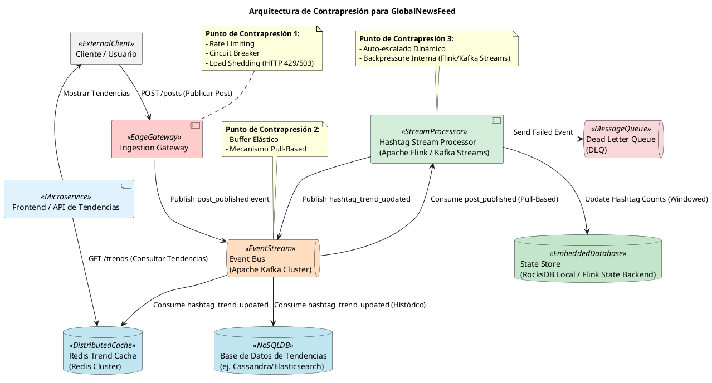

Como Principal Software & Enterprise Architect, presento el siguiente **Documento de Diseño Arquitectónico Consolidado** para la plataforma **GlobalNewsFeed**, centrado en la funcionalidad de **"Análisis de Hashtags en Tendencia"** y la gestión robusta de la contrapresión.

---

# Informe Arquitectónico Consolidado: Gestión de Contrapresión en GlobalNewsFeed - Análisis de Hashtags en Tendencia

## 1. Planteamiento del Problema

La plataforma GlobalNewsFeed, una red social global, requiere una funcionalidad de **"Análisis de Hashtags en Tendencia"** que procese un flujo continuo y masivo de publicaciones en tiempo real. El desafío técnico central radica en la gestión de la **Contrapresión (Backpressure)**. Durante eventos globales de alto impacto (elecciones, finales deportivas, noticias de última hora), el servicio de ingesta de publicaciones (productores) puede generar cientos de miles de eventos por segundo. Sin embargo, el servicio de análisis de hashtags (consumidores) realiza operaciones intensivas de parsing, conteo en ventanas temporales y ordenamiento, lo que limita su capacidad de procesamiento y lo hace inherentemente más lento.

Sin un manejo adecuado de la contrapresión, el sistema corre el riesgo de agotamiento de memoria, rendimiento degradado, fallas en cascada y caídas catastróficas del servicio, resultando en la pérdida de datos críticos y la indisponibilidad de la plataforma. La misión es diseñar una arquitectura resiliente y escalable que gestione eficazmente esta disparidad de ritmos sin comprometer la integridad ni la disponibilidad.

## 2. Tabla de Comparación Arquitectónica

A continuación, se evalúan 5 enfoques arquitectónicos alternativos para la contrapresión y el procesamiento de flujos, considerando su idoneidad para GlobalNewsFeed.

### 2.1. Colas de Mensajes Finitas / Buffering (ej. Apache Kafka / RabbitMQ)
-   **Mecanismo de Manejo de Contrapresión**: Actúa como un buffer elástico y duradero entre productores y consumidores. Los productores escriben mensajes en la cola, y los consumidores los extraen a su propio ritmo. La cola absorbe picos de carga.
-   **Ventajas Principales**:
    -   **Desacoplamiento Temporal y Espacial**: Productores y consumidores operan de forma independiente.
    -   **Resiliencia y Durabilidad**: Los mensajes persisten, tolerando fallos de consumidores y permitiendo reintentos.
    -   **Amortiguación de Picos (Load Smoothing)**: Absorbe ráfagas de tráfico, estabilizando la tasa de consumo.
    -   **Escalabilidad Independiente**: Permite escalar productores y consumidores por separado.
-   **Desventajas / Riesgos**:
    -   **Latencia Adicional**: Introduce un salto en la comunicación.
    -   **Complejidad Operacional**: La gestión de un clúster distribuido añade infraestructura.
    -   **Consistencia Eventual**: No garantiza consistencia ACID inmediata.
    -   **Saturación del Buffer (Extrema)**: Una contrapresión sostenida y extrema podría eventualmente llenar los discos de la cola.
-   **Idoneidad para GlobalNewsFeed**: **Alta**. Es una base fundamental para desacoplar la ingesta masiva del procesamiento intensivo. Kafka es ideal por su durabilidad, escalabilidad y modelo pull-based.

### 2.2. Procesadores de Flujos en Tiempo Real (ej. Apache Flink / Kafka Streams)
-   **Mecanismo de Manejo de Contrapresión**: Estos frameworks están diseñados para procesar flujos de datos con garantías de estado y tolerancia a fallos. Internamente, gestionan micro-batches o ventanas de eventos, y pueden aplicar contrapresión pull-based a sus fuentes de datos (ej. Kafka) si sus operadores internos se ralentizan.
-   **Ventajas Principales**:
    -   **Procesamiento Stateful**: Permite mantener y actualizar el estado (ej. conteos de hashtags en ventanas deslizantes) de forma distribuida y tolerante a fallos.
    -   **Semántica Exactly-Once**: Garantiza que cada evento se procese una única vez, crucial para conteos precisos.
    -   **Escalabilidad Horizontal**: Los trabajos se pueden paralelizar y escalar en un clúster.
    -   **Ventanas Temporales Avanzadas**: Soporte nativo para tumbling, sliding y session windows.
-   **Desventajas / Riesgos**:
    -   **Complejidad de Desarrollo**: Requiere un paradigma de programación específico y una curva de aprendizaje.
    -   **Infraestructura Dedicada**: Flink requiere un clúster de ejecución; Kafka Streams se ejecuta dentro de las aplicaciones de microservicios.
    -   **Latencia de Checkpointing**: La tolerancia a fallos introduce una pequeña latencia por los checkpoints.
-   **Idoneidad para GlobalNewsFeed**: **Muy Alta**. Es la solución óptima para la lógica de "conteo en ventanas temporales y ordenamiento" de hashtags, garantizando precisión y resiliencia en el procesamiento de streams.

### 2.3. Arquitectura Orientada a Eventos (EDA) (Desacoplamiento Pub/Sub con Consumer Groups)
-   **Mecanismo de Manejo de Contrapresión**: El patrón Pub/Sub desacopla productores de consumidores. Los Consumer Groups permiten escalar horizontalmente los consumidores, donde cada mensaje es procesado por una única instancia dentro del grupo, distribuyendo la carga.
-   **Ventajas Principales**:
    -   **Desacoplamiento Extremo**: Productores no conocen a consumidores, y viceversa.
    -   **Escalabilidad de Consumidores**: Fácilmente escalable añadiendo más instancias a un Consumer Group.
    -   **Resiliencia**: La falla de un consumidor no detiene el procesamiento del grupo.
    -   **Flexibilidad**: Permite múltiples consumidores para el mismo evento sin impactar a otros.
-   **Desventajas / Riesgos**:
    -   **Consistencia Eventual**: Inherente al modelo asíncrono.
    -   **Complejidad de Trazabilidad**: El flujo de eventos puede ser difícil de seguir sin herramientas de observabilidad.
    -   **Gestión de Estado**: No aborda directamente la gestión de estado distribuido para el procesamiento.
-   **Idoneidad para GlobalNewsFeed**: **Alta**. Es un principio arquitectónico subyacente a la solución con Kafka, permitiendo el escalado de los procesadores de hashtags.

### 2.4. Patrón CQRS (Command Query Responsibility Segregation)
-   **Mecanismo de Manejo de Contrapresión**: Separa el modelo de escritura (comandos) del modelo de lectura (consultas). Los comandos (ingesta de posts) pueden ser procesados de forma asíncrona y bufferizados, mientras que las consultas (tendencias) se sirven desde un modelo de lectura optimizado.
-   **Ventajas Principales**:
    -   **Escalabilidad Independiente**: Los modelos de escritura y lectura pueden escalarse de forma independiente.
    -   **Optimización de Rendimiento**: Cada modelo puede usar la tecnología de base de datos más adecuada para su propósito.
    -   **Flexibilidad de Diseño**: Permite diseños de dominio complejos y evolutivos.
-   **Desventajas / Riesgos**:
    -   **Complejidad Adicional**: Introduce una capa significativa de complejidad arquitectónica y de desarrollo.
    -   **Consistencia Eventual**: La propagación de datos del modelo de escritura al de lectura es asíncrona.
    -   **Gestión de Datos**: Requiere mecanismos robustos para mantener la sincronización entre los modelos.
-   **Idoneidad para GlobalNewsFeed**: **Media-Alta**. Es muy relevante para la separación entre la ingesta masiva de posts (escritura) y la consulta de tendencias (lectura). Complementa bien una arquitectura EDA con procesadores de flujos.

### 2.5. Procesadores de Trabajos por Lotes / Workers (ej. Background Worker Job Processors)
-   **Mecanismo de Manejo de Contrapresión**: Los trabajos se encolan y son procesados por un pool de workers en segundo plano. El sistema puede añadir más workers para aumentar la capacidad de procesamiento.
-   **Ventajas Principales**:
    -   **Simplicidad Relativa**: Más sencillo de implementar para tareas asíncronas básicas.
    -   **Desacoplamiento Básico**: Separa la solicitud inicial del procesamiento de larga duración.
    -   **Reintentos y DLQ**: Las colas de trabajos suelen soportar reintentos y colas de mensajes fallidos.
-   **Desventajas / Riesgos**:
    -   **No Diseñado para Streams**: No es óptimo para el procesamiento continuo de flujos de datos con estado y ventanas temporales.
    -   **Latencia Potencial**: Puede introducir latencias significativas si la cola de trabajos crece mucho.
    -   **Gestión de Estado Compleja**: La gestión de estado distribuido y ventanas temporales es más difícil de implementar manualmente.
-   **Idoneidad para GlobalNewsFeed**: **Baja**. Aunque útil para tareas asíncronas genéricas, no es la solución más eficiente ni robusta para el análisis de streams en tiempo real con ventanas temporales y garantías de procesamiento.

## 3. Diseño Recomendado y Justificación Técnico-Arquitectónica

### Recomendación Principal: Arquitectura Híbrida de Procesamiento de Streams con Contrapresión Adaptativa

La solución objetivo para GlobalNewsFeed es una arquitectura híbrida que integra las fortalezas de los **Event Streams**, **Procesadores de Flujos en Tiempo Real**, **CQRS** y mecanismos de **Contrapresión en el Borde**.

1.  **Ingestion Gateway con Load Shedding**: Punto de entrada unificado que aplica Rate Limiting, Circuit Breakers y, crucialmente, Load Shedding para proteger el sistema de picos de tráfico insostenibles.
2.  **Event Bus (Apache Kafka Cluster)**: Actúa como el buffer elástico y duradero principal, desacoplando la ingesta de los procesadores de análisis.
3.  **Stream Processor (Apache Flink / Kafka Streams)**: Componente central para el análisis de hashtags, implementando la lógica de ventanas deslizantes, conteo y agregación con garantías de estado y tolerancia a fallos.
4.  **Redis Cluster Cache**: Almacena las tendencias de hashtags más recientes y populares para consultas de baja latencia.
5.  **Base de Datos de Tendencias (ej. Cassandra/Elasticsearch)**: Almacén de datos persistente para tendencias históricas y análisis más complejos.

### Justificación Técnica

Esta combinación es la mejor opción para GlobalNewsFeed por las siguientes razones:

-   **Amortiguación de Picos de Carga y Resiliencia**: Apache Kafka proporciona un desacoplamiento temporal y espacial robusto, absorbiendo los "cientos de miles de eventos por segundo" durante picos. El Load Shedding en el Ingestion Gateway actúa como una última línea de defensa, protegiendo el sistema de un colapso total al descartar selectivamente la carga excesiva.
-   **Procesamiento de Streams en Tiempo Real con Estado**: Apache Flink o Kafka Streams son ideales para la lógica de "parsing, conteo en ventanas temporales y ordenamiento". Permiten mantener el estado de los conteos de hashtags de forma distribuida y tolerante a fallos, garantizando la precisión y la semántica *exactly-once* necesaria para un análisis de tendencias fiable.
-   **Baja Latencia para Consultas de Tendencias**: El Redis Cluster actúa como una caché de alta velocidad, absorbiendo la mayoría de las lecturas de tendencias. Esto asegura que la UI/API pueda mostrar las tendencias actuales con una latencia mínima, incluso bajo alta carga de consulta.
-   **Escalabilidad Elástica**: Todos los componentes clave (Ingestion Gateway, Kafka, Stream Processors, Redis) son horizontalmente escalables. Los Stream Processors pueden auto-escalarse dinámicamente en función del lag de Kafka o la utilización de recursos, adaptándose a la carga de procesamiento.
-   **Consistencia Eventual y Tolerancia a Fallos**: La arquitectura EDA con Kafka y procesadores de streams se alinea con el principio de consistencia eventual, adecuado para el análisis de tendencias. Los mecanismos de reintentos, DLQ y el estado tolerante a fallos de Flink/Kafka Streams garantizan que no haya pérdida de datos críticos.
-   **Optimización de la Capa de Datos (CQRS Implícito)**: La separación entre la ingesta (escritura en Kafka) y la consulta de tendencias (lectura desde Redis/DB) es una aplicación práctica de CQRS, permitiendo optimizar cada camino de datos de forma independiente.

### Diagramación Visual en PlantUML

## 4. Documentación Step-by-Step del Flujo de Trabajo y Conclusiones

### 4.1. Flujo de Trabajo Detallado

1.  **Publicación del Post (Cliente a Ingestion Gateway)**:
    *   Un `Cliente / Usuario` envía una solicitud `POST /posts` al `Ingestion Gateway` para publicar un nuevo post.
    *   **Contrapresión**: El `Ingestion Gateway` aplica `Rate Limiting` por usuario/IP y `Circuit Breakers` para protegerse de dependencias lentas. Si la carga excede un umbral predefinido (ej. 85% de capacidad), activa `Load Shedding`, descartando solicitudes y respondiendo con `HTTP 429 Too Many Requests` o `503 Service Unavailable` para proteger el sistema.

2.  **Ingesta y Publicación de Eventos (Ingestion Gateway a Event Bus)**:
    *   Si la solicitud es aceptada, el `Ingestion Gateway` valida el post y lo publica como un evento `post_published` en el `Event Bus (Apache Kafka Cluster)`.
    *   **Contrapresión**: Kafka actúa como un buffer elástico, absorbiendo picos de tráfico. Si Kafka mismo experimenta contención de discos o red, el `Ingestion Gateway` detectaría latencias elevadas o fallos, activando sus `Circuit Breakers` y recurriendo al `Load Shedding`.

3.  **Consumo y Procesamiento de Streams (Event Bus a Stream Processor)**:
    *   El `Hashtag Stream Processor` (ej. Apache Flink o Kafka Streams), configurado como un `Consumer Group` de Kafka, consume eventos `post_published` de forma pull-based a su propio ritmo.
    *   **Contrapresión**: El mecanismo pull-based de Kafka asegura que el `Stream Processor` no sea abrumado. Si el `Stream Processor` se ralentiza, simplemente consume menos mensajes, y el lag en Kafka aumentaría, lo que activaría el auto-escalado horizontal del `Stream Processor`.

4.  **Análisis de Hashtags en Ventanas Deslizantes (Stream Processor y State Store)**:
    *   Cada instancia del `Stream Processor` parsea el contenido del post, extrae los hashtags y actualiza sus conteos en ventanas deslizantes (ej. 5 minutos, 1 hora) utilizando un `State Store` local (ej. RocksDB o el State Backend de Flink). Este `State Store` permite mantener el estado de los conteos de forma eficiente y tolerante a fallos.

5.  **Publicación de Actualizaciones de Tendencias (Stream Processor a Event Bus)**:
    *   Cuando los conteos de hashtags en una ventana alcanzan ciertos umbrales o se actualizan periódicamente, el `Stream Processor` publica eventos `hashtag_trend_updated` en otro tópico de Kafka.

6.  **Actualización de Caché y Base de Datos (Event Bus a Redis Cache y Trends DB)**:
    *   Consumidores dedicados (no mostrados explícitamente como microservicios separados, pero parte de la lógica de consumo) escuchan los eventos `hashtag_trend_updated` de Kafka.
    *   Estos eventos se utilizan para actualizar el `Redis Trend Cache` (para consultas de baja latencia) y la `Base de Datos de Tendencias` (para persistencia histórica y análisis más profundos).

7.  **Consulta y Visualización de Tendencias (Frontend/API de Tendencias a Redis Cache)**:
    *   El `Frontend / API de Tendencias` consulta el `Redis Trend Cache` para obtener los hashtags en tendencia más recientes y los muestra al `Cliente / Usuario`.

8.  **Manejo de Eventos Fallidos (Stream Processor a DLQ)**:
    *   Si un evento `post_published` no puede ser procesado exitosamente por el `Stream Processor` después de varios reintentos, se envía a la `Dead Letter Queue (DLQ)` para análisis forense y posible re-procesamiento manual.

### 4.2. Conclusiones Finales

La gestión de la contrapresión en sistemas distribuidos de gran escala como GlobalNewsFeed es un desafío fundamental que requiere un enfoque arquitectónico multifacético. Las lecciones clave aprendidas y consolidadas en este diseño incluyen:

-   **Desacoplamiento como Pilar de Resiliencia**: La interposición de un `Event Bus` (Apache Kafka) es indispensable para desacoplar productores de consumidores, permitiendo que cada componente opere a su propio ritmo y escale de forma independiente.
-   **Procesamiento de Streams Stateful**: Para el análisis en tiempo real con ventanas temporales, los `Stream Processors` (Flink/Kafka Streams) son cruciales. Su capacidad para gestionar el estado de forma distribuida y tolerante a fallos garantiza la precisión y la integridad de los datos de tendencias.
-   **Contrapresión en Capas**: La contrapresión debe gestionarse en múltiples capas: en el borde (Rate Limiting, Load Shedding en el `Ingestion Gateway`), en el buffer (mecanismo pull-based de Kafka) y en los procesadores (auto-escalado y backpressure interna de Flink/Kafka Streams).
-   **Consistencia Eventual y Observabilidad**: Aceptar la consistencia eventual es un compromiso necesario para la escalabilidad y resiliencia. Sin embargo, esto exige una robusta observabilidad (monitoreo de lag de Kafka, métricas de rendimiento de procesadores, trazabilidad distribuida) para entender el estado del sistema y reaccionar proactivamente.
-   **Compromisos de Negocio**: El `Load Shedding` es una herramienta poderosa pero implica la pérdida intencional de datos. La política de descarte debe ser un compromiso cuidadosamente calibrado con el negocio, priorizando la estabilidad general de la plataforma sobre la completitud absoluta de los datos en escenarios extremos.

Este diseño proporciona una arquitectura robusta, escalable y resiliente, capaz de manejar los desafíos de la ingesta masiva y el procesamiento intensivo de datos en tiempo real para GlobalNewsFeed, garantizando la disponibilidad y la calidad del servicio de "Análisis de Hashtags en Tendencia".