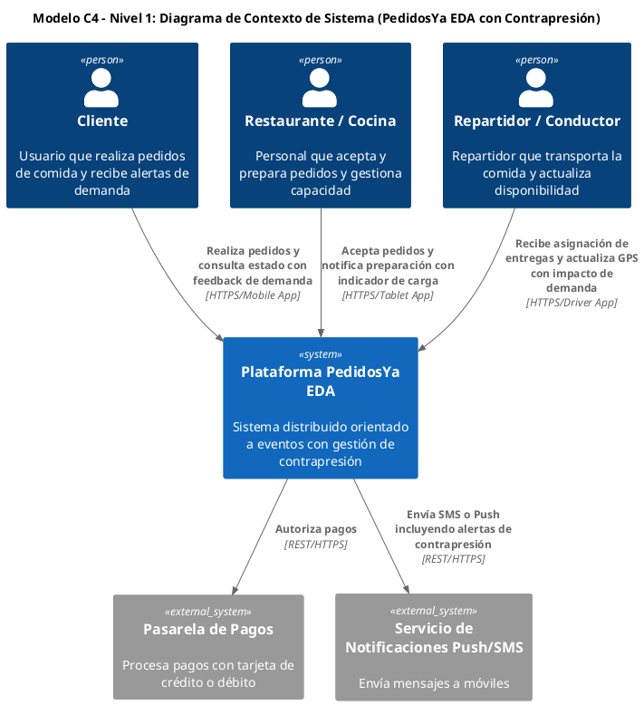
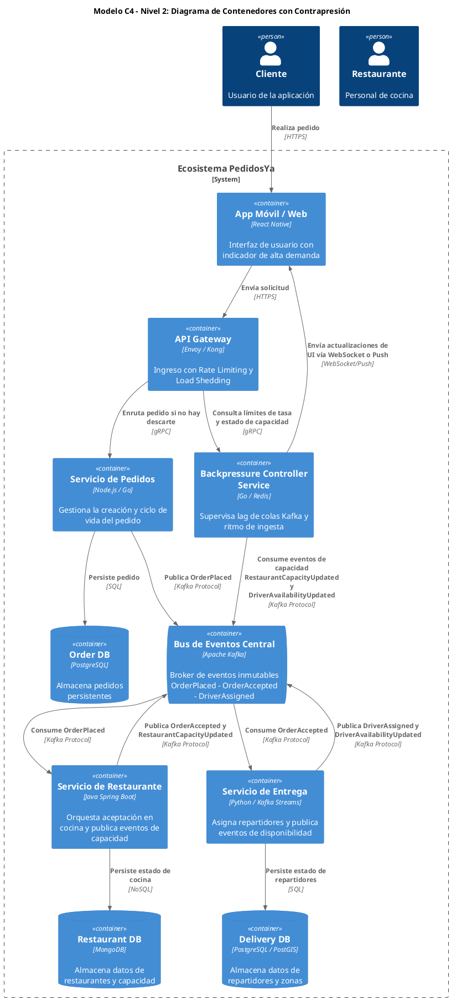
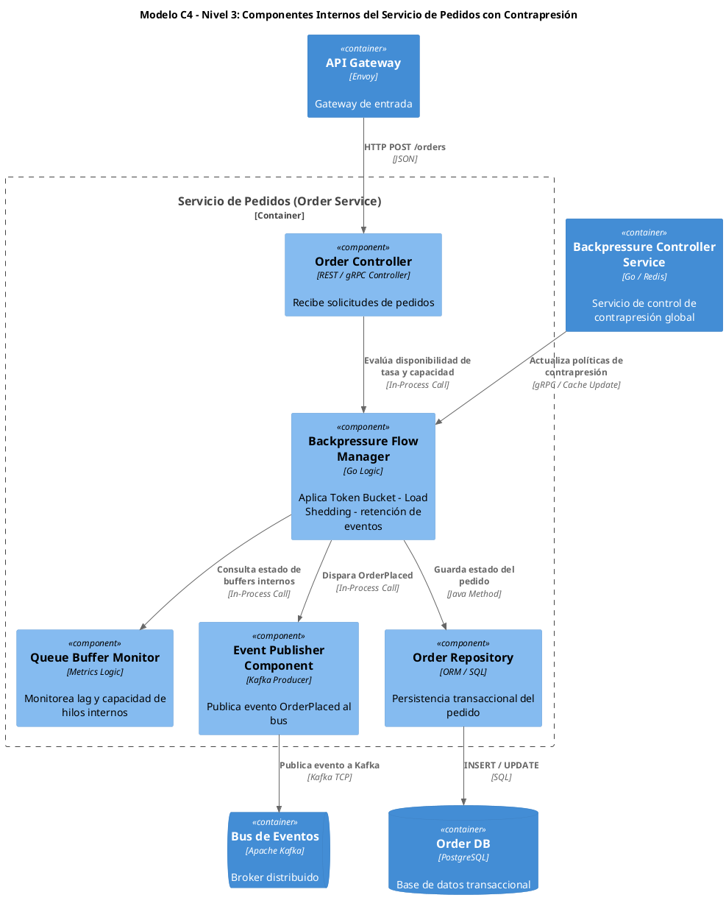

# Informe de Arquitectura: Control de Contrapresión y Experiencia de Usuario en PedidosYa EDA

## 1. Introducción: El Desafío de la Contrapresión en Arquitecturas Orientadas a Eventos

En arquitecturas distribuidas como la de PedidosYa, la capacidad de procesar un volumen masivo de solicitudes de manera resiliente es crítica. Sin embargo, los picos de demanda pueden sobrepasar la capacidad de los sistemas de backend (cocinas, repartidores, bases de datos), llevando a la saturación, latencias excesivas y una experiencia de usuario degradada. Este informe detalla la extensión del modelo C4 para incorporar un **Componente de Contrapresión (Backpressure Component)**, diseñado para gestionar el flujo de carga de manera adaptativa y comunicar proactivamente el estado del sistema a los usuarios finales.

La estrategia se centra en la detección temprana de la saturación, el aislamiento de fallas mediante patrones como Rate Limiting y Load Shedding, y la recuperación controlada a través de la degradación elegante y la comunicación transparente con el usuario.

---

## 2. Extensión del Modelo C4 con Componente de Contrapresión

Se presenta la evolución del Modelo C4 para PedidosYa EDA, incorporando el **Backpressure Controller Service** y sus componentes internos, que actúan como el cerebro de la gestión de carga.

### 2.1. Modelo C4 - Nivel 1: Diagrama de Contexto de Sistema Extendido

Este diagrama muestra el sistema PedidosYa en su entorno, destacando cómo la plataforma gestiona la interacción con usuarios y sistemas externos bajo condiciones de carga variable.

### 2.2. Modelo C4 - Nivel 2: Diagrama de Contenedores con Contrapresión

Este nivel detalla los contenedores principales de la plataforma, introduciendo el `Backpressure Controller Service` como un componente clave que orquesta la gestión de carga entre el `API Gateway`, el `Order Service` y el `Event Bus`.

### 2.3. Modelo C4 - Nivel 3: Diagrama de Componentes del Order Service con Contrapresión

Este diagrama profundiza en la estructura interna del `Order Service`, mostrando cómo los componentes de contrapresión se integran para gestionar el flujo de pedidos antes de su persistencia y publicación de eventos.

---

## 3. Escenarios Operacionales de Contrapresión

La implementación del `Backpressure Controller Service` permite al sistema PedidosYa reaccionar de manera inteligente ante diferentes tipos de sobrecarga.

### 3.1. Escenario 1: Sobrecarga Masiva de Ingesta (Peak Event)

-   **Descripción**: Durante eventos como el Black Friday o la final del Super Bowl, la aplicación móvil experimenta un volumen de solicitudes HTTP que excede la capacidad de procesamiento del `API Gateway` y los servicios downstream.
-   **Mecanismos de Contrapresión**:
    -   **Rate Limiting (API Gateway)**: El `API Gateway` (Envoy/Kong) aplica límites de tasa configurados dinámicamente por el `Backpressure Controller Service`. Las solicitudes que exceden el umbral son rechazadas con un código HTTP 429 (Too Many Requests).
    -   **Load Shedding (API Gateway)**: Si la saturación persiste, el `API Gateway` puede descartar un porcentaje de solicitudes entrantes para proteger los servicios internos, priorizando a usuarios con mayor valor o solicitudes críticas.
    -   **Feedback al Cliente**: El `Backpressure Controller Service` informa a la `App Móvil / Web` (vía WebSocket o Push) sobre la alta demanda, lo que activa un banner de advertencia y ajusta los tiempos de espera estimados.
-   **Impacto**: Protege los servicios internos de colapsar, manteniendo la disponibilidad para un subconjunto de usuarios y comunicando expectativas realistas.

### 3.2. Escenario 2: Saturación de Capacidad en Cocina (Restaurant Capacity Saturation)

-   **Descripción**: Un restaurante específico o un grupo de restaurantes en una zona se ven abrumados por la cantidad de pedidos, superando su capacidad de preparación.
-   **Mecanismos de Contrapresión**:
    -   **Detección**: El `Restaurant Service` monitorea el tiempo promedio de preparación y el número de pedidos activos. Al superar un umbral, publica un evento `RestaurantCapacityUpdated` al `Event Bus`.
    -   **Reacción del Backpressure Controller**: El `Backpressure Controller Service` consume estos eventos y actualiza un caché distribuido (Redis) con el estado de capacidad de cada restaurante.
    -   **Influencia en Order Service**: Cuando un cliente intenta hacer un pedido a un restaurante saturado, el `Order Service` consulta al `Backpressure Controller Service`. Si la capacidad es crítica, el pedido se pone en una cola interna de baja prioridad o se le informa al cliente un tiempo de espera significativamente mayor.
    -   **UI/UX**: La `App Móvil Cliente` muestra un mensaje específico para ese restaurante, indicando "Cocina muy ocupada, tiempo de espera extendido" o "Pedidos temporalmente pausados para este restaurante".
-   **Impacto**: Evita que los restaurantes se saturen, reduce la frustración del cliente por esperas inesperadas y permite a los restaurantes gestionar su carga de trabajo de manera efectiva.

### 3.3. Escenario 3: Agotamiento de Flota de Repartidores (Driver Fleet Depletion)

-   **Descripción**: En una zona geográfica, la demanda de entregas excede la disponibilidad de repartidores activos, por ejemplo, debido a condiciones climáticas adversas o un evento masivo.
-   **Mecanismos de Contrapresión**:
    -   **Detección**: El `Delivery Service` monitorea la relación entre pedidos pendientes de asignación y repartidores disponibles en cada zona. Publica eventos `DriverAvailabilityUpdated` al `Event Bus`.
    -   **Reacción del Backpressure Controller**: El `Backpressure Controller Service` consume estos eventos, actualizando la disponibilidad de repartidores por zona.
    -   **Ajuste de SLA**: Cuando un pedido es creado, el `Order Service` (o un componente de estimación de entrega) consulta al `Backpressure Controller Service` para obtener el tiempo de entrega estimado. Si la flota está agotada, el SLA se extiende dinámicamente (ej. de 30 min a 90 min).
    -   **UI/UX**: La `App Móvil Cliente` muestra el tiempo de entrega ajustado y, en casos extremos, puede sugerir "No hay repartidores disponibles en tu zona, ¿deseas programar tu pedido para más tarde?".
-   **Impacto**: Gestiona las expectativas del cliente, evita la aceptación de pedidos que no pueden ser entregados a tiempo y permite al sistema priorizar entregas o reasignar recursos.

---

## 4. Pantallas de Interfaz de Usuario (UI Mockups ante Contrapresión)

La comunicación transparente con el usuario es fundamental para una experiencia positiva durante eventos de alta demanda. Estos bocetos visuales ilustran cómo la aplicación reacciona a la contrapresión.

### 4.1. Mockup 1 (App Móvil Cliente - Alta Demanda)

-   **Descripción**: Muestra un banner informativo en la parte superior de la aplicación o durante el proceso de checkout, alertando al usuario sobre la alta demanda y el ajuste en los tiempos de entrega.

```plantuml
@startsalt
{
  .------------------------------------.
  | [PedidosYa]                        |
  |------------------------------------|
  | ALTA DEMANDA EN TU ZONA            |
  | Tiempo estimado ajustado:          |
  | 45-60 min                          |
  |------------------------------------|
  | Imagen de Comida                   |
  |                                    |
  | Tu Restaurante Favorito            |
  | Cocina Internacional               |
  |                                    |
  | [  Añadir a la Cesta  ]            |
  |                                    |
  |------------------------------------|
  | [Inicio] [Buscar] [Pedidos] [Perfil] |
  '------------------------------------'
}
@endsalt
```

### 4.2. Mockup 2 (App Móvil Cliente - Pausa Temporal de Ingesta)

-   **Descripción**: Una pantalla de bloqueo o modal que aparece cuando el sistema está completamente saturado o no puede aceptar nuevos pedidos en ese momento, ofreciendo alternativas.

```plantuml
@startsalt
{
  .------------------------------------.
  | [PedidosYa]                        |
  |------------------------------------|
  |                                    |
  |         Icono de Reloj             |
  |                                    |
  | SERVICIO TEMPORALMENTE OCUPADO     |
  |                                    |
  | Debido a la alta demanda no        |
  | podemos tomar nuevos pedidos       |
  | en este momento.                   |
  |                                    |
  | Desea programar su pedido          |
  | para mas tarde?                    |
  |                                    |
  | [  Programar Pedido  ]             |
  | [  Reintentar en 5 min  ]          |
  |                                    |
  |------------------------------------|
  | [Inicio] [Buscar] [Pedidos] [Perfil] |
  '------------------------------------'
}
@endsalt
```

### 4.3. Mockup 3 (Tablet Cocina Restaurante - Control de Capacidad)

-   **Descripción**: Un panel de control para el personal del restaurante que muestra la capacidad actual de la cocina y permite gestionar la aceptación de pedidos.

```plantuml
@startsalt
{
  .------------------------------------.
  | [PedidosYa Restaurante]            |
  |------------------------------------|
  | Panel de Control de Cocina         |
  |                                    |
  | Capacidad Actual: 92%              |
  |                                    |
  | Pedidos en Cola: 12                |
  | Tiempo Promedio Prep.: 25 min      |
  |                                    |
  | [  Pausar Nuevos Pedidos 5 min  ]  |
  |                                    |
  | Pedidos Pendientes:                |
  | - Orden 1234 - Pizza Margarita     |
  | - Orden 1235 - Hamburguesa Doble   |
  | - Orden 1236 - Ensalada Cesar      |
  |                                    |
  | [  Aceptar Siguiente Pedido  ]     |
  '------------------------------------'
}
@endsalt
```

