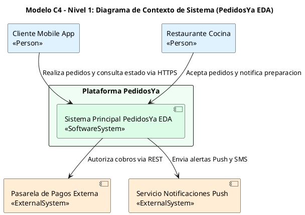
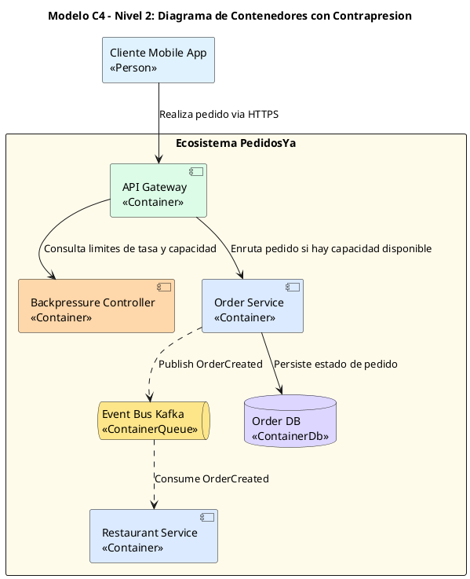

# Guía Estándar de Diagramación C4 con Structurizr y PlantUML (C4 Model Native Standard - Strict Anti-Error)

Esta guía define la especificación para generar **Diagramas del Modelo C4** (Nivel 1: Contexto, Nivel 2: Contenedores, Nivel 3: Componentes) utilizando la sintaxis nativa de **PlantUML** sin dependencias externas `!include`.

---

## 1. Reglas de Diagramación Nativa C4 (100% Parseable y Libre de Errores)

1. **PROHIBIDO USAR `!include` EXTERNOS O REMOTOS**:
   - NUNCA incluyas `!include <C4/...>` ni `!include https://...`.
   - Usa la sintaxis nativa de componentes de PlantUML (`skinparam componentStyle uml2`), que compila en 100% de las herramientas locales y remotas sin fallos de inclusión.

2. **MODELADO C4 CON ELEMENTOS NATIVOS**:
   - **Personas / Usuarios**: `rectangle "Nombre del Usuario\n<<Person>>" as UserAlias`
   - **Sistemas Externos**: `component "Nombre del Sistema Extero\n<<ExternalSystem>>" as ExtSysAlias`
   - **Contenedores de Aplicación**: `component "Nombre del Contenedor\n<<Container>>" as ContainerAlias`
   - **Buses de Eventos / Colas**: `queue "Message Broker (Kafka)\n<<EventBus>>" as EventBusAlias`
   - **Bases de Datos**: `database "Order DB (PostgreSQL)\n<<Database>>" as DBAlias`
   - **Límites de Sistema**: `package "Ecosistema PedidosYa" #FFFBEB { ... }`

3. **RELACIONES Y ETIQUETAS SIN COMAS NI SÍMBOLOS ESPECIALES**:
   - NUNCA uses comas `,`, comillas anidadas, paréntesis ni corchetes `<< >>` dentro del string de la etiqueta de la flecha:
     - **INCORRECTO**: `A --> B : "Relacion, <<Protocolo>>"`
     - **CORRECTO**: `A --> B : "Enruta solicitud via gRPC"`

---

## 2. Ejemplo Parseable Nivel 1: Diagrama de Contexto Nativo

---

## 3. Ejemplo Parseable Nivel 2: Diagrama de Contenedores con Contrapresión

