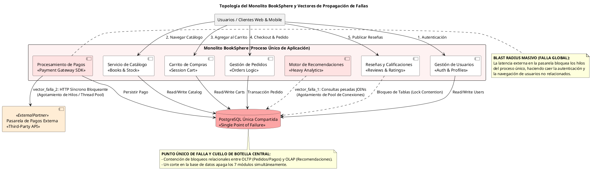

# Informe Técnico de Arquitectura: Comprensión Conceptual y Análisis Crítico del Monolito "BookSphere"

**Documento**: Entregable Hito 1 - Semana 5  
**Autor**: Principal Software & Enterprise Architect  
**Sistema Evaluado**: Monolito BookSphere (Librería en Línea)  

---

## 1. Investigación Conceptual de Arquitectura de Microservicios

### 1.1. Principio de Responsabilidad Única (SRP) en Arquitectura de Sistemas
- **Definición Formal**: El Principio de Responsabilidad Única (*Single Responsibility Principle* - SRP), originado en los principios S.O.L.I.D. de diseño orientado a objetos (definido por Robert C. Martin), establece que **un módulo, clase o componente debe tener una, y solo una, razón para cambiar**. Esto significa que una unidad de software debe ser responsable ante un único actor o interés de negocio (*stakeholder*).
- **Relación Estructural con S.O.L.I.D. en Microservicios**: Al escalar el concepto de SRP desde el nivel de código hacia la arquitectura de sistemas distribuidos, un **Microservicio** se define en función de un **Bounded Context** (Contexto Delimitado en Domain-Driven Design). Cada microservicio encapsula la lógica de negocio y las reglas asociadas a una única capacidad de dominio (ej. *Gestión de Pedidos* vs. *Motor de Recomendaciones*).
- **Prevención de Efectos Secundarios**: Cuando un componente acumula múltiples responsabilidades, cualquier cambio en las reglas de negocio de una función (ej. modificar el cálculo de impuestos en Pedidos) introduce el riesgo de romper inadvertidamente funciones no relacionadas que residen dentro del mismo límite (ej. la reserva de stock o la generación de recomendaciones). En microservicios, el SRP aísla el impacto de las modificaciones dentro del límite del servicio.
- **Ejemplo en Sistemas Reales**: En una plataforma e-commerce como Amazon, el servicio de *Inventory Management* tiene como única responsabilidad rastrear el stock físico y las reservas de productos. No asume responsabilidades de procesamiento financiero ni de cálculo de promociones de marketing.

---

### 1.2. Acoplamiento Débil (*Loose Coupling*) vs. Acoplamiento Fuerte (*Tight Coupling*)
- **Definición y Grados de Dependencia**:
  - **Acoplamiento Fuerte (*Tight Coupling*)**: Ocurre cuando dos o más componentes poseen un conocimiento profundo de los detalles internos de implementación, estructuras de datos concretas, espacio de memoria o esquema de base de datos de los demás. Un cambio en la implementación del componente A obliga inmediatamente a modificar y redesplegar el componente B.
  - **Acoplamiento Débil (*Loose Coupling*)**: Ocurre cuando los componentes interactúan exclusivamente a través de interfaces bien definidas, abstractas y contratos estables, ignorando completamente el funcionamiento interno, el lenguaje de programación o la persistencia subyacente de sus pares.
- **Mecanismos de Propagación de Fallas en Cascada (*Cascading Failures*)**:
  - **Acoplamiento en Memoria/Proceso**: En una aplicación monolítica, si el módulo A sufre una fuga de memoria (*memory leak*) o consume el 100% del CPU, agota los recursos del proceso compartido, provocando la caída inmediata de los módulos B, C y D.
  - **Acoplamiento en Base de Datos**: Si múltiples servicios comparten una base de datos relacional y el servicio A ejecuta una consulta lenta sin indexar que bloquea tablas exclusivas (`EXCLUSIVE LOCK`), el servicio B queda bloqueado esperando conexiones libres en el pool, propagando la falla de forma instantánea a todo el sistema.

| Dimensión de Comparación | Acoplamiento Fuerte (*Tight Coupling*) | Acoplamiento Débil (*Loose Coupling*) |
| :--- | :--- | :--- |
| **Mecanismo de Integración** | Llamadas a funciones en memoria / BD compartida | APIs HTTP/gRPC / Eventos asíncronos en Message Broker |
| **Autonomía de Despliegue** | Nula (Despliegues monolíticos "todo o nada") | Alta (Cada microservicio se despliega de forma independiente) |
| **Impacto ante Cambios** | Onda de choque amplia (*High Blast Radius*) | Localizado exclusivamente dentro del Bounded Context |
| **Resiliencia ante Fallas** | Fallas en cascada inmediatas y globales | Aislamiento de fallas (*Fault Containment*) y degradación grácil |

---

### 1.3. APIs como Contratos Estables (*APIs as Stable Contracts*)
- **Concepto de Contrato Inmutable**: En arquitectura de microservicios, la interfaz pública expuesta por un servicio (definida mediante OpenAPI/Swagger para REST o archivos `.proto` para gRPC) se trata como un **contrato formal e inmutable**. El servicio garantiza a sus consumidores que la estructura de la solicitud, la respuesta, las validaciones y la semántica de los datos no cambiarán de forma destructiva sin un proceso de deprecación planificado.
- **Versionado Semántico (SemVer)**: Los contratos se gestionan mediante reglas de versionado (ej. `v1.2.0`):
  - **PATCH (`v1.2.1`)**: Corrección interna de errores sin alterar la interfaz.
  - **MINOR (`v1.3.0`)**: Adición de nuevos campos o funcionalidad opcional (compatible hacia atrás).
  - **MAJOR (`v2.0.0`)**: Cambios disruptivos (*breaking changes*) que requieren la convivencia simultánea de ambas versiones durante un período de migración.
- **Ley de Postel (*Robustness Principle*)**: *"Sé conservador en lo que envías, y liberal en lo que aceptas"*. Los consumidores de una API deben ser tolerantes a la adición de nuevos campos no reconocidos en la respuesta sin fallar (deserialización flexible), permitiendo que el servicio proveedor evolucione sin romper clientes existentes.

---

### 1.4. Comunicación Síncrona vs. Asíncrona entre Servicios
- **Comunicación Síncrona (Request-Response)**:
  - **Patrón**: El cliente realiza una petición (ej. vía HTTP/REST o gRPC) y **bloquea su hilo de ejecución** a la espera de la respuesta del servidor antes de continuar.
  - **Acoplamiento Temporal**: Requiere que tanto el emisor como el receptor estén simultáneamente en línea y disponibles en el instante exacto de la llamada.
  - **Latencia Acumulativa**: Si el servicio A llama síncronamente al servicio B, y B llama a C, la latencia total de la transacción es la suma de las latencias $T_{total} = T_A + T_B + T_C$. Si C falla, la falla se propaga de regreso en la cadena.
- **Comunicación Asíncrona (Event-Driven / Messaging)**:
  - **Patrón**: El emisor publica un evento de dominio o mensaje en un intermediario (*Message Broker* como Kafka o RabbitMQ) y continúa inmediatamente su ejecución sin esperar la respuesta del consumidor.
  - **Desacoplamiento Temporal**: El emisor y los consumidores operan de forma asíncrona. Si el consumidor está caído o sobrecargado, los eventos se almacenan en la cola/topic sin afectar al emisor.
  - **Tolerancia a Caídas**: Absorbe picos de tráfico (*Load Smoothing*) y permite procesar los mensajes cuando los consumidores recuperan su capacidad operativamente.

---

### 1.5. Gestión de Datos Descentralizada (*Database-per-Service*)
- **La Extensión del Principio SRP a la Persistencia**: El patrón **Database-per-Service** postula que la base de datos de un microservicio es parte privada e inaccesible de su implementación. Ningún servicio externo puede leer o escribir directamente en el almacén de datos de otro servicio; cualquier acceso a los datos **debe realizarse obligatoriamente a través de la API pública expuesta por el servicio dueño**.
- **Antipatrón de Base de Datos Compartida (*Shared Database Anti-Pattern*)**:
  - **Contención de Bloqueos (Lock Contention)**: Múltiples aplicaciones compitiendo por bloqueos de filas o tablas relacionales provocan estancamiento (*Deadlocks*) y degrada severamente el throughput.
  - **Acoplamiento de Esquema**: Modificar el nombre o tipo de una columna en la base de datos compartida requiere coordinar y desplegar simultáneamente todos los módulos del sistema.
  - **Falta de Optimización Políglota**: Fuerza a utilizar un único motor relacional (ej. PostgreSQL) para necesidades heterogéneas que requerirían motores NoSQL (ej. Redis para caché, MongoDB para catálogo flexible, Elasticsearch para búsquedas de texto).

---

### 1.6. Aislamiento de Fallas y Marco FDIR (*Fault Detection, Isolation, and Recovery*)
El marco **FDIR** es una disciplina de ingeniería de sistemas críticos orientada a garantizar la resiliencia operativa ante la ocurrencia inevitable de fallas de software o infraestructura:

1. **Detección de Fallas (*Fault Detection*)**:
   - **Mecanismos**: Probes de disponibilidad (*Liveness & Readiness Probes* de Kubernetes), monitoreo de métricas clave (*Golden Signals*: Latencia, Throughput, Errores, Saturación) y rastreo distribuido (*OpenTelemetry Trace IDs*).
   - **Objetivo**: Identificar anomalías en milisegundos antes de que impacten masivamente al usuario.
2. **Aislamiento de Fallas (*Fault Isolation*)**:
   - **Mecanismos**: Patrones de Mamparas (*Bulkheads* - aislamiento de pools de hilos/recursos), *Circuit Breakers* (abrir el circuito ante tasas de error elevadas), *Rate Limiting* y *Load Shedding* (descarte controlado de tráfico no prioritario).
   - **Objetivo**: Contener la falla dentro del componente donde se originó, impidiendo la propagación en cascada (*Fault Containment*).
3. **Recuperación de Fallas (*Fault Recovery*)**:
   - **Mecanismos**: Autorrecuperación (*Auto-healing* mediante reinicio de pods), reintentos con algoritmo de retroceso exponencial y aleatoriedad (*Exponential Backoff & Jitter*), y ejecución de transacciones compensatorias en Sagas.
   - **Objetivo**: Restablecer el servicio a un estado operativo seguro de forma automática y transparente para el usuario final.

---

## 2. Análisis Crítico del Monolito BookSphere

### 2.1. Caracterización del Estado Actual de BookSphere
**BookSphere** opera como un monolito tradicional de gran tamaño donde sus 7 módulos centrales (**Gestión de Usuarios, Servicio de Catálogo, Carrito de Compras, Gestión de Pedidos, Procesamiento de Pagos, Motor de Recomendaciones, Reseñas y Calificaciones**) se ejecutan dentro del mismo proceso de aplicación y comparten una única base de datos relacional PostgreSQL.

---

### 2.2. Desafío Crítico 1: Contención y Cuellos de Botella en la Base de Datos Única
- **Escenario Operativo**: Durante un evento de alta demanda (ej. *Black Friday* o el lanzamiento de un libro de alto perfil), miles de usuarios concurrentes navegan el sitio.
- **Mecanismo de Falla**:
  1. El **Motor de Recomendaciones** ejecuta consultas SQL analíticas sumamente pesadas que involucran uniones masivas (`JOINs` complejas sobre tablas de `compras_historicas`, `navegacion_logs` y `libros`).
  2. Simultáneamente, cientos de usuarios publican opiniones en el módulo de **Reseñas y Calificaciones**, generando escrituras de texto e índices de actualización intensivos sobre las tablas de libros.
  3. Estas operaciones bloquean tablas relacionales clave (ej. `libros`, `inventario`) mediante bloqueos a nivel de tabla o rango de filas (`EXCLUSIVE LOCKS`), consumiendo la totalidad de las conexiones disponibles en el pool de PostgreSQL (*Connection Pool Starvation*).
  4. Cuando los usuarios intentan completar una compra a través de **Gestión de Pedidos** y **Procesamiento de Pagos**, las transacciones críticas de negocio quedan bloqueadas esperando una conexión a la base de datos hasta que caducan por *Timeout* (HTTP 504 Gateway Timeout).
- **Causa Raíz**: Ausencia de aislamiento de datos (*Shared Database Anti-Pattern*) y convivencia de cargas de trabajo OLTP (transaccionales) y OLAP (analíticas) sobre el mismo motor de almacenamiento.

---

### 2.3. Desafío Crítico 2: Riesgo de Fallas Globales y Degradación de UX (Blast Radius Masivo)
- **Escenario Operativo**: El módulo de **Procesamiento de Pagos** se conecta de forma síncrona a una pasarela de pago de terceros (ej. Stripe API) la cual experimenta una degradación temporal o una latencia de red inusualmente alta (ej. 30 segundos por solicitud).
- **Mecanismo de Falla**:
  1. El cliente envía la solicitud de compra a BookSphere. El hilo de ejecución del monolito atiende la petición e invoca síncronamente la API de la pasarela de pagos.
  2. Al no existir un mecanismo de aislamiento (*Circuit Breaker* ni *Timeouts* estrictos), los hilos de ejecución del servidor web del monolito quedan bloqueados esperando la respuesta de la pasarela.
  3. En pocos segundos, todas las peticiones concurrentes de pago agotan el *Thread Pool* del servidor de aplicaciones monolítico.
  4. **Impacto Catastrófico (Blast Radius Masivo)**: Como todos los 7 módulos comparten el mismo proceso, la aplicación deja de responder por completo. Usuarios que simplemente deseaban **iniciar sesión (Usuarios)**, **consultar el catálogo (Catálogo)** o **leer una reseña (Reseñas)** reciben errores de conexión (HTTP 503 Service Unavailable).
- **Causa Raíz**: Acoplamiento fuerte en memoria/proceso y llamadas síncronas bloqueantes sin mecanismos de aislamiento de fallas (FDIR).

---

### 2.4. Desafíos Operativos, de Despliegue y Mantenimiento
- **Despliegues "Todo o Nada" (*All-or-Nothing Deployments*)**: Cualquier corrección menor (ej. modificar una falta de ortografía en el módulo de Reseñas) requiere recompilar, probar y desplegar los 7 módulos enteros del monolito. Si el despliegue falla, todo el sistema queda fuera de línea.
- **Bloqueo Tecnológico (*Tech Stack Lock-in*)**: Todo el sistema está forzado a usar el mismo lenguaje de programación, framework y versión de PostgreSQL. No es posible adoptar tecnologías más adecuadas para dominios específicos (ej. Python para el Motor de Recomendaciones o Redis para el Carrito).
- **Fricción Organizativa**: Múltiples equipos de desarrollo trabajando sobre la misma base de código monolithic y el mismo esquema de PostgreSQL generan conflictos constantes de fusión (*Git merge conflicts*) y regrabado no coordinado de migraciones SQL.

---

### 2.5. Diagrama de Arquitectura de la Problemática (Topología y Vectores de Falla)

El siguiente diagrama PlantUML ilustra la arquitectura actual de **BookSphere**, evidenciando las dependencias internas, la base de datos compartida y los vectores de propagación de fallas en cascada y bloqueos relacionales:

---

## 3. Conclusión del Diagnóstico

El análisis crítico del monolito **BookSphere** demuestra que, si bien la arquitectura monolítica facilitó el desarrollo inicial de la aplicación, el crecimiento del volumen de usuarios y la heterogeneidad de las cargas de trabajo la han convertido en una arquitectura altamente vulnerable:

1. **Acoplamiento de Datos**: La base de datos PostgreSQL compartida es el cuello de botella primario, donde las consultas analíticas no críticas del *Motor de Recomendaciones* y las escrituras de *Reseñas* destruyen la disponibilidad del flujo transaccional crítico (*Pedidos* y *Pagos*).
2. **Acoplamiento de Proceso**: La ausencia de aislamiento de fallas (FDIR) expone a la empresa a fallas globales (*Blast Radius completo*) causadas por latencias en servicios externos o fugas de memoria en módulos secundarios.
3. **Pauta de Transformación**: Para solucionar estos desafíos, se requiere evolucionar BookSphere hacia una **Arquitectura de Microservicios Descentralizada**, delimitando *Bounded Contexts*, aplicando el patrón *Database-per-Service* y desacoplando la comunicación mediante eventos asíncronos y contratos estables de API.
