# Informe Técnico de Arquitectura: Rediseño Arquitectónico en Microservicios para "BookSphere"

**Documento**: Entregable Hito 2 - Semana 5 (Versión Mejorada: Modelo Híbrido Síncrono/Asíncrono EDA)  
**Autor**: Principal Software & Enterprise Architect  
**Sistema Evaluado**: Transición de Monolito a Microservicios en BookSphere  

---

## 1. Introducción al Rediseño Arquitectónico

A partir del diagnóstico técnico realizado en el Hito 1, donde se identificaron los cuellos de botella severos en la base de datos PostgreSQL compartida y el riesgo de fallas globales en el monolito **BookSphere**, se propone la transición formal hacia una **Arquitectura de Microservicios (MSA)** guiada por **Domain-Driven Design (DDD)**.

La descomposición se realiza definiendo **Bounded Contexts (Contextos Delimitados)** autónomos, garantizando el cumplimiento estricto del **Principio de Responsabilidad Única (SRP)** tanto a nivel de código como en la capa de persistencia (*Database-per-Service*).

---

## 2. Identificación y Especificación de Microservicios

Deconstruimos el monolito BookSphere en **7 microservicios autónomos**, cubriendo la totalidad de las capacidades operativas de la librería en línea:

---

### 2.1. `User & Identity Service` (Servicio de Usuarios e Identidad)
- **Bounded Context**: Gestión de Identidad, Autenticación y Perfiles de Usuario.
- **Responsabilidad Principal**: Administra el ciclo de vida completo de la cuenta del cliente (registro, autenticación mediante credenciales/OAuth2, gestión de tokens JWT, almacenamiento de perfiles de usuario y direcciones de envío). Es el único servicio dueño de los datos personales y de seguridad del cliente.
- **Almacén de Datos (Database-per-Service)**: Base de datos relacional aislada (PostgreSQL `user_db`).
- **Ejemplos de Endpoints de API (Síncronos HTTP/REST)**:

| Método HTTP | Ruta URL | Descripción Funcional | Códigos de Respuesta |
| :--- | :--- | :--- | :--- |
| `POST` | `/api/v1/users/register` | Registro de nuevos usuarios y creación de perfil inicial. | `201 Created`, `400 Bad Request`, `409 Conflict` |
| `POST` | `/api/v1/auth/login` | Autenticación de credenciales y emisión de Access Token / Refresh Token (JWT). | `200 OK`, `401 Unauthorized` |
| `GET` | `/api/v1/users/me` | Obtención del perfil detallado del usuario autenticado actual. | `200 OK`, `401 Unauthorized` |
| `PUT` | `/api/v1/users/me/addresses` | Adición o actualización de direcciones de facturación y despacho. | `200 OK`, `400 Bad Request` |

---

### 2.2. `Catalog & Inventory Service` (Servicio de Catálogo e Inventario)
- **Bounded Context**: Catálogo de Productos y Control Transaccional de Stock.
- **Responsabilidad Principal**: Gestiona los metadatos de los libros (título, autor, ISBN, descripción, editorial, categorías, precio base) y administra el control transaccional del stock disponible en almacén. Permite reservar y liberar unidades durante el proceso de compra.
- **Almacén de Datos (Database-per-Service)**: Base de datos documento/relacional optimizada para lectura (MongoDB / PostgreSQL `catalog_db`).
- **Ejemplos de Endpoints de API (Síncronos HTTP/gRPC)**:

| Método HTTP | Ruta URL | Descripción Funcional | Códigos de Respuesta |
| :--- | :--- | :--- | :--- |
| `GET` | `/api/v1/books` | Búsqueda y listado de libros con paginación, filtros y ordenamiento. | `200 OK` |
| `GET` | `/api/v1/books/{bookId}` | Consulta detallada del perfil y stock disponible de un libro específico. | `200 OK`, `404 Not Found` |
| `POST` | `/api/v1/books` | Alta de un nuevo libro en el catálogo (Reservado para Admin). | `201 Created`, `400 Bad Request` |
| `POST` | `/api/v1/books/reserve-stock` | Reserva de stock transaccional síncrona/interna para un pedido en proceso. | `200 OK`, `409 Conflict (Out of Stock)` |

---

### 2.3. `Cart Service` (Servicio de Carrito de Compras)
- **Bounded Context**: Carrito de Compras Efímero de Sesión.
- **Responsabilidad Principal**: Administra el estado temporal de los carritos de compras activos de los usuarios antes de iniciar el checkout. Permite agregar, modificar cantidades y remover libros, calculando subtotales en tiempo real con latencia sub-milisegundo.
- **Almacén de Datos (Database-per-Service)**: Almacén de clave-valor en memoria de ultra baja latencia (Redis Cluster `cart_redis`).
- **Ejemplos de Endpoints de API (Síncronos HTTP/REST)**:

| Método HTTP | Ruta URL | Descripción Funcional | Códigos de Respuesta |
| :--- | :--- | :--- | :--- |
| `GET` | `/api/v1/carts/me` | Obtención de los ítems y subtotal del carrito del usuario activo. | `200 OK` |
| `POST` | `/api/v1/carts/me/items` | Agregar un libro y cantidad al carrito de compras. | `200 OK`, `400 Bad Request`, `404 Not Found` |
| `PUT` | `/api/v1/carts/me/items/{bookId}` | Actualizar la cantidad solicitada de un libro en el carrito. | `200 OK`, `400 Bad Request` |
| `DELETE` | `/api/v1/carts/me/items/{bookId}` | Eliminar un libro específico del carrito activo. | `204 No Content`, `404 Not Found` |

---

### 2.4. `Order Management Service` (Servicio de Pedidos y Cumplimiento)
- **Bounded Context**: Orquestación y Ciclo de Vida del Pedido.
- **Responsabilidad Principal**: Orquesta el flujo de checkout, la creación formal de órdenes de compra y la gestión de sus estados (`CREATED`, `PAYMENT_PENDING`, `CONFIRMED`, `SHIPPED`, `DELIVERED`, `CANCELLED`). Emite eventos de dominio asíncronos y coordina la consistencia eventual mediante el **Patrón Saga**.
- **Almacén de Datos (Database-per-Service)**: Base de datos relacional orientada a transacciones ACID (PostgreSQL `order_db`).
- **Ejemplos de Endpoints de API (Síncronos HTTP/REST)**:

| Método HTTP | Ruta URL | Descripción Funcional | Códigos de Respuesta |
| :--- | :--- | :--- | :--- |
| `POST` | `/api/v1/orders` | Iniciar la creación formal de un pedido a partir del carrito activo (Checkout). | `202 Accepted` / `201 Created` |
| `GET` | `/api/v1/orders/{orderId}` | Consultar el estado y detalle completo de un pedido por su identificador. | `200 OK`, `404 Not Found` |
| `GET` | `/api/v1/orders/me` | Listar el historial de pedidos del usuario autenticado. | `200 OK` |
| `PATCH` | `/api/v1/orders/{orderId}/status` | Transición de estado del pedido (ej. actualización por logística o cancelación). | `200 OK`, `400 Bad Request` |

---

### 2.5. `Payment Processing Service` (Servicio de Procesamiento de Pagos)
- **Bounded Context**: Integración Financiera y Transacciones de Pago.
- **Responsabilidad Principal**: Aísla la integración con pasarelas de pago externas (Stripe, PayPal). Procesa cobros con tarjeta de forma síncrona o asíncrona reaccionando a eventos de órdenes creadas, gestiona verificación de transacciones y emite eventos de resultado de pago (`PaymentProcessed` / `PaymentFailed`).
- **Almacén de Datos (Database-per-Service)**: Base de datos relacional auditada (PostgreSQL `payment_db`).
- **Ejemplos de Endpoints de API (Síncronos HTTP/REST)**:

| Método HTTP | Ruta URL | Descripción Funcional | Códigos de Respuesta |
| :--- | :--- | :--- | :--- |
| `POST` | `/api/v1/payments/charge` | Procesar un cobro síncrono/asíncrono para un pedido específico. | `200 OK`, `400 Bad Request`, `502 Bad Gateway` |
| `GET` | `/api/v1/payments/{paymentId}` | Consultar la confirmación y recibo financiero de una transacción de pago. | `200 OK`, `404 Not Found` |
| `POST` | `/api/v1/payments/{paymentId}/refund` | Solicitar el reembolso total o parcial de un pago procesado anteriormente. | `200 OK`, `400 Bad Request` |

---

### 2.6. `Recommendation Engine Service` (Servicio de Recomendaciones)
- **Bounded Context**: Analítica de Negocio y Personalización.
- **Responsabilidad Principal**: Consume eventos asíncronos en tiempo real (compras completadas, vistas de producto, reseñas publicadas) para calcular sugerencias de libros personalizadas ("Usuarios que compraron X también leyeron Y") sin realizar consultas directas ni bloquear la base de datos de producción.
- **Almacén de Datos (Database-per-Service)**: Base de datos orientada a Grafos / Documentos (Neo4j / MongoDB `recommendation_db`).
- **Ejemplos de Endpoints de API (Síncronos HTTP/REST)**:

| Método HTTP | Ruta URL | Descripción Funcional | Códigos de Respuesta |
| :--- | :--- | :--- | :--- |
| `GET` | `/api/v1/recommendations/user/me` | Obtener la lista de recomendaciones personalizadas para el usuario activo. | `200 OK` |
| `GET` | `/api/v1/recommendations/books/{bookId}/similar` | Obtener recomendaciones de libros similares o complementarios. | `200 OK`, `404 Not Found` |

---

### 2.7. `Reviews & Ratings Service` (Servicio de Reseñas y Calificaciones)
- **Bounded Context**: Contenido Generado por Usuarios (*User Generated Content - UGC*).
- **Responsabilidad Principal**: Gestiona la publicación de opiniones de texto, asignación de estrellas (1 a 5) y moderación. Emite eventos asíncronos (`ReviewPublished`) para que otros servicios actualicen métricas sin acoplamiento directo.
- **Almacén de Datos (Database-per-Service)**: Base de datos NoSQL basada en Documentos (MongoDB `review_db`).
- **Ejemplos de Endpoints de API (Síncronos HTTP/REST)**:

| Método HTTP | Ruta URL | Descripción Funcional | Códigos de Respuesta |
| :--- | :--- | :--- | :--- |
| `GET` | `/api/v1/books/{bookId}/reviews` | Obtener las reseñas y calificaciones paginadas de un libro específico. | `200 OK` |
| `POST` | `/api/v1/books/{bookId}/reviews` | Publicar una nueva reseña y calificación para un libro. | `201 Created`, `400 Bad Request`, `409 Conflict` |
| `GET` | `/api/v1/books/{bookId}/ratings/summary` | Consultar el promedio de estrellas y la distribución de calificaciones de un libro. | `200 OK` |

---

## 3. Estrategia Dual de Comunicación: Síncrona vs. Asíncrona (EDA)

Una arquitectura de microservicios robusta **NO utiliza exclusivamente HTTP/REST**. En BookSphere se implementa una **Estrategia Dual Híbrida**:

```
+-----------------------------------------------------------------------------------+
|                              CLIENTES / API GATEWAY                               |
+-----------------------------------------------------------------------------------+
       | (HTTP/REST Síncrono)                                  | (HTTP/REST Síncrono)
       v                                                       v
+-----------------------------+                         +---------------------------+
|    User & Identity Service  |                         | Catalog & Inventory Svc   |
+-----------------------------+                         +---------------------------+
       |                                                       |
       | (Publica Eventos)                                     | (Publica Eventos)
       v                                                       v
=====================================================================================
                    MESSAGE BROKER / EVENT BUS (Apache Kafka / RabbitMQ)
=====================================================================================
       ^                                  ^                                  ^
       | (Consume / Publica)              | (Consume / Publica)              | (Consume Asíncrono)
       v                                  v                                  v
+-----------------------------+    +-----------------------------+    +----------------------+
|   Order Management Service  |    | Payment Processing Service  |    | Recommendation Engine|
+-----------------------------+    +-----------------------------+    +----------------------+
```

### 3.1. Cuándo se utiliza Comunicación Síncrona (HTTP/REST / gRPC)
- **Consultas de Lectura Inmediata (Queries)**: El cliente usuario necesita renderizar la interfaz en tiempo real (ej. consultar datos de perfil en `/api/v1/users/me`, buscar libros en el catálogo o verificar los ítems del carrito).
- **Validaciones Críticas e Inmediatas**: Autenticación de credenciales (`/auth/login`) donde el cliente no puede continuar sin el token JWT de respuesta.
- **Protección de Resiabilidad**: Todas las llamadas síncronas entre microservicios (o hacia APIs externas) están protegidas obligatoriamente mediante patrones de **Circuit Breaker** (Resilience4j), **Timeouts estrictos (ej. 2s)** y **Bulkheads**.

---

### 3.2. Cuándo se utiliza Comunicación Asíncrona Guiada por Eventos (EDA)
- **Modificaciones de Estado y Procesos de Negocio (Commands & Events)**: Operaciones que alteran el estado del dominio (crear un pedido, procesar un pago, publicar una reseña).
- **Amortiguación de Picos de Carga (*Load Smoothing / Buffer*)**: Durante eventos de alto tráfico (*Black Friday*), los eventos de compra se encolan en el Message Broker (Apache Kafka), permitiendo que los trabajadores procesen los pedidos a un ritmo constante sin saturar las bases de datos.
- **Desacoplamiento Temporal**: El emisor publica el evento y no requiere que el consumidor esté en línea en ese milisegundo exacto.

---

### 3.3. Casos de Uso Concretos de Asincronía en BookSphere

#### 1. Orquestación del Checkout y Pedidos (Saga Choreography Pattern)
1. El cliente envía `POST /api/v1/orders`. El `Order Management Service` valida la petición, crea la orden en estado `PENDING_PAYMENT` y publica el evento **`OrderCreated`** en el topic de Kafka `orders.events`.
2. El `Payment Processing Service` consume el evento **`OrderCreated`**, procesa el cobro con Stripe/PayPal de forma asíncrona y publica **`PaymentProcessed`** (o **`PaymentFailed`** si no hay fondos).
3. El `Catalog & Inventory Service` consume **`PaymentProcessed`** y confirma la deducción definitiva de stock (**`InventoryDeducted`**).
4. El `Order Management Service` consume **`PaymentProcessed`** y actualiza el estado de la orden a `CONFIRMED`.
5. *Transacción Compensatoria (Saga)*: Si `PaymentFailed` es emitido, el `Order Management Service` cambia la orden a `CANCELLED` y el `Catalog & Inventory Service` libera la reserva temporal de stock (**`InventoryReleased`**). Ninguna llamada síncrona bloqueante mantiene abierta la conexión del usuario.

#### 2. Alimentación del Motor de Recomendaciones en Tiempo Real
- Cada vez que un usuario completa un pedido, el `Order Management Service` publica **`OrderCompleted`**.
- Cada vez que un usuario escribe una opinión, el `Reviews & Ratings Service` publica **`ReviewPublished`**.
- El **`Recommendation Engine Service`** consume estos eventos de forma totalmente asíncrona desde Kafka topics (`orders.events`, `reviews.events`), actualizando sus modelos de grafos/vectoriales en segundo plano **sin realizar consultas SQL `JOIN` sobre la base de datos transaccional de producción**.

#### 3. Patrón Transactional Outbox + Change Data Capture (CDC)
Para evitar el problema de la "doble escritura" (escribir en la base de datos de PostgreSQL pero fallar al publicar en Kafka si la red se cae), cada microservicio utiliza el patrón **Transactional Outbox**:
- La transacción local guarda el cambio de estado (ej. la tabla `orders`) y escribe simultáneamente un registro en una tabla local `outbox` dentro de la misma transacción ACID.
- Un proceso de CDC (ej. **Debezium**) lee los logs de transacciones de la base de datos (`WAL` de PostgreSQL) y publica los eventos en Kafka de forma 100% garantizada (*At-Least-Once Delivery*).

---

## 4. Matriz de Persistencia Descentralizada (*Database-per-Service*)

| Microservicio | Tipo de Almacén | Tecnología Seleccionada | Justificación Técnica de Arquitectura |
| :--- | :--- | :--- | :--- |
| **`User & Identity Service`** | Relacional (RDBMS) | PostgreSQL (`user_db`) | Garantiza consistencia ACID en credenciales, restricciones de unicidad de emails e integridad relacional. |
| **`Catalog & Inventory`** | Documentos / Relacional | MongoDB / PostgreSQL (`catalog_db`) | Esquema flexible para atributos variados de libros e inventario con bloqueo de filas transaccional. |
| **`Cart Service`** | In-Memory Key-Value | Redis Cluster (`cart_redis`) | Lectura/escritura de sub-milisegundo, TTL automático para expiración de carritos abandonados. |
| **`Order Management`** | Relacional (RDBMS) | PostgreSQL (`order_db`) | Transacciones ACID estrictas para garantizar integridad financiera de los pedidos y sus líneas de detalle. |
| **`Payment Processing`** | Relacional (RDBMS) | PostgreSQL (`payment_db`) | Trazabilidad inmutable, auditoría contable estricta y cumplimiento de estándares financieros. |
| **`Recommendation Engine`**| Grafos / Analítica | Neo4j / Elasticsearch (`rec_db`) | Optimizado para traversals de relaciones complejas ("Cliente-Compró-Libro") y consultas analíticas sin bloquear OLTP. |
| **`Reviews & Ratings`** | Documentos (NoSQL) | MongoDB (`review_db`) | Alto throughput de escritura para comentarios de texto libre y fácil escalamiento horizontal en lectura. |

---

## 5. Arquitectura de la Capa de Borde (API Gateway & BFF)

- **API Gateway (Spring Cloud Gateway / Kong)**:
  - **Punto Único de Entrada**: Centraliza la recepción de todas las peticiones externas en el puerto estándar `443 (HTTPS)`.
  - **Autenticación & Terminación TLS**: Valida los tokens JWT emitidos por el `User & Identity Service` y descifra TLS antes de enrutar la petición internamente.
  - **Control de Tráfico**: Aplica *Rate Limiting* (limitación de tasa) y *Load Shedding* para proteger a los microservicios internos contra picos de tráfico maliciosos o sobrecargas.
  - **Enrutamiento Dinámico**: Traduce rutas públicas (ej. `/api/v1/books`) a servicios internos.

---

## 6. Diagrama de la Nueva Arquitectura Híbrida de Microservicios (HTTP + Message Broker)

El siguiente diagrama PlantUML de componentes especifica la topología descentralizada híbrida de **BookSphere**, evidenciando las interacciones síncronas HTTP/REST (líneas continuas) y la comunicación asíncrona mediante el **Event Bus / Message Broker** (líneas discontinuas `..>`):

```plantuml
@startuml
skinparam componentStyle uml2
skinparam packageStyle rectangle
skinparam backgroundColor white

title Topología Híbrida de Microservicios para BookSphere (HTTP/REST + Message Broker EDA)

rectangle "Clientes Web & Mobile" as Clients

package "Capa de Borde (Edge Infrastructure)" #F0FDF4 {
    component "API Gateway / BFF\n<<Security & Routing>>" as APIGW #DCFCE7
}

package "Capa de Integración Asíncrona (EDA)" #FFFBEB {
    queue "Message Broker / Event Bus\n<<Apache Kafka / RabbitMQ>>" as EventBus #FDE68A
}

package "Capa de Microservicios Autónomos (Bounded Contexts)" #EFF6FF {
    component "User & Identity Service\n<<Identidad & Auth>>" as UserSvc #DBEAFE
    component "Catalog & Inventory Service\n<<Libros & Stock>>" as CatalogSvc #DBEAFE
    component "Cart Service\n<<Carrito Efímero>>" as CartSvc #DBEAFE
    component "Order Management Service\n<<Ciclo de Pedidos & Saga>>" as OrderSvc #DBEAFE
    component "Payment Processing Service\n<<Integración Financiera>>" as PaymentSvc #DBEAFE
    component "Recommendation Engine\n<<Analítica & Streaming>>" as RecSvc #DBEAFE
    component "Reviews & Ratings Service\n<<Reseñas & Votos>>" as ReviewSvc #DBEAFE
}

package "Capa de Persistencia Descentralizada (Database-per-Service)" #F5F3FF {
    database "User DB\n(PostgreSQL)" as UserDB #DDD6FE
    database "Catalog DB\n(PostgreSQL/Mongo)" as CatalogDB #DDD6FE
    database "Cart Cache\n(Redis Cluster)" as CartDB #DDD6FE
    database "Order DB\n(PostgreSQL)" as OrderDB #DDD6FE
    database "Payment DB\n(PostgreSQL)" as PaymentDB #DDD6FE
    database "Recommendation DB\n(Neo4j Graph)" as RecDB #DDD6FE
    database "Review DB\n(MongoDB)" as ReviewDB #DDD6FE
}

component "Pasarela de Pagos Externa\n<<Stripe / PayPal API>>" as ExtPayment <<ExternalPartner>> #FFEDD5

' Relaciones de Clientes a Gateway (Síncronas HTTP)
Clients --> APIGW : "Solicitudes HTTPS / JWT"

' Enrutamiento del Gateway a Microservicios (Síncrono HTTP)
APIGW --> UserSvc : "1. GET/POST /users"
APIGW --> CatalogSvc : "2. GET /books"
APIGW --> CartSvc : "3. GET/POST /carts"
APIGW --> OrderSvc : "4. POST /orders (Checkout)"
APIGW --> PaymentSvc : "5. GET /payments"
APIGW --> RecSvc : "6. GET /recommendations"
APIGW --> ReviewSvc : "7. GET/POST /reviews"

' Comunicaciones Asíncronas Guiadas por Eventos (EDA via EventBus)
OrderSvc ..> EventBus : "Publish [OrderCreated]"
PaymentSvc ..> EventBus : "Publish [PaymentProcessed / PaymentFailed]"
CatalogSvc ..> EventBus : "Publish [InventoryDeducted]"
ReviewSvc ..> EventBus : "Publish [ReviewPublished]"

EventBus ..> PaymentSvc : "Consume [OrderCreated]"
EventBus ..> OrderSvc : "Consume [PaymentProcessed]"
EventBus ..> CatalogSvc : "Consume [OrderCreated]"
EventBus ..> RecSvc : "Stream Consume [OrderCompleted, ReviewPublished]"

' Patrón Database-per-Service (Exclusivo 1:1)
UserSvc --> UserDB : "Privado"
CatalogSvc --> CatalogDB : "Privado"
CartSvc --> CartDB : "Privado"
OrderSvc --> OrderDB : "Privado"
PaymentSvc --> PaymentDB : "Privado"
RecSvc --> RecDB : "Privado"
ReviewSvc --> ReviewDB : "Privado"

' Integración Externa Síncrona Protegida (Circuit Breaker)
PaymentSvc --> ExtPayment : "API REST Síncrona (Circuit Breaker)"

note bottom of EventBus
  <b>DESACOPLAMIENTO ASÍNCRONO & PAGOS (SAGA):</b>
  - Las transacciones de compra no bloquean al cliente HTTP.
  - Kafka amortigua picos de carga (Load Smoothing).
  - CDC (Debezium) garantiza Transactional Outbox.
end note

@enduml
```



---

## 7. Conclusión del Rediseño

El rediseño mejorado de **BookSphere** demuestra que la solución **NO se limita a comunicación síncrona HTTP/REST**:

1. **Enfoque Híbrido Síncrono/Asíncrono**: Las consultas de lectura de la interfaz de usuario utilizan **HTTP/REST** síncrono por su inmediatez, mientras que las operaciones críticas de negocio (checkout, procesamiento de pagos, deducción de inventario y analítica de recomendaciones) se procesan de forma **asíncrona guiada por eventos (EDA)** sobre un **Message Broker (Apache Kafka / RabbitMQ)**.
2. **Patrón Saga y Resiliencia**: Garantiza consistencia eventual mediante eventos de dominio (`OrderCreated`, `PaymentProcessed`, `PaymentFailed`) sin mantener conexiones HTTP síncronas bloqueadas.
3. **Escalamiento Independiente y Absorbente de Carga**: El Message Broker amortigua picos masivos de peticiones (*Load Smoothing*) y alimenta al *Recommendation Engine Service* en segundo plano sin congestionar las bases de datos de producción.
