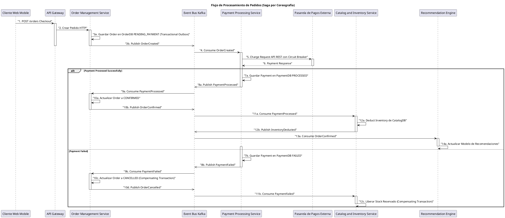

# Documento de Diseño de Arquitectura de Microservicios (ASM) para BookSphere

**Documento**: Diseño ASM de BookSphere  
**Autor**: Principal Software & Enterprise Architect  
**Fecha**: 2023-10-27  
**Sistema Evaluado**: Transición de Monolito a Microservicios en BookSphere

---

## 1. Parte 1: Diagnóstico de Arquitectura y Principios de Microservicios (Resumen Ejecutivo Breve)

### 1.1. Principios Clave de Microservicios
La transición de BookSphere hacia una arquitectura de microservicios se fundamenta en los siguientes principios:

-   **Principio de Responsabilidad Única (SRP)**: Cada microservicio encapsula una única capacidad de negocio, minimizando el impacto de los cambios y promoviendo la autonomía.
-   **Acoplamiento Débil (Loose Coupling)**: Los servicios interactúan a través de contratos de API estables, sin conocimiento de las implementaciones internas, lo que previene fallas en cascada.
-   **APIs como Contratos Estables**: Las interfaces públicas de los servicios son contratos formales versionados, garantizando la compatibilidad y la evolución independiente.
-   **Comunicación Síncrona vs. Asíncrona**: Se utiliza comunicación síncrona (HTTP/REST) para consultas de lectura en tiempo real y asíncrona (Event-Driven Architecture - EDA con Message Broker) para modificaciones de estado y flujos transaccionales, desacoplando temporalmente los servicios.
-   **Persistencia Descentralizada (Database-per-Service)**: Cada microservicio posee y gestiona su propia base de datos, eliminando el antipatrón de base de datos compartida y permitiendo la selección políglota de persistencia.
-   **Aislamiento de Fallas (FDIR)**: Se implementan mecanismos de Detección, Aislamiento y Recuperación de fallas (Circuit Breakers, Bulkheads, Rate Limiting, Sagas compensatorias) para garantizar la resiliencia y la degradación grácil del sistema.

### 1.2. Diagnóstico del Monolito BookSphere
El análisis del monolito BookSphere reveló vulnerabilidades críticas:

-   **Cuello de Botella en Base de Datos Única**: La base de datos PostgreSQL compartida era un punto único de falla y contención. Las consultas analíticas pesadas del Motor de Recomendaciones y las escrituras intensivas de Reseñas bloqueaban las transacciones críticas de Pedidos y Pagos, agotando el pool de conexiones y causando interrupciones globales.
-   **Riesgo de Fallas Globales en Cascada (Blast Radius Masivo)**: El acoplamiento fuerte en memoria/proceso significaba que una latencia o falla en un módulo (ej. la integración síncrona con la Pasarela de Pagos Externa) agotaba los recursos del proceso monolítico, haciendo caer la aplicación completa y afectando funcionalidades no relacionadas como la autenticación o la navegación del catálogo.
-   **Desafíos Operativos**: Despliegues "todo o nada", bloqueo tecnológico a una única pila y fricción organizativa entre equipos.

---

## 2. Parte 2: Diseño de Arquitectura de Microservicios para BookSphere (Detallado y Completo)

### 2.1. Deconstrucción de Dominios y Tabla de Microservicios

La aplicación BookSphere se deconstruye en 7 microservicios autónomos, cada uno alineado a un Bounded Context específico:

| Microservicio | Bounded Context | Responsabilidad Principal | Dominio de Datos Exclusivo |
| :--- | :--- | :--- | :--- |
| **User and Identity Service** | Gestión de Identidad y Perfiles | Registro, autenticación, gestión de perfiles y direcciones de usuario. | Usuarios, Credenciales, Perfiles, Direcciones. |
| **Catalog and Inventory Service** | Catálogo de Productos y Stock | Gestión de metadatos de libros (título, autor, precio) y control transaccional de inventario. | Libros, Stock, Categorías. |
| **Cart Service** | Carrito de Compras Efímero | Gestión del estado temporal del carrito de compras de un usuario (agregar, remover, actualizar ítems). | Carritos de Sesión, Ítems de Carrito. |
| **Order Management Service** | Orquestación y Ciclo de Vida del Pedido | Coordinación del flujo de checkout, creación de órdenes y gestión de estados del pedido (Saga Orchestrator). | Pedidos, Ítems de Pedido, Historial de Estados. |
| **Payment Processing Service** | Integración Financiera y Pagos | Procesamiento de cobros con pasarelas externas, gestión de transacciones de pago y reembolsos. | Transacciones de Pago, Recibos, Métodos de Pago. |
| **Recommendation Engine Service** | Analítica de Negocio y Personalización | Generación de sugerencias de libros personalizadas basadas en el comportamiento del usuario y eventos de dominio. | Modelos de Recomendación, Historial de Interacciones. |
| **Reviews and Ratings Service** | Contenido Generado por Usuarios (UGC) | Publicación, almacenamiento y moderación de reseñas de texto y calificaciones de estrellas para libros. | Reseñas, Calificaciones, Moderación. |

### 2.2. Definición Estructurada de Interfaces y Endpoints de API

Cada microservicio expone una API RESTful bien definida, actuando como un contrato estable para sus consumidores:

#### 2.2.1. `User and Identity Service`
| Método HTTP | Ruta URL | Descripción Funcional |
| :--- | :--- | :--- |
| `POST` | `/api/v1/users/register` | Registra un nuevo usuario con email y contraseña. |
| `POST` | `/api/v1/auth/login` | Autentica credenciales y emite un token JWT. |
| `GET` | `/api/v1/users/me` | Recupera el perfil del usuario autenticado. |

#### 2.2.2. `Catalog and Inventory Service`
| Método HTTP | Ruta URL | Descripción Funcional |
| :--- | :--- | :--- |
| `GET` | `/api/v1/books` | Lista libros con filtros y paginación. |
| `GET` | `/api/v1/books/{bookId}` | Obtiene detalles de un libro específico, incluyendo stock. |
| `POST` | `/api/v1/books/reserve-stock` | Reserva unidades de stock para un pedido en proceso. |

#### 2.2.3. `Cart Service`
| Método HTTP | Ruta URL | Descripción Funcional |
| :--- | :--- | :--- |
| `GET` | `/api/v1/carts/me` | Obtiene el contenido del carrito del usuario actual. |
| `POST` | `/api/v1/carts/me/items` | Agrega un libro al carrito. |
| `PUT` | `/api/v1/carts/me/items/{bookId}` | Actualiza la cantidad de un libro en el carrito. |

#### 2.2.4. `Order Management Service`
| Método HTTP | Ruta URL | Descripción Funcional |
| :--- | :--- | :--- |
| `POST` | `/api/v1/orders` | Inicia el proceso de checkout y crea un pedido. |
| `GET` | `/api/v1/orders/{orderId}` | Consulta el estado y detalles de un pedido específico. |
| `GET` | `/api/v1/orders/me` | Lista el historial de pedidos del usuario autenticado. |

#### 2.2.5. `Payment Processing Service`
| Método HTTP | Ruta URL | Descripción Funcional |
| :--- | :--- | :--- |
| `POST` | `/api/v1/payments/charge` | Procesa un cobro para un pedido. |
| `GET` | `/api/v1/payments/{paymentId}` | Consulta el estado de una transacción de pago. |
| `POST` | `/api/v1/payments/{paymentId}/refund` | Solicita un reembolso para un pago. |

#### 2.2.6. `Recommendation Engine Service`
| Método HTTP | Ruta URL | Descripción Funcional |
| :--- | :--- | :--- |
| `GET` | `/api/v1/recommendations/user/me` | Obtiene recomendaciones personalizadas para el usuario. |
| `GET` | `/api/v1/recommendations/books/{bookId}/similar` | Obtiene libros similares a uno dado. |

#### 2.2.7. `Reviews and Ratings Service`
| Método HTTP | Ruta URL | Descripción Funcional |
| :--- | :--- | :--- |
| `GET` | `/api/v1/books/{bookId}/reviews` | Lista reseñas y calificaciones de un libro. |
| `POST` | `/api/v1/books/{bookId}/reviews` | Publica una nueva reseña y calificación. |
| `GET` | `/api/v1/books/{bookId}/ratings/summary` | Obtiene el promedio y distribución de calificaciones. |

### 2.3. Topología de Persistencia Descentralizada (Database-per-Service)

Cada microservicio gestiona su propio almacén de datos, optimizado para su carga de trabajo específica:

| Microservicio | Motor de Almacenamiento | Justificación Técnica de la Carga de Trabajo | Patrón de Consistencia |
| :--- | :--- | :--- | :--- |
| **User and Identity Service** | PostgreSQL | Consistencia ACID para datos de usuario, seguridad y relaciones. | ACID Local |
| **Catalog and Inventory Service** | PostgreSQL / MongoDB | PostgreSQL para stock transaccional, MongoDB para flexibilidad de catálogo. | ACID Local / Consistencia Eventual |
| **Cart Service** | Redis Cluster | Baja latencia para carritos efímeros, TTL para expiración de sesiones. | Consistencia Eventual (Cache) |
| **Order Management Service** | PostgreSQL | Transacciones ACID estrictas para la integridad financiera de los pedidos. | ACID Local |
| **Payment Processing Service** | PostgreSQL | Trazabilidad inmutable y auditoría para transacciones financieras. | ACID Local |
| **Recommendation Engine Service** | Neo4j / Elasticsearch | Optimizado para relaciones complejas y consultas analíticas de grafos. | Consistencia Eventual |
| **Reviews and Ratings Service** | MongoDB | Alto throughput de escritura para contenido de texto libre y escalabilidad horizontal. | Consistencia Eventual |

### 2.4. Representación Visual de la Arquitectura Objetivo en PlantUML

#### 2.4.1. Diagrama de Componentes Completo

```plantuml
@startuml
skinparam componentStyle uml2
skinparam packageStyle rectangle
skinparam backgroundColor white

title Topología Híbrida de Microservicios para BookSphere (HTTP/REST + Message Broker EDA)

rectangle "Clientes Web and Mobile" as Clients

package "Capa de Borde (Edge Infrastructure)" #F0FDF4 {
    component "API Gateway / BFF\n<<Security and Routing>>" as APIGW #DCFCE7
}

package "Capa de Integración Asíncrona (EDA)" #FFFBEB {
    queue "Message Broker / Event Bus\n(Apache Kafka)" as EventBus #FDE68A
}

package "Capa de Microservicios Autónomos (Bounded Contexts)" #EFF6FF {
    component "User and Identity Service\n<<Identidad and Auth>>" as UserSvc #DBEAFE
    component "Catalog and Inventory Service\n<<Libros and Stock>>" as CatalogSvc #DBEAFE
    component "Cart Service\n<<Carrito Efímero>>" as CartSvc #DBEAFE
    component "Order Management Service\n<<Ciclo de Pedidos and Saga>>" as OrderSvc #DBEAFE
    component "Payment Processing Service\n<<Integración Financiera>>" as PaymentSvc #DBEAFE
    component "Recommendation Engine\n<<Analítica and Streaming>>" as RecSvc #DBEAFE
    component "Reviews and Ratings Service\n<<Reseñas and Votos>>" as ReviewSvc #DBEAFE
}

package "Capa de Persistencia Descentralizada (Database-per-Service)" #F5F3FF {
    database "User DB\n(PostgreSQL)" as UserDB #DDD6FE
    database "Catalog DB\n(PostgreSQL/Mongo)" as CatalogDB #DDD6FE
    database "Cart Cache\n(Redis Cluster)" as CartDB #DDD6FE
    database "Order DB\n(PostgreSQL)" as OrderDB #DDD6FE
    database "Payment DB\n(PostgreSQL)" as PaymentDB #DDD6FE
    database "Recommendation DB\n(Neo4j Graph)" as RecDB #DDD6FE
    database "Review DB\n(MongoDB)" as ReviewDB #DDD6FE
}

component "Pasarela de Pagos Externa\n<<Stripe / PayPal API>>" as ExtPayment <<ExternalPartner>> #FFEDD5

' Relaciones de Clientes a Gateway (Síncronas HTTP)
Clients --> APIGW : "Solicitudes HTTPS / JWT"

' Enrutamiento del Gateway a Microservicios (Síncrono HTTP)
APIGW --> UserSvc : "GET/POST /users"
APIGW --> CatalogSvc : "GET /books"
APIGW --> CartSvc : "GET/POST /carts"
APIGW --> OrderSvc : "POST /orders (Checkout)"
APIGW --> PaymentSvc : "GET /payments"
APIGW --> RecSvc : "GET /recommendations"
APIGW --> ReviewSvc : "GET/POST /reviews"

' Comunicaciones Asíncronas Guiadas por Eventos (EDA via EventBus)
OrderSvc ..> EventBus : "Publish OrderCreated"
PaymentSvc ..> EventBus : "Publish PaymentProcessed / PaymentFailed"
CatalogSvc ..> EventBus : "Publish InventoryDeducted"
ReviewSvc ..> EventBus : "Publish ReviewPublished"

EventBus ..> PaymentSvc : "Consume OrderCreated"
EventBus ..> OrderSvc : "Consume PaymentProcessed / PaymentFailed"
EventBus ..> CatalogSvc : "Consume PaymentProcessed / PaymentFailed"
EventBus ..> RecSvc : "Stream Consume OrderCompleted, ReviewPublished"

' Patrón Database-per-Service (Exclusivo 1:1)
UserSvc --> UserDB : "Privado"
CatalogSvc --> CatalogDB : "Privado"
CartSvc --> CartDB : "Privado"
OrderSvc --> OrderDB : "Privado"
PaymentSvc --> PaymentDB : "Privado"
RecSvc --> RecDB : "Privado"
ReviewSvc --> ReviewDB : "Privado"

' Integración Externa Síncrona Protegida (Circuit Breaker)
PaymentSvc --> ExtPayment : "API REST Síncrona (Circuit Breaker)"

note bottom of EventBus
  **DESACOPLAMIENTO ASÍNCRONO and PAGOS (SAGA):**
  - Las transacciones de compra no bloquean al cliente HTTP.
  - Kafka amortigua picos de carga (Load Smoothing).
  - CDC (Debezium) garantiza Transactional Outbox.
end note

@enduml
```

#### 2.4.2. Diagrama de Secuencia de Procesamiento de Pedidos (Saga por Coreografía)

