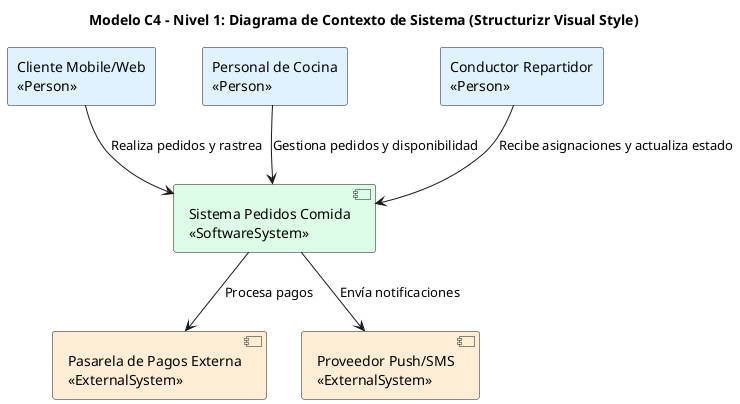
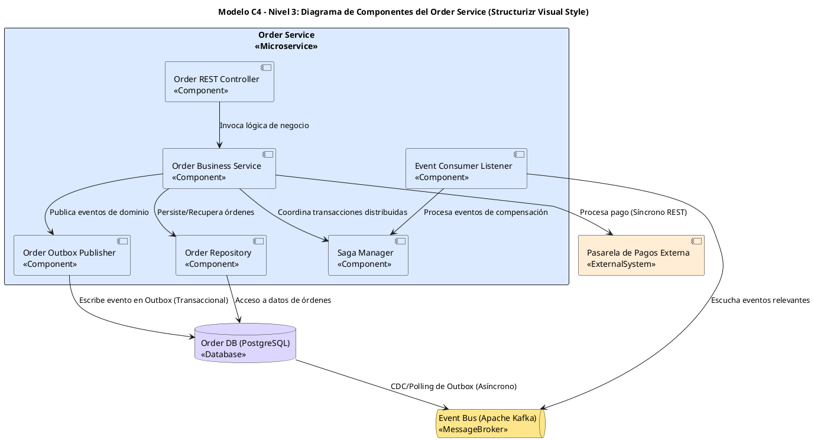
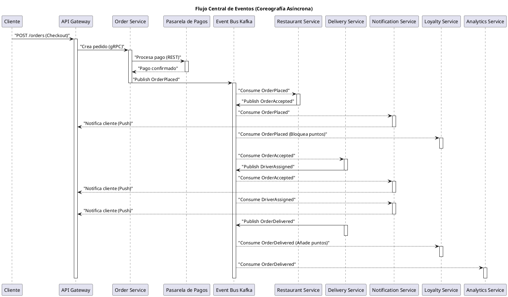

Como Principal Software & Enterprise Architect, he elaborado el siguiente informe técnico de arquitectura para la plataforma de pedidos de comida, aplicando el Modelo C4 con una orientación explícita a la Arquitectura de Microservicios (MSA) y la Arquitectura Guiada por Eventos (EDA), siguiendo estrictamente la identidad visual de Structurizr.

---

### 1. Resumen Ejecutivo del Modelo C4 Orientado a Microservicios (MSA & EDA)

La plataforma de pedidos de comida se concibe como un ecosistema de microservicios autónomos, cada uno gestionando un **Bounded Context** específico del dominio. La arquitectura se basa en el patrón **Database-per-Service**, asegurando la independencia de datos y la escalabilidad horizontal. La comunicación principal entre servicios es **asíncrona**, mediada por un **Message Broker (Apache Kafka)**, lo que promueve un alto desacoplamiento, resiliencia y extensibilidad. Las interacciones síncronas se limitan a la API Gateway y a integraciones externas críticas.

---

### 2. Modelo C4 Nivel 1: Diagrama de Contexto de Sistema (Estilo Structurizr)

Este diagrama muestra la plataforma central de pedidos de comida y sus interacciones con los usuarios clave y sistemas externos.

---

### 3. Modelo C4 Nivel 2: Diagrama de Contenedores de Microservicios & Topología de Datos (Estilo Structurizr)

Este diagrama detalla los microservicios autónomos, el bus de eventos y sus bases de datos dedicadas, encapsulados dentro del ecosistema de pedidos.

```plantuml
@startuml
skinparam componentStyle uml2
skinparam packageStyle rectangle
skinparam backgroundColor white

title Modelo C4 - Nivel 2: Diagrama de Contenedores de Microservicios y Bases de Datos (Structurizr Visual Style)

rectangle "Cliente Mobile/Web\n<<Person>>" as Client #E0F2FE

package "Ecosistema Pedidos Comida" #FFFBEB {
    component "API Gateway / BFF\n<<EdgeGateway>>" as APIGW #DCFCE7
    queue "Event Bus (Apache Kafka)\n<<MessageBroker>>" as EventBus #FDE68A
    
    component "Order Service\n<<Microservice>>" as OrderSvc #DBEAFE
    component "Restaurant Service\n<<Microservice>>" as RestSvc #DBEAFE
    component "Delivery Service\n<<Microservice>>" as DeliverySvc #DBEAFE
    component "Notification Service\n<<Microservice>>" as NotifSvc #DBEAFE
    component "Loyalty Service\n<<Microservice>>" as LoyaltySvc #DBEAFE
    component "Analytics Service\n<<Microservice>>" as AnalyticsSvc #DBEAFE
    
    database "Order DB (PostgreSQL)\n<<Database>>" as OrderDB #DDD6FE
    database "Restaurant DB (MongoDB)\n<<Database>>" as RestDB #DDD6FE
    database "Delivery DB (PostgreSQL+PostGIS)\n<<Database>>" as DeliveryDB #DDD6FE
    database "Notification Cache (Redis)\n<<Database>>" as NotifCache #DDD6FE
    database "Loyalty DB (PostgreSQL)\n<<Database>>" as LoyaltyDB #DDD6FE
    database "Analytics DW (ClickHouse)\n<<Database>>" as AnalyticsDW #DDD6FE
}

component "Pasarela de Pagos Externa\n<<ExternalSystem>>" as ExtPayment #FFEDD5
component "Proveedor Push/SMS\n<<ExternalSystem>>" as ExtNotif #FFEDD5

' Comunicación Síncrona
Client --> APIGW : "Solicitudes HTTPS (Síncrono REST)"
APIGW --> OrderSvc : "POST /orders (Síncrono gRPC)"
OrderSvc --> ExtPayment : "Procesa cobro (Síncrono REST)"
NotifSvc --> ExtNotif : "Envía notificaciones (Síncrono REST)"

' Comunicaciones Asíncronas Guiadas por Eventos
OrderSvc ..> EventBus : "Publish OrderPlaced (Asíncrono Kafka Events)"
EventBus ..> RestSvc : "Consume OrderPlaced (Asíncrono Kafka Events)"
EventBus ..> NotifSvc : "Consume OrderPlaced (Asíncrono Kafka Events)"
EventBus ..> LoyaltySvc : "Consume OrderPlaced (Asíncrono Kafka Events)"

RestSvc ..> EventBus : "Publish OrderAccepted (Asíncrono Kafka Events)"
EventBus ..> DeliverySvc : "Consume OrderAccepted (Asíncrono Kafka Events)"
EventBus ..> NotifSvc : "Consume OrderAccepted (Asíncrono Kafka Events)"

DeliverySvc ..> EventBus : "Publish DriverAssigned (Asíncrono Kafka Events)"
EventBus ..> NotifSvc : "Consume DriverAssigned (Asíncrono Kafka Events)"

DeliverySvc ..> EventBus : "Publish OrderDelivered (Asíncrono Kafka Events)"
EventBus ..> LoyaltySvc : "Consume OrderDelivered (Asíncrono Kafka Events)"
EventBus ..> AnalyticsSvc : "Consume OrderDelivered (Asíncrono Kafka Events)"

' Persistencia Descentralizada (Database-per-Service)
OrderSvc --> OrderDB : "Acceso Exclusivo (ACID)"
RestSvc --> RestDB : "Acceso Exclusivo (Documentos)"
DeliverySvc --> DeliveryDB : "Acceso Exclusivo (Geoespacial)"
NotifSvc --> NotifCache : "Acceso Exclusivo (Cache)"
LoyaltySvc --> LoyaltyDB : "Acceso Exclusivo (ACID)"
AnalyticsSvc --> AnalyticsDW : "Acceso Exclusivo (OLAP)"

@enduml
```

**Tabla de Identificación de Microservicios, Límites y Persistencia Descentralizada**

| Microservicio | Responsabilidad y Límite de Dominio | Motor de Base de Datos Asociado | Patrón de Comunicación |
| :--- | :--- | :--- | :--- |
| `Order Service` | Orquesta checkout y máquina de estados del pedido. | PostgreSQL (`order_db`) | Síncrono gRPC / Asíncrono Kafka |
| `Restaurant Service` | Gestiona aceptación de pedidos en cocina. | MongoDB (`restaurant_db`) | Asíncrono Kafka (`OrderPlaced`) |
| `Delivery Service` | Asigna conductores y rastrea entregas. | PostgreSQL + PostGIS (`delivery_db`) | Asíncrono Kafka (`OrderAccepted`) |
| `Notification Service` | Entrega emails, SMS y alertas push. | Redis (`notif_cache`) | Asíncrono Kafka (Multi-Consumer) |
| `Loyalty Service` | Gestiona puntos y recompensas del cliente. | PostgreSQL (`loyalty_db`) | Asíncrono Kafka (`OrderDelivered`) |
| `Analytics Service` | Genera reportes de negocio e indicadores. | ClickHouse / BigQuery | Asíncrono Kafka Stream (OLAP) |

---

### 4. Modelo C4 Nivel 3: Diagrama de Componentes del Order Service (Estilo Structurizr)

Este diagrama profundiza en la estructura interna del `Order Service`, mostrando sus componentes clave.

---

### 5. Flujo Central de Eventos y Diagrama de Secuencia de Coreografía

**Matriz de Eventos de Negocio**

| Evento de Negocio | Servicio Emisor | Servicios Consumidores | Protocolo / Canal | Payload Clave (Alto Nivel) |
| :--- | :--- | :--- | :--- | :--- |
| `OrderPlaced` | `Order Service` | `Restaurant`, `Notification`, `Loyalty` | Kafka Topic (`order-events`) | `orderId`, `userId`, `items`, `totalAmount` |
| `OrderAccepted` | `Restaurant Service` | `Delivery`, `Notification` | Kafka Topic (`restaurant-events`) | `orderId`, `restaurantId`, `prepTimeMinutes` |
| `DriverAssigned` | `Delivery Service` | `Notification` | Kafka Topic (`delivery-events`) | `orderId`, `driverId`, `driverName`, `eta` |
| `OrderDelivered` | `Delivery Service` | `Loyalty`, `Analytics` | Kafka Topic (`delivery-events`) | `orderId`, `deliveredTimestamp`, `ratingPrompt` |

**Diagrama PlantUML 4 (Secuencia del Flujo de Eventos por Coreografía)**

---

### 6. Consideraciones de Consistencia e Integridad de Datos a través de los Servicios

La gestión de la consistencia y la integridad de datos en una arquitectura de microservicios guiada por eventos es fundamental y se aborda con los siguientes patrones:

*   **Consistencia Eventual vs. Consistencia ACID Local**:
    *   En un entorno de microservicios, las **transacciones distribuidas 2PC (Two-Phase Commit)** se evitan debido a su complejidad, impacto en la disponibilidad y problemas de escalabilidad. En su lugar, se adopta la **consistencia eventual**.
    *   Cada microservicio es el propietario exclusivo de su base de datos y garantiza la **consistencia ACID** dentro de su propio límite de dominio. Esto significa que las operaciones internas de un servicio son atómicas, consistentes, aisladas y duraderas.
    *   La consistencia global del sistema se logra a través de la propagación asíncrona de eventos. Los servicios reaccionan a los eventos de otros servicios, actualizando su propio estado de manera independiente. Esto introduce una latencia, pero mejora la disponibilidad y el desacoplamiento.

*   **Patrón Saga por Coreografía**:
    *   Las transacciones de larga duración que abarcan múltiples servicios se gestionan mediante el **patrón Saga**. En este caso, se utiliza una **Saga por Coreografía**, donde los servicios se comunican directamente a través del bus de eventos sin un coordinador central explícito.
    *   Cada servicio participante en la saga publica eventos al completar su parte de la transacción y escucha eventos de otros servicios para decidir su siguiente acción o para ejecutar una **acción de compensación** si se detecta un fallo.
    *   **Ejemplo**: Si el `Restaurant Service` rechaza un pedido (`OrderRejected` event), el `Order Service` consume este evento para cambiar el estado del pedido a "Cancelado" y el `Loyalty Service` consume el mismo evento para desbloquear los puntos de fidelidad que se habían reservado inicialmente.

*   **Transactional Outbox Pattern + Debezium CDC**:
    *   Para garantizar la **integridad transaccional** al publicar eventos, se implementa el **Transactional Outbox Pattern**. Cuando el `Order Service` (o cualquier otro servicio) realiza un cambio en su base de datos (ej. crea un pedido) y necesita publicar un evento (`OrderPlaced`), ambas operaciones (guardar el pedido y guardar el evento en una tabla `outbox`) se realizan dentro de la **misma transacción ACID local** de PostgreSQL.
    *   Esto asegura que el evento solo se publique si el cambio de estado del pedido se persiste exitosamente.
    *   Un componente separado (como **Debezium** o un polling de la tabla `outbox`) monitorea esta tabla `outbox` y, al detectar nuevas entradas, las publica de forma asíncrona en el `Event Bus Kafka`. Una vez que el evento se publica con éxito en Kafka, se marca como enviado o se elimina de la tabla `outbox`.
    *   Este patrón previene la pérdida de eventos y garantiza que el estado de la base de datos y los eventos publicados estén siempre sincronizados, incluso ante fallos del servicio o de la red.

---

### 7. Lista de Verificación (Checklist de Assignment 5)

*   [x] Diagramación C4 Nivel 1 (Contexto del Sistema)
*   [x] Diagramación C4 Nivel 2 (Contenedores de Microservicios)
*   [x] Tabla de Identificación de Microservicios, Límites y Persistencia Descentralizada
*   [x] Diagramación C4 Nivel 3 (Componentes de Order Service)
*   [x] Matriz de Eventos de Negocio
*   [x] Diagrama de Secuencia del Flujo de Eventos (Coreografía)
*   [x] Análisis de Resiliencia y Desacoplamiento (Consistencia Eventual, Saga, Outbox)
*   [x] Todos los diagramas PlantUML cumplen con las reglas de estilo Structurizr C4.
*   [x] Todas las tablas Markdown son concisas (máximo 10-12 palabras por celda).
*   [x] No se incluye código de aplicación ni SQL.
*   [x] La numeración de secciones comienza en 1.
*   [x] Todos los diagramas PlantUML cumplen con el protocolo de auto-auditoría Linter.