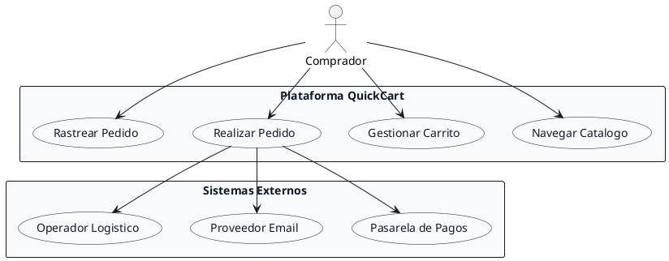
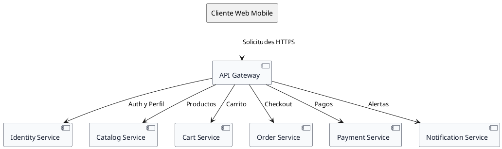
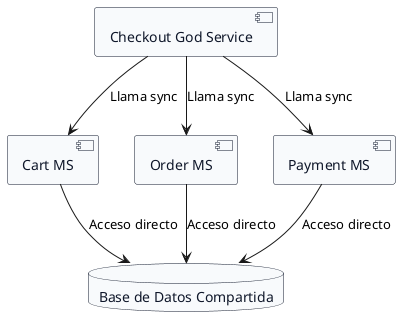

# Context Engineering Master Prompt - Hito 1: Descomposición del Dominio y Límites de Servicios (QuickCart - Week 6)

## Contexto de Referencia
Asimila las directrices del rol en `../context/role.md`, la descripción del problema QuickCart en `../context/problem_description.md`, las reglas de formato en `../context/markdown_guide.md` y los estándares de diagramación en `../context/plantuml_guide.md`.

---

## Directivas Arquitectónicas Imperativas para el Modelo

Actúa como **Principal Software & Enterprise Architect** especializado en **Domain-Driven Design (DDD)** y **Arquitectura de Microservicios (MSA)**. Elabora el informe técnico de arquitectura definitivo para el **Hito 1: Descomposición del Dominio y Límites de Servicios de QuickCart**.

Tu informe debe destacar por su **rigor técnico, análisis de trade-offs profundos, celdas de tabla ultra-concisas (MÁXIMO 8-10 PALABRAS POR CELDA para evitar deformación horizontal), numeración profesional comenzando en la Sección 1, checklist con todas las casillas marcadas [x] al final y diagramas PlantUML impecables en fondo blanco**.

---

### Estructura Obligatoria y Entregables del Hito 1 (Numeración Profesional desde la Sección 1)

#### 1. Contexto y Dominio del Negocio QuickCart
- **Análisis de Flujo de Negocio**: Describe el recorrido completo `encontrar producto -> armar carrito -> pagar -> confirmar pedido`, distinguiendo los efectos colaterales (notificaciones asíncronas, fulfillment).
- **Diagnóstico del Dolor Monolítico**: Explica conceptualmente por qué mezclar en un mismo proceso monolítico la **sesión de compra (carrito)**, el **compromiso durable de negocio (pedido)** y la **infraestructura transversal (correos/SMS)** destruye la escalabilidad y resiliencia.
- **Diagrama PlantUML 1 (Contexto Lógico QuickCart)**:
  - Estructura limpia parseable con fondo blanco:


#### 2. Microservicios Candidatos y Descomposición por Bounded Contexts
- **Tabla Estructurada de Microservicios (Celdas Breves: Máximo 8-10 palabras)**:
  Toda celda DEBE ser una frase ultra-corta para mantener la tabla compacta:

| # | Nombre del servicio | Responsabilidad principal (Frase corta) | Qué NO hace (Límite corto) |
| :--- | :--- | :--- | :--- |
| 1 | `Identity Service` | Autenticación, registro y perfiles de usuarios. | No conoce carritos, stock ni pedidos. |
| 2 | `Catalog Service` | Catálogo de productos y búsquedas. | No cobra, no arma carritos ni gestiona envíos. |
| 3 | `Cart Service` | Carrito efímero de compras pre-pago. | No crea pedidos ni cobra ni reserva stock firme. |
| 4 | `Order Service` | Orquestación del ciclo de vida del pedido. | No autentica usuarios ni envía emails. |
| 5 | `Payment Service` | Integración financiera y cobros con pasarelas. | No gestiona carritos ni envío de productos. |
| 6 | `Notification Service` | Envíos asíncronos de email, SMS y push. | No contiene reglas de negocio ni pedidos. |

- **Diagrama PlantUML 2 (Topología de Microservicios)**:


#### 3. Decisiones Discutibles y Justificación Arquitectónica

##### 3.1. Decisiones Clave para Notification Service
- Justifica conceptualmente por qué `Notification Service` debe ser un microservicio independiente.
- *Frase Arquitectónica Clave*: *"La compra debe ser el centro del negocio. El correo confirma, pero no define si la compra existe. Esa diferencia conceptual es CLAVE."*
- Explica los factores de aislamiento: integración con proveedores externos cambiantes (SendGrid/Twilio), fallas independientes, volumen de retribuciones y criticidad diferenciada respecto al pedido.

##### 3.2. Caso B: Shopping Cart Service y Order Service (Matriz Dual de Trade-Offs)
Presenta una evaluación comparativa detallada entre dos alternativas arquitectónicas usando tablas markdown ultra-concisas:

- **Alternativa 1: Servicios Independientes (`Cart Service` vs `Order Service`)**:
  | Criterio | Análisis de la Separación (Frase Corta) |
  | :--- | :--- |
  | `Ciclo de vida datos` | Carrito efímero abandonable; pedido inmutable y durable. |
  | `Estado temporal/definitivo` | Carrito temporal; pedido definitivo y legal. |
  | `Reglas de negocio` | Carrito valida intención; pedido valida pago y fulfillment. |
  | `Persistencia` | Carrito usa Key-Value Redis; pedido exige ACID PostgreSQL. |
  | `Escalabilidad` | Carrito alto throughput; pedido alta criticidad. |
  | `Evolución independiente` | Cambios en UX del carrito no afectan pedidos. |

- **Alternativa 2: Un solo servicio para Carrito y Pedidos (Evaluación del Antipatrón)**:
  | Criterio | Análisis del Antipatrón (Frase Corta) |
  | :--- | :--- |
  | `Ciclo de vida datos` | Mezcla datos efímeros con datos históricos de compra. |
  | `Estado temporal/definitivo` | Trata el carrito como pre-pedido desorganizando estados. |
  | `Reglas de negocio` | Colisión de reglas de intención con validaciones financieras. |
  | `Persistencia` | Fuerza base de datos común ineficiente para ambos. |
  | `Escalabilidad` | Tráfico masivo en carritos degrada pedidos reales. |
  | `Evolución independiente` | Cambios en UX arriesgan la lógica legal de pedidos. |

##### 3.3. Justificación de Desacoplamiento de Logística / Shipping

#### 4. Explicación en Profundidad de Límites de Servicio (Cart vs Order)
- **Qué está FUERA de Cart (y por qué)**:
  - Captura de pago y confirmación -> `Order` (+ `Payment`).
  - Reserva firme de stock post-compra -> `Catalog/Inventory` vía hechos del pedido, no "el carrito es dueño del inventario".
  - Email "gracias por tu compra" -> `Notification` ante evento de `Order`, no un `sendMail()` dentro del carrito.
- **Señal de que el límite está BIEN**:
  - *"Si mañana cambiamos la UX del carrito (drawer, guest cart, multi-wishlist) SIN tocar las transiciones legales del pedido ni la pasarela, el borde aguantó."*
- **Señal de que el límite SE ROMPIÓ**:
  - *"Si Cart Service empieza a persistir orderId, estados paid/shipped o plantillas de correo, estamos FILTRANDO el contexto Ordering/Notification hacia Cart -> camino a God Service / distributed monolith."*
- **Diagrama PlantUML 3 (Límite Bounded Context Cart vs Order)**:
```plantuml
@startuml
skinparam backgroundColor white
skinparam package {
    BackgroundColor #F8FAFC
    BorderColor #0F172A
    FontColor #0F172A
}
skinparam rectangle {
    BackgroundColor #F8FAFC
    BorderColor #0F172A
    FontColor #0F172A
}

package "Cart Bounded Context" as CartBC {
  rectangle "Carrito de Compras" as Cart {
    + Items
    + Cantidad
    + TTL
  }
}

package "Order Bounded Context" as OrderBC {
  rectangle "Agregado de Pedido" as OrderAggregate {
    + Order ID
    + Items Confirmados
    + Estado Pedido
  }
}

CartBC --> OrderBC : checkout: crear pedido luego carrito se vacia
@enduml
```

#### 5. Análisis de Anti-Patrones y Evaluación de Riesgos (Distributed Monolith & God Service)
Desarrolla el análisis del anti-patrón dividiéndolo obligatoriamente en 4 secciones numeradas:

1. **Cómo podría aparecer**:
   - Explicación de cómo QuickCart podría separar servicios físicamente pero mantener dependencias síncronas en cadena.
2. **Qué mala decisión de límites podría provocarlo**:
   - Explicación del antipatrón de micro-división por operaciones pequeñas.
3. **Qué problema generaría a futuro**:
   - Evaluación del impacto: alto acoplamiento, despliegues coordinados obligatorios, latencia p95 e inestabilidad.
4. **Cómo modificar los límites para evitarlo**:
   - Re-alineamiento por Bounded Contexts y agregados de DDD.

- **Tabla Comparativa de Anti-Patrones (Celdas Breves)**:
  | Si hacemos esto... | Anti-patrón | Problema a futuro |
  | :--- | :--- | :--- |
  | Un solo "Checkout Service" con carrito + pedido + pago + emails | **God Service** | Un release para todo; bug de email redeploya cobros. |
  | Servicios "separados" pero PostgreSQL compartida y joins | **Distributed Monolith** | Latencia de red sin independencia de datos. |
  | Cart llamando en sync a Order, Payment, Catalog en cada addItem | **Chatty Services** | Latencia p95 alta; cascadas de falla en acciones simples. |

- *Frase Arquitectónica Contundente*: *"Límites mal cortados no 'parten' QuickCart: reparten el dolor (más piezas, mismo acoplamiento)."*

- **Diagrama PlantUML 4 (Anti-Patrón Monolito Distribuido)**:


#### 6. Lista de Verificación (Checklist del Hito 1)
Escribe OBLIGATORIAMENTE todas las casillas marcadas como completadas `[x]` al final del informe:
- [x] Entre 5 y 7 microservicios (6)
- [x] Nombre + responsabilidad (1 oración) + qué NO hace
- [x] >= 1 decisión discutible justificada (Cart != Order; emails; Shipping opcional)
- [x] Un límite explicado en profundidad (Cart vs Order)
- [x] Anti-patrones de mala delimitación (God Service, Distributed Monolith, Chatty Services) con impacto futuro

---

## Reglas Estrictas de Formato Markdown y PlantUML
1. **CELDAS ULTRA-CONCISAS**: Máximo 8 a 10 palabras por celda.
2. **PLANTUML CON FONDO BLANCO ESPECÍFICO**: Todos los diagramas deben usar `skinparam backgroundColor white` y colores explícitos `#F8FAFC` / `#0F172A` para visibilidad óptima en tema oscuro.
3. **SIN PALABRAS DE ESTILO SUELTAS**: Prohibido usar `backgroundColor`, `componentStyle`, `handwritten` sin la palabra `skinparam` delante.

---

## Entregables
Guarda la respuesta técnica estructurada en `../outputs/output1.md`.
