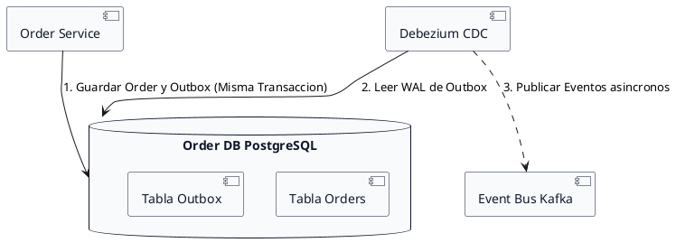

# Context Engineering Master Prompt - Hito 2: Diseño de APIs y Comunicación entre Servicios (QuickCart - Week 6)

## Contexto de Referencia
Asimila las directrices del rol en `../context/role.md`, la descripción del problema QuickCart en `../context/problem_description.md`, las reglas de formato en `../context/markdown_guide.md`, los estándares de diagramación en `../context/plantuml_guide.md` y los resultados acumulados del Hito 1 (`output1.md`).

---

## Directivas Arquitectónicas Imperativas para el Modelo

Actúa como **Principal Software & Enterprise Architect** especializado en **Arquitectura de Microservicios (MSA)** y **Sistemas Distribuidos**. Elabora el informe técnico de arquitectura definitivo para el **Hito 2: Diseño de APIs y Comunicación entre Servicios de QuickCart**.

Tu informe debe destacar por su **rigor técnico, análisis explícito de acoplamiento (temporal, espacial, de protocolo, de dominio), estrategias de contrapresión (backpressure), selección justificada de un vendor/tecnología real (Confluent Cloud / Apache Kafka), análisis del efecto dominó ante fallas, patrones de resiliencia (Outbox Pattern, Circuit Breaker, DLQ), celdas de tabla concisas (máximo 8-10 palabras), checklist marcado [x] al final y diagramas PlantUML en fondo blanco con alto contraste**.

---

### Estructura Obligatoria y Entregables del Hito 2 (Numeración Profesional desde la Sección 1)

#### 1. Contexto de Comunicación e Interacciones Críticas en QuickCart
- **Análisis del Modelo de Comunicación Híbrido**: Explica por qué QuickCart adopta un modelo híbrido: síncrono (HTTP/REST o gRPC) para validaciones inmediatas y asíncrono (EDA via Message Broker) para la transmisión de eventos de cambio de estado.
- **Análisis de Tipos de Acoplamiento**: Define y analiza cómo se gestiona cada tipo de acoplamiento en QuickCart (Temporal, Espacial, de Protocolo y de Dominio).

#### 2. Diseño Detallado de Interacciones entre Servicios Críticos
Selecciona exactamente dos pares de interacción crítica de negocio:
- **Interacción A: `Order Service` <-> `Inventory Service`**
- **Interacción B: `Order Service` <-> `Notification Service`**

Para CADA una de las dos interacciones, detalla de forma estructurada:
- **2.1. Naturaleza de la Comunicación y Solicitudes/Eventos Intercambiados**: Flujo funcional de negocio.
- **2.2. Selección Justificada de Protocolos**: gRPC/REST para síncrono; Kafka Protocol/AMQP para asíncrono.
- **2.3. Estructura de Datos Transmitida (Alto Nivel)**: Payload schemas concisos (`orderId`, `userId`, `items`, `timestamp`).
- **2.4. Tabla Resumen de Interacción (Formato Markdown Limpio con Celdas Breves de 8-10 Palabras)**:

| Flujo / Operación | Tipo de Comunicación | Protocolo Seleccionado | Estructura de Datos (Alto Nivel) |
| :--- | :--- | :--- | :--- |
| `Reserva Stock` | Síncrona (Request-Response) | gRPC / Protobuf | `orderId`, `itemsList[productId, qty]` |
| `Pedido Confirmado` | Asíncrona (Event-Driven) | Kafka Topic (`order-events`) | `orderId`, `userId`, `totalAmount`, `timestamp` |
| `Notificación Compra` | Asíncrona (Event-Driven) | Kafka Topic (`order-events`) | `orderId`, `userEmail`, `templateId` |

- **Diagrama PlantUML 1 (Secuencia de Interacción entre Servicios)**:
```plantuml
@startuml
skinparam backgroundColor white
skinparam participant {
    BackgroundColor #F8FAFC
    BorderColor #0F172A
    FontColor #0F172A
}

participant "Cliente Web Mobile" as Client
participant "API Gateway" as APIGW
participant "Order Service" as OrderSvc
participant "Inventory Service" as InventorySvc
participant "Event Bus Kafka" as EventBus
participant "Notification Service" as NotificationSvc

Client -> APIGW : POST /orders Checkout
activate APIGW
APIGW -> OrderSvc : Crear Pedido HTTP
activate OrderSvc
OrderSvc -> InventorySvc : gRPC ReserveStock
activate InventorySvc
InventorySvc --> OrderSvc : StockReservado OK
deactivate InventorySvc

OrderSvc -> OrderSvc : Guardar Order CONFIRMED
OrderSvc ..> EventBus : Publish OrderConfirmed
deactivate OrderSvc
deactivate APIGW

EventBus -> NotificationSvc : Consume OrderConfirmed
activate NotificationSvc
NotificationSvc -> NotificationSvc : Enviar Email Cliente
deactivate NotificationSvc
@enduml
```

#### 3. Estrategias de Contrapresión (Backpressure) y Gestión de Cargas Extremas
- Explicación detallada de cómo se implementa la contrapresión:
  - *Contrapresión Síncrona*: Rate Limiting en API Gateway (Token Bucket), Throttling y Circuit Breaker.
  - *Contrapresión Asíncrona*: Gestión de Consumer Lag en Kafka, tuning de `max.poll.records`, permitiendo a `Notification Service` procesar a su propio ritmo.

#### 4. Investigación y Selección Justificada de un Vendor / Tecnología Real
- Selecciona **Confluent Cloud / Apache Kafka** para el Bus de Eventos de QuickCart.
- Desarrolla una justificación técnica y de negocio completa en 5 ejes clave (Throughput, Modelo de costos Pay-as-you-go, SLA 99.99%, Conectores Kafka Connect / Debezium y Event Log inmutable).

#### 5. Análisis de Fallos, Efecto Dominó y Patrones de Mitigación de Riesgos
- **5.1. Escenario de Falla del Vendor**: Caída total o degradación del cluster de Kafka.
- **5.2. Identificación del Efecto Dominó**: Acumulación de hilos en API Gateway, latencia descontrolada y parálisis del checkout.
- **5.3. Patrones de Resiliencia y Mitigación de Riesgos**:
  - *Transactional Outbox Pattern + Debezium CDC*: Persistencia local del pedido y evento en PostgreSQL antes de publicar.
  - *Dead Letter Queue (DLQ)*: Aislamiento de mensajes fallidos.
  - *Circuit Breaker + Fallback Degradado*: Mantenimiento operativo del checkout ante fallas secundarias.
- **Diagrama PlantUML 2 (Patrón Transactional Outbox ante Falla de Bus)**:


#### 6. Lista de Verificación (Checklist del Hito 2)
Escribe OBLIGATORIAMENTE todas las casillas marcadas como completadas `[x]` al final del informe:
- [x] 2 servicios/interacciones críticas elegidas (Order-Inventory, Order-Notification)
- [x] Definición de eventos/solicitudes, comunicación síncrona/asíncrona y protocolos
- [x] Transmisión de datos explicada a alto nivel (payload schemas)
- [x] Vendor o tecnología real investigada y justificada (Confluent Cloud / Kafka)
- [x] Análisis del escenario de falla del vendor y efecto dominó identificado
- [x] Patrones de resiliencia (Outbox, Circuit Breaker, DLQ) para mitigar el fallo

---

## Reglas Estrictas de Formato Markdown y PlantUML
1. **CELDAS ULTRA-CONCISAS**: Máximo 8 a 10 palabras por celda.
2. **PLANTUML CON FONDO BLANCO ESPECÍFICO**: Usar `skinparam backgroundColor white` y colores explícitos `#F8FAFC` / `#0F172A` para visibilidad en tema oscuro.
3. **SIN PALABRAS DE ESTILO SUELTAS**: Prohibido usar `backgroundColor`, `componentStyle`, `handwritten` sin la palabra `skinparam` delante.

---

## Entregables
Guarda la respuesta técnica estructurada en `../outputs/output2.md`.
