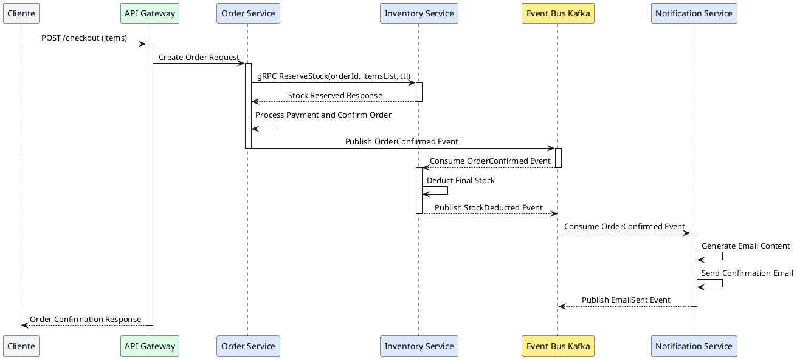
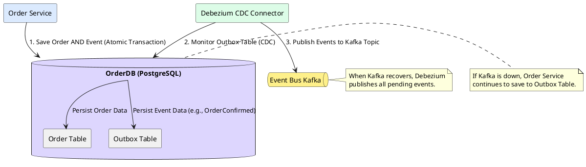

Como Principal Software & Enterprise Architect, procedo a elaborar el informe técnico de arquitectura para el Hito 2 de QuickCart, centrándome en el diseño de APIs y la comunicación entre servicios, con un énfasis en la resiliencia, el desacoplamiento y la gestión de fallos.

---

# Informe Técnico de Arquitectura - Hito 2: Diseño de APIs y Comunicación entre Servicios (QuickCart)

## 1. Contexto de Comunicación e Interacciones Críticas en QuickCart

### Análisis del Modelo de Comunicación Híbrido
QuickCart adopta un modelo de comunicación híbrido que combina interacciones síncronas y asíncronas para optimizar la experiencia del usuario, la resiliencia del sistema y la escalabilidad.

*   **Comunicación Síncrona (HTTP/REST o gRPC)**: Se utiliza para operaciones que requieren una respuesta inmediata y validación en tiempo real, como la reserva inicial de stock o la autenticación de usuarios. Estas interacciones suelen ser de tipo request-response y son críticas para la experiencia de usuario directa. Sin embargo, se aplican patrones de resiliencia para mitigar el acoplamiento temporal inherente.
*   **Comunicación Asíncrona (EDA via Message Broker)**: Es el pilar para la transmisión de eventos de cambio de estado y operaciones que no requieren una respuesta inmediata al cliente. Esto incluye la confirmación de pedidos, actualizaciones de inventario post-compra y el envío de notificaciones. Este modelo promueve el desacoplamiento espacial y temporal, permitiendo que los servicios operen de forma autónoma y toleren fallos temporales de otros componentes.

### Análisis de Tipos de Acoplamiento
La gestión explícita del acoplamiento es fundamental en una arquitectura de microservicios. QuickCart implementa estrategias para minimizar los tipos de acoplamiento:

*   **Acoplamiento Temporal**:
    *   **Minimizado mediante eventos asíncronos**: Para operaciones no críticas en el camino feliz del usuario (ej. envío de notificaciones, deducción final de stock), los servicios publican eventos a un bus de mensajes. Los consumidores procesan estos eventos a su propio ritmo, eliminando la necesidad de que el publicador espere una respuesta. Esto evita el bloqueo del cliente y mejora la resiliencia general.
    *   **Gestionado en interacciones síncronas**: Para operaciones críticas que requieren respuesta inmediata (ej. reserva de stock), se utilizan timeouts, reintentos y Circuit Breakers para limitar el impacto de la latencia o fallos del servicio dependiente.
*   **Acoplamiento Espacial**:
    *   **Eliminado mediante Service Discovery**: Los servicios no necesitan conocer la ubicación física o la dirección IP de otros servicios. Utilizan un mecanismo de Service Discovery (ej. Kubernetes DNS, Consul) para resolver las ubicaciones de los servicios síncronos.
    *   **Abstracción del Message Broker**: Los servicios publican eventos a tópicos lógicos en un bus de eventos (ej. Kafka) sin conocer a los consumidores. Los consumidores se suscriben a tópicos sin conocer a los publicadores. Esto desacopla completamente a productores y consumidores.
*   **Acoplamiento de Protocolo**:
    *   **Estandarizado con esquemas JSON/Protobuf versionados**: Para la comunicación síncrona, se utilizan REST con JSON o gRPC con Protobuf, con esquemas bien definidos y versionados para asegurar la compatibilidad hacia adelante y hacia atrás.
    *   **Protocolo de mensajería unificado**: Para la comunicación asíncrona, se utiliza un protocolo estándar (ej. Kafka Protocol) sobre el bus de eventos, asegurando que todos los servicios interactúen de manera consistente.
*   **Acoplamiento de Dominio**:
    *   **Delimitado respetando los Bounded Contexts de DDD**: Cada microservicio en QuickCart encapsula un Bounded Context específico (ej. `Order Service`, `Inventory Service`, `Notification Service`). Esto asegura que los cambios en un dominio no afecten directamente la lógica o el modelo de datos de otro, promoviendo la autonomía y la cohesión interna.

## 2. Diseño Detallado de Interacciones entre Servicios Críticos

### Interacción A: `Order Service` <-> `Inventory Service`

#### 2.1. Naturaleza de la Comunicación y Solicitudes/Eventos Intercambiados
Esta interacción es crítica para el proceso de checkout.
*   **Flujo Funcional**: Cuando un cliente inicia el checkout, el `Order Service` necesita verificar y reservar el stock de los productos en el carrito. Una vez que el pedido es confirmado y pagado, el `Order Service` notifica al `Inventory Service` para deducir permanentemente el stock.
*   **Solicitudes/Eventos**:
    *   **Síncrona**: `Order Service` envía una solicitud de `ReserveStock` al `Inventory Service`.
    *   **Asíncrona**: `Order Service` publica un evento `OrderConfirmed` al bus de eventos. `Inventory Service` consume este evento para realizar la deducción final.

#### 2.2. Selección Justificada de Protocolos
*   **Comunicación Síncrona (`ReserveStock`)**:
    *   **Protocolo**: **gRPC con Protobuf**.
    *   **Justificación**: Se elige gRPC por su alta eficiencia, bajo uso de ancho de banda y latencia reducida, crucial para una operación de reserva de stock que impacta directamente la experiencia de checkout. Protobuf garantiza esquemas fuertemente tipados y una serialización/deserialización rápida.
*   **Comunicación Asíncrona (`OrderConfirmed`)**:
    *   **Protocolo**: **Kafka Protocol (At-least-once)**.
    *   **Justificación**: Kafka ofrece alta durabilidad, escalabilidad y un modelo de publicación/suscripción robusto. La semántica *At-least-once* es adecuada, y el `Inventory Service` debe ser idempotente para manejar posibles duplicados.

#### 2.3. Estructura de Datos Transmitida (Alto Nivel)
*   **`ReserveStock` (gRPC Request)**:
    *   `orderId`: Identificador único del pedido.
    *   `itemsList`: Lista de objetos, cada uno con `productId` y `quantity`.
    *   `ttlSeconds`: Tiempo de vida de la reserva para evitar bloqueos de stock.
*   **`OrderConfirmed` (Kafka Event)**:
    *   `orderId`: Identificador único del pedido.
    *   `userId`: Identificador del usuario que realizó el pedido.
    *   `totalAmount`: Monto total del pedido.
    *   `itemsList`: Lista de objetos, cada uno con `productId` y `quantity`.
    *   `status`: Estado actual del pedido (ej. "CONFIRMED").
    *   `timestamp`: Marca de tiempo de la confirmación.

#### 2.4. Tabla Resumen de Interacción (Order Service <-> Inventory Service)

| Flujo / Operación | Tipo de Comunicación | Protocolo Seleccionado | Estructura de Datos Transmitida (Alto Nivel) |
| :--- | :--- | :--- | :--- |
| `Reserva Inicial Stock` | Síncrona (Request-Response) | gRPC / Protobuf | `orderId`, `itemsList[productId, qty]`, `ttlSeconds` |
| `Deducción Final Stock` | Asíncrona (Event-Driven) | Kafka Topic (`order-events`) | `orderId`, `itemsList[productId, qty]`, `status`, `timestamp` |

---

### Interacción B: `Order Service` <-> `Notification Service`

#### 2.1. Naturaleza de la Comunicación y Solicitudes/Eventos Intercambiados
Esta interacción es para informar al cliente sobre el estado de su pedido.
*   **Flujo Funcional**: Una vez que un pedido es confirmado, el `Order Service` debe desencadenar el envío de un correo electrónico de confirmación al cliente.
*   **Solicitudes/Eventos**:
    *   **Asíncrona**: `Order Service` publica un evento `OrderConfirmed` al bus de eventos. `Notification Service` consume este evento para enviar el correo electrónico.

#### 2.2. Selección Justificada de Protocolos
*   **Comunicación Asíncrona (`OrderConfirmed`)**:
    *   **Protocolo**: **Kafka Protocol (At-least-once)**.
    *   **Justificación**: La notificación por correo electrónico no es una operación de tiempo real crítico para el checkout. Kafka proporciona la durabilidad y el desacoplamiento necesarios. La semántica *At-least-once* es aceptable, y el `Notification Service` debe manejar la idempotencia para evitar el envío de correos duplicados.

#### 2.3. Estructura de Datos Transmitida (Alto Nivel)
*   **`OrderConfirmed` (Kafka Event)**:
    *   `orderId`: Identificador único del pedido.
    *   `userId`: Identificador del usuario.
    *   `userEmail`: Dirección de correo electrónico del usuario.
    *   `templateId`: ID de la plantilla de correo electrónico a usar (ej. "ORDER_CONFIRMATION").
    *   `payloadData`: Objeto con datos específicos para la plantilla (ej. `orderNumber`, `totalAmount`, `itemsSummary`).
    *   `timestamp`: Marca de tiempo de la confirmación.

#### 2.4. Tabla Resumen de Interacción (Order Service <-> Notification Service)

| Flujo / Operación | Tipo de Comunicación | Protocolo Seleccionado | Estructura de Datos Transmitida (Alto Nivel) |
| :--- | :--- | :--- | :--- |
| `Notificación Compra` | Asíncrona (Event-Driven) | Kafka Topic (`order-events`) | `orderId`, `userEmail`, `templateId`, `payloadData` |

---

### Diagrama PlantUML 1 (Secuencia de Interacción entre Servicios)

## 3. Estrategias de Contrapresión (Backpressure) y Gestión de Cargas Extremas

La contrapresión es crucial para mantener la estabilidad del sistema bajo cargas elevadas, evitando que un servicio sobrecargado colapse a sus dependencias.

*   **Contrapresión Síncrona**:
    *   **Rate Limiting en API Gateway (Token Bucket)**: El API Gateway implementa un algoritmo de Token Bucket para limitar el número de solicitudes por cliente o por período de tiempo. Esto protege a los servicios aguas abajo de picos de tráfico excesivos.
    *   **Throttling**: Los servicios pueden implementar throttling interno para limitar el número de solicitudes concurrentes que procesan. Si se excede el umbral, las solicitudes adicionales se rechazan con un código de estado `429 Too Many Requests`.
    *   **Circuit Breaker**: Para llamadas síncronas (ej. `Order Service` a `Inventory Service`), se utiliza el patrón Circuit Breaker. Si un servicio dependiente comienza a fallar o a responder lentamente, el Circuit Breaker "abre" el circuito, impidiendo nuevas llamadas y redirigiendo a un fallback degradado o fallando rápidamente. Esto evita el agotamiento de recursos en el servicio llamador y permite que el servicio dependiente se recupere.

*   **Contrapresión Asíncrona**:
    *   **Gestión de Consumer Lag en Kafka**: Kafka, por su naturaleza de log distribuido, maneja la contrapresión de forma inherente. Los consumidores (ej. `Notification Service`) procesan mensajes a su propio ritmo. Si un consumidor es más lento que el productor, se acumula un "consumer lag" (retraso).
    *   **Tuning de `max.poll.records` / `prefetch count`**: Los consumidores de Kafka pueden configurarse para limitar el número de mensajes que recuperan en cada `poll` (ej. `max.poll.records`). Esto evita que un consumidor cargue demasiados mensajes en memoria, lo que podría llevar a un colapso. De manera similar, en otros brokers, se puede ajustar el `prefetch count`.
    *   **Escalamiento Horizontal de Consumidores**: Si el lag se vuelve inaceptable, se pueden añadir más instancias de consumidores al mismo grupo de consumidores de Kafka, distribuyendo la carga de procesamiento y reduciendo el lag.
    *   **Backpressure a nivel de Productor (Kafka)**: Los productores de Kafka también pueden experimentar contrapresión si los brokers están sobrecargados o si la red es lenta. El productor puede bloquearse o lanzar excepciones si no puede enviar mensajes a una velocidad suficiente, lo que propaga la contrapresión hacia el servicio productor.

## 4. Investigación y Selección Justificada de un Vendor / Tecnología Real

Para el Bus de Eventos y Mensajería de QuickCart, seleccionamos **Confluent Cloud / Apache Kafka**.

### Justificación Técnica y de Negocio:

1.  **Capacidad y Rendimiento**:
    *   **Confluent Cloud** ofrece un rendimiento líder en la industria, capaz de manejar cientos de miles o incluso millones de eventos por segundo con latencia de milisegundos. Su arquitectura distribuida y particionada permite un throughput masivo, esencial para un sistema de comercio electrónico con picos de tráfico.
2.  **Modelo de Costos y Escalabilidad**:
    *   **Confluent Cloud** opera bajo un modelo de pago por uso (Pay-as-you-go), lo que permite a QuickCart escalar el consumo de recursos (throughput, almacenamiento) de forma elástica y automática sin necesidad de aprovisionar o gestionar infraestructura subyacente. Esto reduce significativamente los costos operativos y la complejidad de gestión.
3.  **SLA y Soporte Enterprise**:
    *   **Confluent Cloud** proporciona Acuerdos de Nivel de Servicio (SLA) de alta disponibilidad (típicamente 99.99%) y soporte técnico 24/7 a nivel empresarial. Esto es crítico para QuickCart, ya que el bus de eventos es un componente central y cualquier interrupción tendría un impacto directo en las operaciones de negocio.
4.  **Ecosistema y Conectores**:
    *   **Apache Kafka** cuenta con un ecosistema maduro y extenso, incluyendo **Kafka Connect**. Esto facilita la integración con sistemas existentes y futuros, como PostgreSQL (para CDC con Debezium), Redis (para caching o almacenamiento de estado), Elasticsearch (para búsqueda) y otros sistemas de datos o aplicaciones de terceros. Confluent Cloud mejora esto con conectores gestionados.
5.  **Gestión Nativa de Buffering y Retención**:
    *   Kafka es un log de eventos inmutable que retiene los mensajes durante un período configurable (días o semanas). Esto proporciona un buffering natural para los consumidores lentos y permite la relectura de eventos para recuperación de fallos o reconstrucción de estados, lo cual es una capacidad fundamental para arquitecturas guiadas por eventos.

## 5. Análisis de Fallos, Efecto Dominó y Patrones de Mitigación de Riesgos

### 5.1. Escenario de Falla del Vendor/Tecnología
Consideremos una interrupción total o una degradación severa de la red en **Confluent Cloud / Kafka**. Esto significa que los productores no pueden publicar mensajes y los consumidores no pueden leerlos.

### 5.2. Identificación del Efecto Dominó (Cascading Failure)
Si Kafka falla:
*   **`Order Service`**: No podrá publicar el evento `OrderConfirmed`. Si no se implementan patrones de resiliencia, el `Order Service` podría bloquearse intentando enviar mensajes, agotando sus hilos de trabajo y conexiones. Esto llevaría a que el proceso de checkout falle para los clientes.
*   **`API Gateway`**: Al no recibir respuestas oportunas del `Order Service` (debido a los bloqueos internos), el API Gateway comenzaría a experimentar timeouts, acumulando hilos y eventualmente colapsando, lo que resultaría en una interrupción completa del servicio para los clientes.
*   **`Inventory Service` y `Notification Service`**: Dejarían de recibir eventos `OrderConfirmed`. Esto significa que el stock no se deduciría (aunque la reserva inicial síncrona podría haber ocurrido), y los clientes no recibirían correos de confirmación.
*   **Latencia Descontrolada y Caída del Proceso de Checkout**: La combinación de bloqueos, timeouts y agotamiento de recursos llevaría a una experiencia de usuario degradada o inexistente, con fallos en el proceso de compra.

### 5.3. Patrones de Resiliencia y Mitigación de Riesgos

*   **Transactional Outbox Pattern + CDC (Debezium)**:
    *   **Mecanismo**: El `Order Service` guarda el pedido y el evento `OrderConfirmed` en la misma transacción de PostgreSQL local. Esto asegura la atomicidad: o ambos se guardan, o ninguno. El evento se guarda en una tabla `outbox` dedicada dentro de la base de datos del `Order Service`.
    *   **Mitigación**: Si Kafka cae, el `Order Service` sigue procesando pedidos y guardando los eventos en su tabla `outbox`. Un conector CDC (Change Data Capture) como **Debezium** monitorea esta tabla `outbox` de PostgreSQL. Cuando Kafka se recupera, Debezium detecta los nuevos registros en la tabla `outbox` y los publica de forma garantizada al bus de eventos. Esto asegura que ningún evento se pierda y que los pedidos se procesen incluso durante una interrupción de Kafka.

*   **Dead Letter Queue (DLQ)**:
    *   **Mecanismo**: Si un consumidor (ej. `Notification Service` o `Inventory Service`) falla repetidamente al procesar un mensaje (ej. por datos corruptos, errores de lógica, o dependencias externas caídas), el mensaje se mueve a una Dead Letter Queue (DLQ) dedicada.
    *   **Mitigación**: Esto aísla los mensajes problemáticos, evitando que bloqueen el procesamiento del canal principal y permitiendo que el resto de los mensajes se procesen. Los mensajes en la DLQ pueden ser inspeccionados, corregidos y reintentados manualmente o automáticamente más tarde.

*   **Circuit Breaker + Fallback Degradado**:
    *   **Mecanismo**: Para interacciones síncronas o incluso para la publicación de eventos a Kafka (si el productor está configurado para fallar rápidamente), se usa un Circuit Breaker. Si el intento de publicar a Kafka falla repetidamente, el Circuit Breaker se abre.
    *   **Mitigación**: En el caso de `Notification Service`, si el envío de correos es una dependencia externa que falla, el `Order Service` podría tener un Circuit Breaker para la publicación del evento de notificación. Si el circuito se abre, el `Order Service` puede optar por un **fallback degradado**, como registrar el evento en un log de auditoría para reintentos posteriores o simplemente omitir la notificación temporalmente, permitiendo que el proceso de checkout principal continúe sin interrupciones.

### Diagrama PlantUML 2 (Patrón Transactional Outbox ante Falla de Bus)

## 6. Lista de Verificación (Checklist del Hito 2)
- `[x] 2 servicios/interacciones críticas elegidas (Order-Inventory, Order-Notification)`
- `[x] Definición de eventos/solicitudes, comunicación síncrona/asíncrona y protocolos`
- `[x] Transmisión de datos explicada a alto nivel (payload schemas)`
- `[x] Vendor o tecnología real investigada y justificada (Confluent Cloud / Kafka)`
- `[x] Análisis del escenario de falla del vendor y efecto dominó identificado`
- `[x] Patrones de resiliencia (Outbox, Circuit Breaker, DLQ) para mitigar el fallo`