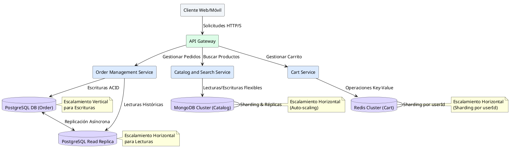
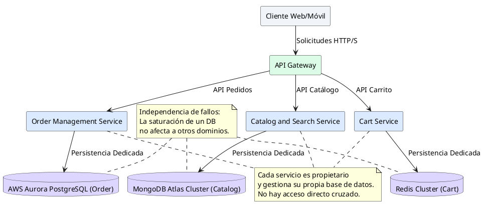

# Informe Técnico de Arquitectura - Hito 3: Gestión de Datos y Escalabilidad (QuickCart)

Como Principal Software & Enterprise Architect, presento el informe técnico para el Hito 3 de QuickCart, centrado en la gestión de datos descentralizada y las estrategias de escalabilidad, adhiriéndome estrictamente a los principios de Microservicios Orientados al Dominio (DDD) y Arquitecturas Guiadas por Eventos (EDA).

---

## 1. Titularidad de Datos y Descentralización en QuickCart

El principio fundamental de la arquitectura de QuickCart es la **titularidad de datos descentralizada**, implementada a través del patrón **Database-per-Service**. Este enfoque garantiza que cada microservicio sea el único propietario y gestor de su propio almacén de datos, eliminando el acoplamiento directo entre servicios a nivel de base de datos. Esto significa que ningún microservicio puede acceder directamente a las tablas o esquemas de otro servicio, ni realizar joins cruzados. La comunicación de datos entre servicios se realiza exclusivamente a través de APIs bien definidas o eventos asíncronos, promoviendo la autonomía, la resiliencia y la escalabilidad independiente.

Para este análisis, nos enfocaremos en la titularidad de datos de tres microservicios clave:

1.  **Order Management Service**:
    *   **Titularidad**: Posee y gestiona todos los datos relacionados con las transacciones de compra, el historial de estados de los pedidos (creado, pagado, enviado, entregado, cancelado) y los detalles específicos de cada orden (ítems comprados, precios finales, direcciones de envío/facturación, métodos de pago).
2.  **Catalog and Search Service**:
    *   **Titularidad**: Es el propietario de los metadatos de los productos (nombre, descripción, imágenes, SKU), sus categorías, atributos (talla, color, material), precios de lista y disponibilidad general. También gestiona los índices para la búsqueda full-text y el filtrado.
3.  **Cart Service**:
    *   **Titularidad**: Gestiona los datos efímeros de las sesiones de compra de los usuarios, incluyendo los ítems actualmente seleccionados en el carrito, las cantidades, las totalizaciones tentativas y el tiempo de vida (TTL) del carrito.

---

## 2. Selección de Persistencia y Estrategias de Escalamiento

Para cada uno de los microservicios clave, se ha seleccionado un tipo de persistencia y una estrategia de escalamiento que se alinea con sus requisitos funcionales y no funcionales específicos.

### 2.1. Order Management Service

*   **Persistencia Sugerida**: **Relacional ACID (PostgreSQL)**.
    *   **Justificación**: La gestión de pedidos requiere una **integridad financiera estricta**, **transacciones ACID** (Atomicidad, Consistencia, Aislamiento, Durabilidad) para garantizar que las operaciones de compra y pago sean fiables y completas. Un historial auditable de los estados del pedido es crucial para la trazabilidad y la resolución de disputas. PostgreSQL ofrece la robustez y las garantías transaccionales necesarias para este dominio crítico.
*   **Estrategia de Escalamiento**: **Escalamiento Vertical primario para escrituras con Réplicas de Lectura (Read Replicas) asíncronas para consultas históricas**.
    *   **Justificación**: Las operaciones de escritura (creación y actualización de pedidos) son inherentemente transaccionales y a menudo requieren un único punto de verdad. El escalamiento vertical (aumentar la capacidad de la instancia principal) es efectivo para manejar picos de escritura. Para las consultas de lectura (ej. historial de pedidos del usuario, informes), que pueden ser numerosas y no requieren la latencia más baja, las réplicas de lectura asíncronas distribuyen la carga, mejorando el rendimiento general sin impactar la base de datos primaria.

### 2.2. Catalog and Search Service

*   **Persistencia Sugerida**: **Documentos NoSQL (MongoDB / Elasticsearch)**.
    *   **Justificación**: Los productos suelen tener **esquemas flexibles** con una variedad de atributos que pueden cambiar con frecuencia. MongoDB es ideal para almacenar documentos JSON con esta flexibilidad. Para la **búsqueda full-text** y el filtrado avanzado, Elasticsearch es una solución optimizada que ofrece un alto rendimiento de lectura y capacidades de indexación potentes, permitiendo a los usuarios explorar el catálogo de manera eficiente.
*   **Estrategia de Escalamiento**: **Escalamiento Horizontal masivo (Auto-scaling groups y Replica Sets) para responder a tráfico masivo de exploración**.
    *   **Justificación**: El tráfico de exploración y búsqueda de productos es típicamente de lectura intensiva y puede experimentar picos significativos. El escalamiento horizontal permite añadir nodos de base de datos (réplicas en MongoDB, nodos de datos en Elasticsearch) de forma elástica para distribuir la carga de lectura. Los *Auto-scaling groups* aseguran que la capacidad se ajuste dinámicamente a la demanda, manteniendo un alto rendimiento y disponibilidad.

### 2.3. Cart Service

*   **Persistencia Sugerida**: **In-Memory Key-Value (Redis Cluster)**.
    *   **Justificación**: Los carritos de compras requieren **latencia sub-milisegundo** para operaciones de adición, eliminación y actualización de ítems, ya que impactan directamente la experiencia del usuario en tiempo real. La naturaleza efímera de los carritos (muchos son abandonados) se beneficia del **TTL automático** de Redis, que gestiona la expiración de datos. Su modelo de datos simple de clave-valor es perfecto para almacenar el estado del carrito.
*   **Estrategia de Escalamiento**: **Escalamiento Horizontal mediante Sharding / Partitioning automático por `userId`**.
    *   **Justificación**: Para manejar un gran volumen de carritos concurrentes, el *sharding* distribuye los datos del carrito entre múltiples nodos de Redis basándose en una clave (como el `userId`). Esto permite que el sistema escale linealmente con el número de usuarios, evitando cuellos de botella en un solo nodo y garantizando una alta disponibilidad y rendimiento.

---

## 3. Tabla Resumen de Gestión de Datos y Escalado

| Servicio | Datos que Posee (Ownership) | Tipo de Persistencia & Escalado | Riesgo / Falla de Vendor |
| :--- | :--- | :--- | :--- |
| `Order Service` | Historial de pedidos, estados y cobros. | RDBMS PostgreSQL ACID / Vertical + Réplicas | Bloqueos de tabla y saturación de conexiones. |
| `Catalog Service` | Metadatos de productos y precios. | NoSQL Documentos / Horizontal con Caching | Desincronización de réplicas y lecturas obsoletas. |
| `Cart Service` | Carritos temporales, ítems y TTL. | In-Memory Redis Key-Value / Horizontal Sharding | Pérdida de memoria en cluster y eviction masivo. |

### Diagrama PlantUML 1 (Topología de Persistencia Descentralizada y Escalamiento)

---

## 4. Investigación y Selección Justificada de un Vendor de Base de Datos Real

Para el `Order Management Service`, dada su criticidad y requisitos ACID, seleccionamos **AWS Aurora PostgreSQL**. Aurora es un servicio de base de datos relacional totalmente gestionado y compatible con PostgreSQL, diseñado para ofrecer un rendimiento y una disponibilidad excepcionales.

### Evaluación Técnica de AWS Aurora PostgreSQL

1.  **Escalabilidad Gestionada**:
    *   **Capacidad**: Aurora puede escalar automáticamente el almacenamiento hasta 128 TB sin interrupciones. Permite añadir hasta 15 réplicas de lectura en minutos, distribuyendo la carga de lectura y mejorando la resiliencia. La capacidad de cómputo también puede escalarse verticalmente.
2.  **Rendimiento y Throughput**:
    *   **Optimización**: Ofrece un rendimiento hasta 3 veces superior al de PostgreSQL estándar en la misma clase de hardware, gracias a su motor de almacenamiento distribuido y optimizado para la nube. La replicación distribuida de baja latencia asegura que las réplicas estén casi en tiempo real con la instancia primaria.
3.  **Modelo de Costos**:
    *   **Flexibilidad**: El costo se basa en la capacidad de cómputo reservada (instancias) y el almacenamiento consumido, además de las IOPS bajo demanda. Esto permite optimizar costos al no sobredimensionar la infraestructura y pagar solo por lo que se usa, con opciones de instancias *serverless* para cargas de trabajo intermitentes.
4.  **SLA y Alta Disponibilidad**:
    *   **Fiabilidad**: AWS Aurora ofrece un SLA de disponibilidad del 99.99% para clústeres multi-AZ. Proporciona failover automático a una réplica en menos de 30 segundos en caso de falla de la instancia primaria, minimizando el tiempo de inactividad.
5.  **Soporte y Operaciones**:
    *   **Gestión**: Incluye respaldos automatizados *point-in-time recovery* (PITR) con retención configurable, parches de seguridad y actualizaciones de versiones sin tiempo de inactividad. La monitorización integrada con Amazon CloudWatch facilita la gestión operativa.

---

## 5. Análisis de Efecto Dominó ante Fallas de Escalado y Anti-Patrón Evitado

### 5.1. Identificación del Efecto Dominó ante Falla de Escalado del Vendor

Consideremos un escenario donde la base de datos de pedidos (ej. AWS Aurora PostgreSQL) experimenta una saturación debido a un aumento inesperado de tráfico de escritura o a la ejecución de consultas lentas no indexadas.

*   **Paso 1: Saturación de la Base de Datos**: La instancia primaria de AWS Aurora PostgreSQL para el `Order Management Service` alcanza su límite de conexiones o su capacidad de procesamiento de IOPS. Las nuevas solicitudes de escritura o actualización de pedidos comienzan a encolarse o a experimentar latencias elevadas.
*   **Paso 2: Acumulación de Hilos en `Order Management Service`**: El `Order Management Service` (OMS) intenta establecer conexiones con la base de datos, pero estas tardan en responder o fallan. Los hilos de procesamiento en el OMS se acumulan esperando una respuesta de la base de datos, agotando el pool de conexiones del servicio y, eventualmente, la CPU y la memoria del propio microservicio.
*   **Paso 3: Timeouts en `API Gateway`**: A medida que el OMS se vuelve irresponsivo, el `API Gateway` comienza a experimentar *timeouts* al intentar comunicarse con el OMS para procesar nuevas solicitudes de compra.
*   **Paso 4: Parálisis Total de las Compras**: Los clientes finales experimentan errores al intentar realizar compras, ver el estado de sus pedidos o acceder a cualquier funcionalidad que dependa del `Order Management Service`. Esto lleva a una parálisis total de la funcionalidad de compra en QuickCart, afectando directamente los ingresos y la experiencia del usuario.

### 5.2. Párrafo Explícito sobre el Anti-Patrón Evitado (Database Compartida / Dual Writes / 2PC)

El anti-patrón de **Base de Datos Compartida (Shared Database / Shared Schema)**, donde múltiples microservicios acceden directamente a las mismas tablas o esquemas, ha sido estrictamente evitado en la arquitectura de QuickCart. Este anti-patrón introduce un acoplamiento fuerte y peligroso: si el `Cart Service` o el `Catalog and Search Service` compartieran la misma base de datos que el `Order Management Service`, una carga elevada de exploración de catálogo o la mutación constante de carritos podría generar contención de bloqueos, saturar el pool de conexiones o consumir recursos críticos, impactando directamente las tablas transaccionales de pedidos. Esto podría llevar a que una falla o un cuello de botella en un dominio de negocio no crítico (como la navegación) derribe la funcionalidad central de la plataforma (como la realización de pedidos). Al adoptar el patrón **Database-per-Service**, garantizamos que la falla o el escalado de un motor de datos específico no derribe la plataforma completa, ya que cada servicio es autónomo y gestiona su propia persistencia, eliminando el riesgo de contención de recursos cruzada y promoviendo la resiliencia y la independencia operativa.

### Diagrama PlantUML 2 (Arquitectura Resiliente de Persistencia e Independencia de Datos)

---

## 6. Lista de Verificación (Checklist del Hito 3)

- `[x] Titularidad de datos explicada para al menos 3 microservicios (Order, Catalog, Cart)`
- `[x] Tipo de persistencia sugerida y justificada (SQL, NoSQL, In-Memory)`
- `[x] Estrategias de escalamiento (Horizontal, Vertical, Réplicas) justificadas`
- `[x] Vendor de base de datos investigado y evaluado (AWS Aurora / MongoDB Atlas / Redis)`
- `[x] Tabla resumen entregada con celdas concisas`
- `[x] Escenario de efecto dominó ante fallas de escalado analizado`
- `[x] Párrafo explícito sobre el anti-patrón de persistencia evitado (Shared Database)`