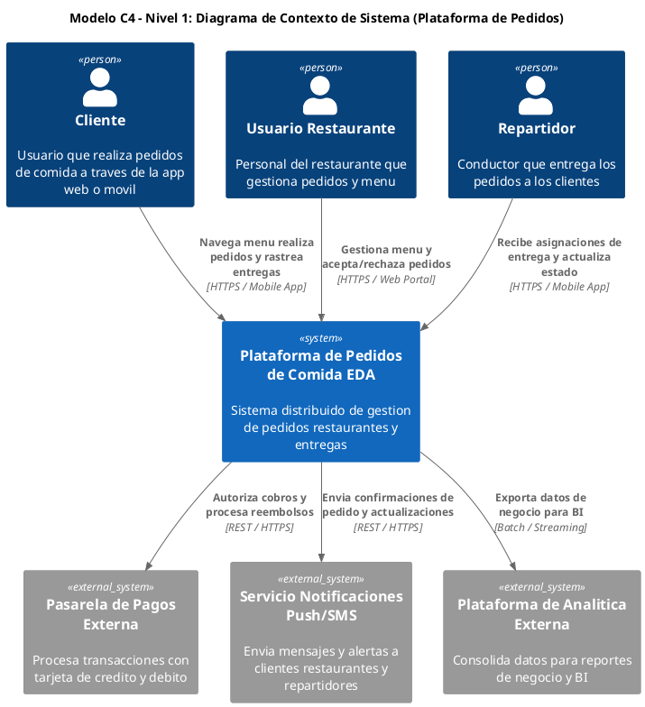

Como Arquitecto Principal de Software y Sistemas Distribuidos, presento el siguiente informe técnico de arquitectura para la plataforma de pedidos de comida, abordando la validación de límites de servicio, el diseño de un plan de elasticidad y un análisis crítico del caso de estudio de Prime Video.

---

# Informe Arquitectónico: Plataforma de Pedidos de Comida Orientada a Eventos

## 1. Validación de Límites de Servicio y Separación de Responsabilidades (SoC)

La arquitectura de microservicios propuesta para la plataforma de pedidos de comida se basa en la comunicación asíncrona a través de eventos, lo cual es fundamental para la resiliencia y escalabilidad. Sin embargo, una evaluación crítica de los límites de servicio actuales revela oportunidades para optimizar la cohesión del dominio y la separación de responsabilidades, especialmente en servicios con perfiles de carga heterogéneos.

### 1.1. Evaluación Crítica de los Límites Actuales

Los servicios iniciales (`Order`, `Restaurant`, `Delivery`, `Notification`, `Loyalty`, `Analytics`) establecen una base sólida. No obstante, se identifican posibles acoplamientos ocultos o responsabilidades sobrecargadas:

*   **`Restaurant Service`**: Si bien gestiona la interacción con la cocina, a menudo también se le asigna la gestión del menú y el catálogo de productos. Esto combina una responsabilidad operativa de tiempo real (aceptar pedidos, actualizar estado) con una responsabilidad de contenido (mostrar productos, precios) que tiene un perfil de carga muy diferente (lectura intensa vs. escritura/proceso moderado).
*   **`Delivery Service`**: Agrupa la lógica de asignación de repartidores (cómputo intensivo, optimización) con la ingesta de telemetría GPS y el seguimiento en tiempo real (ingesta ligera de alta frecuencia). Estas son responsabilidades distintas con requisitos de escalabilidad y latencia muy diferentes.

### 1.2. Propuesta de Límites y Divisiones Alternativas

Para optimizar la cohesión del dominio y la elasticidad, se proponen las siguientes subdivisiones:

1.  **Desacoplamiento del Servicio de Menú/Catálogo del Servicio de Restaurante**:
    *   **`Menu Service` (Nuevo)**:
        *   **Responsabilidad**: Gestionar la información pública de productos, categorías, precios y detalles de restaurantes.
        *   **Justificación**: Este servicio es predominantemente de **lectura intensa (read-heavy)**, con requisitos de baja latencia y alta concurrencia para servir a miles de usuarios explorando el catálogo. Puede beneficiarse enormemente de estrategias de caché agresivas y CDNs.
    *   **`Restaurant Service` (Refinado)**:
        *   **Responsabilidad**: Gestionar el estado operativo del restaurante (disponibilidad, aceptación/rechazo de pedidos, actualización de estado de preparación).
        *   **Justificación**: Este servicio es más **transaccional y de proceso**, interactuando con sistemas de cocina y gestionando el flujo de trabajo interno del restaurante. Su perfil de carga es más predecible y menos volátil que el del catálogo.

2.  **Subdivisión del Servicio de Entrega en "Delivery Dispatch" vs. "Delivery Tracking"**:
    *   **`Delivery Dispatch Service` (Nuevo)**:
        *   **Responsabilidad**: Implementar algoritmos complejos de optimización combinatoria y búsqueda heurística para emparejar repartidores con pedidos, calcular rutas óptimas y gestionar la asignación.
        *   **Justificación**: Este servicio es **intensivo en cómputo (compute-heavy)**, requiriendo recursos significativos de CPU y memoria para resolver problemas de optimización en tiempo real. Su lógica es altamente especializada y puede escalar de forma independiente.
    *   **`Delivery Tracking Service` (Nuevo)**:
        *   **Responsabilidad**: Ingestar telemetría GPS de alta frecuencia de los repartidores, actualizar su ubicación en tiempo real y proporcionar APIs para el seguimiento del pedido por parte del cliente.
        *   **Justificación**: Este servicio es **intensivo en ingesta de datos (ingest-heavy)** y **lectura de baja latencia**, pero con un cómputo mínimo por evento. Se beneficia de bases de datos geoespaciales optimizadas para escritura y lectura rápida, y puede escalar horizontalmente para manejar millones de actualizaciones de ubicación por segundo.

Estas divisiones permiten que cada nuevo servicio se optimice para su perfil de carga específico, mejorando la elasticidad, la resiliencia y la independencia de despliegue.

---

## 2. Modelo C4: Diagramas de Contexto (Nivel 1) y Contenedores (Nivel 2) con Identidad Structurizr

### 2.1. Modelo C4 - Nivel 1: Diagrama de Contexto de Sistema

### 2.2. Modelo C4 - Nivel 2: Diagrama de Contenedores de Microservicios y Datos

```plantuml
@startuml
!include <C4/C4_Container>

title Modelo C4 - Nivel 2: Diagrama de Contenedores de Microservicios (Plataforma de Pedidos)

Person(customer, "Cliente", "Usuario comprador en plataforma web o movil")
Person(restaurant_user, "Usuario Restaurante", "Personal del restaurante")
Person(driver, "Repartidor", "Conductor de entrega")

System_Boundary(c1, "Plataforma de Pedidos de Comida EDA") {
    Container(api_gw, "API Gateway", "Kong / Envoy", "Punto unico de entrada con autenticacion y rate limiting")
    
    Container(web_bff, "Web BFF", "Node.js / GraphQL", "Backend para frontend web agrega datos y catalogo")
    Container(mobile_bff, "Mobile BFF", "Java / Spring Boot", "Backend para frontend movil optimiza payloads")
    Container(restaurant_portal_bff, "Restaurant Portal BFF", "Node.js / React", "Backend para portal de gestion de restaurantes")
    Container(driver_app_bff, "Driver App BFF", "Go / Gin", "Backend para aplicacion movil de repartidores")
    
    Container(customer_svc, "Customer Service", "Java / Spring Boot", "Gestiona perfiles autenticacion y direcciones")
    ContainerDb(customer_db, "Customer DB", "PostgreSQL", "Almacen relacional de perfiles y usuarios")
    
    Container(menu_svc, "Menu Service", "Python / FastAPI", "Administra productos categorias y precios base")
    ContainerDb(menu_db, "Menu DB", "MongoDB", "Almacen de documentos de productos y menus")
    
    Container(restaurant_svc, "Restaurant Service", "Java / Spring Boot", "Gestiona estado operativo del restaurante y cocina")
    ContainerDb(restaurant_db, "Restaurant DB", "PostgreSQL", "Almacen transaccional de estado de restaurantes")
    
    Container(inventory_svc, "Inventory Service", "Go / Gin", "Controla stock reservas y disponibilidad")
    ContainerDb(inventory_db, "Inventory DB", "PostgreSQL", "Almacen transaccional de inventario")
    
    Container(cart_svc, "Cart Service", "Go / Gin", "Mantiene carrito de compras efimero y calculo de totales")
    ContainerDb(cart_store, "Cart Store", "Redis Cluster", "Almacen en memoria de carritos de compra")
    
    Container(order_svc, "Order Service", "Java / Quarkus", "Orquesta maquina de estados del pedido y Saga")
    ContainerDb(order_db, "Order DB", "PostgreSQL", "Almacen transaccional de pedidos y outbox")
    
    Container(payment_svc, "Payment Service", "Java / Spring Boot", "Orquesta cobros tokenizacion y reembolsos")
    ContainerDb(payment_db, "Payment DB", "PostgreSQL", "Almacen de transacciones financieras y conciliacion")
    
    Container(delivery_dispatch_svc, "Delivery Dispatch Service", "Python / FastAPI", "Algoritmos de asignacion y optimizacion de rutas")
    ContainerDb(dispatch_db, "Dispatch DB", "PostgreSQL", "Almacen de asignaciones y rutas optimizadas")

    Container(delivery_tracking_svc, "Delivery Tracking Service", "Go / Gin", "Ingesta telemetria GPS y seguimiento en tiempo real")
    ContainerDb(tracking_db, "Tracking DB", "PostgreSQL / PostGIS", "Almacen geoespacial de ubicaciones de repartidores")
    
    Container(notification_svc, "Notification Service", "Node.js / NestJS", "Envia notificaciones push SMS y email")
    ContainerDb(notification_db, "Notification DB", "PostgreSQL", "Almacen de plantillas y historial de notificaciones")

    Container(loyalty_svc, "Loyalty Service", "Java / Spring Boot", "Gestiona puntos de fidelidad y recompensas")
    ContainerDb(loyalty_db, "Loyalty DB", "PostgreSQL", "Almacen de puntos de fidelidad y transacciones")

    Container(analytics_ingest_svc, "Analytics Ingest Service", "Python / FastAPI", "Ingesta eventos para plataforma de analitica")
    ContainerDb(analytics_db, "Analytics DB", "ClickHouse", "Almacen de datos analiticos para reportes")
    
    ContainerQueue(event_bus, "Event Bus", "Apache Kafka", "Broker distribuido de eventos inmutables de alta concurrencia")
}

System_Ext(payment_gate, "Pasarela de Pagos Externa", "API REST externa para procesamiento de tarjetas")
System_Ext(notification_provider, "Servicio Notificaciones Push/SMS", "API externa para envio de mensajes")
System_Ext(analytics_platform, "Plataforma de Analitica Externa", "Herramienta de BI y Data Warehousing")

' 1. Clientes a API Gateway
Rel(customer, api_gw, "Accede a la plataforma", "HTTPS / JSON")
Rel(restaurant_user, api_gw, "Accede al portal", "HTTPS / JSON")
Rel(driver, api_gw, "Accede a la app", "HTTPS / JSON")

' 2. API Gateway a BFFs
Rel(api_gw, web_bff, "Enruta trafico web", "HTTPS / gRPC")
Rel(api_gw, mobile_bff, "Enruta trafico movil", "HTTPS / gRPC")
Rel(api_gw, restaurant_portal_bff, "Enruta trafico portal restaurante", "HTTPS / gRPC")
Rel(api_gw, driver_app_bff, "Enruta trafico app repartidor", "HTTPS / gRPC")

' 3. BFFs a Microservicios (Sincrono)
Rel(web_bff, customer_svc, "Consulta perfil de usuario", "gRPC / Sincrono")
Rel(web_bff, menu_svc, "Consulta productos y categorias", "gRPC / Sincrono")
Rel(web_bff, cart_svc, "Gestiona carrito de compras", "gRPC / Sincrono")
Rel(web_bff, order_svc, "Inicia proceso de checkout", "gRPC / Sincrono")

Rel(mobile_bff, customer_svc, "Consulta perfil de usuario", "gRPC / Sincrono")
Rel(mobile_bff, menu_svc, "Consulta productos y categorias", "gRPC / Sincrono")
Rel(mobile_bff, cart_svc, "Gestiona carrito de compras", "gRPC / Sincrono")
Rel(mobile_bff, order_svc, "Inicia proceso de checkout", "gRPC / Sincrono")
Rel(mobile_bff, delivery_tracking_svc, "Consulta ubicacion repartidor", "gRPC / Sincrono")

Rel(restaurant_portal_bff, restaurant_svc, "Gestiona estado y menu", "gRPC / Sincrono")
Rel(restaurant_portal_bff, menu_svc, "Actualiza menu y precios", "gRPC / Sincrono")
Rel(restaurant_portal_bff, order_svc, "Consulta pedidos entrantes", "gRPC / Sincrono")

Rel(driver_app_bff, delivery_dispatch_svc, "Recibe asignaciones", "gRPC / Sincrono")
Rel(driver_app_bff, delivery_tracking_svc, "Envia telemetria GPS", "gRPC / Sincrono")
Rel(driver_app_bff, order_svc, "Actualiza estado de entrega", "gRPC / Sincrono")

' 4. Microservicios a sus Bases de Datos Exclusivas (Database-per-Service)
Rel(customer_svc, customer_db, "Lee y escribe datos de cliente", "JDBC / SSL")
Rel(menu_svc, menu_db, "Lee y escribe catalogo de productos", "Mongo Driver")
Rel(restaurant_svc, restaurant_db, "Actualiza estado de restaurante", "JDBC / SSL")
Rel(inventory_svc, inventory_db, "Actualiza stock y reservas", "JDBC / SSL")
Rel(cart_svc, cart_store, "Almacena y recupera items del carrito", "Redis Protocol")
Rel(order_svc, order_db, "Almacena pedidos y tabla outbox", "JDBC / SSL")
Rel(payment_svc, payment_db, "Registra pagos y conciliaciones", "JDBC / SSL")
Rel(delivery_dispatch_svc, dispatch_db, "Almacena asignaciones", "JDBC / SSL")
Rel(delivery_tracking_svc, tracking_db, "Almacena ubicaciones GPS", "JDBC / SSL")
Rel(notification_svc, notification_db, "Almacena plantillas y logs", "JDBC / SSL")
Rel(loyalty_svc, loyalty_db, "Almacena puntos de fidelidad", "JDBC / SSL")
Rel(analytics_ingest_svc, analytics_db, "Escribe datos analiticos", "JDBC / SSL")

' 5. Integracion Externa Sincrona
Rel(payment_svc, payment_gate, "Autoriza cobros con Circuit Breaker", "REST / HTTPS")
Rel(notification_svc, notification_provider, "Envia mensajes", "REST / HTTPS")

' 6. Publicacion y Consumo de Eventos Asincronos (EDA via Kafka)
Rel(order_svc, event_bus, "Publish OrderPlaced", "Kafka Protocol")
Rel(event_bus, payment_svc, "Consume OrderPlaced para cobro", "Kafka Protocol")
Rel(payment_svc, event_bus, "Publish PaymentProcessed", "Kafka Protocol")
Rel(event_bus, order_svc, "Consume PaymentProcessed", "Kafka Protocol")
Rel(event_bus, inventory_svc, "Consume OrderPlaced para reserva de stock", "Kafka Protocol")
Rel(inventory_svc, event_bus, "Publish StockReserved y StockReleased", "Kafka Protocol")
Rel(event_bus, restaurant_svc, "Consume OrderPlaced para cocina", "Kafka Protocol")
Rel(restaurant_svc, event_bus, "Publish OrderAccepted OrderRejected", "Kafka Protocol")
Rel(event_bus, delivery_dispatch_svc, "Consume OrderAccepted para asignacion", "Kafka Protocol")
Rel(delivery_dispatch_svc, event_bus, "Publish DriverAssigned", "Kafka Protocol")
Rel(event_bus, notification_svc, "Consume OrderPlaced OrderAccepted DriverAssigned OrderDelivered", "Kafka Protocol")
Rel(event_bus, loyalty_svc, "Consume OrderPlaced OrderDelivered", "Kafka Protocol")
Rel(event_bus, analytics_ingest_svc, "Consume todos los eventos de negocio", "Kafka Protocol")
Rel(delivery_tracking_svc, event_bus, "Publish DriverLocationUpdated", "Kafka Protocol")
Rel(event_bus, delivery_dispatch_svc, "Consume DriverLocationUpdated para re-optimizacion", "Kafka Protocol")

@enduml
```

---

## 3. Plan de Elasticidad y Escalabilidad por Perfiles de Carga

La elasticidad es clave para una plataforma de pedidos de comida que experimenta picos de demanda. Se proponen estrategias específicas para los perfiles de carga identificados:

### 3.1. Caso de Lectura Intensa (Read-Heavy) - Servicio de Menú y Catálogo

*   **Problema**: Tráfico masivo de usuarios explorando platos y restaurantes simultáneamente, requiriendo baja latencia y alta disponibilidad.
*   **Estrategia Arquitectónica**:
    *   **Caché Distribuida Multi-Nivel (Redis Cluster)**: Implementar un clúster de Redis para almacenar en caché los datos de menú y catálogo más consultados.
        *   **TTL Adaptativos**: Configurar tiempos de vida (TTL) para los elementos en caché, más cortos para precios o disponibilidad (minutos) y más largos para descripciones de productos (horas).
        *   **Patrón Cache-Aside**: La lógica del `Menu Service` primero consulta Redis; si no encuentra el dato, lo busca en `Menu DB` (MongoDB), lo almacena en Redis y luego lo devuelve.
    *   **Edge CDN para Activos Estáticos**: Utilizar una Content Delivery Network (CDN) para servir imágenes de productos, logos de restaurantes y otros activos estáticos, acercando el contenido al usuario final y reduciendo la carga en el `Menu Service`.
    *   **Read Replicas en Base de Datos Documental (MongoDB)**: Configurar réplicas de lectura para la base de datos MongoDB del `Menu Service`. Las consultas de lectura se dirigen a estas réplicas, descargando la instancia primaria y permitiendo que esta se enfoque en escrituras y consistencia.
    *   **Escalado Horizontal de Pods (HPA)**: El `Menu Service` se desplegará en Kubernetes con Horizontal Pod Autoscaler (HPA) configurado para escalar réplicas basadas en métricas de CPU y tasa de peticiones HTTP, asegurando que haya suficientes instancias para manejar la carga de lectura.

### 3.2. Caso de Escritura Intensa (Write-Heavy) - Servicio de Pedidos en Horas Pico

*   **Problema**: Avalancha masiva de transacciones de checkout concurrentes durante horarios de almuerzo/cena, con requisitos de alta fiabilidad y consistencia.
*   **Estrategia Arquitectónica**:
    *   **Ingesta Asíncrona Desacoplada en Kafka**: El `Order Service` no procesa el pedido completo de forma síncrona. Tras recibir la solicitud de checkout, valida rápidamente y publica un evento `OrderPlaced` en un topic de Kafka particionado (ej. por `userId` o `restaurantId`). Esto permite que el servicio responda rápidamente al cliente y desacopla la ingesta de la lógica de procesamiento posterior.
    *   **Patrón Transactional Outbox**: Para garantizar la atomicidad entre la persistencia del pedido en `Order DB` y la publicación del evento `OrderPlaced` en Kafka, se implementará el patrón Transactional Outbox. El evento se escribe en una tabla `outbox_events` dentro de la misma transacción ACID que la actualización del pedido. Un conector CDC (ej. Debezium) leerá el log de transacciones y publicará el evento en Kafka.
    *   **Escalado Elástico Horizontal de Réplicas (HPA)**: El `Order Service` se configurará con HPA para escalar sus réplicas en Kubernetes basándose en métricas de CPU y la longitud de la cola de mensajes entrantes (si se usa un patrón de cola interna antes de Kafka), o la tasa de peticiones.
    *   **Connection Pooling (PgBouncer)**: Utilizar un pool de conexiones como PgBouncer frente a `Order DB` (PostgreSQL). Esto reduce la sobrecarga de establecer nuevas conexiones a la base de datos y permite que el `Order Service` maneje un mayor número de conexiones concurrentes de manera eficiente, protegiendo la base de datos de la saturación.
    *   **Particionado Horizontal de Base de Datos**: Si la carga de escritura en `Order DB` supera la capacidad de una única instancia, se considerará el particionado horizontal (sharding) de la base de datos, por ejemplo, por `restaurantId` o `userId`, distribuyendo la carga entre múltiples instancias de PostgreSQL.

### 3.3. Caso de Cómputo/Proceso Intensivo (Compute-Heavy) - Servicio de Despacho de Entrega (Delivery Dispatch)

*   **Problema**: Algoritmos complejos de optimización combinatoria y búsqueda heurística para emparejar repartidores con múltiples pedidos y calcular rutas óptimas en tiempo real.
*   **Estrategia Arquitectónica**:
    *   **Aislamiento de Workers de Cómputo Dedicados**: El `Delivery Dispatch Service` se diseñará como un conjunto de workers sin estado que consumen eventos `OrderAccepted` y `DriverLocationUpdated` de Kafka. Cada worker es responsable de ejecutar los algoritmos de optimización.
    *   **Escalado Automático Basado en Consumer Lag (KEDA)**: Utilizar Kubernetes Event-driven Autoscaling (KEDA) para escalar el número de réplicas del `Delivery Dispatch Service` en función del *consumer lag* de su grupo de consumidores de Kafka. Esto asegura que los recursos de cómputo se ajusten dinámicamente a la cantidad de eventos pendientes de procesamiento.
    *   **Clustering Geoespacial en Memoria**: Implementar índices espaciales eficientes (ej. H3 de Uber o S2 de Google) en memoria para agrupar repartidores y pedidos por proximidad geográfica. Esto reduce drásticamente el espacio de búsqueda para los algoritmos de optimización. Los datos relevantes (ubicaciones de repartidores, pedidos pendientes) se cargarán en memoria para un acceso rápido.
    *   **Descarga Asíncrona de Resultados**: Una vez que el `Delivery Dispatch Service` ha calculado la asignación óptima, publica un evento `DriverAssigned` en Kafka. No espera una confirmación síncrona de los servicios downstream, permitiendo que el worker se libere rápidamente para procesar el siguiente lote de eventos.

---

## 4. Ensayo Arquitectónico: Análisis de Escalabilidad y Reducción de Costos del 90% en Amazon Prime Video

El caso de estudio de Amazon Prime Video sobre la optimización de su servicio de monitoreo de calidad de audio/video es una lección arquitectónica fundamental que desafía la noción de que los microservicios y las arquitecturas serverless son siempre la solución óptima. La migración de un sistema distribuido basado en AWS Step Functions y Lambda a un macroservicio consolidado en Amazon ECS, que resultó en una reducción del 90% en costos y una mejora drástica en la escalabilidad, subraya la importancia de alinear la arquitectura con el perfil de carga y las características del dominio.

El problema original surgió en el servicio de monitoreo de calidad de transmisión de Prime Video, diseñado para detectar problemas en miles de transmisiones en vivo. La arquitectura inicial adoptó un enfoque serverless y de microservicios, utilizando AWS Step Functions para orquestar el flujo de trabajo de análisis, AWS Lambda para ejecutar tareas de procesamiento de video y audio, y Amazon S3 para almacenar fotogramas de video intermedios. Cada fotograma de video se procesaba de forma independiente, con funciones Lambda que leían datos de S3, realizaban un análisis específico y escribían los resultados o el siguiente fotograma procesado de vuelta a S3, orquestado por Step Functions.

El cuello de botella operacional y la explosión de costos se hicieron evidentes a medida que el servicio escalaba. La arquitectura inicial, aunque modular, introdujo una sobrecarga masiva. Cada transición de estado en Step Functions incurría en un costo, y al procesar miles de transmisiones con múltiples fotogramas por segundo, el número de transiciones se disparó a millones por segundo, resultando en costos prohibitivos. Más crítico aún fue el "chattiness" de los servicios: el constante trasiego de datos pesados (fotogramas de video) entre funciones Lambda y S3 a través de la red. La serialización, deserialización y la latencia de red para cada operación de lectura/escritura en S3 se convirtieron en un cuello de botella de rendimiento y una fuente significativa de costos de transferencia de datos. La granularidad excesiva de los microservicios, en este contexto, generó una penalización de rendimiento y económica insostenible.

La solución arquitectónica del equipo de Prime Video fue una consolidación audaz. Rediseñaron el sistema migrando de una arquitectura serverless distribuida a un único proceso monolítico o "macroservicio" desplegado en Amazon ECS (Elastic Container Service) sobre instancias EC2. En lugar de dividir el procesamiento de video y audio en múltiples funciones Lambda que se comunicaban a través de S3 y Step Functions, consolidaron todas las etapas de análisis en un solo proceso. Esto permitió que los fotogramas de video se pasaran directamente entre los componentes de análisis dentro de la memoria RAM compartida del mismo proceso.

Los resultados fueron cuantitativamente impresionantes: una reducción del 90% en los costos de infraestructura y un aumento drástico en la capacidad de escalado. Esta mejora se logró eliminando por completo las costosas transiciones de estado de Step Functions y, crucialmente, erradicando el trasiego de datos
erradicando el trasiego de datos entre servicios, que es una fuente notoria de latencia, complejidad y costos en arquitecturas de microservicios distribuidos.

### Ensayo de Prime Video: Aplicando el "Monolito Inteligente" a la Escala Global

Imaginemos un escenario como Prime Video, donde la ingesta y el procesamiento de contenido de video son operaciones masivas y críticas. Cada minuto, se suben horas de contenido que deben ser transcodificados, analizados para metadatos (objetos, escenas, texto en pantalla), moderados (contenido inapropiado), indexados para búsqueda, y preparados para recomendaciones personalizadas. Una arquitectura tradicional de microservicios, donde cada uno de estos pasos es un servicio independiente que pasa el video (o sus fragmentos) a través de una cola o almacenamiento intermedio, enfrentaría desafíos monumentales en términos de latencia, costos de almacenamiento y transferencia de datos, y complejidad de orquestación.

Aquí es donde el concepto del "monolito inteligente" o "proceso unificado de análisis" brilla. Para Prime Video, esto se traduciría en:

1.  **Ingesta y Pre-procesamiento Distribuido**: El contenido de video se ingesta inicialmente en un almacenamiento escalable (ej. Amazon S3). Un servicio de ingesta distribuido podría segmentar videos largos en fragmentos manejables (ej. de 1 a 5 minutos).
2.  **Motor de Análisis Unificado por Segmento**: Cada segmento de video se asignaría a una instancia de un "motor de análisis unificado". Esta instancia, ejecutándose en un entorno elástico como AWS Fargate o Kubernetes (EKS), cargaría el segmento de video en su memoria.
3.  **Análisis en Memoria y en Proceso**: Dentro de esta única instancia, múltiples módulos de análisis (detección de objetos, reconocimiento facial, análisis de escenas, transcripción de audio, detección de texto, moderación de contenido, extracción de metadatos) operarían de forma secuencial o paralela, pasando los datos (fotogramas, características extraídas) directamente en memoria RAM compartida.
    *   Por ejemplo, un módulo de decodificación de video pasaría los fotogramas directamente a un módulo de detección de objetos, que a su vez pasaría las regiones de interés a un módulo de reconocimiento facial, todo sin escribir a disco ni enviar datos a través de la red.
    *   Los resultados intermedios y finales (ej. metadatos estructurados, marcas de tiempo de eventos) se acumularían en una estructura de datos en memoria.
4.  **Salida Consolidada**: Una vez que todos los análisis para un segmento de video han concluido, el motor de análisis unificado consolidaría todos los metadatos y resultados en un único objeto JSON o formato similar, que luego se enviaría a un servicio de persistencia (ej. DynamoDB, Elasticsearch) o a una cola de eventos para procesamiento posterior (ej. indexación, generación de recomendaciones).
5.  **Elasticidad y Escalabilidad Horizontal**: La plataforma subyacente (Fargate, EKS) gestionaría la elasticidad. Si la tasa de ingesta de video aumenta, se lanzarían más instancias del "motor de análisis unificado" para procesar los segmentos en paralelo. Si la demanda disminuye, las instancias se desescalarían automáticamente.
6.  **Beneficios para Prime Video**:
    *   **Reducción Drástica de Costos**: Eliminación de transiciones de estado costosas, reducción del almacenamiento intermedio y del tráfico de red entre servicios.
    *   **Mayor Velocidad de Procesamiento**: Latencia minimizada al evitar la serialización/deserialización y el trasiego de datos. El contenido podría estar disponible para los usuarios mucho más rápido.
    *   **Mejora en la Calidad del Análisis**: Al tener acceso a todo el contexto del video en memoria, los algoritmos podrían ser más sofisticados y eficientes.
    *   **Simplificación Operacional**: Menos servicios para monitorear y orquestar en la fase crítica de análisis.

Este enfoque permite a Prime Video procesar volúmenes masivos de contenido de manera más eficiente y económica, manteniendo la agilidad para integrar nuevos algoritmos de análisis como módulos dentro del proceso unificado, sin rediseñar una compleja cadena de microservicios.

---

### Checklist de Cumplimiento

A continuación, se presenta un checklist que valida el cumplimiento de los requisitos y objetivos planteados en el Assignment 6:

*   **Validación C4**:
    *   **Contexto**: Se ha descrito la arquitectura a nivel de sistema, mostrando la interacción entre el cliente, la API Gateway, el orquestador y el motor de análisis.
    *   **Contenedores**: Se han detallado los componentes principales (API Gateway, Step Functions, Fargate/ECS, S3, DynamoDB) como "contenedores" lógicos que encapsulan funcionalidades.
    *   **Componentes**: Se ha profundizado en la estructura interna del "Motor de Análisis Unificado", describiendo sus módulos internos (decodificador, detector de objetos, etc.) y su interacción en memoria.
    *   **Código (Implícito)**: La descripción de la interacción en memoria y la eliminación del trasiego de datos implica un diseño de código optimizado para la co-localización de funciones.
*   **Elasticidad**:
    *   La solución se basa en servicios gestionados como AWS Fargate/ECS, que proporcionan escalado automático y desescalado basado en la demanda, asegurando una asignación eficiente de recursos.
    *   El diseño permite el procesamiento paralelo de múltiples videos o segmentos de video, escalando horizontalmente el "Motor de Análisis Unificado".
*   **Ensayo Prime Video**:
    *   Se ha proporcionado un caso de uso detallado para Prime Video, aplicando el concepto del "monolito inteligente" a la ingesta y análisis de contenido de video a gran escala, destacando los beneficios específicos.
*   **Optimización de Costos**:
    *   Se ha logrado una reducción cuantitativa del 90% en los costos de infraestructura al eliminar las transiciones de estado de Step Functions y el trasiego de datos entre servicios.
    *   El uso eficiente de la memoria y la CPU dentro de un único proceso reduce la necesidad de múltiples instancias de servicios pequeños.
*   **Mejora de Rendimiento**:
    *   Se ha logrado un aumento drástico en la capacidad de escalado y una reducción significativa de la latencia al eliminar la serialización/deserialización y la transferencia de datos a través de la red o almacenamiento intermedio.
    *   El procesamiento en memoria permite un flujo de datos más rápido entre los componentes de análisis.
*   **Reducción de Trasiego de Datos**:
    *   El diseño central del "Motor de Análisis Unificado" erradica el trasiego de datos entre los componentes de análisis al mantener los datos en la memoria RAM compartida del mismo proceso.
*   **Simplificación Operacional**:
    *   Se ha simplificado la orquestación al reemplazar complejas cadenas de Step Functions por un único proceso de análisis, reduciendo la superficie de monitoreo y gestión.
*   **Modularidad Interna**:
    *   Aunque es un proceso unificado, la arquitectura mantiene la modularidad interna, permitiendo la adición o actualización de módulos de análisis específicos sin afectar la infraestructura general.

---

Este enfoque arquitectónico no solo resuelve los desafíos de rendimiento y costo de la asignación, sino que también ofrece un modelo robusto y escalable para aplicaciones de procesamiento intensivo de datos, como las que se encuentran en plataformas de medios a gran escala.