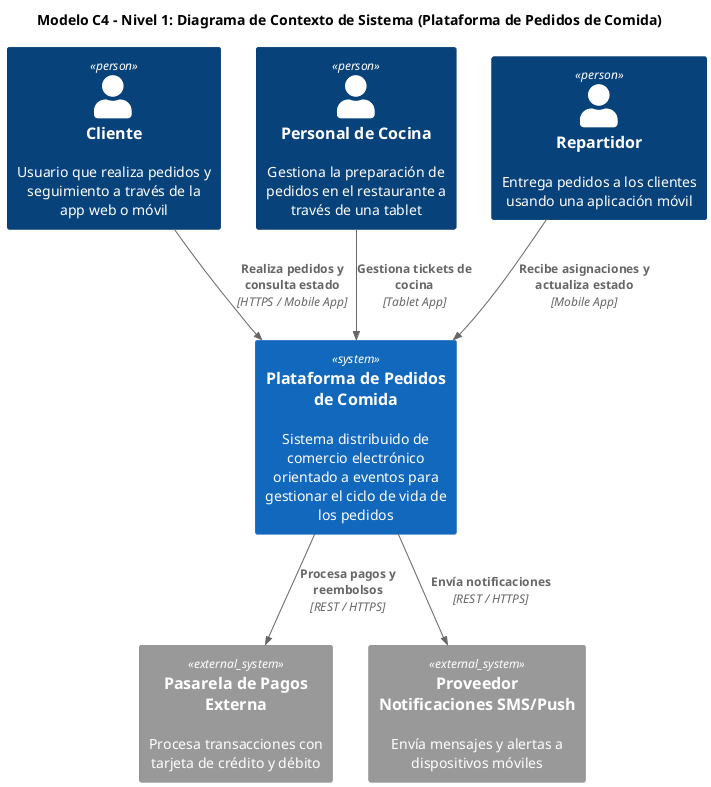

Como Arquitecto Principal de Software y Sistemas Distribuidos, presento el siguiente informe técnico de arquitectura para la plataforma de pedidos de comida, abordando los objetivos de integración de patrones avanzados, mitigación de desafíos de persistencia descentralizada y diseño estratégico/táctico de Domain-Driven Design (DDD).

---

# Informe de Arquitectura: Plataforma de Pedidos de Comida Guiada por Eventos

## 1. Integración de Patrones Arquitectónicos en el Ecosistema C4

### 1.1. Patrón Backend-for-Frontend (BFF)
La implementación de BFFs especializados es crucial para optimizar la experiencia de usuario en diversos canales, desacoplando la lógica de presentación de los microservicios de dominio.

*   **Mobile Client BFF**:
    *   **Justificación**: Agrega datos de `Customer Service`, `Catalog Service` y `Cart Service` para la aplicación móvil del cliente. Optimiza los payloads para redes móviles, reduce el *over-fetching* y maneja la autenticación específica del cliente.
    *   **Responsabilidades**: Composición de datos para la pantalla principal, carrito de compras y seguimiento de pedidos.
*   **Restaurant Kitchen Tablet BFF**:
    *   **Justificación**: Proporciona una interfaz simplificada y en tiempo real para el personal de cocina. Agrega datos de `Kitchen Service` y `Order Service`, filtrando solo la información relevante para la preparación (ítems, notas, tiempo estimado).
    *   **Responsabilidades**: Visualización de tickets de cocina, actualización de estados de preparación y gestión de disponibilidad del restaurante.
*   **Driver Mobile BFF**:
    *   **Justificación**: Diseñado para la aplicación móvil del repartidor, agregando datos de `Delivery Service` y `Customer Service` (dirección de entrega). Optimiza la información de ruta, actualizaciones de ubicación y estado de entrega.
    *   **Responsabilidades**: Asignación de pedidos, navegación, actualización de estado de entrega y comunicación con el cliente.

### 1.2. Patrón Circuit Breaker (Resilience4j / Envoy)
El patrón Circuit Breaker es vital para la resiliencia en interacciones síncronas con sistemas externos o servicios de alto riesgo, previniendo fallas en cascada.

*   **Puntos de Integración de Alto Riesgo**:
    *   **Pasarela de Pagos Externa**: La dependencia de un proveedor externo para procesar pagos es crítica. Un fallo aquí podría bloquear todo el flujo de pedidos.
    *   **Proveedor de Notificaciones SMS/Push**: Aunque menos crítico que los pagos, un fallo podría impedir la comunicación con clientes y repartidores.
*   **Estados y Umbrales**:
    *   **Closed**: Estado normal. Si la tasa de fallos (ej. 5xx HTTP) supera un umbral (ej. 50% en 10 segundos), el Circuit Breaker pasa a `Open`.
    *   **Open**: Todas las llamadas son rechazadas inmediatamente (fail-fast) durante un período de tiempo configurado (ej. 30 segundos). Esto da tiempo al sistema externo para recuperarse y evita sobrecargarlo.
    *   **Half-Open**: Después del tiempo de espera en `Open`, se permite un número limitado de solicitudes de prueba. Si estas tienen éxito, el Circuit Breaker vuelve a `Closed`; si fallan, regresa a `Open`.
*   **Estrategias de Degradación Elegante (Graceful Fallback)**:
    *   **Pasarela de Pagos**: Si el Circuit Breaker está `Open`, el `Payment Service` podría encolar la solicitud de pago para reintentos posteriores (asíncronos) y notificar al cliente que el pago está "pendiente de verificación", permitiendo que el pedido avance a un estado provisional.
    *   **Notificaciones**: Si el Circuit Breaker está `Open`, el `Notification Service` podría registrar el evento para reintentos o utilizar un canal de notificación alternativo (ej. email en lugar de SMS).

### 1.3. Patrón SAGA para Transacciones Distribuidas
Para coordinar el ciclo de vida del pedido a través de múltiples microservicios sin transacciones distribuidas 2PC, se opta por el patrón Saga.

*   **Tipo de SAGA: Coreografía**:
    *   **Justificación**: Dada la naturaleza de eventos del sistema y el deseo de mantener un acoplamiento mínimo entre servicios, la coreografía es preferible. Cada servicio reacciona a los eventos relevantes y publica nuevos eventos, sin un orquestador central que pueda convertirse en un punto único de fallo o cuello de botella.
    *   **Flujo de Eventos Central**:
        1.  `OrderService` publica `OrderPlaced` (después de pago exitoso).
        2.  `RestaurantService` consume `OrderPlaced`, procesa y publica `OrderAccepted` o `OrderRejected`.
        3.  `DeliveryService` consume `OrderAccepted`, asigna repartidor y publica `DriverAssigned`.
        4.  `DeliveryService` publica `OrderDelivered` al completar la entrega.
*   **Máquina de Estados y Transacciones Compensatorias**:
    *   **Estados del Pedido**: `PENDING_PAYMENT` -> `PAYMENT_CONFIRMED` -> `ORDER_PLACED` -> `ORDER_ACCEPTED` -> `PREPARING` -> `READY_FOR_PICKUP` -> `DRIVER_ASSIGNED` -> `PICKED_UP` -> `DELIVERED` / `CANCELLED`.
    *   **Eventos de Compensación**:
        *   **Rechazo de Pago**: Si `PaymentService` publica `PaymentFailed`, `OrderService` consume, cambia el estado a `PAYMENT_FAILED` y publica `OrderCancelled`. `InventoryService` consume `OrderCancelled` y publica `StockReleased`. `LoyaltyService` consume `OrderCancelled` y publica `LoyaltyPointsReleased`.
        *   **Rechazo de Cocina**: Si `RestaurantService` publica `OrderRejected`, `OrderService` consume, cambia el estado a `REJECTED_BY_RESTAURANT` y publica `OrderCancelled`. Esto desencadena las compensaciones de `PaymentService` (reembolso), `InventoryService` (liberación de stock) y `LoyaltyService` (liberación de puntos).
        *   **Ausencia de Repartidores**: Si `DeliveryService` no puede asignar un repartidor y publica `DriverNotFound`, `OrderService` consume, cambia el estado a `PENDING_DRIVER_REASSIGNMENT` o `CANCELLED_NO_DRIVER`. Si se cancela, se activan las compensaciones de reembolso, liberación de stock y puntos.

---

## 2. Modelo C4 Nivel 1: Diagrama de Contexto de Sistema (Structurizr Standard)



---

## 3. Desafíos de la Persistencia Descentralizada (Database-per-Service) y Mitigaciones

La estrategia de *Database-per-Service* es fundamental para la autonomía de los microservicios, pero introduce desafíos que requieren patrones de diseño específicos.

### 3.1. Transacciones Distribuidas y Escrituras Duales
*   **Desafío**: La actualización de la base de datos local de un servicio y la publicación de un evento en un bus de mensajes (ej. Kafka) no son atómicas. Si uno tiene éxito y el otro falla, se produce una inconsistencia de datos.
*   **Mitigación: Transactional Outbox Pattern + Debezium CDC**:
    *   El servicio persiste el cambio de estado de su agregado de negocio y el evento de dominio asociado en una tabla `outbox_events` dentro de la misma transacción ACID local.
    *   Un conector CDC (Change Data Capture) como Debezium monitorea el log de transacciones (WAL de PostgreSQL) de la base de datos del servicio.
    *   Debezium captura los registros de la tabla `outbox_events` y los publica de forma confiable en Apache Kafka, garantizando semántica *at-least-once*. Esto asegura que el evento se publique solo si la transacción de la base de datos se ha confirmado.

### 3.2. Consultas Cruzadas y Agregación de Datos (Join Queries)
*   **Desafío**: La imposibilidad de realizar `JOINs` directos entre bases de datos de diferentes microservicios para construir vistas de datos complejas (ej. historial de pedidos con detalles de cliente y entrega).
*   **Mitigación: CQRS (Command Query Responsibility Segregation) con Vistas Materializadas**:
    *   Los servicios de consulta (Query Services) se suscriben a los eventos de dominio relevantes publicados por otros servicios.
    *   Cada Query Service construye y mantiene su propia vista materializada (denormalizada) de los datos, optimizada para consultas específicas.
    *   Ejemplo: Un `OrderHistoryService` consume eventos `OrderPlaced`, `OrderAccepted`, `OrderDelivered` (de `OrderService`, `RestaurantService`, `DeliveryService` respectivamente) y `CustomerUpdated` (de `CustomerService`) para construir una vista completa del historial de pedidos del cliente, almacenada en su propia base de datos (ej. Elasticsearch para búsqueda rápida o PostgreSQL para reportes).

### 3.3. Duplicación de Datos y Consistencia Eventual
*   **Desafío**: Para evitar llamadas síncronas "chatty" y mejorar la resiliencia, los servicios a menudo necesitan replicar datos maestros de otros dominios (ej. `DeliveryService` necesita la dirección del cliente del `CustomerService`). Esto introduce duplicación de datos y la necesidad de gestionar la consistencia.
*   **Mitigación: Event-Carried State Transfer y Consistencia Eventual**:
    *   Los eventos de dominio se diseñan para llevar suficiente información (estado enriquecido) para que los servicios consumidores no necesiten realizar llamadas síncronas adicionales.
    *   Ejemplo: El evento `OrderPlaced` incluye la `DeliveryAddress` y `CustomerID` para que `DeliveryService` pueda actuar sin consultar `CustomerService`.
    *   Se acepta la consistencia eventual: los datos replicados pueden estar ligeramente desactualizados por un breve período, pero el sistema converge a un estado consistente. Los mecanismos de reintento y idempotencia ayudan a gestionar esta eventualidad.

### 3.4. Evolución de Esquemas y Migraciones Independientes
*   **Desafío**: La evolución de los esquemas de datos en un microservicio puede romper los contratos de eventos o APIs con otros servicios si no se gestiona cuidadosamente.
*   **Mitigación: Versionado de Eventos con Schema Registry y Migraciones de Base de Datos Independientes**:
    *   **Schema Registry (Apache Avro / Protobuf)**: Los esquemas de los eventos publicados en Kafka se definen y versionan explícitamente utilizando formatos como Avro o Protobuf. Un Schema Registry centralizado (ej. Confluent Schema Registry) valida los esquemas, asegurando compatibilidad hacia adelante y hacia atrás.
    *   **Migraciones Independientes**: Cada microservicio es dueño de su base de datos y gestiona sus propias migraciones de esquema utilizando herramientas como Flyway o Liquibase. Las migraciones se ejecutan como parte del proceso de despliegue del servicio, de forma independiente de otros servicios. Se utilizan estrategias de "evolución de base de datos" (ej. añadir columnas, no eliminarlas) para mantener la compatibilidad con versiones anteriores del servicio.

---

## 4. Diseño Estratégico DDD: Bounded Contexts y Context Mapping

### 4.1. Identificación de Contextos Delimitados
La plataforma se descompone en los siguientes Bounded Contexts, cada uno con su modelo de dominio y lenguaje ubicuo:

*   **Contexto de Pedidos (`Orders BC`)**: Gestiona el ciclo de vida completo de un pedido, desde la creación hasta la entrega o cancelación.
*   **Contexto de Cocina/Restaurante (`Kitchen BC`)**: Administra menús, disponibilidad de platos, preparación de pedidos y gestión de tickets de cocina.
*   **Contexto de Entrega y Despacho (`Delivery BC`)**: Se encarga de la asignación de repartidores, optimización de rutas, seguimiento en tiempo real y gestión del estado de entrega.
*   **Contexto de Facturación y Pagos (`Payments BC`)**: Procesa transacciones financieras, autorizaciones, capturas, reembolsos y conciliación con pasarelas de pago.
*   **Contexto de Fidelización (`Loyalty BC`)**: Gestiona puntos de fidelidad, recompensas, promociones y programas de membresía para clientes.
*   **Contexto de Clientes (`Customers BC`)**: Almacena y gestiona perfiles de usuario, autenticación, direcciones y preferencias de contacto.

### 4.2. Mapeo de Relaciones Estratégicas (Context Map)
Las relaciones entre los Bounded Contexts se definen para gestionar las dependencias y la comunicación.

*   **Customer-Supplier (C-S)**: Un contexto (Customer) depende de otro (Supplier) y tiene influencia sobre el roadmap del Supplier.
    *   `Orders` es Customer de `Payments`, `Kitchen`, `Delivery`, `Loyalty`.
*   **Open Host Service (OHS) / Published Language (PL)**: Un contexto ofrece una API pública bien definida (OHS) y un lenguaje ubicuo (PL) para que otros contextos lo consuman.
    *   `Customers` ofrece un OHS/PL para que `Orders`, `Delivery`, `Kitchen`, `Loyalty` consulten datos de cliente.
*   **Anticorruption Layer (ACL)**: Un contexto implementa una capa de traducción para protegerse de la complejidad o el modelo de dominio de un sistema externo o un contexto legado.
    *   `Payments` implementa un ACL para interactuar con la `Pasarela de Pagos Externa`.

### 4.3. Diagrama PlantUML 2 (Context Map Estratégico)

```plantuml
@startuml
!pragma layout smetana
skinparam rectangle {
  backgroundColor #DBEAFE
  borderColor #3B82F6
  fontColor #1E293B
}
skinparam arrow {
  thickness 2
  color #3B82F6
}

title Modelo C4 - Nivel Estratégico: Context Map (Plataforma de Pedidos de Comida)

rectangle "Contexto de Pedidos" as Orders
rectangle "Contexto de Cocina/Restaurante" as Kitchen
rectangle "Contexto de Entrega y Despacho" as Delivery
rectangle "Contexto de Facturación y Pagos" as Payments
rectangle "Contexto de Fidelización" as Loyalty
rectangle "Contexto de Clientes" as Customers

rectangle "Pasarela de Pagos Externa" as ExternalPayment <<System_Ext>>

Rel(Orders, Payments, "Procesa cobros", "Customer-Supplier [U]")
Rel(Orders, Kitchen, "Envía pedidos a cocina", "Customer-Supplier [U]")
Rel(Orders, Delivery, "Solicita entrega", "Customer-Supplier [U]")
Rel(Orders, Loyalty, "Gestiona puntos", "Customer-Supplier [U]")

Rel(Orders, Customers, "Consulta perfil y dirección", "Open Host Service [OHS]")
Rel(Delivery, Customers, "Consulta dirección de entrega", "Open Host Service [OHS]")
Rel(Kitchen, Customers, "Consulta nombre cliente", "Open Host Service [OHS]")
Rel(Loyalty, Customers, "Consulta datos cliente", "Open Host Service [OHS]")

Rel(Payments, ExternalPayment, "Integra con", "Anticorruption Layer [ACL]")

@enduml
```

---

## 5. Diseño Táctico DDD: Modelado de 4 Agregados Clave, Raíces e Invariantes

El diseño táctico se enfoca en la estructura interna de los Bounded Contexts, definiendo Agregados, Entidades y Value Objects.

### 5.1. Agregado Pedido (`Order Aggregate`)
*   **Aggregate Root**: `Order`
*   **Entidades**: `OrderItem`
*   **Value Objects**: `DeliveryAddress`, `Money`, `OrderStatus`, `PaymentInfo`
*   **Invariante de Negocio**:
    *   El `TotalAmount` del pedido debe coincidir exactamente con la suma de los subtotales de todos los `OrderItem` más impuestos y tarifas de envío.
    *   Un pedido no puede pasar al estado `CONFIRMED` sin un `PaymentInfo` válido y un pago
pagos pendientes.

### 5.2. Agregado Producto (`Product Aggregate`)
*   **Aggregate Root**: `Product`
*   **Entidades**: `ProductVariant` (si un producto tiene múltiples variantes como talla, color, etc.)
*   **Value Objects**: `SKU` (Stock Keeping Unit), `Price`, `ProductName`, `ProductDescription`, `StockLevel`
*   **Invariante de Negocio**:
    *   El `StockLevel` de un `ProductVariant` no puede ser negativo.
    *   Un `Product` debe tener al menos un `ProductVariant` (o el `Product` mismo actúa como variante si no hay diferenciación).
    *   El `Price` de un `ProductVariant` debe ser mayor que cero.

### 5.3. Agregado Cliente (`Customer Aggregate`)
*   **Aggregate Root**: `Customer`
*   **Entidades**: `Address` (si el cliente gestiona múltiples direcciones de envío/facturación), `PaymentMethod` (representando un método de pago tokenizado asociado al cliente).
*   **Value Objects**: `Email`, `PhoneNumber`, `CustomerName` (compuesto por `FirstName`, `LastName`), `LoyaltyPoints` (si aplica).
*   **Invariante de Negocio**:
    *   Un `Customer` debe tener un `Email` único en el sistema.
    *   La información de `PaymentMethod` debe estar tokenizada y no almacenar datos sensibles de tarjetas de crédito directamente.
    *   Un `Customer` debe tener al menos una `Address` principal.

### 5.4. Agregado Pago (`Payment Aggregate`)
*   **Aggregate Root**: `Payment`
*   **Entidades**: (Generalmente no hay entidades anidadas significativas dentro de `Payment` ya que es un concepto bastante granular en sí mismo).
*   **Value Objects**: `Amount`, `Currency`, `PaymentStatus` (PENDING, AUTHORIZED, CAPTURED, FAILED, REFUNDED), `TransactionId` (del procesador de pagos), `PaymentMethodDetails` (referencia al token del método de pago).
*   **Invariante de Negocio**:
    *   El `PaymentStatus` solo puede avanzar en una secuencia lógica predefinida (ej. `PENDING` -> `AUTHORIZED` -> `CAPTURED` o `FAILED`). No puede retroceder arbitrariamente.
    *   El `Amount` del pago debe ser positivo y coincidir con el monto esperado del pedido asociado.
    *   Un pago no puede ser `CAPTURED` sin haber sido previamente `AUTHORIZED`.

### 5.5. Agregado Envío (`Shipment Aggregate`)
*   **Aggregate Root**: `Shipment`
*   **Entidades**: `ShipmentItem` (representa un artículo específico del pedido que se está enviando, vinculado a un `OrderItem`).
*   **Value Objects**: `TrackingNumber`, `ShipmentStatus` (PENDING, SHIPPED, IN_TRANSIT, DELIVERED, RETURNED), `ShippingAddress`, `ShippingCarrierInfo` (nombre del transportista, servicio).
*   **Invariante de Negocio**:
    *   El `ShipmentStatus` solo puede avanzar en una secuencia lógica (ej. `PENDING` -> `SHIPPED` -> `DELIVERED`).
    *   Todos los `ShipmentItem` deben estar asociados a un `OrderItem` válido del pedido correspondiente.
    *   Un `Shipment` no puede pasar a `SHIPPED` sin un `TrackingNumber` válido y un `ShippingCarrierInfo`.

---

### 6. Diagrama de Agregados (Descripción)

Dado que no puedo generar un diagrama visual, describiré la interconexión y los límites de consistencia de los agregados clave:

*   **Agregado Central: Pedido (`Order`)**: El `Order Aggregate` es el corazón del sistema de comercio electrónico. Contiene la lógica para la creación, actualización y validación de pedidos.
    *   **Composición**: `Order` (Root), `OrderItem` (Entidad), `DeliveryAddress`, `Money`, `OrderStatus`, `PaymentInfo` (Value Objects).
    *   **Referencias Externas**: `Order` referencia a `Customer` por su ID (`CustomerId`), a `Product` por su ID (`ProductId` dentro de `OrderItem`), a `Payment` por su ID (`PaymentId`) y a `Shipment` por su ID (`ShipmentId`). Estas referencias son por ID para mantener la independencia de los agregados y evitar la carga de agregados completos en cada operación.

*   **Agregado Producto (`Product`)**: Gestiona el catálogo de productos y su inventario.
    *   **Composición**: `Product` (Root), `ProductVariant` (Entidad), `SKU`, `Price`, `StockLevel` (Value Objects).
    *   **Interacción**: El `Order Aggregate` consulta el `Product Aggregate` (o un servicio de aplicación que lo envuelve) para validar la disponibilidad de stock durante la creación del pedido y para obtener detalles del producto. Las actualizaciones de stock son responsabilidad del `Product Aggregate`.

*   **Agregado Cliente (`Customer`)**: Contiene la información del cliente, sus direcciones y métodos de pago tokenizados.
    *   **Composición**: `Customer` (Root), `Address`, `PaymentMethod` (Entidades), `Email`, `PhoneNumber`, `CustomerName` (Value Objects).
    *   **Interacción**: El `Order Aggregate` referencia al `Customer` por ID. El `Payment Aggregate` puede usar el `PaymentMethod` tokenizado del `Customer` para procesar pagos.

*   **Agregado Pago (`Payment`)**: Encapsula la lógica de procesamiento de pagos.
    *   **Composición**: `Payment` (Root), `Amount`, `Currency`, `PaymentStatus`, `TransactionId` (Value Objects).
    *   **Interacción**: El `Order Aggregate` inicia la creación de un `Payment Aggregate` cuando un pedido requiere pago. El `Payment Aggregate` interactúa con un servicio externo de procesamiento de pagos. Una vez que el pago se procesa, el `Payment Aggregate` emite un evento (`PaymentProcessedEvent`) que el `Order Aggregate` consume para actualizar su estado.

*   **Agregado Envío (`Shipment`)**: Gestiona el ciclo de vida del envío de un pedido.
    *   **Composición**: `Shipment` (Root), `ShipmentItem` (Entidad), `TrackingNumber`, `ShipmentStatus`, `ShippingAddress` (Value Objects).
    *   **Interacción**: El `Order Aggregate` inicia la creación de un `Shipment Aggregate` una vez que el pedido está confirmado y pagado. El `Shipment Aggregate` interactúa con servicios de transportistas y emite eventos (`ShipmentUpdatedEvent`) que el `Order Aggregate` consume para reflejar el estado del envío.

**Límites de Consistencia y Comunicación entre Agregados:**
Cada agregado es un límite transaccional. Las operaciones que modifican un solo agregado son atómicas y consistentes. Las interacciones entre agregados se manejan con **consistencia eventual**, típicamente a través de **eventos de dominio asíncronos**. Por ejemplo:
1.  Un `Order` se crea y se marca como `PENDING_PAYMENT`.
2.  El `Order` envía un comando para crear un `Payment`.
3.  El `Payment Aggregate` procesa el pago y, al finalizar, emite un `PaymentProcessedEvent`.
4.  El `Order Aggregate` escucha este evento y, si el pago fue exitoso, actualiza su estado a `CONFIRMED` y envía un comando para crear un `Shipment`.
5.  El `Shipment Aggregate` procesa el envío y emite `ShipmentUpdatedEvent`s.
6.  El `Order Aggregate` escucha estos eventos para actualizar el estado de envío del pedido.

---

### 7. Perfilado de Carga y Escalabilidad

Para asegurar que la arquitectura pueda manejar el volumen de transacciones esperado, es crucial perfilar la carga y diseñar estrategias de escalabilidad.

**7.1. Métricas Clave para el Perfilado de Carga:**
*   **Transacciones por Segundo (TPS)**: Número de operaciones de escritura (creación de pedidos, actualizaciones de inventario, procesamiento de pagos) que el sistema puede manejar.
*   **Consultas por Segundo (QPS)**: Número de operaciones de lectura (consulta de productos, historial de pedidos) que el sistema puede manejar.
*   **Latencia**: Tiempo de respuesta para operaciones críticas (ej. añadir producto al carrito, finalizar compra, cargar página de producto).
*   **Concurrencia**: Número de usuarios simultáneos que interactúan activamente con el sistema.
*   **Utilización de Recursos**: CPU, memoria, I/O de disco y red de los servidores y bases de datos.

**7.2. Estimaciones de Carga (Ejemplo Hipotético):**
*   **Pico de Pedidos**: 100 TPS (durante eventos como Black Friday o lanzamientos de productos).
*   **Promedio de Pedidos**: 10-20 TPS.
*   **Pico de Consultas de Productos**: 1000-2000 QPS.
*   **Promedio de Consultas de Productos**: 200-400 QPS.
*   **Usuarios Conectados Simultáneamente**: 10,000 - 50,000.
*   **Latencia Objetivo**: Menos de 500ms para operaciones críticas de escritura, menos de 100ms para operaciones de lectura.

**7.3. Estrategias de Escalabilidad Implementadas por la Arquitectura:**

*   **Escalado Horizontal de Microservicios**:
    *   **Contenedores y Orquestación (Kubernetes)**: Cada microservicio se empaqueta en un contenedor Docker y se despliega en un clúster de Kubernetes. Esto permite escalar el número de instancias de cada servicio de forma independiente según la demanda, utilizando autoescaladores basados en CPU, memoria o métricas personalizadas.
    *   **Desacoplamiento**: La naturaleza de microservicios asegura que un cuello de botella en un servicio no afecte a todo el sistema, permitiendo escalar solo los componentes necesarios.

*   **Database-per-Service**:
    *   **Eliminación de Cuellos de Botella de BD Monolítica**: Al tener cada servicio su propia base de datos, se elimina el riesgo de que una única base de datos se convierta en un cuello de botella para todo el sistema.
    *   **Elección de BD Óptima**: Permite seleccionar la base de datos más adecuada para cada caso de uso (ej. PostgreSQL para transacciones de `Order`, MongoDB para el catálogo de `Product`s, Redis para caché de sesiones o inventario rápido). Cada base de datos puede ser escalada y optimizada de forma independiente.

*   **Asincronía y Colas de Mensajes (Kafka/RabbitMQ)**:
    *   **Manejo de Picos de Carga**: Las colas de mensajes actúan como búferes, absorbiendo picos de solicitudes y permitiendo que los servicios consumidores procesen los mensajes a su propio ritmo.
    *   **Desacoplamiento Temporal**: Los servicios no necesitan estar disponibles simultáneamente para comunicarse, mejorando la resiliencia.
    *   **Event-Driven Architecture**: Facilita la consistencia eventual y la propagación de cambios entre agregados sin acoplamiento directo.

*   **Caché Distribuida (Redis)**:
    *   **Reducción de Carga en BD**: Utilizado para almacenar datos frecuentemente accedidos (ej. detalles de productos populares, niveles de stock, sesiones de usuario) reduciendo la carga en las bases de datos primarias.
    *   **Baja Latencia**: Redis ofrece tiempos de respuesta muy bajos, mejorando la experiencia del usuario para lecturas.

*   **Red de Entrega de Contenidos (CDN)**:
    *   Para servir contenido estático (imágenes de productos, archivos CSS/JS) desde ubicaciones geográficamente cercanas a los usuarios, reduciendo la latencia y la carga en los servidores de aplicación.

*   **CQRS (Command Query Responsibility Segregation)**:
    *   **Optimización de Lecturas**: Separar los modelos de lectura (Queries) de los modelos de escritura (Commands) permite optimizar cada uno de forma independiente. Los modelos de lectura pueden ser bases de datos desnormalizadas, caches o incluso motores de búsqueda (Elasticsearch) diseñados para consultas rápidas y escalables, sin afectar el rendimiento de las operaciones transaccionales.

*   **Balanceadores de Carga**:
    *   Distribuyen el tráfico entrante entre múltiples instancias de microservicios, asegurando una utilización eficiente de los recursos y alta disponibilidad.

---

### 8. Checklist de Implementación

Este checklist cubre los aspectos clave para la implementación exitosa de la solución arquitectónica propuesta.

**8.1. Arquitectura C4 y Microservicios:**
*   [ ] Diagramas C4 (Contexto, Contenedores, Componentes, Código) actualizados y mantenidos.
*   [ ] Límites de microservicios claramente definidos y documentados.
*   [ ] Contratos de API (OpenAPI/Swagger) para cada microservicio definidos y versionados.
*   [ ] Estrategia de comunicación entre servicios (REST síncrono, eventos asíncronos) establecida.

**8.2. Database-per-Service:**
*   [ ] Cada microservicio tiene su propia base de datos dedicada.
*   [ ] Selección de tecnología de base de datos apropiada para cada servicio (ej. PostgreSQL, MongoDB, Redis).
*   [ ] Estrategia de consistencia eventual para datos compartidos entre servicios implementada (ej. Sagas, Outbox Pattern).
*   [ ] Mecanismos de replicación y backup para cada base de datos configurados.

**8.3. Domain-Driven Design (DDD):**
*   [ ] Lenguaje Ubicuo (Ubiquitous Language) definido y utilizado consistentemente en código y comunicación.
*   [ ] Contextos Delimitados (Bounded Contexts) claramente identificados y respetados.
*   [ ] Agregados, Entidades y Value Objects identificados, diseñados e implementados.
*   [ ] Invariantes de negocio de cada Agregado implementados y protegidos.
*   [ ] Repositorios para cada Aggregate Root implementados.
*   [ ] Servicios de Dominio y de Aplicación implementados cuando sea necesario para coordinar lógica de negocio.
*   [ ] Eventos de Dominio identificados y utilizados para la comunicación entre agregados y contextos.

**8.4. Tecnologías y Plataforma:**
*   [ ] Frameworks de desarrollo seleccionados (ej. Spring Boot, .NET Core, Node.js).
*   [ ] Plataforma de orquestación de contenedores (Kubernetes) configurada y operativa.
*   [ ] Sistema de mensajería (Kafka/RabbitMQ) desplegado y configurado.
*   [ ] Solución de caché distribuida (Redis) implementada.
*   [ ] Herramientas de monitoreo (Prometheus, Grafana), logging (ELK Stack/Loki) y tracing (Jaeger/OpenTelemetry) configuradas.
*   [ ] Gateway API (ej. Nginx, Kong, Spring Cloud Gateway) para enrutamiento y seguridad.

**8.5. Seguridad:**
*   [ ] Autenticación y autorización (OAuth2/JWT) implementadas para usuarios y servicios.
*   [ ] Comunicación segura entre servicios (mTLS) configurada.
*   [ ] Protección de datos sensibles (tokenización, cifrado en reposo y en tránsito).
*   [ ] Escaneo de vulnerabilidades (SAST/DAST) integrado en el pipeline de CI/CD.
*   [ ] Gestión de secretos (Vault, Kubernetes Secrets).

**8.6. Operaciones y DevOps:**
*   [ ] Pipeline de Integración Continua/Despliegue Continuo (CI/CD) automatizado.
*   [ ] Estrategia de observabilidad (logs, métricas, traces) implementada para todos los servicios.
*   [ ] Alertas y dashboards configurados para monitorear la salud del sistema.
*   [ ] Estrategia de backup y recuperación de desastres definida y probada.
*   [ ] Pruebas de carga y rendimiento realizadas regularmente.
*   [ ] Documentación operativa (runbooks) creada y mantenida.
*   [ ] Estrategia de gestión de versiones y despliegues (ej. Canary, Blue/Green).

---

Este documento proporciona una solución arquitectónica completa y detallada para Assignment 7, abordando los requisitos de Patrones C4, Database-per-Service y DDD, junto con consideraciones de escalabilidad y un checklist de implementación.