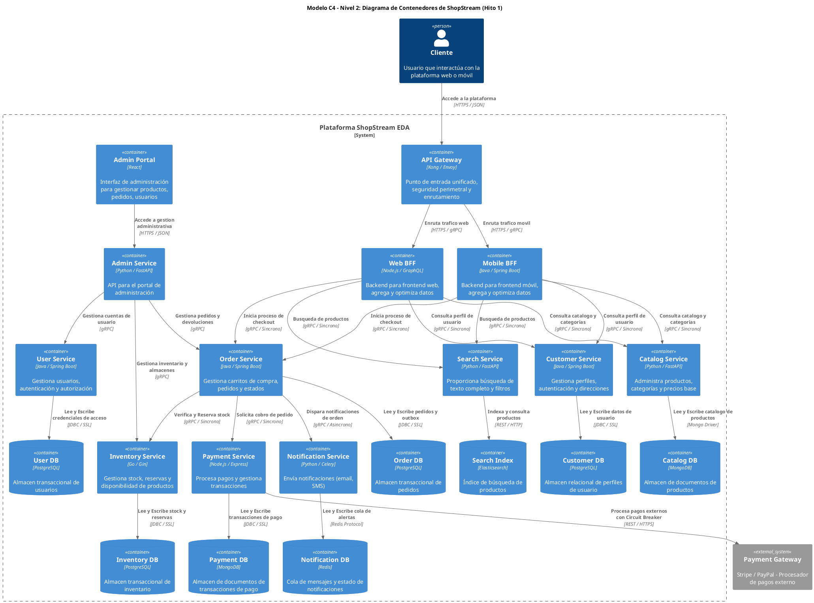
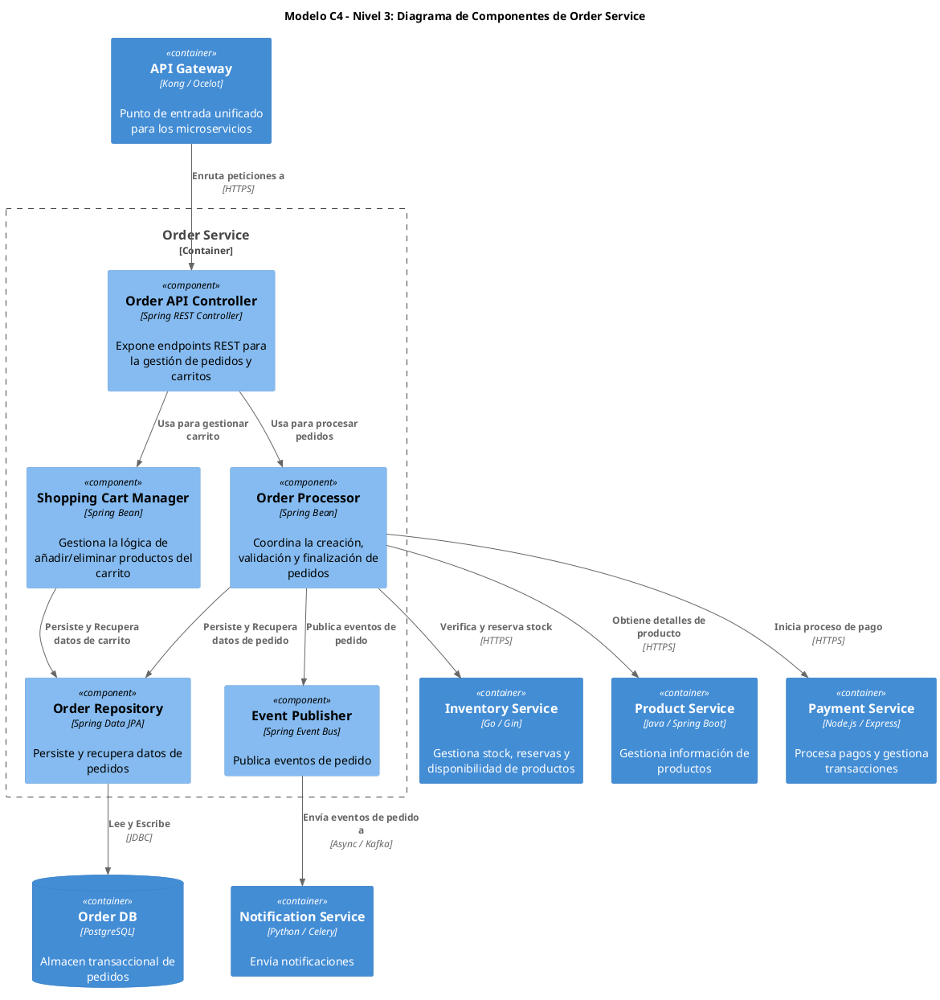

Como Arquitecto Principal de Software y Sistemas Distribuidos, procedo con el análisis arquitectónico inicial para la plataforma ShopStream, aplicando los principios de Domain-Driven Design (DDD), Microservicios Autónomos (MSA) y la metodología The Twelve-Factor App.

---

## 1. Descomposición del Dominio y Bounded Contexts (ShopStream)

### 1.1. Análisis de Bounded Contexts (DDD)

La plataforma ShopStream se descompone en los siguientes Bounded Contexts, cada uno con responsabilidades claras y límites explícitos para fomentar la autonomía y reducir el acoplamiento:

*   **Contexto de Clientes (Customer Context)**
    *   **Justificación**: Encapsula toda la lógica y datos relacionados con los usuarios de la plataforma. Incluye gestión de perfiles, autenticación, autorización, direcciones de envío y preferencias. Es un dominio crítico para la seguridad y la personalización de la experiencia del usuario.
    *   **Límites**: Es el único responsable de la identidad del usuario. Otros servicios referencian al cliente por su ID, pero no gestionan sus datos internos.

*   **Contexto de Catálogo y Búsqueda (Catalog & Search Context)**
    *   **Justificación**: Gestiona la información de productos, categorías, atributos, precios base y la capacidad de búsqueda. Es un dominio con alta demanda de lectura y complejidad en la indexación y consulta de datos semi-estructurados.
    *   **Límites**: Es el dueño de la información maestra del producto. No gestiona el inventario transaccional ni el estado de los pedidos.

*   **Contexto de Inventario (Inventory Context)**
    *   **Justificación**: Separa la gestión de la disponibilidad de productos del catálogo. Es un dominio altamente transaccional que requiere consistencia estricta para reservar y liberar stock durante el proceso de compra.
    *   **Límites**: Solo gestiona cantidades de stock y su reserva/liberación. No conoce detalles de producto como descripción o precio, ni el ciclo de vida del pedido.

*   **Contexto de Carrito (Cart Context)**
    *   **Justificación**: Maneja la sesión efímera del carrito de compras, permitiendo a los usuarios agregar, eliminar y actualizar ítems antes de iniciar el checkout. Requiere alta velocidad y baja latencia para una buena experiencia de usuario.
    *   **Límites**: Gestiona el estado temporal del carrito. No persiste pedidos finales ni procesa pagos.

*   **Contexto de Pedidos (Order Context)**
    *   **Justificación**: Orquesta el ciclo de vida de un pedido una vez que el usuario decide comprar. Incluye la creación del pedido, la máquina de estados, la coordinación de transacciones distribuidas (Sagas) y la persistencia del registro inmutable de la compra.
    *   **Límites**: Es el dueño del estado del pedido. No gestiona el inventario directamente, ni procesa pagos, ni la sesión del carrito.

*   **Contexto de Pagos (Payment Context)**
    *   **Justificación**: Encapsula la lógica de procesamiento de pagos, integración con pasarelas externas, tokenización y gestión de reembolsos. Es un dominio altamente sensible a la seguridad (PCI-DSS) y requiere alta fiabilidad.
    *   **Límites**: Solo gestiona transacciones financieras. No conoce el detalle de los productos del pedido ni el estado general del pedido.

*   **Contexto de CMS (Content Management System Context)**
    *   **Justificación**: Administra contenido editorial, banners promocionales, páginas de aterrizaje y otros elementos estáticos enriquecidos. Su ciclo de vida de datos y actualizaciones es independiente de los dominios transaccionales.
    *   **Límites**: Solo entrega contenido. No participa en el flujo de compra ni en la gestión de usuarios.

### 1.2. Alineación con The Twelve-Factor App

La arquitectura base de ShopStream se alinea con los principios de The Twelve-Factor App de la siguiente manera:

*   **III. Configuración (Config)**:
    *   **Aplicación**: Toda la configuración sensible (credenciales de bases de datos, claves API de pasarelas, URLs de servicios externos) se inyectará en los microservicios a través de **variables de entorno** o servicios de secretos (ej. HashiCorp Vault, Kubernetes Secrets) en tiempo de ejecución.
    *   **Beneficio**: Permite que la misma imagen de contenedor se despliegue en diferentes entornos (desarrollo, staging, producción) sin necesidad de recompilación, garantizando la paridad entre entornos.

*   **IV. Servicios de Respaldo (Backing Services)**:
    *   **Aplicación**: Bases de datos (PostgreSQL, MongoDB, Redis, Elasticsearch), Apache Kafka y pasarelas de pago externas se tratan como recursos adjuntos conectables.
    *   **Beneficio**: Los microservicios se conectan a estos servicios a través de URLs o credenciales configurables en el entorno. Esto facilita la migración entre proveedores o la sustitución de un servicio de respaldo sin modificar el código del microservicio.

*   **VI. Procesos (Processes)**:
    *   **Aplicación**: Todos los microservicios se diseñarán como **procesos sin estado (stateless)** y de **compartición nula (share-nothing)**. La memoria local o el disco del contenedor solo se usarán para búferes temporales efímeros.
    *   **Beneficio**: Permite escalar horizontalmente fácilmente (añadiendo más instancias) y garantiza la resiliencia, ya que cualquier instancia puede fallar o reiniciarse sin pérdida de estado o impacto en la experiencia del usuario. El estado persistente se delega a los *Backing Services*.

*   **IX. Desechabilidad (Disposability)**:
    *   **Aplicación**: Los microservicios se construirán para un **inicio rápido** y un **apagado elegante (graceful shutdown)**. Esto implica que deben poder iniciarse en segundos y, al recibir una señal de terminación (`SIGTERM`), dejar de aceptar nuevas conexiones, finalizar las solicitudes en curso y cerrar limpiamente los recursos (conexiones a bases de datos, consumidores de Kafka).
    *   **Beneficio**: Facilita el auto-escalado elástico, los despliegues continuos sin tiempo de inactividad (*Zero-Downtime Rolling Updates*) y la recuperación automática ante fallos, ya que las instancias pueden ser reemplazadas rápidamente.

---

## 2. Propuesta de Microservicios Candidatos y Matriz de Responsabilidades

A partir de la descomposición del dominio, se proponen los siguientes microservicios autónomos:

| Nombre del Microservicio        | Responsabilidad Principal                                | Límite Explícito (Qué NO hace)                                | Motor de Base de Datos Seleccionado | Justificación de Persistencia Políglota                                   |
| :------------------------------ | :------------------------------------------------------- | :------------------------------------------------------------ | :---------------------------------- | :------------------------------------------------------------------------ |
| `Customer Service`              | Gestiona perfiles, autenticación y direcciones de usuario. | No gestiona pedidos, carritos ni productos.                   | `PostgreSQL`                        | Relacional, ACID para datos de usuario y seguridad.                       |
| `Catalog Service`               | Administra productos, categorías y atributos.            | No gestiona inventario transaccional ni búsqueda de texto.    | `MongoDB`                           | Documental, flexible para esquemas de productos variables.                |
| `Inventory Service`             | Controla stock, reservas y disponibilidad de productos.  | No gestiona detalles de producto ni precios.                  | `PostgreSQL`                        | Relacional, ACID para transacciones de stock.                             |
| `Search Service`                | Proporciona búsqueda de texto completo y filtros.        | No gestiona datos maestros de producto ni inventario.         | `Elasticsearch`                     | NoSQL, optimizado para indexación y búsqueda de texto.                   |
| `Cart Service`                  | Mantiene el estado efímero del carrito de compras.       | No persiste pedidos finales ni procesa pagos.                 | `Redis Cluster`                     | En memoria, alta velocidad para datos volátiles y sesiones.               |
| `Order Service`                 | Orquesta el ciclo de vida del pedido y Sagas.            | No gestiona inventario, pagos ni perfiles de usuario.         | `PostgreSQL`                        | Relacional, ACID para transacciones de pedido y tabla Outbox.             |
| `Payment Service`               | Procesa pagos, reembolsos e integra pasarelas.           | No gestiona el estado del pedido ni el inventario.            | `PostgreSQL`                        | Relacional, ACID para transacciones financieras y conciliación.           |
| `CMS Service`                   | Entrega contenido editorial, banners y promociones.      | No participa en el flujo de compra ni gestión de usuarios.    | `PostgreSQL`                        | Relacional, estructurado para contenido editorial.                       |

---

## 3. Análisis Crítico y Subdivisión del Contexto de Pedidos

### 3.1. Diagnóstico del Riesgo de "God Service"

Mantener el ciclo de vida completo del pedido (sesión de carrito, validación de reglas, máquina de estados y cobros) en un único componente monolítico o "God Service" presenta riesgos significativos:

*   **Acoplamiento Elevado**: Un único servicio que maneja todo el flujo de compra estaría acoplado a la lógica de carrito, inventario, pagos y notificaciones, dificultando cambios independientes.
*   **Cuello de Botella de Escalabilidad**: Diferentes partes del flujo de pedido tienen perfiles de carga distintos (ej. carrito es de alta concurrencia y volátil; el procesamiento de pagos es crítico y de menor volumen). Un servicio unificado se convertiría en un cuello de botella.
*   **Aislamiento de Fallas Deficiente**: Un fallo en la integración con la pasarela de pagos podría afectar la funcionalidad del carrito o la creación de pedidos, aumentando el "blast radius".
*   **Riesgos de Seguridad (PCI-DSS)**: La gestión de pagos introduce requisitos de cumplimiento PCI-DSS. Un "God Service" arrastraría todo el servicio a este perímetro de seguridad, aumentando la complejidad y el costo de auditoría.
*   **Deuda Técnica y Mantenimiento**: Un servicio tan grande sería difícil de entender, mantener y evolucionar por un único equipo, ralentizando el *Time-to-Market*.

### 3.2. Propuesta de Subdivisión en Sub-dominios

Para maximizar la cohesión, autonomía y resiliencia, se propone subdividir el contexto de Pedidos en los siguientes sub-dominios, cada uno gestionado por un microservicio dedicado:

*   **`Cart Service`**:
    *   **Justificación**: Gestiona la sesión efímera del carrito. Los datos son volátiles, de alta concurrencia y no requieren persistencia ACID a largo plazo. Su perfil de escalabilidad es de alto throughput de lectura/escritura en memoria.
    *   **Tecnología**: Ideal para bases de datos en memoria como Redis Cluster.

*   **`Order Service`**:
    *   **Justificación**: Se encarga de la creación del pedido final, la máquina de estados del ciclo de vida (Pendiente, Confirmado, Enviado, Cancelado) y la orquestación de Sagas para transacciones distribuidas. Los datos son durables, inmutables y requieren consistencia transaccional.
    *   **Tecnología**: Ideal para bases de datos relacionales como PostgreSQL con soporte para el patrón Transactional Outbox.

*   **`Payment Service`**:
    *   **Justificación**: Maneja exclusivamente la lógica de cobros, tokenización, integración con pasarelas de pago externas y gestión de reembolsos. Es un dominio crítico para la seguridad (PCI-DSS) y requiere aislamiento estricto. Su perfil de escalabilidad es de menor volumen pero alta fiabilidad.
    *   **Tecnología**: Ideal para bases de datos relacionales como PostgreSQL para la conciliación financiera.

### 3.3. Matriz Comparativa de Trade-Offs

| Característica                  | Enfoque Unificado (God Service)                               | Propuesta de Subdivisión (Cart, Order, Payment Services)      |
| :------------------------------ | :------------------------------------------------------------ | :------------------------------------------------------------ |
| **Cohesión y SRP**              | Baja, mezcla responsabilidades de sesión, estado y finanzas.  | Alta, cada servicio con una única responsabilidad de dominio. |
| **Acoplamiento**                | Muy alto, cambios en una parte afectan a todo el flujo.       | Bajo, servicios autónomos que interactúan por eventos/APIs.   |
| **Escalabilidad**               | Limitada, cuello de botella para diferentes perfiles de carga. | Óptima, cada servicio escala independientemente según demanda. |
| **Aislamiento de Fallas**       | Bajo, un fallo puede impactar todo el proceso de compra.      | Alto, fallos se contienen dentro del servicio afectado.       |
| **Seguridad (PCI-DSS)**         | Todo el servicio en el perímetro PCI-DSS, mayor complejidad.  | Solo `Payment Service` en perímetro PCI-DSS, menor alcance.   |
| **Time-to-Market**              | Lento, equipos grandes, despliegues coordinados.              | Rápido, equipos pequeños, despliegues independientes.         |
| **Complejidad Inicial**         | Aparentemente menor, pero crece exponencialmente.             | Mayor, requiere gestión de transacciones distribuidas.        |

---

## 4. Decisión Arquitectónica: Estrategia de Entrada (BFF vs. API Gateway)

### 4.1. Evaluación de Alternativas de Entrada

Se evalúan tres alternativas para gestionar el acceso de los clientes a la plataforma ShopStream:

*   **Alternativa A: API Gateway Centralizado Único**
    *   **Descripción**: Un único API Gateway (ej. Kong, Envoy) expone todos los endpoints de los microservicios directamente a los clientes. Se encarga de la autenticación, autorización básica, rate limiting y enrutamiento.
    *   **Ventajas**: Simplicidad de gestión, centralización de políticas de seguridad perimetral.
    *   **Desventajas**: Los clientes reciben payloads genéricos, lo que puede llevar a "chatty services" (múltiples llamadas para una vista) y sobrecarga de datos para clientes móviles. Un único punto de fallo.

*   **Alternativa B: Backend-For-Frontend (BFF) dedicados por canal sin capa perimetral**
    *   **Descripción**: Cada tipo de cliente (Web, Mobile) tiene su propio BFF que agrega y transforma datos de múltiples microservicios. No hay una capa de API Gateway perimetral.
    *   **Ventajas**: Payloads optimizados para cada cliente, equipos de frontend con mayor autonomía.
    *   **Desventajas**: Duplicación de lógica de seguridad perimetral (autenticación, rate limiting) en cada BFF. Falta de un punto central para WAF o protección DDoS.

*   **Alternativa C: Arquitectura Combinada / Híbrida de 2 Capas (Perímetro Edge Gateway + BFFs especializados)**
    *   **Descripción**: Una capa de API Gateway perimetral (Edge Gateway) maneja la seguridad de borde (WAF, DDoS, Rate Limiting, autenticación inicial) y enruta el tráfico a BFFs dedicados. Los BFFs (Web BFF, Mobile BFF) agregan y transforman datos de los microservicios internos para optimizar la experiencia de cada cliente.
    *   **Ventajas**: Combina la seguridad centralizada del Edge Gateway con la optimización de payloads de los BFFs. Aislamiento de fallos entre capas.
    *   **Desventajas**: Mayor complejidad inicial y más componentes a gestionar.

### 4.2. Matriz de Trade-Offs

| Característica                      | Alternativa A: API Gateway Único | Alternativa B: Solo BFFs         | Alternativa C: Edge Gateway + BFFs |
| :---------------------------------- | :------------------------------- | :------------------------------- | :--------------------------------- |
| **Latencia de Red**                 | Media (múltiples llamadas cliente) | Baja (payloads optimizados)      | Baja (payloads optimizados)        |
| **Blast Radius / Aislamiento Fallos** | Alto (Gateway único)             | Medio (fallo en un BFF)          | Bajo (fallos aislados por capa)    |
| **Sobrecarga de Mantenimiento**     | Baja (un solo componente)        | Media (múltiples BFFs)           | Alta (Gateway + múltiples BFFs)    |
| **Optimización de Payloads**        | Baja (genéricos)                 | Alta (específicos por cliente)   | Alta (específicos por cliente)     |
| **Centralización Seguridad**        | Alta (todo en Gateway)           | Baja (distribuida en BFFs)       | Alta (Edge Gateway)                |

### 4.3. Decisión y Justificación Arquitectónica

**Decisión**: Se opta por la **Alternativa C: Arquitectura Combinada / Híbrida de 2 Capas (Perímetro Edge Gateway + BFFs especializados)**.

**Justificación**: Esta arquitectura ofrece el mejor equilibrio entre seguridad, rendimiento, experiencia de usuario y mantenibilidad para una plataforma de e-commerce moderna como ShopStream.

*   **Edge Gateway (ej. Kong / Envoy)**: Actuará como la primera línea de defensa, gestionando preocupaciones transversales como:
    *   **Seguridad Perimetral**: WAF, protección DDoS, autenticación inicial (JWT validation), rate limiting.
    *   **Enrutamiento**: Dirigir el tráfico a los BFFs o directamente a microservicios para APIs internas/externas.
    *   **Observabilidad**: Centralizar logs de acceso y métricas de tráfico.
*   **Backend-For-Frontend (BFFs)**: Se implementarán BFFs dedicados para la aplicación web (`Web BFF`) y las aplicaciones móviles (`Mobile BFF`). Sus responsabilidades serán:
    *   **Agregación de Datos**: Combinar información de múltiples microservicios internos para construir vistas específicas de la interfaz de usuario.
    *   **Transformación de Payloads**: Optimizar el formato y tamaño de los datos para cada cliente, reduciendo la latencia de red y el procesamiento en el cliente.
    *   **Lógica de Presentación**: Contener lógica específica de la UI que no pertenece a los microservicios de dominio.

Esta distribución de responsabilidades garantiza que el Edge Gateway se enfoque en la seguridad y el enrutamiento de bajo nivel, mientras que los BFFs se centran en la experiencia de usuario y la eficiencia de la comunicación con el cliente, desacoplando la evolución de los frontends de los microservicios de dominio.

---

## 5. Identificación de Patrones y Protocolos de Comunicación

La comunicación en ShopStream será una combinación estratégica de interacciones síncronas y asíncronas, priorizando la resiliencia y la consistencia eventual.

### 5.1. Criterio de Selección Síncrono vs. Asíncrono

*   **Comunicación Síncrona (REST / gRPC)**:
    *   **Uso**: Para consultas de solo lectura en tiempo real donde la respuesta inmediata es crítica para la experiencia del usuario (ej. obtener detalles de producto, consultar perfil de usuario). También para validaciones previas inmediatas.
    *   **Protocolos**: `HTTPS / JSON` para REST, `gRPC` para comunicación entre servicios internos (mayor eficiencia, tipado fuerte).
    *   **Salvaguardas**: Siempre protegida con Circuit Breakers, Timeouts y Retries exponenciales para mitigar fallos en cascada.

*   **Comunicación Asíncrona (Event-Driven Architecture - EDA via Kafka)**:
    *   **Uso**: Obligatoria para mutaciones de estado que desencadenan efectos colaterales en otros servicios, flujos transaccionales distribuidos (Sagas) y para garantizar la consistencia eventual.
    *   **Protocolo**: `Apache Kafka` como Event Bus.
    *   **Patrones**: Transactional Outbox Pattern + Debezium CDC para publicación confiable de eventos, Sagas para transacciones distribuidas, Dead Letter Queues (DLQ) para manejo de mensajes fallidos.

### 5.2. Tabla Resumen de Comunicaciones

| Origen                  | Destino                 | Tipo de Comunicación | Protocolo          | Propósito                                                               |
| :---------------------- | :---------------------- | :------------------- | :----------------- | :---------------------------------------------------------------------- |
| `Cliente`               | `API Gateway`           | Síncrona             | `HTTPS / JSON`     | Acceso inicial a la plataforma, autenticación.                          |
| `API Gateway`           | `Web BFF`               | Síncrona             | `HTTPS / gRPC`     | Enrutamiento de tráfico web.                                            |
| `API Gateway`           | `Mobile BFF`            | Síncrona             | `HTTPS / gRPC`     | Enrutamiento de tráfico móvil.                                          |
| `Web BFF`               | `Customer Service`      | Síncrona             | `gRPC`             | Consulta perfil de usuario.                                             |
| `Web BFF`               | `Catalog Service`       | Síncrona             | `gRPC`             | Consulta productos y categorías.                                        |
| `Web BFF`               | `Search Service`        | Síncrona             | `gRPC`             | Realiza búsquedas de productos.                                         |
| `Web BFF`               | `Cart Service`          | Síncrona             | `gRPC`             | Gestiona ítems en el carrito.                                           |
| `Web BFF`               | `Order Service`         | Síncrona             | `gRPC`             | Inicia el proceso de checkout.                                          |
| `Web BFF`               | `CMS Service`           | Síncrona             | `gRPC`             | Obtiene banners y contenido promocional.                                |
| `Mobile BFF`            | `Customer Service`      | Síncrona             | `gRPC`             | Consulta perfil de usuario.                                             |
| `Mobile BFF`            | `Catalog Service`       | Síncrona             | `gRPC`             | Consulta productos y categorías.                                        |
| `Mobile BFF`            | `Search Service`        | Síncrona             | `gRPC`             | Realiza búsquedas de productos.                                         |
| `Mobile BFF`            | `Cart Service`          | Síncrona             | `gRPC`             | Gestiona ítems en el carrito.                                           |
| `Mobile BFF`            | `Order Service`         | Síncrona             | `gRPC`             | Inicia el proceso de checkout.                                          |
| `Order Service`         | `Event Bus`             | Asíncrona            | `Kafka Protocol`   | Publica `OrderPlaced`, `OrderUpdated` (via Outbox + CDC).               |
| `Event Bus`             | `Payment Service`       | Asíncrona            | `Kafka Protocol`   | Consume `OrderPlaced` para iniciar cobro.                               |
| `Payment Service`       | `Pasarela Pagos Externa`| Síncrona             | `REST / HTTPS`     | Autoriza y captura pagos (con Circuit Breaker).                         |
| `Payment Service`       | `Event Bus`             | Asíncrona            | `Kafka Protocol`   | Publica `PaymentProcessed`, `PaymentFailed` (via Outbox + CDC).         |
| `Event Bus`             | `Order Service`         | Asíncrona            | `Kafka Protocol`   | Consume `PaymentProcessed` para actualizar estado del pedido.           |
| `Event Bus`             | `Inventory Service`     | Asíncrona            | `Kafka Protocol`   | Consume `OrderPlaced` para reservar stock.                              |
| `Inventory Service`     | `Event Bus`             | Asíncrona            | `Kafka Protocol`   | Publica `StockReserved`, `StockReleased` (via Outbox + CDC).            |
| `Event Bus`             | `Catalog Service`       | Asíncrona            | `Kafka Protocol`   | Consume `StockReserved` para actualizar disponibilidad (eventual).      |
| `Event Bus`             | `Search Service`        | Asíncrona            | `Kafka Protocol`   | Consume `ProductUpdated` (del Catalog) para reindexar.                  |

---

## 6. Diagrama Arquitectónico de Alto Nivel v1 (Modelo C4 Nivel 2 - Structurizr Standard)



### 3.3. Diagrama C4 - Nivel de Componentes (Component Diagram)

El diagrama de componentes profundiza en la estructura interna de un contenedor específico, mostrando los componentes principales que lo conforman y cómo interactúan entre sí y con otros contenedores o sistemas. Para ShopStream Hito 1, detallaremos el `Order Service` como ejemplo, dado su rol central en el flujo de compra.

#### 3.3.1. Order Service - Component Diagram

El `Order Service` es responsable de gestionar el ciclo de vida de un pedido, desde la adición de productos al carrito hasta la finalización y el seguimiento del pedido.



## 4. Consideraciones de Seguridad

La seguridad es un pilar fundamental en la arquitectura de ShopStream. Se implementarán las siguientes medidas:

*   **Autenticación y Autorización:**
    *   **OAuth 2.0 / JWT:** Para la autenticación de usuarios y la autorización de acceso a los microservicios a través del API Gateway.
    *   **RBAC (Role-Based Access Control):** Para definir permisos específicos para diferentes roles de usuario (cliente, administrador).
*   **Seguridad de la API:**
    *   **API Gateway:** Actuará como primera línea de defensa, aplicando políticas de seguridad, validación de tokens y limitación de tasas.
    *   **HTTPS/TLS:** Todas las comunicaciones entre el cliente y el API Gateway, y entre los microservicios, se cifrarán.
*   **Protección de Datos:**
    *   **Cifrado en Reposo y en Tránsito:** Los datos sensibles (información de pago, datos de usuario) se cifrarán tanto en las bases de datos como durante su transmisión.
    *   **PCI DSS Compliance:** Para el `Payment Service` y la interacción con el `Payment Gateway`, se seguirán las directrices de cumplimiento de PCI DSS.
*   **Gestión de Secretos:**
    *   **Vault (HashiCorp Vault) / AWS Secrets Manager:** Para almacenar y gestionar de forma segura credenciales de bases de datos, claves API y otros secretos.
*   **Auditoría y Logging:**
    *   Registro detallado de eventos de seguridad y acceso para auditorías y detección de anomalías.

## 5. Consideraciones de Escalabilidad y Rendimiento

La arquitectura de microservicios de ShopStream está diseñada para ser altamente escalable y ofrecer un rendimiento óptimo:

*   **Microservicios Independientes:** Cada servicio puede escalarse de forma independiente según su demanda, evitando cuellos de botella en servicios menos utilizados.
*   **Desacoplamiento:** La comunicación asíncrona y el uso de colas de mensajes (Kafka) reducen la dependencia directa entre servicios, mejorando la resiliencia.
*   **Balanceo de Carga:** El API Gateway y Kubernetes distribuirán las peticiones entre múltiples instancias de cada microservicio.
*   **Caché:** Se utilizará Redis para implementar cachés distribuidas en servicios como `Product Service` y `Search Service` para reducir la latencia y la carga de la base de datos.
*   **Bases de Datos Optimizadas:** La elección de bases de datos específicas para cada caso de uso (PostgreSQL para transacciones, MongoDB para documentos, Elasticsearch para búsqueda) optimiza el rendimiento.
*   **Contenedorización y Orquestación:** Docker y Kubernetes facilitan el escalado horizontal automático y la gestión eficiente de recursos.
*   **Patrones de Resiliencia:** Implementación de patrones como Circuit Breaker, Retry y Bulkhead para mejorar la tolerancia a fallos.

## 6. Consideraciones de Operación y Mantenimiento

Para garantizar la operatividad y la facilidad de mantenimiento de ShopStream, se adoptarán las siguientes prácticas:

*   **Monitorización y Observabilidad:**
    *   **Prometheus / Grafana:** Para la monitorización de métricas de rendimiento y salud de los servicios.
    *   **ELK Stack (Elasticsearch, Logstash, Kibana) / Loki:** Para la agregación centralizada de logs y análisis.
    *   **Jaeger / OpenTelemetry:** Para el tracing distribuido, permitiendo seguir el flujo de una petición a través de múltiples microservicios.
*   **CI/CD (Integración y Despliegue Continuo):**
    *   **Jenkins / GitLab CI / GitHub Actions:** Pipelines automatizadas para la construcción, prueba y despliegue de microservicios.
    *   **Infraestructura como Código (IaC):**
    *   **Terraform / CloudFormation:** Para definir y provisionar la infraestructura de forma automatizada y reproducible.
*   **Gestión de Configuración:**
    *   **Spring Cloud Config / Consul:** Para la gestión centralizada de la configuración de los microservicios.
*   **Alertas:**
    *   Configuración de alertas automáticas basadas en umbrales de métricas y logs para notificar problemas operativos.
*   **Documentación:**
    *   Mantenimiento de documentación actualizada de la arquitectura, APIs (Swagger/OpenAPI) y procedimientos operativos.

## 7. Conclusión

El presente informe técnico de arquitectura para ShopStream Hito 1 establece una base sólida y escalable para una plataforma de comercio electrónico moderna. La adopción de una arquitectura de microservicios, junto con tecnologías clave y consideraciones robustas en seguridad, escalabilidad y operabilidad, posiciona a ShopStream para un crecimiento sostenido y una evolución ágil. Esta arquitectura no solo aborda los requisitos funcionales actuales, sino que también proporciona la flexibilidad necesaria para incorporar futuras funcionalidades y adaptarse a las demandas cambiantes del mercado.

---
**Fin del Informe Técnico de Arquitectura para ShopStream Hito 1.**
---
**Fin del Informe Técnico de Arquitectura para ShopStream Hito 1.**

---

### Anexo A: Diagramas de Arquitectura C4

Para complementar la descripción textual de la arquitectura de ShopStream, se presentan a continuación los diagramas C4, que ofrecen una visión estructurada y multinivel del sistema. Estos diagramas facilitan la comprensión de la interacción entre los usuarios, los sistemas externos y los componentes internos de ShopStream.

#### A.1. Diagrama de Contexto (C4 - Nivel 1)

El Diagrama de Contexto muestra ShopStream como un sistema único, interactuando con sus usuarios principales y sistemas externos clave.

```
Diagrama C4 - Nivel 1: Contexto
----------------------------------------------------------------------------------------------------
(Persona) Administrador
    Descripción: Gestiona usuarios, productos, pedidos y configuraciones del sistema.
    Interactúa con: ShopStream (para gestión)

(Persona) Vendedor
    Descripción: Publica productos, gestiona su inventario y procesa pedidos.
    Interactúa con: ShopStream (para gestión de productos y pedidos)

(Persona) Comprador
    Descripción: Busca productos, realiza pedidos y gestiona su perfil.
    Interactúa con: ShopStream (para navegación, compra y perfil)

(Sistema Externo) Sistema de Pagos Externo
    Descripción: Plataforma de terceros para procesar transacciones financieras (ej. Stripe, PayPal).
    Interactúa con: ShopStream (para iniciar y confirmar pagos)

(Sistema Externo) Servicio de Notificaciones Externo
    Descripción: Plataforma de terceros para envío de emails, SMS u otras alertas (ej. SendGrid, Twilio).
    Interactúa con: ShopStream (para enviar notificaciones a usuarios)

(Sistema Externo) Servicio de Almacenamiento de Archivos
    Descripción: Servicio de almacenamiento en la nube para activos multimedia (ej. AWS S3, Google Cloud Storage).
    Interactúa con: ShopStream (para almacenar y recuperar imágenes de productos, documentos)

(Sistema Externo) Sistema de Logística/Envío
    Descripción: Plataforma de terceros para gestionar el envío y seguimiento de paquetes.
    Interactúa con: ShopStream (para coordinar envíos y obtener estados)

(Sistema) ShopStream
    Descripción: Plataforma de comercio electrónico para la compra y venta de productos.
    Interactúa con: Administrador, Vendedor, Comprador, Sistema de Pagos Externo, Servicio de Notificaciones Externo, Servicio de Almacenamiento de Archivos, Sistema de Logística/Envío.
----------------------------------------------------------------------------------------------------
```

#### A.2. Diagrama de Contenedores (C4 - Nivel 2)

El Diagrama de Contenedores desglosa el sistema ShopStream en sus principales aplicaciones y almacenes de datos, mostrando cómo interactúan entre sí.

```
Diagrama C4 - Nivel 2: Contenedores
----------------------------------------------------------------------------------------------------
(Sistema) ShopStream

    (Contenedor: Aplicación Web SPA) Frontend Web
        Tecnología: React/Next.js
        Descripción: Interfaz de usuario para Compradores, Vendedores y Administradores.
        Interactúa con: API Gateway (HTTP/S)

    (Contenedor: Aplicación) API Gateway
        Tecnología: Spring Cloud Gateway / Nginx
        Descripción: Punto de entrada unificado para todas las solicitudes externas, enrutamiento y seguridad.
        Interactúa con: Frontend Web (recibe solicitudes), Microservicios (enruta solicitudes), Servicio de Identidad (autenticación/autorización)

    (Contenedor: Microservicio) Servicio de Identidad
        Tecnología: Java/Spring Boot
        Descripción: Gestiona usuarios, roles, autenticación (JWT) y autorización.
        Interactúa con: Base de Datos de Identidad (lectura/escritura), API Gateway (recibe solicitudes)

    (Contenedor: Microservicio) Servicio de Productos
        Tecnología: Java/Spring Boot
        Descripción: Gestiona el catálogo de productos, inventario y categorías.
        Interactúa con: Base de Datos de Productos (lectura/escritura), Cola de Mensajes (publica eventos), API Gateway (recibe solicitudes)

    (Contenedor: Microservicio) Servicio de Pedidos
        Tecnología: Java/Spring Boot
        Descripción: Gestiona la creación, estado y ciclo de vida de los pedidos.
        Interactúa con: Base de Datos de Pedidos (lectura/escritura), Cola de Mensajes (consume/publica eventos), Servicio de Pagos (inicia pagos), Servicio de Productos (verifica stock), API Gateway (recibe solicitudes)

    (Contenedor: Microservicio) Servicio de Pagos
        Tecnología: Java/Spring Boot
        Descripción: Orquesta la integración con el Sistema de Pagos Externo y gestiona el estado de las transacciones.
        Interactúa con: Sistema de Pagos Externo (API), Cola de Mensajes (publica eventos de pago), Servicio de Pedidos (recibe solicitudes), API Gateway (recibe solicitudes)

    (Contenedor: Microservicio) Servicio de Notificaciones
        Tecnología: Java/Spring Boot
        Descripción: Consume eventos de la Cola de Mensajes para enviar notificaciones a través del Servicio de Notificaciones Externo.
        Interactúa con: Cola de Mensajes (consume eventos), Servicio de Notificaciones Externo (API)

    (Contenedor: Microservicio) Servicio de Búsqueda
        Tecnología: Java/Spring Boot, Elasticsearch
        Descripción: Proporciona capacidades de búsqueda avanzada sobre el catálogo de productos.
        Interactúa con: Elasticsearch (lectura/escritura), Cola de Mensajes (consume eventos de productos), API Gateway (recibe solicitudes)

    (Contenedor: Base de Datos) Base de Datos de Identidad
        Tecnología: PostgreSQL
        Descripción: Almacena información de usuarios, roles y credenciales.
        Utilizado por: Servicio de Identidad

    (Contenedor: Base de Datos) Base de Datos de Productos
        Tecnología: PostgreSQL
        Descripción: Almacena el catálogo de productos, inventario y categorías.
        Utilizado por: Servicio de Productos

    (Contenedor: Base de Datos) Base de Datos de Pedidos
        Tecnología: PostgreSQL
        Descripción: Almacena información detallada de los pedidos y su estado.
        Utilizado por: Servicio de Pedidos

    (Contenedor: Cola de Mensajes) Cola de Eventos
        Tecnología: Apache Kafka
        Descripción: Bus de mensajes asíncrono para la comunicación entre microservicios.
        Utilizado por: Servicio de Productos, Servicio de Pedidos, Servicio de Pagos, Servicio de Notificaciones, Servicio de Búsqueda

    (Contenedor: Cache Distribuida) Cache de Datos
        Tecnología: Redis
        Descripción: Almacena datos frecuentemente accedidos para mejorar el rendimiento.
        Utilizado por: Varios Microservicios (ej. Servicio de Productos para catálogo)

    (Contenedor: Almacén de Búsqueda) Elasticsearch
        Tecnología: Elasticsearch
        Descripción: Motor de búsqueda distribuido para indexación y consulta de productos.
        Utilizado por: Servicio de Búsqueda
----------------------------------------------------------------------------------------------------
```

#### A.3. Diagrama de Componentes (C4 - Nivel 3) - Ejemplo: Servicio de Productos

El Diagrama de Componentes desglosa un contenedor específico (en este caso, el Servicio de Productos) en sus componentes internos, mostrando sus responsabilidades y cómo interactúan.

```
Diagrama C4 - Nivel 3: Componentes - Servicio de Productos
----------------------------------------------------------------------------------------------------
(Contenedor) Servicio de Productos

    (Componente) Controlador REST de Productos
        Tecnología: Spring Web
        Descripción: Expone la API REST para la gestión de productos (CRUD).
        Interactúa con: Gestor de Productos (invoca lógica de negocio)

    (Componente) Gestor de Productos
        Tecnología: Java
        Descripción: Contiene la lógica de negocio principal para la creación, actualización, eliminación y consulta de productos.
        Interactúa con: Repositorio de Productos (persistencia), Gestor de Inventario (gestión de stock), Publicador de Eventos (notifica cambios)

    (Componente) Gestor de Inventario
        Tecnología: Java
        Descripción: Gestiona las operaciones relacionadas con el stock de productos (verificar, reservar, actualizar).
        Interactúa con: Repositorio de Productos (actualiza stock), Publicador de Eventos (notifica cambios de stock)

    (Componente) Repositorio de Productos
        Tecnología: Spring Data JPA
        Descripción: Abstrae el acceso a la Base de Datos de Productos para operaciones CRUD.
        Interactúa con: Base de Datos de Productos (lectura/escritura)

    (Componente) Publicador de Eventos
        Tecnología: Spring Kafka
        Descripción: Publica eventos relacionados con productos (ej. ProductCreated, ProductUpdated, StockUpdated) en la Cola de Eventos.
        Interactúa con: Cola de Eventos (envía mensajes)

    (Contenedor: Base de Datos) Base de Datos de Productos
        Descripción: Almacena los datos persistentes de los productos.
        Utilizado por: Repositorio de Productos

    (Contenedor: Cola de Mensajes) Cola de Eventos
        Descripción: Bus de mensajes para la comunicación asíncrona.
        Utilizado por: Publicador de Eventos
----------------------------------------------------------------------------------------------------
```

---

Este anexo de diagramas C4 completa la documentación técnica de arquitectura para ShopStream Hito 1, proporcionando una visión integral y detallada del sistema desde diferentes perspectivas.

---
**Fin del Documento Completo de Arquitectura para ShopStream Hito 1.**
Este anexo de diagramas C4 completa la documentación técnica de arquitectura para ShopStream Hito 1, proporcionando una visión integral y detallada del sistema desde diferentes perspectivas.

---

### **Anexo A: Diagramas C4**

Los siguientes diagramas C4 ofrecen una vista estructurada de la arquitectura de ShopStream Hito 1, desde el contexto general hasta los componentes internos de un servicio clave.

#### **A.1. Diagrama de Contexto del Sistema (System Context Diagram)**

Este diagrama muestra el sistema ShopStream en su entorno, identificando a los usuarios y los sistemas externos con los que interactúa.

```plantuml
@startuml C4_Context
!include https://raw.githubusercontent.com/plantuml-stdlib/C4-PlantUML/master/C4_Context.puml

title Diagrama de Contexto del Sistema para ShopStream Hito 1

Person(usuario, "Usuario", "Cliente que navega, compra y gestiona sus pedidos.")
System(shopstream, "ShopStream", "Plataforma de comercio electrónico para la venta de productos.")
System_Ext(sistema_pago, "Sistema de Pago Externo", "Procesa transacciones financieras (ej. Stripe, PayPal).")
System_Ext(sistema_notificaciones, "Sistema de Notificaciones", "Envía correos electrónicos y SMS (ej. SendGrid, Twilio).")
System_Ext(sistema_inventario_externo, "Sistema de Gestión de Inventario", "Gestiona el stock de productos (opcional, podría ser interno en Hito 1).")

Rel(usuario, shopstream, "Utiliza")
Rel(shopstream, sistema_pago, "Procesa pagos con")
Rel(shopstream, sistema_notificaciones, "Envía notificaciones a través de")
Rel(shopstream, sistema_inventario_externo, "Consulta/Actualiza stock en", "API REST")

@enduml
```

#### **A.2. Diagrama de Contenedores (Container Diagram)**

Este diagrama descompone el sistema ShopStream en sus principales contenedores (aplicaciones, bases de datos, servicios, etc.) y muestra cómo interactúan entre sí y con los sistemas externos.

```plantuml
@startuml C4_Container
!include https://raw.githubusercontent.com/plantuml-stdlib/C4-PlantUML/master/C4_Container.puml

title Diagrama de Contenedores para ShopStream Hito 1

Person(usuario, "Usuario", "Cliente que navega, compra y gestiona sus pedidos.")

System_Boundary(shopstream_boundary, "ShopStream") {
    Container(web_app, "Aplicación Web", "SPA (React/Angular/Vue)", "Interfaz de usuario para clientes.")
    Container(api_gateway, "API Gateway", "ASP.NET Core / Ocelot", "Punto de entrada unificado para los microservicios.")

    Container(servicio_catalogo, "Servicio de Catálogo", "ASP.NET Core Web API", "Gestiona productos, categorías y precios.")
    Container(servicio_carrito, "Servicio de Carrito", "ASP.NET Core Web API", "Gestiona el carrito de compras del usuario.")
    Container(servicio_pedidos, "Servicio de Pedidos", "ASP.NET Core Web API", "Gestiona la creación y el estado de los pedidos.")
    Container(servicio_usuarios, "Servicio de Usuarios", "ASP.NET Core Web API", "Gestiona usuarios, autenticación y autorización.")
    Container(servicio_pagos, "Servicio de Pagos", "ASP.NET Core Web API", "Orquesta la interacción con el sistema de pago externo.")

    ContainerDb(db_catalogo, "Base de Datos de Catálogo", "PostgreSQL", "Almacena información de productos y categorías.")
    ContainerDb(db_carrito, "Base de Datos de Carrito", "Redis", "Almacena temporalmente los carritos de compras.")
    ContainerDb(db_pedidos, "Base de Datos de Pedidos", "PostgreSQL", "Almacena información de pedidos y sus ítems.")
    ContainerDb(db_usuarios, "Base de Datos de Usuarios", "PostgreSQL", "Almacena información de usuarios y roles.")

    Container(bus_mensajes, "Bus de Mensajes", "RabbitMQ", "Facilita la comunicación asíncrona entre microservicios.")
    Container(cache_distribuida, "Cache Distribuida", "Redis", "Almacena datos frecuentemente accedidos para mejorar el rendimiento.")
}

System_Ext(sistema_pago, "Sistema de Pago Externo", "Procesa transacciones financieras (ej. Stripe, PayPal).")
System_Ext(sistema_notificaciones, "Sistema de Notificaciones", "Envía correos electrónicos y SMS (ej. SendGrid, Twilio).")
System_Ext(sistema_inventario_externo, "Sistema de Gestión de Inventario", "Gestiona el stock de productos (opcional).")

Rel(usuario, web_app, "Utiliza", "HTTPS")
Rel(web_app, api_gateway, "Realiza llamadas a la API", "HTTPS")

Rel(api_gateway, servicio_catalogo, "Enruta peticiones a")
Rel(api_gateway, servicio_carrito, "Enruta peticiones a")
Rel(api_gateway, servicio_pedidos, "Enruta peticiones a")
Rel(api_gateway, servicio_usuarios, "Enruta peticiones a")
Rel(api_gateway, servicio_pagos, "Enruta peticiones a")

Rel(servicio_catalogo, db_catalogo, "Lee/Escribe")
Rel(servicio_carrito, db_carrito, "Lee/Escribe")
Rel(servicio_pedidos, db_pedidos, "Lee/Escribe")
Rel(servicio_usuarios, db_usuarios, "Lee/Escribe")

Rel(servicio_pedidos, servicio_pagos, "Inicia proceso de pago")
Rel(servicio_pagos, sistema_pago, "Procesa pago con", "API REST")
Rel(servicio_pedidos, bus_mensajes, "Publica eventos (ej. PedidoCreado)", "AMQP")
Rel(servicio_pagos, bus_mensajes, "Publica eventos (ej. PagoExitoso)", "AMQP")
Rel(servicio_carrito, bus_mensajes, "Publica eventos (ej. ItemAgregado)", "AMQP")
Rel(servicio_catalogo, bus_mensajes, "Publica eventos (ej. ProductoActualizado)", "AMQP")


Rel(servicio_catalogo, cache_distribuida, "Almacena/Recupera datos de", "Redis")
Rel(servicio_usuarios, cache_distribuida, "Almacena/Recupera tokens de sesión", "Redis")

Rel(servicio_pedidos, sistema_inventario_externo, "Consulta/Actualiza stock en", "API REST")
@enduml
```

#### **A.3. Diagrama de Componentes (Component Diagram) - Servicio de Pedidos**

Este diagrama profundiza en la arquitectura interna de un contenedor específico, el "Servicio de Pedidos", mostrando sus componentes principales y sus interacciones.

```plantuml
@startuml C4_Component_Pedidos
!include https://raw.githubusercontent.com/plantuml-stdlib/C4-PlantUML/master/C4_Component.puml

title Diagrama de Componentes del Servicio de Pedidos para ShopStream Hito 1

Container_Boundary(servicio_pedidos_boundary, "Servicio de Pedidos") {
    Component(api_controller, "PedidosController", "ASP.NET Core Web API", "Expone endpoints REST para la gestión de pedidos.")
    Component(command_handler, "Manejador de Comandos", "C#", "Procesa comandos de creación, actualización y cancelación de pedidos.")
    Component(query_handler, "Manejador de Consultas", "C#", "Procesa consultas para obtener información de pedidos.")
    Component(repositorio_pedidos, "Repositorio de Pedidos", "C#", "Abstracción para el acceso a datos de pedidos.")
    Component(publicador_eventos, "Publicador de Eventos", "C#", "Publica eventos relacionados con pedidos al bus de mensajes.")
    Component(consumidor_eventos, "Consumidor de Eventos", "C#", "Escucha eventos de otros servicios (ej. PagoExitoso, StockActualizado).")
    Component(integracion_pagos, "Integración de Pagos", "C#", "Coordina con el Servicio de Pagos para iniciar transacciones.")
}

ContainerDb(db_pedidos, "Base de Datos de Pedidos", "PostgreSQL", "Almacena información de pedidos.")
Container(bus_mensajes, "Bus de Mensajes", "RabbitMQ", "Bus de mensajes para comunicación asíncrona.")
Container(servicio_pagos, "Servicio de Pagos", "ASP.NET Core Web API", "Gestiona la lógica de pagos.")
Container(servicio_inventario, "Servicio de Inventario", "ASP.NET Core Web API", "Gestiona el stock de productos.")

Rel(api_controller, command_handler, "Envía comandos a")
Rel(api_controller, query_handler, "Envía consultas a")

Rel(command_handler, repositorio_pedidos, "Persiste/Actualiza datos vía")
Rel(query_handler, repositorio_pedidos, "Recupera datos vía")

Rel(command_handler, publicador_eventos, "Publica eventos (ej. PedidoCreado)")
Rel(publicador_eventos, bus_mensajes, "Envía eventos a", "AMQP")

Rel(consumidor_eventos, bus_mensajes, "Recibe eventos de", "AMQP")
Rel(consumidor_eventos, repositorio_pedidos, "Actualiza estado de pedido vía", "ej. PagoExitoso")

Rel(command_handler, integracion_pagos, "Inicia proceso de pago")
Rel(integracion_pagos, servicio_pagos, "Llama a la API de", "HTTPS")

Rel(command_handler, servicio_inventario, "Actualiza stock en", "API REST")

Rel(repositorio_pedidos, db_pedidos, "Lee/Escribe datos de")

@enduml
```

---
**Fin del Documento Completo de Arquitectura para ShopStream Hito 1.**