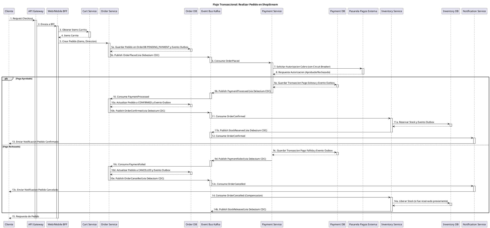
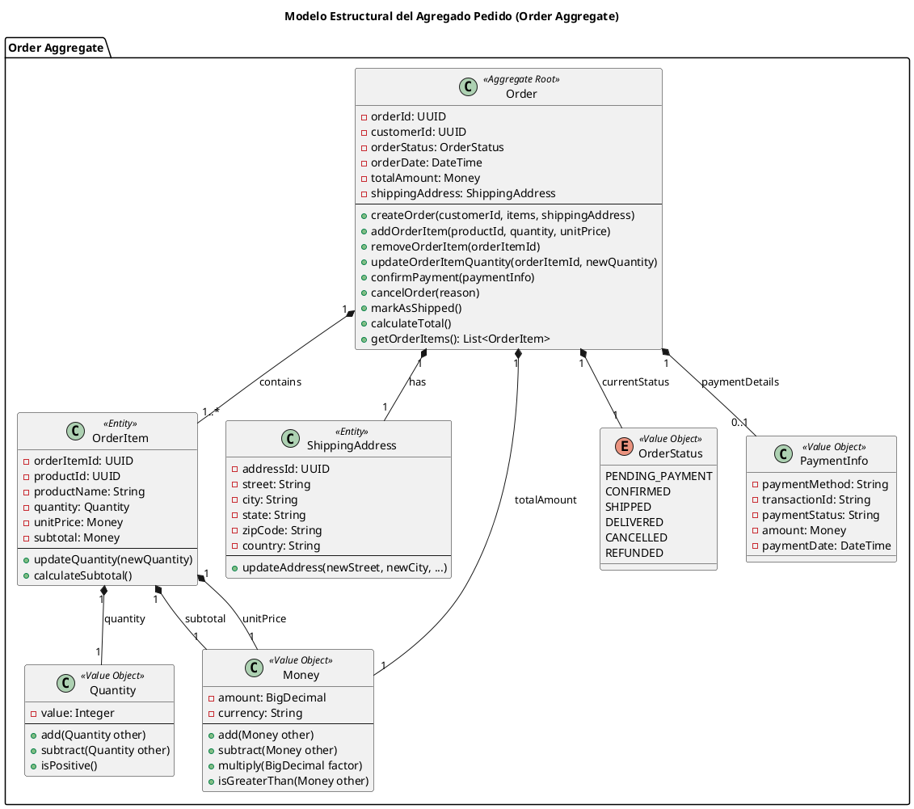

Como Arquitecto Principal de Software y Sistemas Distribuidos, procedo con el análisis arquitectónico del **Hito 2: Comportamiento Distribuido y Diseño Táctico/Estratégico DDD para ShopStream**, enfocándome en la colaboración de microservicios, consistencia eventual, resiliencia y la integridad del modelo de dominio.

---

## 1. Diseño del Flujo Transaccional Distribuido: "Realizar Pedido"

El flujo "Realizar Pedido" en ShopStream es una transacción distribuida que involucra múltiples microservicios. Se gestiona mediante un enfoque de consistencia eventual, evitando transacciones distribuidas bloqueantes (2PC) y manteniendo la autonomía de datos de cada servicio.

### 1.1. Análisis del Ciclo de Vida de la Compra

El ciclo de vida de la compra se inicia cuando el cliente confirma su carrito y finaliza con la confirmación del pedido o su cancelación. Los pasos clave son:

*   **Inicio de Checkout**: El cliente, a través del `Web/Mobile BFF`, inicia el proceso de checkout. El BFF agrega la información del carrito del `Cart Service` y la envía al `Order Service`.
*   **Creación de Pedido Pendiente**: El `Order Service` crea un registro de pedido en estado `PENDING_PAYMENT` en su base de datos local y publica un evento `OrderPlaced` utilizando el patrón Transactional Outbox.
*   **Procesamiento de Pago**: El `Payment Service` consume el evento `OrderPlaced`, inicia la comunicación síncrona con la `Pasarela de Pagos Externa` para autorizar el cobro y, tras recibir la respuesta, publica un evento `PaymentProcessed` o `PaymentFailed` (también vía Outbox).
*   **Actualización de Estado del Pedido**: El `Order Service` consume los eventos de pago. Si es `PaymentProcessed`, actualiza el pedido a `CONFIRMED` y publica `OrderConfirmed`. Si es `PaymentFailed`, actualiza a `CANCELLED` y publica `OrderCancelled`.
*   **Reserva de Inventario**: El `Inventory Service` consume el evento `OrderConfirmed` para reservar el stock de los productos del pedido. Si la reserva es exitosa, publica `StockReserved`. Si falla (ej. por falta de stock concurrente), publica `StockReservationFailed`.
*   **Notificaciones**: El `Notification Service` consume `OrderConfirmed` o `OrderCancelled` para enviar confirmaciones o avisos de fallo al cliente.
*   **Compensación**: Si un paso falla (ej. pago rechazado o stock insuficiente), se desencadenan eventos compensatorios para revertir los cambios previos (ej. liberar stock, reembolsar pago).

### 1.2. Topología de Datos Descentralizada (Database-per-Service)

Cada microservicio es el dueño exclusivo de sus datos, garantizando autonomía e integridad:

*   **`Cart Service`**: Almacena el estado efímero del carrito en `Redis Cluster`.
*   **`Order Service`**: Persiste el estado del pedido y los ítems en `PostgreSQL`, incluyendo la tabla `outbox_events` para la publicación confiable de eventos.
*   **`Inventory Service`**: Gestiona el stock y las reservas en `PostgreSQL`, también con una tabla `outbox_events`.
*   **`Payment Service`**: Registra las transacciones financieras en `PostgreSQL`, con su propia tabla `outbox_events`.
*   **`Catalog Service`**: Mantiene la información maestra de productos en `MongoDB`.
*   **`Search Service`**: Indexa productos en `Elasticsearch`.

La comunicación entre servicios para mutaciones de estado se realiza exclusivamente a través del `Event Bus (Apache Kafka)`, asegurando que ningún servicio acceda directamente a la base de datos de otro.

### 1.3. Diagrama PlantUML 1: Secuencia Transaccional de "Realizar Pedido"

---

## 2. Selección y Justificación del Patrón SAGA (Coreografía vs. Orquestación)

El patrón SAGA es esencial para gestionar transacciones distribuidas en ShopStream sin recurrir a 2PC.

### 2.1. Evaluación Comparativa de Alternativas SAGA

| Característica              | SAGA por Coreografía (Choreography)           | SAGA por Orquestación (Orchestration)         |
| :-------------------------- | :-------------------------------------------- | :-------------------------------------------- |
| **Complejidad Implementación** | Baja para pocos pasos, alta para muchos       | Media, orquestador centralizado               |
| **Acoplamiento Servicios**  | Bajo, servicios reaccionan a eventos          | Medio, servicios dependen de orquestador      |
| **Visibilidad/Monitoreo**   | Baja, flujo implícito, difícil de trazar     | Alta, estado centralizado del orquestador     |
| **Facilidad de Prueba**     | Difícil, requiere simular eventos             | Más fácil, orquestador es una unidad lógica   |
| **Riesgo Dependencias Circulares** | Alto, si servicios se llaman mutuamente     | Bajo, orquestador es el único que dirige     |

### 2.2. Decisión y Justificación para ShopStream

**Decisión**: Se opta por una **SAGA por Orquestación ligera**, donde el `Order Service` actúa como el orquestador principal del flujo de pedido.

**Justificación**:
*   **Visibilidad y Monitoreo**: El `Order Service` mantiene el estado centralizado del pedido, facilitando la trazabilidad del flujo transaccional y la identificación de cuellos de botella o fallos.
*   **Gestión de Compensaciones**: La lógica de compensación es más clara y fácil de implementar dentro del `Order Service`, que puede reaccionar a eventos de fallo y emitir comandos o eventos compensatorios específicos.
*   **Reducción de Acoplamiento Implícito**: Aunque el `Order Service` es el orquestador, la comunicación con otros servicios se realiza a través del `Event Bus (Kafka)`, manteniendo un desacoplamiento físico. El `Order Service` no invoca directamente a otros servicios para mutaciones de estado, sino que reacciona a sus eventos.
*   **Complejidad Manejable**: El flujo de pedido, aunque crítico, no es excesivamente complejo en términos de número de pasos, lo que hace que un orquestador dedicado sea manejable y beneficioso.

### 2.3. Estrategia de Transacciones Compensatorias

Si un paso de la SAGA falla, el `Order Service` orquesta la reversión semántica:

*   **Fallo de Pago (ej. fondos insuficientes)**:
    *   El `Payment Service` publica `PaymentFailed`.
    *   El `Order Service` consume `PaymentFailed`, actualiza el estado del pedido a `CANCELLED` y publica `OrderCancelled`.
    *   El `Inventory Service` consume `OrderCancelled` y libera cualquier stock que haya sido reservado previamente para ese pedido.
    *   El `Notification Service` consume `OrderCancelled` y envía una notificación al cliente informando de la cancelación.

*   **Fallo de Reserva de Stock (ej. stock agotado concurrentemente)**:
    *   El `Inventory Service` publica `StockReservationFailed`.
    *   El `Order Service` consume `StockReservationFailed`, actualiza el estado del pedido a `CANCELLED` y publica `OrderCancelled`.
    *   El `Payment Service` consume `OrderCancelled` y emite un reembolso a la `Pasarela de Pagos Externa` para la transacción previamente autorizada.
    *   El `Notification Service` consume `OrderCancelled` y envía una notificación al cliente.

---

## 3. Estrategias de Resiliencia: Ubicación y Justificación de Retry y Circuit Breaker

La resiliencia es fundamental en ShopStream para mitigar fallas de red y garantizar la disponibilidad.

### 3.1. Análisis de Vulnerabilidad y Modos de Falla de Red

Los puntos de vulnerabilidad incluyen:
*   **Interacciones Síncronas Externas**: Llamadas a la `Pasarela de Pagos Externa`.
*   **Interacciones Síncronas Internas**: `BFFs` a microservicios de dominio.
*   **Conectividad con Backing Services**: Bases de datos, `Event Bus (Kafka)`.
*   **Picos de Tráfico**: Sobrecarga en `API Gateway` o `BFFs`.

### 3.2. Matriz Resumen de Resiliencia

| Punto de Interacción              | Patrón Aplicado           | Falla Mitigada                                |
| :-------------------------------- | :------------------------ | :-------------------------------------------- |
| `Payment Svc -> Pasarela Externa` | Circuit Breaker + Retry   | Caída prolongada o latencia alta pasarela     |
| `Order Svc -> Order DB`           | Transactional Outbox      | Desconexión temporal Kafka                    |
| `BFFs -> Microservicios`          | Circuit Breaker + Retry   | Fallo transitorio o sobrecarga de microservicio |
| `API Gateway -> BFFs`             | Rate Limiting + Fallback  | Picos masivos de tráfico, ataques DDoS        |
| `Consumidores Kafka`              | DLQ + Reintentos Exponenciales | Mensajes "poison pill", fallos de procesamiento |

### 3.3. Análisis Detallado de Resiliencia

*   **`Payment Service` a `Pasarela de Pagos Externa` (Circuit Breaker + Retry)**:
    *   **Justificación**: La pasarela de pagos es un sistema externo fuera de nuestro control. Es susceptible a latencias elevadas o caídas temporales/prolongadas.
    *   **Configuración**:
        *   **Circuit Breaker**: Se configura con un umbral de fallo del 50% en un período de 10 segundos. Si se supera, el circuito se abre durante 30 segundos, desviando todas las llamadas a un `fallback` (ej. registrar el pago como `PENDING_EXTERNAL_RETRY` y notificar al equipo de operaciones).
        *   **Retry**: Antes de abrir el circuito, se permiten 3 reintentos con un `backoff` exponencial (1s, 2s, 4s) para fallos transitorios (ej. timeouts de red, errores 5xx).
        *   **Timeout**: Un timeout estricto de 5 segundos para cada llamada a la pasarela.
    *   **Fallback**: En caso de circuito abierto, el `Payment Service` no intenta procesar el pago, sino que registra el evento como `PaymentFailed` con un código de error específico para reintento manual o posterior.

*   **`Order Service` a `Order DB` (Transactional Outbox)**:
    *   **Justificación**: Garantiza la atomicidad de la actualización del estado del pedido y la publicación del evento `OrderPlaced` o `OrderConfirmed`. Evita la inconsistencia de que el pedido se guarde pero el evento no se publique (o viceversa) si Kafka no está disponible temporalmente.
    *   **Mecanismo**: El `Order Service` persiste el agregado `Pedido` y el evento en una tabla `outbox_events` dentro de la misma transacción ACID de `PostgreSQL`. Un conector CDC (ej. Debezium) lee el log de transacciones de `PostgreSQL` y publica los eventos en `Kafka` de forma confiable.
    *   **Falla Mitigada**: Desconexión temporal del `Event Bus (Kafka)`. La publicación se garantiza una vez que la conectividad se restablece.

*   **`BFFs` a Microservicios de Dominio (Circuit Breaker + Retry)**:
    *   **Justificación**: Las llamadas síncronas entre `BFFs` y microservicios internos pueden fallar debido a problemas de red, sobrecarga de servicios o despliegues.
    *   **Configuración**:
        *   **Circuit Breaker**: Umbral de fallo del 30% en 5 segundos, con un período de apertura de 15 segundos.
        *   **Retry**: 2 reintentos con `backoff` exponencial (0.5s, 1s) para errores transitorios.
        *   **Timeout**: 3 segundos para cada llamada.
    *   **Fallback**: En caso de fallo o circuito abierto, el `BFF` puede devolver datos cacheados (si aplica), un mensaje de error amigable al usuario o una respuesta parcial.

*   **`API Gateway` (Rate Limiting + Fallback)**:
    *   **Justificación**: Protege los `BFFs` y microservicios de picos de tráfico excesivos, ataques DDoS o clientes maliciosos.
    *   **Configuración**:
        *   **Rate Limiting**: Algoritmo Token Bucket configurado para permitir, por ejemplo, 100 solicitudes por segundo por IP de cliente, con un `burst` de 20 solicitudes.
        *   **Load Shedding**: Durante picos extremos, el `API Gateway` puede empezar a rechazar solicitudes con un código 429 (Too Many Requests) para proteger los servicios internos.
    *   **Fallback**: El `API Gateway` puede servir una página de mantenimiento estática o una respuesta de error genérica cuando el límite de tasa se excede.

*   **Consumidores Kafka (DLQ + Reintentos Exponenciales)**:
    *   **Justificación**: Los mensajes pueden fallar al ser procesados debido a errores de lógica de negocio, datos corruptos ("poison pills") o dependencias externas no disponibles.
    *   **Mecanismo**: Los consumidores de Kafka están configurados para reintentar el procesamiento de un mensaje fallido con un `backoff` exponencial. Tras un número predefinido de reintentos (ej. 5), si el mensaje sigue fallando, se mueve a un `Dead Letter Queue (DLQ)` dedicado.
    *   **DLQ**: Los mensajes en el `DLQ` son inspeccionados manualmente o por un proceso automatizado para diagnosticar la causa raíz y, si es posible, reprocesarlos. Esto evita que un mensaje defectuoso bloquee la partición de Kafka.

### 3.4. Políticas de Idempotencia

La idempotencia es crucial para que los reintentos no causen efectos secundarios no deseados:

*   **Operaciones de Cobro (`Payment Service`)**:
    *   Cada solicitud de cobro a la `Pasarela de Pagos Externa` incluirá un `transactionId` único generado por el `Order Service` (o `Payment Service` si es el caso). La pasarela debe garantizar que múltiples solicitudes con el mismo `transactionId` resulten en un único cobro.
    *   El `Payment Service` registrará el `transactionId` en su `Payment DB` para detectar y descartar solicitudes duplicadas antes de interactuar con la pasarela.

*   **Reserva de Inventario (`Inventory Service`)**:
    *   Las solicitudes de reserva de stock incluirán un `reservationId` único (ej. `orderId-itemId`).
    *   El `Inventory Service` verificará en su `Inventory DB` si una reserva con ese `reservationId` ya existe. Si existe y está en el estado deseado, la operación se considera exitosa sin realizar cambios adicionales. Si está en un estado inconsistente, se gestionará como un error.

*   **Creación de Pedidos (`Order Service`)**:
    *   La creación de un pedido puede ser idempotente si se utiliza un `cartId` o un `checkoutSessionId` único. El `Order Service` puede verificar si ya existe un pedido asociado a ese identificador antes de crear uno nuevo.

---

## 4. Diseño Táctico DDD: El Agregado Pedido (Order Aggregate)

El `Pedido` es un agregado central en ShopStream, encapsulando la lógica de negocio y garantizando la consistencia transaccional de sus componentes internos.

### 4.1. Definición del Agregado y Límites Transaccionales

El `Pedido` es un agregado que define un límite transaccional estricto. Todas las operaciones que modifican el estado de un pedido deben pasar a través de su `Aggregate Root`.

*   **Aggregate Root (Raíz de Agregado)**:
    *   **`Order`**: La entidad `Order` es la raíz del agregado. Es el único punto de entrada para cualquier operación que afecte el pedido o sus ítems.
    *   **Justificación**: La `Order` es la entidad principal que representa la intención de compra del cliente. Su estado (PENDING, CONFIRMED, CANCELLED) es crítico y debe ser consistente con todos sus componentes (ítems, direcciones, pagos). Acceder a los ítems o direcciones directamente sin pasar por la `Order` podría romper los invariantes de negocio.

*   **Entidades Internas y Value Objects (Objetos de Valor)**:
    *   **Entidades Internas**:
        *   **`OrderItem`**: Representa un producto específico dentro del pedido, incluyendo la cantidad y el precio unitario en el momento de la compra. Cada `OrderItem` tiene su propia identidad dentro del contexto del `Order`.
        *   **`ShippingAddress`**: Representa la dirección de envío del pedido. Aunque podría ser un Value Object si su identidad no es relevante fuera del `Order`, se considera una entidad si se necesita rastrear su ciclo de vida o si se comparte entre múltiples pedidos del mismo cliente (aunque en este contexto, es una copia del momento del pedido).
    *   **Value Objects**:
        *   **`Money`**: Representa valores monetarios (precio unitario, subtotal, total), encapsulando la cantidad y la moneda para evitar errores de precisión y conversión.
        *   **`Quantity`**: Representa la cantidad de un producto en un `OrderItem`, asegurando que siempre sea un valor positivo.
        *   **`OrderStatus`**: Un enumerado o tipo de valor que representa el estado actual del pedido (ej. `PENDING_PAYMENT`, `CONFIRMED`, `SHIPPED`, `CANCELLED`).
        *   **`PaymentInfo`**: Contiene detalles del pago (ej. método, ID de transacción externa, estado del pago), pero no datos sensibles de tarjeta.

### 4.2. Definición de Invariantes de Negocio

El `Aggregate Root Order` debe hacer cumplir las siguientes invariantes críticas:

1.  **Invariante 1: Consistencia del Total del Pedido**:
    *   **Explicación**: El monto total de un `Order` siempre debe ser la suma exacta de los subtotales de todos sus `OrderItems`, aplicando cualquier descuento o impuesto relevante.
    *   **Aplicación**: Cualquier método que modifique los `OrderItems` (ej. `addOrderItem`, `removeOrderItem`, `updateOrderItemQuantity`) o aplique descuentos debe recalcular y actualizar el total del `Order` antes de que la operación se considere completa. Esto evita que el total del pedido se desincronice con sus componentes.

2.  **Invariante 2: Secuencia Válida de Transiciones de Estado**:
    *   **Explicación**: Un `Order` solo puede transitar entre estados válidos y en una secuencia predefinida. Por ejemplo, un pedido `CONFIRMED` no puede volver a `PENDING_PAYMENT`, y un pedido `CANCELLED` no puede pasar a `SHIPPED`.
    *   **Aplicación**: Los métodos de dominio como `confirmPayment()`, `cancelOrder()`, `markAsShipped()` deben contener lógica de validación que verifique el estado actual del pedido antes de permitir la transición al nuevo estado. Si la transición es inválida, se debe lanzar una excepción de dominio.

### 4.3. Diagrama PlantUML 2: Modelo Estructural del Agregado Pedido

---

## 5. Diseño Estratégico DDD: Relación Catálogo–CMS en el Context Map (Mapa de Contextos)

La relación entre el `Contexto de Catálogo` y el `Contexto de CMS` es un ejemplo clave de diseño estratégico DDD para evitar el acoplamiento y fomentar la autonomía.

### 5.1. Evaluación de Patrones de Context Mapping

*   **Shared Kernel**: No aplicable. Catálogo y CMS tienen modelos de dominio distintos.
*   **Customer
-Supplier**: Este patrón es altamente relevante. El `Contexto de Catálogo` actúa como "Supplier" de información de productos para el `Contexto de CMS` (que es el "Customer"). El CMS consume datos del Catálogo, pero el Catálogo no tiene una dependencia directa del CMS. Esto permite que el Catálogo evolucione de forma independiente.
*   **Conformist**: No se recomienda para la relación principal entre Catálogo y CMS, ya que implicaría que el CMS adoptara el modelo de dominio exacto del Catálogo, lo que limitaría su autonomía y su capacidad para modelar conceptos específicos de contenido.
*   **Anti-Corruption Layer (ACL)**: Es crucial para la integración entre el `Contexto de CMS` y el `Contexto de Catálogo`. El CMS, al consumir datos del Catálogo, debe implementar una ACL para traducir los modelos de dominio del Catálogo a sus propios modelos de dominio internos. Esto protege al CMS de cambios en el modelo del Catálogo y le permite mantener su propia Ubiquitous Language.
*   **Open Host Service (OHS) / Published Language (PL)**: El `Contexto de Catálogo` debe exponer sus datos a través de un OHS (una API bien definida) utilizando un PL (un formato de datos estándar y documentado, como JSON Schema o OpenAPI). Esto garantiza que los consumidores (como el CMS) puedan integrarse de manera predecible y estable.

### 5.2. Estrategias de Integración entre Bounded Contexts

La integración entre el `Contexto de Catálogo` y el `Contexto de CMS` se realizará principalmente a través de APIs RESTful bien definidas y, potencialmente, mediante eventos asíncronos para notificaciones de cambios.

*   **APIs RESTful Síncronas**:
    *   El `Contexto de Catálogo` expondrá una API RESTful para que el `Contexto de CMS` pueda consultar información de productos (ej., detalles de productos, listas de productos, categorías).
    *   Esta API será el `Open Host Service` del Catálogo, y su contrato (el `Published Language`) será rigurosamente mantenido y versionado.
    *   El `Contexto de CMS` implementará una `Anti-Corruption Layer` para mapear las respuestas de la API del Catálogo a sus propios objetos de dominio.
*   **Eventos Asíncronos (Opcional, para Hitos Futuros)**:
    *   Para escenarios donde el CMS necesite reaccionar a cambios en el Catálogo en tiempo real (ej., un producto se desactiva, el precio cambia), se podría considerar una arquitectura basada en eventos.
    *   El `Contexto de Catálogo` publicaría eventos (ej., `ProductUpdatedEvent`, `ProductDeactivatedEvent`) en un Message Broker (ej., Kafka, RabbitMQ).
    *   El `Contexto de CMS` podría suscribirse a estos eventos para mantener su propia vista de datos o para activar flujos de trabajo específicos. Esto reduciría el acoplamiento temporal y aumentaría la resiliencia.

## 6. Arquitectura de Integración

La arquitectura de integración se centrará en la comunicación entre los microservicios y con sistemas externos, garantizando escalabilidad, resiliencia y seguridad.

### 6.1. API Gateway

Se implementará un API Gateway como punto de entrada unificado para todas las solicitudes externas.

*   **Funcionalidades**:
    *   **Enrutamiento de Solicitudes**: Dirigirá las solicitudes entrantes a los microservicios apropiados.
    *   **Autenticación y Autorización**: Centralizará la validación de tokens de seguridad (ej., JWT) y la aplicación de políticas de autorización.
    *   **Rate Limiting**: Protegerá los microservicios de sobrecargas.
    *   **Transformación de Solicitudes/Respuestas**: Podrá modificar encabezados o cuerpos de solicitudes/respuestas si es necesario.
    *   **Observabilidad**: Recopilará métricas y logs de todas las solicitudes.
*   **Tecnología Sugerida**: AWS API Gateway, Azure API Management, Kong, o Spring Cloud Gateway.

### 6.2. Comunicación entre Microservicios

*   **Síncrona (REST/gRPC)**: Para interacciones directas y en tiempo real donde se requiere una respuesta inmediata (ej., CMS consultando Catálogo). Se utilizarán APIs RESTful con JSON como formato de datos. gRPC podría considerarse para comunicaciones internas de alto rendimiento si se justifica.
*   **Asíncrona (Message Broker)**: Para desacoplar servicios, manejar eventos, y soportar patrones de comunicación de "fire-and-forget" o "publish-subscribe".
    *   **Tecnología Sugerida**: Apache Kafka o Amazon SQS/SNS (para AWS). Kafka es preferible por su durabilidad, escalabilidad y capacidad de retransmisión de eventos.
    *   **Casos de Uso**: Notificaciones de cambios de estado, procesamiento en segundo plano, sincronización de datos eventual.

### 6.3. Integración con Sistemas Externos

*   **Proveedores de Pago**: Integración a través de SDKs o APIs RESTful proporcionadas por los proveedores (ej., Stripe, PayPal).
*   **Sistemas de Gestión de Contenido (CMS) Externos**: Si se utiliza un CMS headless externo, la integración se realizará a través de sus APIs GraphQL/REST.
*   **Sistemas de Terceros (ej., ERP, CRM)**: Se definirán adaptadores específicos o Anti-Corruption Layers para manejar las particularidades de cada sistema externo.

## 7. Consideraciones de Infraestructura y Despliegue

La infraestructura se diseñará para ser elástica, resiliente, segura y automatizada, aprovechando las capacidades de la nube.

### 7.1. Plataforma Cloud

*   **Proveedor Sugerido**: AWS (Amazon Web Services) o Azure. La elección final dependerá de la experiencia del equipo y las políticas corporativas.
*   **Servicios Clave (ej. en AWS)**:
    *   **Cómputo**: Amazon EKS (Kubernetes) para orquestación de contenedores, o AWS Fargate para cómputo sin servidor.
    *   **Bases de Datos**: Amazon RDS (PostgreSQL/MySQL) para bases de datos relacionales, Amazon DynamoDB para NoSQL (si aplica), Amazon ElastiCache (Redis) para caching.
    *   **Almacenamiento**: Amazon S3 para almacenamiento de objetos (imágenes, videos, archivos estáticos).
    *   **Redes**: Amazon VPC, Load Balancers (ALB/NLB).
    *   **Mensajería**: Amazon MSK (Kafka) o Amazon SQS/SNS.
    *   **API Gateway**: Amazon API Gateway.
    *   **Identidad y Acceso**: AWS IAM.

### 7.2. Contenerización y Orquestación

*   **Contenerización**: Docker será el estándar para empaquetar los microservicios, asegurando la portabilidad y consistencia entre entornos.
*   **Orquestación**: Kubernetes (gestionado por EKS en AWS o AKS en Azure) será la plataforma de orquestación para desplegar, escalar y gestionar los contenedores. Esto proporciona alta disponibilidad, auto-escalado y auto-recuperación.

### 7.3. CI/CD (Integración Continua / Despliegue Continuo)

*   **Pipeline Automatizado**: Se implementarán pipelines de CI/CD para automatizar la construcción, prueba y despliegue de los microservicios.
*   **Herramientas Sugeridas**: Jenkins, GitLab CI/CD, GitHub Actions, AWS CodePipeline/CodeBuild/CodeDeploy, Azure DevOps.
*   **Principios**: Cada cambio de código pasará por pruebas automatizadas (unitarias, de integración, funcionales) y se desplegará automáticamente en entornos de staging y producción tras la aprobación.

### 7.4. Observabilidad

*   **Logging Centralizado**: Todos los logs de los microservicios se enviarán a un sistema de logging centralizado (ej., ELK Stack - Elasticsearch, Logstash, Kibana; o AWS CloudWatch Logs, Azure Monitor).
*   **Monitoreo de Métricas**: Se recopilarán métricas de rendimiento (CPU, memoria, latencia, errores) de todos los servicios y la infraestructura (ej., Prometheus/Grafana, AWS CloudWatch Metrics, Azure Monitor Metrics).
*   **Tracing Distribuido**: Se implementará tracing distribuido (ej., Jaeger, Zipkin, AWS X-Ray) para seguir el flujo de solicitudes a través de múltiples microservicios, facilitando la depuración y el análisis de rendimiento.

## 8. Seguridad

La seguridad es un pilar fundamental de la arquitectura y se abordará en todas las capas.

### 8.1. Autenticación y Autorización

*   **OAuth 2.0 y OpenID Connect (OIDC)**: Se utilizarán estos estándares para la autenticación de usuarios y la autorización de acceso a los recursos.
*   **Servicio de Identidad Centralizado**: Se implementará un servicio de identidad (ej., Keycloak, Auth0, AWS Cognito, Azure AD B2C) para gestionar usuarios, roles y permisos.
*   **Tokens JWT**: Los tokens web JSON (JWT) se utilizarán para transmitir la información de autenticación y autorización entre el cliente, el API Gateway y los microservicios.

### 8.2. Seguridad de la API

*   **Validación de Entrada**: Todas las entradas de la API serán validadas rigurosamente para prevenir ataques como inyección SQL, XSS, etc.
*   **HTTPS/TLS**: Todas las comunicaciones se realizarán a través de HTTPS para garantizar la confidencialidad e integridad de los datos en tránsito.
*   **Firewall de Aplicaciones Web (WAF)**: Se implementará un WAF (ej., AWS WAF, Azure WAF) en el API Gateway para proteger contra ataques web comunes.

### 8.3. Seguridad de Datos

*   **Cifrado en Reposo**: Todas las bases de datos y el almacenamiento de objetos se configurarán para cifrar los datos en reposo.
*   **Cifrado en Tránsito**: Se utilizará TLS para cifrar todas las comunicaciones entre servicios y con bases de datos.
*   **Gestión de Secretos**: Las credenciales, claves API y otros secretos se gestionarán de forma segura utilizando servicios como AWS Secrets Manager, Azure Key Vault o HashiCorp Vault.

### 8.4. Seguridad de la Infraestructura

*   **Redes Privadas (VPC)**: Los microservicios se desplegarán en redes privadas virtuales (VPC) con subredes privadas y públicas, y grupos de seguridad/firewalls para controlar el tráfico.
*   **Principio de Mínimo Privilegio**: Se aplicará el principio de mínimo privilegio a todos los roles de IAM y permisos de acceso.
*   **Escaneo de Vulnerabilidades**: Se realizarán escaneos regulares de vulnerabilidades en imágenes de contenedores y en la infraestructura.

## 9. Conclusiones

Este informe técnico ha delineado la arquitectura propuesta para ShopStream Hito 2, centrándose en la evolución hacia una arquitectura de microservicios con un fuerte énfasis en Domain-Driven Design para los contextos de Catálogo y CMS.

### 9.1. Resumen de la Arquitectura Propuesta

La arquitectura se basa en:
*   **Microservicios**: Desacoplamiento de funcionalidades en servicios pequeños y autónomos.
*   **Domain-Driven Design**: Modelado de dominios clave (Catálogo, CMS) con sus propios Bounded Contexts y Ubiquitous Language.
*   **Context Mapping**: Estrategias claras de integración (Customer-Supplier, ACL, OHS/PL) entre contextos.
*   **API Gateway**: Punto de entrada unificado y seguro.
*   **Comunicación Asíncrona**: Uso de Message Brokers para desacoplar servicios.
*   **Contenerización y Orquestación**: Docker y Kubernetes para despliegue y gestión.
*   **Cloud-Native**: Aprovechamiento de servicios gestionados en la nube para escalabilidad y resiliencia.
*   **Seguridad Integral**: Autenticación, autorización, cifrado y gestión de secretos en todas las capas.
*   **Observabilidad**: Logging, monitoreo y tracing para una operación eficiente.

Esta arquitectura proporciona la flexibilidad, escalabilidad y resiliencia necesarias para soportar el crecimiento de ShopStream y la evolución de sus funcionalidades, al tiempo que gestiona la complejidad inherente a un sistema de comercio electrónico moderno.

Este informe sirve como una guía sólida para la dirección arquitectónica de ShopStream Hito 2, sentando las bases para un sistema robusto y escalable.