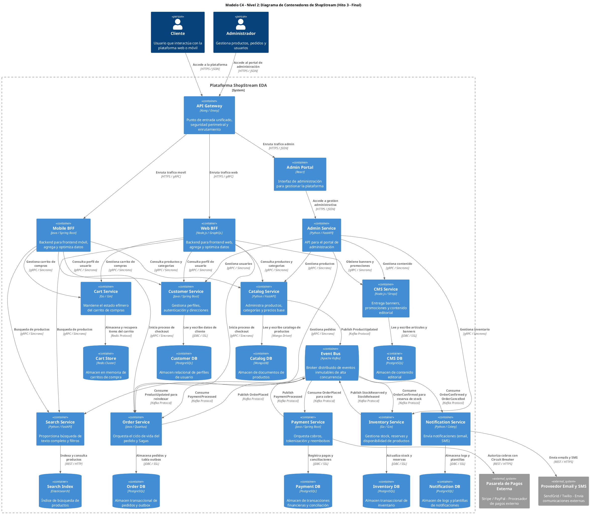

Como Arquitecto Principal de Software y Sistemas Distribuidos, presento el informe técnico de consolidación y defensa para el **Hito 3: Síntesis, Operación y Defensa de ShopStream**, abordando las decisiones arquitectónicas clave, la operabilidad bajo The Twelve-Factor App y una reflexión crítica sobre el uso de la ingeniería de contexto con IA.

---

## 1. Arquitectura Final Consolidada de ShopStream (Modelo C4 Nivel 2 Refinado)

### 1.1. Síntesis del Ecosistema

La plataforma ShopStream se ha diseñado como un ecosistema de microservicios autónomos y guiados por eventos, estructurado en capas para maximizar la resiliencia, escalabilidad y autonomía de los equipos. En el perímetro, un **API Gateway** centraliza la seguridad y el enrutamiento, protegiendo a los **Backend-For-Frontends (BFFs)** especializados para canales web y móvil. Estos BFFs agregan y optimizan los datos de los **Microservicios de Dominio** internos (Customer, Catalog, Inventory, Cart, Order, Payment, Search, CMS), cada uno de los cuales es dueño exclusivo de su **Persistencia Políglota (Database-per-Service)**. La comunicación asíncrona y la coordinación de transacciones distribuidas se gestionan a través de un **Event Bus (Apache Kafka)**, garantizando la consistencia eventual y el desacoplamiento.

### 1.2. Diagrama PlantUML 1 (Modelo C4 Nivel 2 - Diagrama de Contenedores Final)

---

## 2. Matriz y Registro de Decisiones Arquitectónicas (ADRs Consolidados)

| Decisión Arquitectónica | Alternativas Evaluadas | Decisión Seleccionada | Trade-Off Principal Aceptado |
| :--- | :--- | :--- | :--- |
| Arquitectura General | Monolito, Microkernel | Microservicios Autónomos | Mayor complejidad operativa inicial |
| Persistencia de Datos | Base de datos compartida | Database-per-Service | Consistencia eventual, duplicación de datos |
| Entrada de Clientes | API Gateway único, Solo BFFs | Edge Gateway + BFFs | Mayor complejidad de componentes |
| Comunicación Inter-Servicios | Síncrona (REST), 2PC | Asíncrona (Kafka) + Síncrona (gRPC) | Consistencia eventual, complejidad EDA |
| Transacciones Distribuidas | 2PC, SAGA Coreografía | SAGA Orquestación (Order Svc) | Orquestador centralizado, mayor visibilidad |
| Publicación de Eventos | Publicación directa, Polling | Transactional Outbox + CDC | Infraestructura adicional (Debezium) |
| Almacenamiento de Datos | Base de datos única | Persistencia Políglota | Diversidad tecnológica, curva de aprendizaje |

### 2.1. Defensa Técnica y Justificación Detallada

*   **Arquitectura de Microservicios Autónomos**:
    *   **Justificación**: Permite la **descomposición del dominio** en Bounded Contexts, cada uno gestionado por un equipo pequeño e independiente. Esto facilita el **despliegue autónomo**, la **escalabilidad horizontal** de componentes específicos y la **resiliencia** al aislar fallos.
    *   **Trade-Off**: Introduce una **mayor complejidad operativa** debido a la gestión de múltiples servicios, la red distribuida y la observabilidad. Sin embargo, los beneficios a largo plazo en agilidad y escalabilidad superan este costo inicial.

*   **Persistencia Descentralizada (Database-per-Service)**:
    *   **Justificación**: Cada microservicio es el **dueño exclusivo de sus datos**, eliminando el acoplamiento fuerte a nivel de esquema de base de datos. Esto permite a cada equipo elegir la **tecnología de persistencia más adecuada (políglota)** para su caso de uso y evolucionar su esquema de forma independiente.
    *   **Trade-Off**: Requiere gestionar la **consistencia eventual** para transacciones que abarcan múltiples servicios y puede llevar a la **duplicación de datos** para satisfacer necesidades de consulta de otros dominios (mitigado con CQRS o vistas materializadas).

*   **Arquitectura Híbrida de 2 Capas (Edge Gateway + BFFs)**:
    *   **Justificación**: Combina la **seguridad perimetral centralizada** (WAF, Rate Limiting, autenticación inicial) del Edge Gateway con la **optimización de payloads** y la **autonomía de los equipos de frontend** que ofrecen los BFFs. Esto mejora la experiencia del usuario al reducir la latencia y el tamaño de las respuestas.
    *   **Trade-Off**: Aumenta la **complejidad de la infraestructura** al introducir más componentes en la ruta de la solicitud. Se gestiona con herramientas de orquestación como Kubernetes y una sólida observabilidad.

*   **Comunicación Asíncrona (Event-Driven Architecture via Kafka) y Síncrona (gRPC)**:
    *   **Justificación**: La comunicación **asíncrona con Apache Kafka** es obligatoria para mutaciones de estado y flujos transaccionales distribuidos, promoviendo el **desacoplamiento temporal** y la **resiliencia**. Las llamadas **síncronas con gRPC** se reservan para consultas de solo lectura en tiempo real o validaciones previas, aprovechando su eficiencia y tipado fuerte.
    *   **Trade-Off**: La consistencia eventual introduce una **mayor complejidad en el diseño de flujos de negocio** y en la depuración. La gestión de un Event Bus como Kafka requiere experiencia operativa especializada.

*   **Patrón SAGA por Orquestación (con `Order Service` como Orquestador)**:
    *   **Justificación**: Permite gestionar **transacciones distribuidas** que abarcan múltiples microservicios sin recurrir a protocolos 2PC bloqueantes. La orquestación centralizada en el `Order Service` proporciona **mayor visibilidad del estado del flujo** y simplifica la lógica de **compensación** ante fallos.
    *   **Trade-Off**: El `Order Service` asume una **mayor responsabilidad de coordinación**, lo que podría generar un acoplamiento lógico si no se diseña cuidadosamente para reaccionar a eventos en lugar de invocar directamente.

*   **Patrón Transactional Outbox + Debezium CDC**:
    *   **Justificación**: Garantiza la **publicación confiable de eventos** en Kafka, resolviendo el problema de la doble escritura (actualizar la base de datos y publicar el evento de forma atómica). Esto asegura que no se pierdan eventos críticos si el Event Bus no está disponible.
    *   **Trade-Off**: Introduce una **infraestructura adicional** (Debezium o un proceso de polling) y una ligera **latencia adicional** para la propagación de eventos, aunque la fiabilidad es prioritaria.

*   **Persistencia Políglota**:
    *   **Justificación**: Permite seleccionar la **base de datos más adecuada** para los requisitos específicos de cada microservicio (ej. PostgreSQL para transacciones ACID, MongoDB para esquemas flexibles, Redis para caché/sesiones, Elasticsearch para búsqueda). Esto optimiza el rendimiento y la eficiencia del almacenamiento.
    *   **Trade-Off**: Aumenta la **complejidad operativa** y la **curva de aprendizaje** del equipo, ya que se deben gestionar y mantener diversas tecnologías de bases de datos.

---

## 3. Impacto y Operación de The Twelve-Factor App en el Servicio de Pedidos (`Order Service`)

El `Order Service` es un componente crítico en ShopStream, y su diseño y operación se adhieren estrictamente a los principios de The Twelve-Factor App para garantizar su robustez y escalabilidad.

### 3.1. Factor VI. Procesos (Processes): Ejecutar la aplicación como procesos sin estado

*   **Diseño e Implementación Técnica**:
    *   El `Order Service` está diseñado como un **proceso completamente sin estado (stateless)**. Esto significa que no almacena ninguna información de sesión o estado transaccional en su memoria local o en el disco efímero del contenedor.
    *   Toda la información necesaria para procesar una solicitud (ej. detalles del pedido, estado actual) se recupera de su **base de datos dedicada (Order DB - PostgreSQL)** al inicio de la operación y se persiste de nuevo al finalizar.
    *   Las operaciones de negocio, como `createOrder`, `confirmPayment` o `cancelOrder`, son funciones puras que toman el estado actual del pedido de la base de datos, aplican la lógica de negocio y persisten el nuevo estado.
    *   La gestión de la tabla `outbox_events` para la publicación confiable de eventos también se realiza dentro de la transacción ACID de PostgreSQL, asegurando que el estado del pedido y el evento asociado se persistan atómicamente, sin depender del estado en memoria del servicio.

*   **Operación y Resiliencia en Producción**:
    *   **Escalado Horizontal Elástico**: Al ser sin estado, el `Order Service` puede **escalar horizontalmente** de manera trivial. Se pueden añadir o eliminar instancias del servicio en función de la demanda (ej. auto-escalado en Kubernetes) sin preocuparse por la replicación de estado o la afinidad de sesión. Cualquier instancia puede atender cualquier solicitud de pedido.
    *   **Recuperación Automática**: Si una instancia del `Order Service` falla o se reinicia inesperadamente, no hay pérdida de datos o estado en curso, ya que todo el estado persistente reside en `Order DB`. Las solicitudes fallidas pueden ser reintentadas por el cliente o el API Gateway y serán procesadas por otra instancia disponible.
    *   **Despliegues Continuos**: Facilita los **despliegues sin tiempo de inactividad (Zero-Downtime Rolling Updates)**, ya que las nuevas versiones pueden desplegarse gradualmente, y las instancias antiguas pueden ser terminadas sin afectar la disponibilidad del servicio.

### 3.2. Factor IX. Desechabilidad (Disposability): Maximizar la robustez con inicio rápido y apagado elegante

*   **Diseño e Implementación Técnica**:
    *   **Inicio Rápido**: El `Order Service` se construye con frameworks ligeros (ej. Quarkus o Spring Boot con GraalVM) que permiten un **tiempo de inicio en segundos**. Esto es crucial para el auto-escalado reactivo y la recuperación rápida de fallos.
    *   **Apagado Elegante (Graceful Shutdown)**: El servicio está configurado para responder a señales de terminación del sistema (ej. `SIGTERM` de Kubernetes). Al recibir esta señal:
        *   Deja de aceptar nuevas conexiones o solicitudes entrantes.
        *   Permite que las solicitudes en curso finalicen su procesamiento.
        *   Cierra ordenadamente las conexiones a la base de datos (`Order DB`) y los consumidores/productores de Kafka.
        *   Para el patrón Transactional Outbox, el apagado elegante asegura que las transacciones locales en curso se completen y que los eventos pendientes en la tabla `outbox_events` sean persistidos antes de que el proceso termine, garantizando que Debezium los capturará.

*   **Operación y Resiliencia en Producción**:
    *   **Auto-Escalado Elástico**: El inicio rápido permite que nuevas instancias del `Order Service` se pongan en línea rápidamente para absorber picos de demanda, y el apagado elegante facilita la reducción de instancias cuando la carga disminuye, liberando recursos de manera eficiente.
    *   **Despliegues sin Interrupción**: El apagado elegante es fundamental para los despliegues continuos. Las instancias antiguas pueden ser drenadas de tráfico y terminadas limpiamente, mientras las nuevas instancias toman el relevo, sin que el usuario final experimente interrupciones.
    *   **Tolerancia a Fallos**: En caso de un fallo de infraestructura o una terminación forzada, el diseño desechable minimiza el "blast radius". El servicio está diseñado para que su terminación abrupta no deje el sistema en un estado inconsistente, gracias a la atomicidad de las transacciones locales y el patrón Outbox.

---

## 4. Auditoría y Resolución de Inconsistencias Arquitectónicas
## 4. Auditoría y Resolución de Inconsistencias Arquitectónicas

La coherencia y la adherencia a los principios arquitectónicos son cruciales para la mantenibilidad, escalabilidad y seguridad de ShopStream. Esta sección detalla los mecanismos para auditar la arquitectura y resolver cualquier inconsistencia que pueda surgir.

### 4.1. Mecanismos de Auditoría Arquitectónica

Se implementarán varios enfoques para asegurar que la implementación se alinee con el diseño arquitectónico:

*   **Revisiones de Código y Diseño:** Todas las nuevas características y cambios significativos en el código serán sometidos a revisiones por pares. Estas revisiones no solo se centrarán en la calidad del código, sino también en su adherencia a los patrones arquitectónicos definidos, principios SOLID, y las directrices de diseño de microservicios. Las revisiones de diseño se realizarán en etapas tempranas del ciclo de desarrollo para validar la propuesta arquitectónica de nuevas funcionalidades.
*   **Análisis Estático de Código (SAST):** Se integrarán herramientas de SAST en el pipeline de CI/CD para escanear automáticamente el código fuente en busca de vulnerabilidades de seguridad, pero también para identificar desviaciones de patrones de codificación, complejidad excesiva y posibles violaciones de principios arquitectónicos (ej., acoplamiento no deseado entre módulos).
*   **Análisis de Dependencias:** Herramientas como `dep-tree` o similares se utilizarán para visualizar y analizar las dependencias entre los microservicios y dentro de ellos. Esto ayudará a identificar acoplamientos inesperados o dependencias cíclicas que puedan comprometer la independencia de los servicios.
*   **Documentación Viva:** Se promoverá la práctica de mantener la documentación arquitectónica actualizada y vinculada al código (ej., diagramas C4 generados a partir de código o actualizados con cada cambio significativo). Esto facilita la comparación entre el "as-designed" y el "as-built".
*   **Auditorías Periódicas de Arquitectura:** Se programarán sesiones de auditoría arquitectónica periódicas (ej., trimestrales) donde el equipo de arquitectura y los líderes técnicos revisarán el estado actual del sistema, discutirán los desafíos emergentes y validarán la alineación con la visión arquitectónica a largo plazo.

### 4.2. Detección y Clasificación de Inconsistencias

Las inconsistencias pueden variar en su impacto y urgencia. Se clasificarán de la siguiente manera:

*   **Desviaciones Menores:** Violaciones de convenciones de codificación, pequeñas ineficiencias o desviaciones de patrones internos de un servicio que no afectan la integridad del sistema.
*   **Desviaciones Moderadas:** Acoplamiento no deseado entre dos servicios, uso incorrecto de un patrón de comunicación, o una implementación que podría generar deuda técnica significativa.
*   **Inconsistencias Críticas:** Violaciones de principios de seguridad, introducción de puntos únicos de fallo, degradación severa del rendimiento, o cualquier cambio que comprometa la escalabilidad o la resiliencia del sistema.

### 4.3. Proceso de Resolución de Inconsistencias

Una vez detectada una inconsistencia, se seguirá un proceso estructurado para su resolución:

1.  **Identificación y Documentación:** La inconsistencia se documenta, incluyendo su naturaleza, ubicación, impacto potencial y la forma en que fue detectada.
2.  **Análisis de Causa Raíz:** Se investiga por qué ocurrió la inconsistencia. ¿Fue una falta de comprensión del diseño? ¿Presión de tiempo? ¿Falta de herramientas o directrices claras?
3.  **Evaluación de Impacto y Priorización:** Se evalúa el riesgo y el impacto de la inconsistencia en el sistema. Esto determinará la prioridad de su resolución. Las inconsistencias críticas requerirán atención inmediata.
4.  **Definición de un Plan de Acción:** Se elabora un plan detallado para corregir la inconsistencia. Esto puede implicar refactorización de código, actualización de la documentación, o incluso una re-arquitectura de un componente específico.
5.  **Implementación y Verificación:** El plan de acción se ejecuta, y los cambios se verifican a través de pruebas unitarias, de integración y, si es necesario, pruebas de regresión o rendimiento.
6.  **Seguimiento y Lecciones Aprendidas:** Se realiza un seguimiento para asegurar que la inconsistencia se haya resuelto de manera efectiva y que no se reintroduzca. Se documentan las lecciones aprendidas para mejorar los procesos de diseño y desarrollo futuros, y para actualizar las directrices arquitectónicas si es necesario.

### 4.4. Herramientas de Soporte

Se utilizarán herramientas como SonarQube para análisis estático de código, linters específicos para cada lenguaje (ESLint, Pylint, etc.), y herramientas de visualización de dependencias para automatizar la detección de muchas de estas inconsistencias. La integración de estas herramientas en el pipeline de CI/CD asegurará que las inconsistencias se detecten lo antes posible, reduciendo el costo de su resolución.

---

## 5. Consideraciones de Seguridad

La seguridad es un pilar fundamental en el diseño y la implementación de ShopStream Hito 3. Dada la naturaleza de la aplicación (e-commerce), la protección de datos sensibles y la prevención de accesos no autorizados son de máxima prioridad.

### 5.1. Seguridad en la Capa de Aplicación

*   **Autenticación y Autorización:**
    *   **Autenticación:** Se utilizará OAuth 2.0 y OpenID Connect (OIDC) para la autenticación de usuarios y servicios. Un Identity Provider (IdP) centralizado (ej., Keycloak o Auth0) gestionará las identidades, emitiendo tokens JWT para la autenticación.
    *   **Autorización:** Se implementará un modelo de autorización basado en roles (RBAC) o atributos (ABAC) utilizando los claims presentes en los tokens JWT. Cada microservicio validará los tokens y los permisos asociados antes de procesar una solicitud. Se utilizarán *API Gateways* para la validación inicial de tokens y la aplicación de políticas de seguridad comunes.
*   **Validación de Entrada:** Todas las entradas de usuario y de servicios externos serán rigurosamente validadas en el punto de entrada de cada microservicio para prevenir ataques comunes como inyección SQL, XSS, CSRF, etc. Se utilizarán librerías de validación robustas.
*   **Gestión de Sesiones:** Las sesiones de usuario se gestionarán de forma segura, utilizando tokens de corta duración y tokens de refresco, almacenados de forma segura (ej., HttpOnly cookies para tokens de refresco).
*   **Protección contra Ataques Comunes:** Implementación de medidas para mitigar ataques como fuerza bruta (limitación de tasas), denegación de servicio (DoS) a nivel de aplicación (rate limiting en el API Gateway), y protección contra deserialización insegura.

### 5.2. Seguridad en la Capa de Datos

*   **Cifrado en Tránsito:** Todas las comunicaciones entre microservicios, entre la aplicación y las bases de datos, y entre el cliente y el API Gateway se realizarán a través de canales cifrados (TLS/SSL).
*   **Cifrado en Reposo:** Los datos sensibles almacenados en bases de datos (ej., información de tarjetas de crédito, datos personales) se cifrarán en reposo. Se utilizarán las capacidades de cifrado de la base de datos o se implementará cifrado a nivel de aplicación para los campos más críticos.
*   **Control de Acceso a Datos:** Se implementará un control de acceso estricto a las bases de datos, utilizando credenciales únicas para cada microservicio y aplicando el principio de mínimo privilegio. Los secretos de la base de datos se gestionarán de forma segura.
*   **Anonimización y Pseudonimización:** Para datos no productivos (ej., entornos de desarrollo/pruebas), se aplicarán técnicas de anonimización o pseudonimización para proteger la privacidad de los usuarios.

### 5.3. Seguridad de la Infraestructura

*   **Gestión de Secretos:** Las credenciales, claves API y otros secretos se gestionarán utilizando un sistema de gestión de secretos dedicado (ej., HashiCorp Vault, AWS Secrets Manager, Kubernetes Secrets con KMS). Los secretos nunca se codificarán directamente en el código fuente ni se almacenarán en repositorios de control de versiones.
*   **Seguridad de Contenedores y Orquestación:**
    *   **Imágenes de Contenedores:** Se utilizarán imágenes base mínimas y se escanearán regularmente en busca de vulnerabilidades (ej., Trivy, Clair). Se aplicará el principio de mínimo privilegio a los usuarios dentro de los contenedores.
    *   **Kubernetes:** Se configurarán políticas de red (Network Policies) para controlar el tráfico entre pods, se utilizarán Pod Security Policies (o equivalentes en versiones recientes de Kubernetes) para restringir las capacidades de los pods, y se gestionarán los roles de acceso (RBAC) dentro del clúster de forma granular.
*   **Seguridad de Red:** Se implementarán firewalls, grupos de seguridad y listas de control de acceso (ACLs) para restringir el tráfico de red solo a los puertos y protocolos necesarios. Se segmentará la red para aislar los componentes críticos.
*   **Parches y Actualizaciones:** Se establecerá un proceso regular para aplicar parches de seguridad y actualizar el software de la infraestructura (sistemas operativos, librerías, runtimes) para mitigar vulnerabilidades conocidas.

### 5.4. Pruebas de Seguridad

*   **Análisis Estático de Seguridad de Aplicaciones (SAST):** Integrado en el CI/CD para identificar vulnerabilidades en el código fuente.
*   **Análisis Dinámico de Seguridad de Aplicaciones (DAST):** Se realizarán escaneos DAST en entornos de staging para identificar vulnerabilidades en la aplicación en ejecución.
*   **Pruebas de Penetración (Pentesting):** Se contratarán servicios de pentesting externos periódicamente para simular ataques reales y descubrir vulnerabilidades que no hayan sido detectadas por otras herramientas.
*   **Revisiones de Seguridad del Código:** Revisiones manuales del código por expertos en seguridad para identificar patrones de vulnerabilidad complejos.

---

## 6. Rendimiento y Escalabilidad

ShopStream Hito 3 está diseñado para manejar un volumen creciente de usuarios y transacciones, asegurando una experiencia de usuario fluida y tiempos de respuesta rápidos.

### 6.1. Objetivos de Rendimiento

Se establecen los siguientes objetivos de rendimiento clave:

*   **Latencia:**
    *   90% de las solicitudes de lectura (ej., navegación de productos) con una latencia inferior a 200 ms.
    *   90% de las solicitudes de escritura (ej., añadir al carrito, realizar pedido) con una latencia inferior a 500 ms.
*   **Throughput:** Capacidad para manejar al menos 1000 solicitudes por segundo (RPS) en picos, con una degradación mínima del rendimiento.
*   **Disponibilidad:** 99.9% de disponibilidad para los servicios críticos.

### 6.2. Estrategias de Escalabilidad

La arquitectura de microservicios y el despliegue en Kubernetes proporcionan una base sólida para la escalabilidad.

*   **Escalabilidad Horizontal:**
    *   **Microservicios Stateless:** La mayoría de los microservicios se diseñarán para ser *stateless* (sin estado), lo que permite añadir o eliminar instancias fácilmente sin afectar la lógica de negocio. El estado se gestionará en bases de datos o cachés externas.
    *   **Autoescalado de Pods (HPA):** Kubernetes Horizontal Pod Autoscaler (HPA) se configurará para escalar automáticamente el número de instancias de los microservicios basándose en métricas como el uso de CPU, memoria o métricas personalizadas (ej., longitud de cola de mensajes).
    *   **Autoescalado de Clúster (Cluster Autoscaler):** Si la demanda excede la capacidad de los nodos existentes, el Cluster Autoscaler de Kubernetes añadirá automáticamente nuevos nodos al clúster.
*   **Escalabilidad Vertical:** Aunque se prioriza la escalabilidad horizontal, se puede aplicar escalabilidad vertical (aumentar recursos de CPU/memoria de un pod o nodo) para componentes específicos que no puedan escalar horizontalmente de manera eficiente (ej., bases de datos primarias).
*   **Bases de Datos Escalables:**
    *   **Bases de Datos Relacionales:** Para servicios que requieren transacciones ACID, se utilizarán bases de datos relacionales con capacidades de replicación (lectura/escritura) y, si es necesario, sharding.
    *   **Bases de Datos NoSQL:** Para datos con alta demanda de lectura/escritura o estructuras flexibles (ej., catálogo de productos, historial de eventos), se considerarán bases de datos NoSQL (ej., MongoDB, Cassandra) que ofrecen escalabilidad horizontal nativa.
*   **Caché Distribuida:** Se implementará una capa de caché distribuida (ej., Redis) para almacenar datos frecuentemente accedidos (ej., detalles de productos, sesiones de usuario) y reducir la carga en las bases de datos, mejorando la latencia de lectura.
*   **Colas de Mensajes:** El uso de Apache Kafka para la comunicación asíncrona desacopla los servicios, permitiendo que los productores envíen mensajes sin esperar la respuesta inmediata de los consumidores. Esto mejora la resiliencia y permite que los consumidores procesen mensajes a su propio ritmo, escalando independientemente.
*   **CDN (Content Delivery Network):** Para servir contenido estático (imágenes de productos, archivos CSS/JS) de manera eficiente y reducir la carga en los servidores de origen, se utilizará una CDN.

### 6.3. Pruebas de Carga y Estrés

*   Se realizarán pruebas de carga y estrés periódicamente para simular escenarios de alto tráfico y evaluar el comportamiento del sistema bajo presión.
*   Herramientas como JMeter, Locust o K6 se utilizarán para generar carga y medir métricas de rendimiento (latencia, throughput, errores).
*   Los resultados de estas pruebas informarán las decisiones de optimización y configuración del autoescalado.

### 6.4. Optimización de Bases de Datos y Consultas

*   **Indexación:** Se asegurará una indexación adecuada en las bases de datos para optimizar el rendimiento de las consultas.
*   **Optimización de Consultas:** Se revisarán y optimizarán las consultas SQL/NoSQL para asegurar su eficiencia.
*   **Patrones de Acceso a Datos:** Se aplicarán patrones como el patrón *Materialized View* o *CQRS* (Command Query Responsibility Segregation) para optimizar las operaciones de lectura en escenarios complejos.

---

## 7. Observabilidad

La observabilidad es fundamental para entender el comportamiento de ShopStream en producción, diagnosticar problemas rápidamente y asegurar el cumplimiento de los SLAs. Se implementará una estrategia integral de logging, métricas y tracing.

### 7.1. Logging Centralizado

*   **Recopilación de Logs:** Todos los microservicios generarán logs estructurados (ej., JSON) que incluirán información relevante como timestamp, nivel de log, ID de servicio, ID de transacción/correlación, mensaje y contexto adicional.
*   **Agregación de Logs:** Se utilizará un agente de logs (ej., Fluentd, Filebeat) en cada pod para recolectar los logs y enviarlos a un sistema de agregación centralizado.
*   **Plataforma de Logs:** Se implementará una pila ELK (Elasticsearch, Logstash, Kibana) o Loki/Grafana para almacenar, indexar, buscar y visualizar los logs de manera eficiente.
*   **Contexto de Correlación:** Cada solicitud entrante al sistema recibirá un ID de correlación único que se propagará a través de todos los microservicios involucrados en el procesamiento de esa solicitud. Esto permitirá rastrear el flujo completo de una transacción a través de los logs.

### 7.2. Métricas y Monitoreo

*   **Recopilación de Métricas:** Cada microservicio expondrá métricas de rendimiento y salud (ej., uso de CPU/memoria, latencia de solicitudes, tasa de errores, número de transacciones, tamaño de colas) en un formato estándar (ej., Prometheus exposition format).
*   **Sistema de Monitoreo:** Prometheus se utilizará para recolectar y almacenar estas métricas de forma periódica.
*   **Visualización:** Grafana se integrará con Prometheus para crear dashboards personalizados que permitan visualizar el estado de salud y el rendimiento de los microservicios y la infraestructura en tiempo real.
*   **Métricas de Negocio:** Además de las métricas técnicas, se monitorearán métricas de negocio clave (ej., número de pedidos, valor total de ventas, tasa de conversión) para entender el impacto de la arquitectura en los objetivos de negocio.

### 7.3. Tracing Distribuido

*   **Instrumentación:** Los microservicios se instrumentarán utilizando librerías de tracing (ej., OpenTelemetry) para generar spans que representen operaciones individuales dentro de una solicitud. Estos spans se vincularán utilizando el ID de correlación.
*   **Colectores de Traces:** Los spans se enviarán a un sistema de tracing distribuido (ej., Jaeger, Zipkin).
*   **Análisis de Traces:** La plataforma de tracing permitirá visualizar el flujo completo de una solicitud a través de múltiples servicios, identificar cuellos de botella, errores y dependencias. Esto es invaluable para depurar problemas de rendimiento y latencia en arquitecturas distribuidas.

### 7.4. Alertas y Notificaciones

*   **Definición de Alertas:** Se configurarán alertas basadas en umbrales predefinidos para métricas clave (ej., alta latencia, tasa de errores elevada, uso excesivo de recursos, fallos de servicios).
*   **Canales de Notificación:** Las alertas se enviarán a los canales apropiados (ej., Slack, PagerDuty, correo electrónico) para notificar a los equipos de operaciones y desarrollo sobre problemas críticos.
*   **Runbooks:** Para cada alerta crítica, se desarrollarán *runbooks* que proporcionen pasos claros para diagnosticar y resolver el problema, reduciendo el tiempo medio de resolución (MTTR).