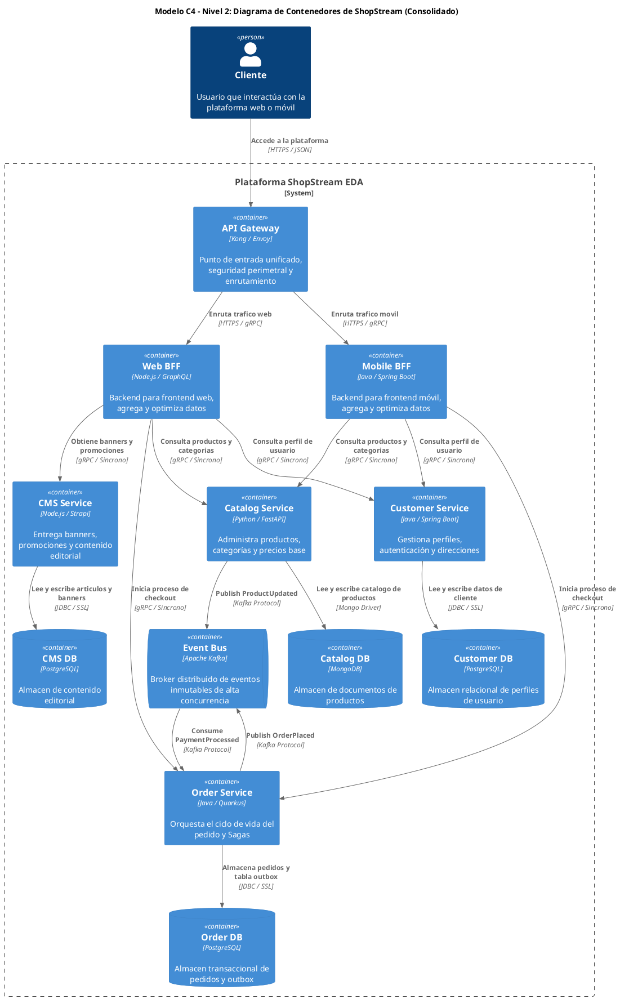

Como Principal Software & Enterprise Architect, presento el Informe Consolidado de Diseño Arquitectónico para ShopStream, sintetizando las decisiones clave y la estrategia de implementación.

---

## 1. Resumen de Diseño Arquitectónico Ejecutivo

### 1.1. Diagrama de Alto Nivel de ShopStream (Modelo C4 - Structurizr Standard)

### 1.2. Tabla de Decisiones de Diseño Clave

| Concepto | Decisión Arquitectónica Final y Justificación Breve |
| :--- | :--- |
| `BFF vs. API Gateway` | Arquitectura híbrida de 2 capas: Edge Gateway para seguridad perimetral (WAF/Auth) y BFFs dedicados por canal (Web/Mobile) para agregación y optimización de payloads. |
| `Tipo SAGA para Pedidos` | SAGA por Orquestación liderada por Order Service, garantizando visibilidad centralizada del estado transaccional y coordinación precisa de transacciones compensatorias. |
| `Mapa de Contextos (Catálogo vs CMS)` | Relación Upstream/Downstream con Catálogo como Open Host Service / Published Language (OHS/PL) y CMS consumiendo mediante una Anticorruption Layer (ACL). |
| `Raíz de Agregado de Pedidos` | Entidad `Order` como Aggregate Root, protegiendo la invariante: *"El pedido no puede confirmarse si el monto total difiere de la suma de ítems o si el pago/reserva falla"*. |

### 1.3. Impacto Operacional: The Twelve-Factor App

*   **Factor III - Configuración (Config)**: Las credenciales de bases de datos, claves de API externas y endpoints de Kafka se inyectan exclusivamente mediante variables de entorno en tiempo de ejecución, permitiendo la misma imagen binaria en todos los entornos.
*   **Factor IV - Servicios de Respaldo (Backing Services)**: Bases de datos (PostgreSQL, MongoDB, Redis) y el broker Kafka son recursos adjuntos intercambiables mediante URLs de conexión configurables, sin alterar el código de los microservicios.

## 2. Resoluciones Finales de Diseño por Hito (Consolidación de Outputs 1, 2 y 3)

### 2.1. Resoluciones del Hito 1 (Descomposición y Arquitectura Base)

*   **Descomposición del Dominio**: Se establecen 4 Bounded Contexts autónomos (`Catálogo`, `Pedidos`, `Clientes`, `CMS`) desacoplados con *Database-per-Service* para garantizar la autonomía de datos y equipos.
*   **Subdivisión del Contexto de Pedidos**: Se subdivide en 3 servicios independientes: `Cart Service` (Redis en memoria para sesión efímera), `Order Service` (PostgreSQL para agregados durables) y `Payment Service` (aislamiento del perímetro PCI-DSS).
*   **Patrones de Comunicación**: Se utiliza comunicación síncrona (gRPC) para lecturas de baja latencia entre BFFs y microservicios; y asíncrona (Kafka) para propagación de eventos transaccionales (`OrderPlaced`, `OrderConfirmed`).

### 2.2. Resoluciones del Hito 2 (Comportamiento Distribuido, SAGA y DDD Táctico)

*   **Flujo Transaccional Distribuido**: Se implementa una orquestación no bloqueante con *Transactional Outbox Pattern + Debezium CDC* para la emisión confiable de eventos hacia Kafka, asegurando la atomicidad de las actualizaciones de base de datos y la publicación de eventos.
*   **Políticas de Resiliencia**: Se aplican Circuit Breakers (Resilience4j) en llamadas síncronas hacia pasarelas de pago y proveedores externos; y Reintentos con Backoff Exponencial e Idempotencia en consumidores de Kafka para manejar fallos transitorios y evitar efectos secundarios.
*   **Invariantes del Dominio**: Se garantiza el cumplimiento estricto de consistencia en el Aggregate Root `Order` (ej. total del pedido, transiciones de estado válidas) y el desacoplamiento de Catálogo y CMS mediante DTOs publicados y una Anti-Corruption Layer.

### 2.3. Resoluciones del Hito 3 (Escalabilidad, Observabilidad y Despliegue Cloud-Native)

*   **Estrategia de Escalabilidad Elástica**: Se implementa el escalado horizontal autónomo por microservicio (HPA en Kubernetes) aprovechando la naturaleza *stateless* de los servicios (Factor VI), permitiendo una adaptación dinámica a la demanda.
*   **Trazabilidad y Observabilidad**: Se asegura la propagación de `TraceID` / `SpanID` con OpenTelemetry a través de API Gateway, gRPC y cabeceras de Kafka, facilitando el monitoreo y la depuración de flujos distribuidos.
*   **Gestión de Fallas y Desechabilidad**: Se garantiza el apagado elegante (*Graceful Shutdown* ante `SIGTERM`) para despliegues sin interrupción y se utilizan colas de descarte (*Dead Letter Queues - DLQ*) para el aislamiento y reprocesamiento de mensajes corruptos o fallidos.

---
**Fin del Informe Consolidado de Diseño Arquitectónico para ShopStream.**