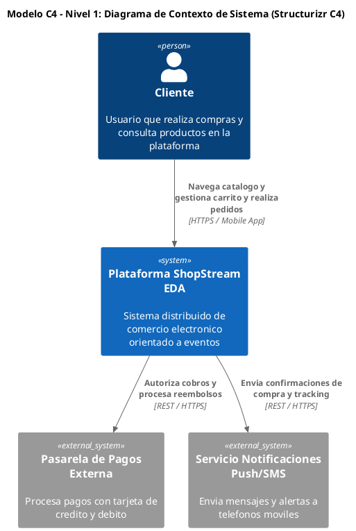
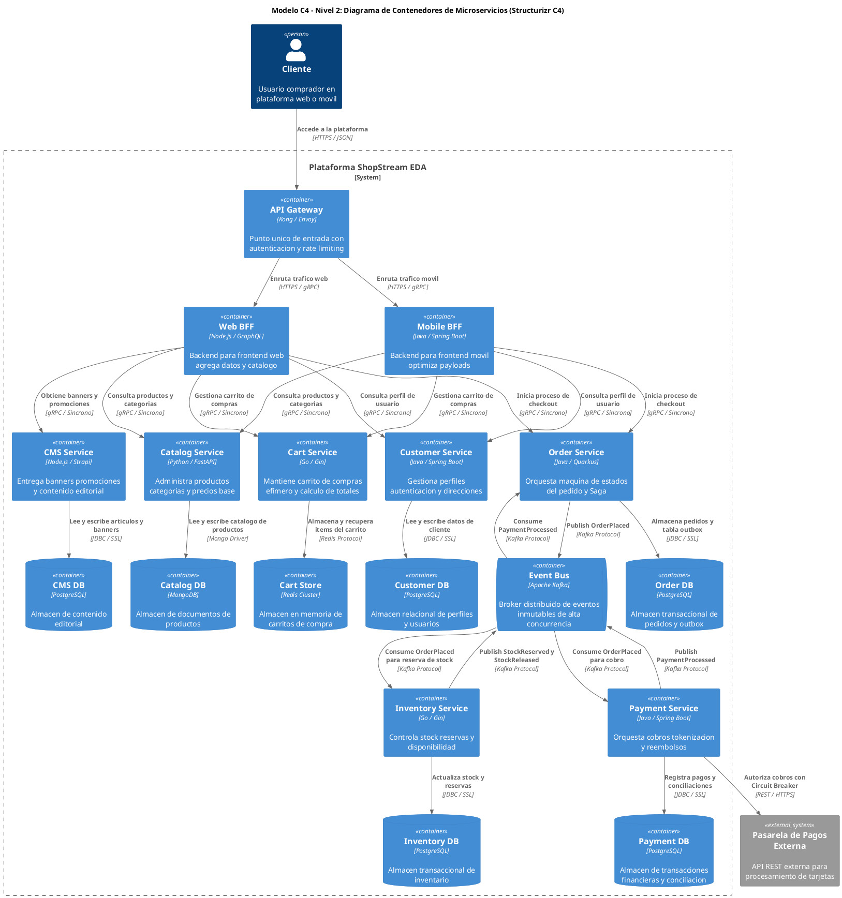

# Guía Maestra de Diagramación C4 con Structurizr & C4-PlantUML (Master C4 Standard)

Esta guía define el estándar oficial e imperativo para generar **Diagramas del Modelo C4** (Nivel 1: Contexto, Nivel 2: Contenedores, Nivel 3: Componentes) utilizando la librería estándar nativa de **C4-PlantUML** (`!include <C4/...>`), garantizando la identidad visual oficial de Structurizr y el enrutamiento perfecto de todas las flechas y relaciones (`Rel`).

---

## 1. Protocolo Imperativo C4-PlantUML (Zero-Error Rules)

1. **INCLUSIONES OFICIALES DE LA LIBRERÍA ESTÁNDAR C4**:
   - **Nivel 1 (Contexto)**: `!include <C4/C4_Context>`
   - **Nivel 2 (Contenedores)**: `!include <C4/C4_Container>`
   - **Nivel 3 (Componentes)**: `!include <C4/C4_Component>`

2. **NOMBRES DE MACROS OFICIALES EN C4-PLANTUML (NOMBRES ESTRICTOS)**:
   - `Person(alias, "Nombre", "Descripción")`
   - `System(alias, "Nombre", "Descripción")`
   - `System_Ext(alias, "Nombre", "Descripción")`  *(PROHIBIDO usar ExternalSystem)*
   - `Container(alias, "Nombre", "Tecnología", "Descripción")`
   - `ContainerDb(alias, "Nombre", "Tecnología", "Descripción")`
   - `ContainerQueue(alias, "Nombre", "Tecnología", "Descripción")`
   - `Component(alias, "Nombre", "Tecnología", "Descripción")`
   - `Rel(origen, destino, "Etiqueta de Acción", "Protocolo o Tecnología")`

3. **BALANCE EXACTO DE COMILLAS DOBLES EN CADA ARGUMENTO**:
   - Todo texto dentro de una macro DEBE estar estrictamente encerrado entre comillas dobles `"..."`.
   - **INCORRECTO**: `ContainerDb(search_idx, Search Index", "Elasticsearch", "Motor")`
   - **CORRECTO**: `ContainerDb(search_idx, "Search Index", "Elasticsearch", "Motor")`

4. **CIERRE OBLIGATORIO DE `System_Boundary` ANTES DE LAS RELACIONES `Rel` (REGLA DE LAS FLECHAS)**:
   - Declara todos los contenedores dentro del bloque `System_Boundary(c1, "Nombre del Sistema") { ... }`.
   - **DEBES CERRAR EL BLOQUE CON `}` ANTES DE ESCRIBIR LAS RELACIONES `Rel(...)`**.
   - Si colocas las relaciones dentro del `System_Boundary`, el motor de diagramación pierde el cálculo de rutas y no dibuja las flechas entre clientes y contenedores.

5. **TOPOLOGÍA COMPLETA DE FLECHAS Y CONEXIONES (PROHIBIDO CONTENEDORES SIN FLECHAS)**:
   - Todo contenedor en el diagrama DEBE tener sus conexiones explícitas:
     - Flecha del Cliente al API Gateway.
     - Flechas del API Gateway a los BFFs (`web_bff`, `mobile_bff`).
     - Flechas de los BFFs a los microservicios de dominio.
     - Flechas de cada microservicio a su base de datos exclusiva (`ContainerDb`).
     - Flechas de publicación y consumo hacia el bus de eventos (`ContainerQueue`).
     - Flechas hacia los sistemas externos (`System_Ext`).

6. **DECLARACIÓN PREVIA OBLIGATORIA (SIN ALIAS HUÉRFANOS)**:
   - Toda relación `Rel(origen, destino, ...)` DEBE referenciar ÚNICAMENTE aliases que hayan sido declarados previamente arriba en ese mismo diagrama.

7. **REGLA DE UNA SOLA LÍNEA POR MACRO Y PROHIBIDAS LAS COMAS EN TEXTOS**:
   - Cada llamada a macro DEBE estar en una **sola línea continua** (sin saltos de línea `ENTER` dentro de los argumentos).
   - NUNCA uses comas `,` dentro de los textos entre comillas (usa conjunciones `y` o guiones `-`).

---

## 2. Plantilla Maestra Nivel 1: Diagrama de Contexto de Sistema

---

## 3. Plantilla Maestra Nivel 2: Diagrama de Contenedores Completo con Todas las Flechas

