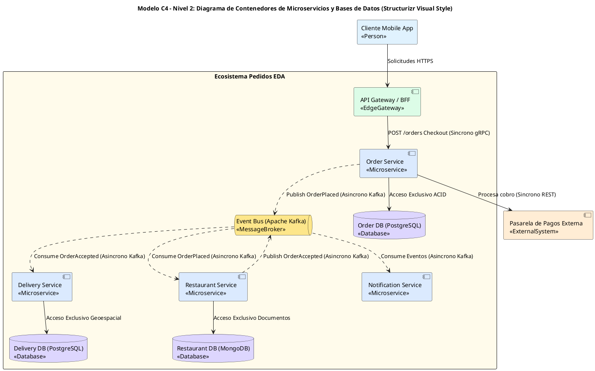

# Guía Estándar de Diagramación C4 con Identidad Visual Structurizr (Strict C4 Visual Standard)

Esta guía define las reglas visuales y sintácticas para generar **Diagramas del Modelo C4** (Nivel 1: Contexto, Nivel 2: Contenedores, Nivel 3: Componentes) con la **identidad visual clásica de Structurizr C4**, 100% nativos y parseables en PlantUML.

---

## 1. Identidad Visual y Paleta de Colores C4 Structurizr

Para mantener la coherencia e identidad visual Structurizr, todos los elementos deben usar las siguientes tarjetas de color y estereotipos:

- **Personas / Usuarios (C4 Person)**:
  - Sintaxis: `rectangle "Nombre del Usuario\n<<Person>>" as UserAlias #E0F2FE` (Azul claro persona)
- **Sistema Central / Software System (C4 System)**:
  - Sintaxis: `component "Nombre del Sistema Central\n<<SoftwareSystem>>" as SystemAlias #DCFCE7` (Verde suave sistema)
- **Contenedores de Aplicación / Microservicios (C4 Container / Microservice)**:
  - Sintaxis: `component "Nombre del Microservicio\n<<Microservice>>" as ContainerAlias #DBEAFE` (Azul contenedor)
- **Buses de Eventos / Message Brokers (C4 Queue)**:
  - Sintaxis: `queue "Event Bus (Apache Kafka)\n<<MessageBroker>>" as EventBusAlias #FDE68A` (Dorado bus)
- **Bases de Datos Aisladas (C4 Database)**:
  - Sintaxis: `database "Order DB (PostgreSQL)\n<<Database>>" as DBAlias #DDD6FE` (Púrpura base de datos)
- **Sistemas Externos (C4 External System)**:
  - Sintaxis: `component "Pasarela Externa\n<<ExternalSystem>>" as ExtSysAlias #FFEDD5` (Naranja externo)
- **Límites de Sistema / Paquetes (C4 Boundary)**:
  - Sintaxis: `package "Ecosistema de Microservicios Pedidos" #FFFBEB { ... }` (Beige límite)

---

## 2. Reglas Sintácticas Imperativas (100% Libre de Errores)

1. **PROHIBIDO USAR `!include` EXTERNOS O REMOTOS**:
   - NUNCA incluyas `!include <C4/...>` ni `!include https://...`. Usa componentes nativos con las tarjetas de colores Structurizr anteriores.

2. **PROHIBIDO `skinparam handwritten true` Y FORMAS OVALADAS `usecase`**:
   - Mantén esquemas planos y limpios con `skinparam componentStyle uml2`, `skinparam packageStyle rectangle`, `skinparam backgroundColor white`.

3. **ETIQUETAS DE RELACIÓN Y PROTOCOLOS LIMPIOS**:
   - Etiqueta la relación especificando explícitamente el patrón y protocolo:
     - **Síncrono**: `A --> B : "Reserva stock via gRPC (Sincrono)"`
     - **Asíncrono**: `A ..> EventBus : "Publish OrderPlaced via Kafka (Asincrono)"`
   - NUNCA uses comas `,`, apóstrofes `'`, ampersands `&`, corchetes `[` `]`, ni `<< >>` dentro del string de la etiqueta.

---

## 3. Plantilla Ejemplo Structurizr C4 Nivel 2 (Contenedores & Database-per-Service)

