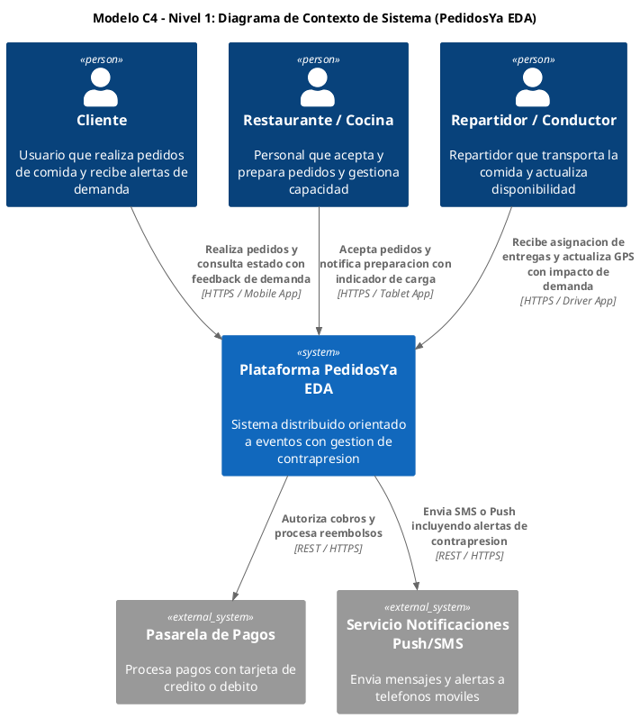
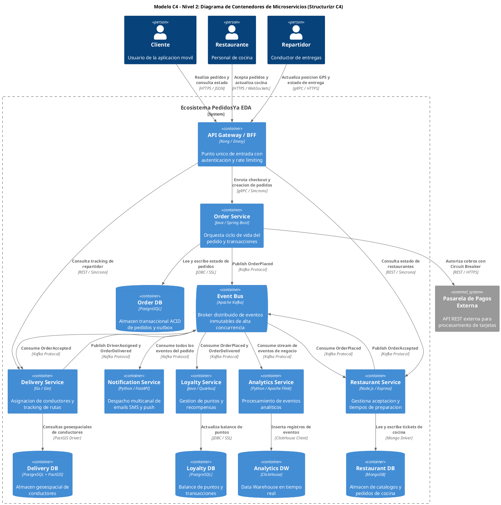
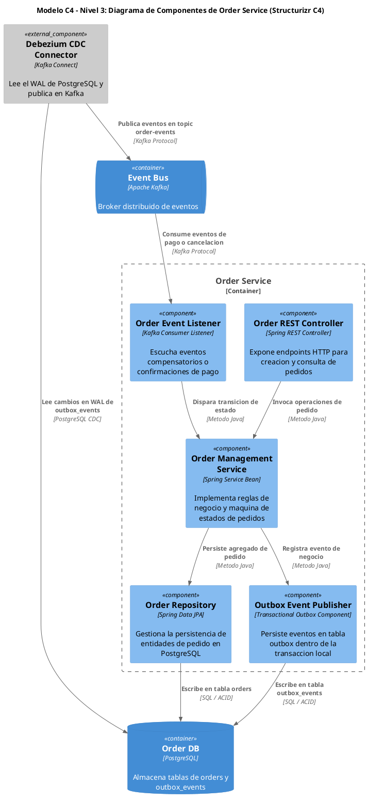

# Guía Maestra de Diagramación C4 con Structurizr & C4-PlantUML (Master C4 Standard)

Esta guía define el estándar oficial e imperativo para generar **Diagramas del Modelo C4** (Nivel 1: Contexto, Nivel 2: Contenedores, Nivel 3: Componentes) utilizando la librería estándar nativa de **C4-PlantUML** (`!include <C4/...>`), garantizando la identidad visual oficial de Structurizr (tarjetas azules `«person»`, `«system»`, `«container»`, doradas `«queue»`, púrpuras `«database»` y grises `«external_system»`).

---

## 1. Reglas Sintácticas Críticas de Macros C4-PlantUML (Zero-Error Protocol)

1. **INCLUSIONES OFICIALES DE LA LIBRERÍA ESTÁNDAR C4**:
   - **Nivel 1 (Contexto)**: `!include <C4/C4_Context>`
   - **Nivel 2 (Contenedores)**: `!include <C4/C4_Container>`
   - **Nivel 3 (Componentes)**: `!include <C4/C4_Component>`
   *(Nota: `plantuml.jar` incluye estas librerías de forma nativa e integrada sin requerir conexión a internet).*

2. **REGLA DE ORO: PROHIBIDAS LAS COMAS ',' DENTRO DE ARGUMENTOS DE TEXTO**:
   - El preprocesador de macros de PlantUML divide los parámetros de las macros en cada coma `,`, incluso si está dentro de comillas dobles `"..."`.
   - **INCORRECTO (Rompe el preprocesador C4)**: `Person(cliente, "Cliente", "Realiza pedidos, paga y recibe alertas")`
   - **CORRECTO (Usa conjunciones o guiones)**: `Person(cliente, "Cliente", "Realiza pedidos y paga y recibe alertas")`

3. **ESTRUCTURA DE PARÁMETROS EN MACROS C4**:
   - `Person(alias, "Nombre", "Descripción")`
   - `System(alias, "Nombre", "Descripción")`
   - `System_Ext(alias, "Nombre", "Descripción")`
   - `Container(alias, "Nombre", "Tecnología", "Descripción")`
   - `ContainerDb(alias, "Nombre", "Tecnología", "Descripción")`
   - `ContainerQueue(alias, "Nombre", "Tecnología", "Descripción")`
   - `Component(alias, "Nombre", "Tecnología", "Descripción")`
   - `Rel(origen, destino, "Etiqueta de Acción", "Protocolo o Tecnología")`

4. **LÍMITES DE SISTEMA Y CONTENEDOR**:
   - Para agrupar servicios en Nivel 2: `System_Boundary(c1, "Ecosistema PedidosYa EDA") { ... }`
   - Para agrupar componentes en Nivel 3: `Container_Boundary(c2, "Order Service") { ... }`

---

## 2. Plantilla Maestra Nivel 1: Diagrama de Contexto de Sistema

---

## 3. Plantilla Maestra Nivel 2: Diagrama de Contenedores y Bases de Datos (MSA & EDA)

---

## 4. Plantilla Maestra Nivel 3: Diagrama de Componentes del Order Service

